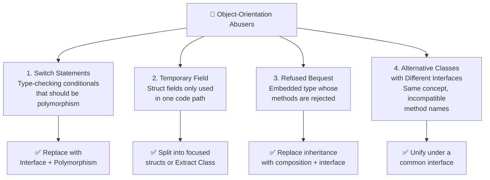

You opened a pull request for a simple feature: add a new user role. Three hours later, you are still searching every `switch` statement scattered across eight files, updating case after case, terrified you missed one. Sound familiar? Or maybe you have a struct with a dozen fields, but each method only ever touches two or three of them — a quiet mystery that forces you to read the entire struct before understanding any single function.

These are not just stylistic complaints. They are **Object-Orientation Abusers** — a family of code smells catalogued by Martin Fowler in *Refactoring: Improving the Design of Existing Code*. They arise when object-oriented principles are either ignored or misapplied, leading to code that is fragile, hard to extend, and surprisingly painful to test. In this post, we will diagnose all four, understand why they hurt, and refactor them into clean, idiomatic Go.

---

## 🎯 Takeaway

By the end of this post, you will be able to:

- **Identify Switch Statements** smell and replace conditional logic with interface-based polymorphism
- **Spot Temporary Fields** that only exist for one or two methods and learn how to split them into focused structs
- **Recognize Refused Bequest** where an embedded type is partially rejected by the child, and restructure using composition + interfaces
- **Unify Alternative Classes with Different Interfaces** that do the same job under different names, reducing duplication and confusion
- Apply each fix confidently in real Go codebases

---

## 🗺️ The OO Abusers Family

The four code smells we cover today all share a common root: they violate the core spirit of object-oriented design — that **data and the behavior that works on it should live together**, and that **new cases should be added by extension, not by modification**.



---

## 1. Switch Statements

### What Is It?

The **Switch Statements** smell does not mean `switch` is forbidden — it is a fine control-flow tool. The smell emerges when you find yourself **switching on the same type discriminator** in multiple places, adding a new case every time you add a new "type" to your domain. This is a symptom that polymorphism should be doing that work instead.

In Go, this often appears as switching on a `string` or `int` type field to decide behavior. Every time you add a new value, you must hunt for every `switch` or `if-else` chain and add another branch — fragile, scattered, and easy to forget.

### Bad Code Example (❌)

```go
// ❌ BAD: Switch Statement smell
// Adding a new role requires hunting every switch block in the codebase.

type User struct {
	Name string
	Role string // "admin", "editor", "viewer"
}

func (u User) GetPermissions() []string {
	switch u.Role {
	case "admin":
		return []string{"read", "write", "delete", "manage_users"}
	case "editor":
		return []string{"read", "write"}
	case "viewer":
		return []string{"read"}
	default:
		return []string{}
	}
}

func (u User) GetDashboardURL() string {
	switch u.Role {
	case "admin":
		return "/admin/dashboard"
	case "editor":
		return "/editor/dashboard"
	case "viewer":
		return "/viewer/dashboard"
	default:
		return "/dashboard"
	}
}

func (u User) CanDeleteContent() bool {
	switch u.Role {
	case "admin":
		return true
	case "editor", "viewer":
		return false
	default:
		return false
	}
}

// The type check leaks into calling code too
func HandleLogin(u User) {
	log.Printf("User %s logged in. Role: %s, URL: %s", u.Name, u.Role, u.GetDashboardURL())
	if u.Role == "admin" {
		log.Println("Admin audit log triggered")
	}
}
```

**Why it hurts:** Adding a new role like `"moderator"` means updating `GetPermissions`, `GetDashboardURL`, `CanDeleteContent`, and every other `switch u.Role` scattered through the codebase. Miss one, and you have a silent bug.

---

### Fix (✅)

Replace the type-dispatching switch with an **interface** and separate concrete types for each role. Adding a new role is now one new file — zero changes to existing code (Open/Closed Principle).

```go
// ✅ GOOD: Replace Switch Statements with polymorphism via interface

// Role encapsulates all behavior a role must provide.
// Adding a new role = adding one new struct that implements this interface.
type Role interface {
	Permissions() []string
	DashboardURL() string
	CanDeleteContent() bool
}

// --- Concrete role types ---

type AdminRole struct{}

func (a AdminRole) Permissions() []string {
	return []string{"read", "write", "delete", "manage_users"}
}
func (a AdminRole) DashboardURL() string   { return "/admin/dashboard" }
func (a AdminRole) CanDeleteContent() bool { return true }

type EditorRole struct{}

func (e EditorRole) Permissions() []string {
	return []string{"read", "write"}
}
func (e EditorRole) DashboardURL() string   { return "/editor/dashboard" }
func (e EditorRole) CanDeleteContent() bool { return false }

type ViewerRole struct{}

func (v ViewerRole) Permissions() []string {
	return []string{"read"}
}
func (v ViewerRole) DashboardURL() string   { return "/viewer/dashboard" }
func (v ViewerRole) CanDeleteContent() bool { return false }

// User now holds an interface — no type-checking anywhere downstream
type User struct {
	Name string
	Role Role
}

// HandleLogin is fully decoupled from role logic
func HandleLogin(u User) {
	log.Printf("User %s logged in. URL: %s", u.Name, u.Role.DashboardURL())
	// No type-switches needed — the Role knows what to do
}

// Factory keeps the one necessary switch in one place
func NewRole(roleStr string) (Role, error) {
	switch roleStr {
	case "admin":
		return AdminRole{}, nil
	case "editor":
		return EditorRole{}, nil
	case "viewer":
		return ViewerRole{}, nil
	default:
		return nil, fmt.Errorf("unknown role: %s", roleStr)
	}
}
```

> **Rule of thumb:** One `switch` in a factory function that maps strings to types is fine. The same switch scattered across ten different functions is the smell.

---

## 2. Temporary Field

### What Is It?

A **Temporary Field** is a struct field that only has a meaningful value in one specific code path or method. Outside that path, the field is either empty, zero, or irrelevant — yet it still sits on the struct, silently misleading every developer who reads it.

This often happens when a function needs several values to complete its work, and instead of receiving them as parameters (or being extracted into its own focused struct), they are stashed as struct fields. The result is a struct that can be in multiple "modes" — some fields are valid, others are garbage, depending on when you call which method.

### Bad Code Example (❌)

```go
// ❌ BAD: Temporary Field smell
// ReportGenerator has fields that are only valid during PDF generation.
// If you call GenerateCSV(), pdfTitle and pdfPageSize are meaningless noise.

type ReportGenerator struct {
	Data       []map[string]any
	OutputPath string

	// These fields only matter when generating a PDF.
	// For CSV generation, they are always empty — confusing!
	pdfTitle    string
	pdfPageSize string
	pdfLogoURL  string
}

func (r *ReportGenerator) SetPDFOptions(title, pageSize, logoURL string) {
	r.pdfTitle = title
	r.pdfPageSize = pageSize
	r.pdfLogoURL = logoURL
}

func (r *ReportGenerator) GeneratePDF() error {
	// Uses r.pdfTitle, r.pdfPageSize, r.pdfLogoURL
	if r.pdfTitle == "" {
		return fmt.Errorf("PDF title is required")
	}
	log.Printf("Generating PDF: %s (%s), logo: %s", r.pdfTitle, r.pdfPageSize, r.pdfLogoURL)
	return nil
}

func (r *ReportGenerator) GenerateCSV() error {
	// pdfTitle, pdfPageSize, pdfLogoURL are all "" here — dead weight
	log.Printf("Generating CSV with %d rows to %s", len(r.Data), r.OutputPath)
	return nil
}
```

**Why it hurts:** A developer reading `ReportGenerator` must mentally track which fields are "active" for which method. There is no compiler help — calling `GeneratePDF()` without `SetPDFOptions()` compiles fine and silently produces broken output. The struct's valid states are invisible.

---

### Fix (✅)

Split the PDF-specific context into its own focused struct. Each struct now has **only the fields it always needs** — no hidden states, no optional fields, no surprises.

```go
// ✅ GOOD: Extract PDF options into a dedicated struct.
// Each struct represents exactly one coherent concept with all required fields.

type ReportData struct {
	Rows       []map[string]any
	OutputPath string
}

// PDFOptions groups PDF-specific configuration — all fields always meaningful.
type PDFOptions struct {
	Title    string
	PageSize string
	LogoURL  string
}

// CSVGenerator handles only CSV logic — zero PDF clutter.
type CSVGenerator struct {
	Report ReportData
}

func (g CSVGenerator) Generate() error {
	if len(g.Report.Rows) == 0 {
		return fmt.Errorf("no data to export")
	}
	log.Printf("Generating CSV with %d rows to %s", len(g.Report.Rows), g.Report.OutputPath)
	return nil
}

// PDFGenerator has exactly the fields it needs — always.
type PDFGenerator struct {
	Report  ReportData
	Options PDFOptions
}

func (g PDFGenerator) Generate() error {
	if g.Options.Title == "" {
		return fmt.Errorf("PDF title is required")
	}
	log.Printf("Generating PDF: %s (%s), logo: %s",
		g.Options.Title, g.Options.PageSize, g.Options.LogoURL)
	return nil
}

// Usage — you cannot forget to set options; they are required at construction.
func main() {
	data := ReportData{Rows: rows, OutputPath: "/tmp/report"}

	csvGen := CSVGenerator{Report: data}
	_ = csvGen.Generate()

	pdfGen := PDFGenerator{
		Report:  data,
		Options: PDFOptions{Title: "Q2 Sales", PageSize: "A4", LogoURL: "https://example.com/logo.png"},
	}
	_ = pdfGen.Generate()
}
```

> **Key insight:** If you find yourself writing `if r.someField == "" { return error }` at the top of a method, that field is probably a Temporary Field. It should be a constructor parameter on a more focused type.

---

## 3. Refused Bequest

### What Is It?

**Refused Bequest** is the smell of inheritance gone wrong. A child type inherits from a parent (or in Go, embeds a struct) but does not actually want all of what the parent provides. It "refuses the bequest" by either panicking in the inherited methods, returning zero values silently, or simply never calling certain methods because they make no sense for the child.

In Go, this appears when you embed a struct and then find yourself overriding methods with `panic("not supported")` or writing confusing documentation like "do not call X on this type." That is a loud signal that the relationship is not truly "is-a" — it is "mostly-a" — and composition should replace embedding.

### Bad Code Example (❌)

```go
// ❌ BAD: Refused Bequest smell
// ReadOnlyCache embeds Cache but refuses the Set and Delete methods.
// The interface is a lie — callers may try to write and get a panic at runtime.

type Cache struct {
	store map[string]string
	mu    sync.RWMutex
}

func (c *Cache) Get(key string) (string, bool) {
	c.mu.RLock()
	defer c.mu.RUnlock()
	val, ok := c.store[key]
	return val, ok
}

func (c *Cache) Set(key, value string) {
	c.mu.Lock()
	defer c.mu.Unlock()
	c.store[key] = value
}

func (c *Cache) Delete(key string) {
	c.mu.Lock()
	defer c.mu.Unlock()
	delete(c.store, key)
}

// ReadOnlyCache embeds Cache — but refuses Set and Delete.
// It inherits them only to panic. That is the refused bequest.
type ReadOnlyCache struct {
	*Cache
}

func (r *ReadOnlyCache) Set(key, value string) {
	panic("ReadOnlyCache: Set is not allowed")
}

func (r *ReadOnlyCache) Delete(key string) {
	panic("ReadOnlyCache: Delete is not allowed")
}

// Any function accepting *Cache can accidentally receive a *ReadOnlyCache.
// The compiler will not warn you — only a runtime panic will.
func loadFromDB(c *Cache) {
	c.Set("user:1", "Alice") // Fine on *Cache, runtime panic on *ReadOnlyCache
}
```

**Why it hurts:** The panics are invisible to the compiler. Any function that receives a `*Cache` can be handed a `*ReadOnlyCache` (because it embeds `*Cache`), but it may crash at runtime. The type system offers zero protection — consumers cannot trust the contract.

---

### Fix (✅)

Replace the inherited relationship with **interfaces and composition**. Define separate read/write interfaces. The read-only type only implements the interface it actually supports.

```go
// ✅ GOOD: Replace Refused Bequest with interfaces + composition

// Separate, honest interfaces
type Reader interface {
	Get(key string) (string, bool)
}

type Writer interface {
	Set(key, value string)
	Delete(key string)
}

// ReadWriter is the full interface — satisfied by the full cache
type ReadWriter interface {
	Reader
	Writer
}

// store is the internal implementation — not exported, not embedded carelessly
type store struct {
	data map[string]string
	mu   sync.RWMutex
}

func newStore() *store {
	return &store{data: make(map[string]string)}
}

func (s *store) Get(key string) (string, bool) {
	s.mu.RLock()
	defer s.mu.RUnlock()
	v, ok := s.data[key]
	return v, ok
}

func (s *store) Set(key, value string) {
	s.mu.Lock()
	defer s.mu.Unlock()
	s.data[key] = value
}

func (s *store) Delete(key string) {
	s.mu.Lock()
	defer s.mu.Unlock()
	delete(s.data, key)
}

// FullCache satisfies ReadWriter
type FullCache struct{ *store }

func NewFullCache() *FullCache { return &FullCache{newStore()} }

// ReadOnlyCache satisfies only Reader — no panic, no lie
type ReadOnlyCache struct{ *store }

func NewReadOnlyCache(s *store) *ReadOnlyCache { return &ReadOnlyCache{s} }

// Functions declare exactly what they need — the compiler enforces it
func populate(w Writer) {
	w.Set("user:1", "Alice")
	w.Set("user:2", "Bob")
}

func lookup(r Reader, key string) {
	if val, ok := r.Get(key); ok {
		log.Printf("Found: %s = %s", key, val)
	}
}

func main() {
	fc := NewFullCache()
	populate(fc)              // ✅ FullCache implements Writer
	lookup(fc, "user:1")      // ✅ FullCache implements Reader

	ro := NewReadOnlyCache(fc.store)
	lookup(ro, "user:1")      // ✅ ReadOnlyCache implements Reader

	// populate(ro)           // 🚫 Compile error! ReadOnlyCache does not implement Writer.
	// The compiler protects you — no runtime panic needed.
}
```

> **Go philosophy:** Prefer small, composable interfaces over deep embedding chains. If you find yourself panicking in a method you inherited, the type hierarchy is telling you something important.

---

## 4. Alternative Classes with Different Interfaces

### What Is It?

**Alternative Classes with Different Interfaces** occurs when two or more types do essentially the same job but expose different method names. Callers cannot use them interchangeably because the interface is different, even though the underlying concept is identical. This leads to duplicated adapters, inconsistent usage, and confusion about which type to use when.

This often happens when two teams develop similar abstractions independently, or when a type is extracted from one package without coordinating with an existing similar type in another package.

### Bad Code Example (❌)

```go
// ❌ BAD: Alternative Classes with Different Interfaces
// EmailSender and SMSSender both "send a notification",
// but their method names are completely different.
// AlertService must handle each type specifically — forever.

type EmailSender struct {
	SMTPHost string
	Port     int
}

// Send delivers an email
func (e *EmailSender) Send(recipient, subject, body string) error {
	log.Printf("[Email] To: %s | Subject: %s | Body: %s", recipient, subject, body)
	return nil
}

func (e *EmailSender) GetTransportName() string { return "email" }

type SMSSender struct {
	APIKey     string
	ServiceURL string
}

// Dispatch sends an SMS — a totally different name from Send!
func (s *SMSSender) Dispatch(phoneNumber, message string) error {
	log.Printf("[SMS] To: %s | Message: %s", phoneNumber, message)
	return nil
}

// TransportType — a different name from GetTransportName!
func (s *SMSSender) TransportType() string { return "sms" }

// AlertService is forced to know both concrete types.
// Adding a third channel requires changing AlertService itself.
type AlertService struct {
	email *EmailSender
	sms   *SMSSender
}

func (a *AlertService) SendAlert(message string) {
	if a.email != nil {
		a.email.Send("ops-team@example.com", "Alert", message)
	}
	if a.sms != nil {
		a.sms.Dispatch("+1234567890", message)
	}
}
```

**Why it hurts:** `AlertService` is coupled to two concrete types. Adding a third channel (Slack, push notification, PagerDuty) means changing `AlertService`. The concept of "send a notification" is fractured across incompatible method signatures.

---

### Fix (✅)

Extract a **unified `Notifier` interface** with a single agreed-upon method name. Each channel implements it, and `AlertService` works with any channel — including ones not yet invented.

```go
// ✅ GOOD: Unified Notifier interface
// All channels speak the same language. AlertService knows nothing about individual channels.

// Notification is a channel-agnostic message container.
// Each Notifier adapts it to its own protocol.
type Notification struct {
	Recipient string // email address, phone number, or user ID — depends on channel
	Subject   string
	Body      string
}

// Notifier is the single, unified interface for all notification channels.
type Notifier interface {
	Notify(n Notification) error
	Channel() string
}

// --- Email implementation ---

type EmailNotifier struct {
	SMTPHost string
	Port     int
}

func (e *EmailNotifier) Notify(n Notification) error {
	log.Printf("[Email] To: %s | Subject: %s | Body: %s", n.Recipient, n.Subject, n.Body)
	return nil
}

func (e *EmailNotifier) Channel() string { return "email" }

// --- SMS implementation ---

type SMSNotifier struct {
	APIKey     string
	ServiceURL string
}

func (s *SMSNotifier) Notify(n Notification) error {
	log.Printf("[SMS] To: %s | %s", n.Recipient, n.Body)
	return nil
}

func (s *SMSNotifier) Channel() string { return "sms" }

// --- Slack implementation (added later — zero changes to AlertService) ---

type SlackNotifier struct {
	WebhookURL string
}

func (sl *SlackNotifier) Notify(n Notification) error {
	log.Printf("[Slack] Channel: %s | %s: %s", n.Recipient, n.Subject, n.Body)
	return nil
}

func (sl *SlackNotifier) Channel() string { return "slack" }

// AlertService works with any Notifier — current or future.
type AlertService struct {
	notifiers []Notifier
}

func NewAlertService(notifiers ...Notifier) *AlertService {
	return &AlertService{notifiers: notifiers}
}

func (a *AlertService) SendAlert(subject, message string) {
	for _, n := range a.notifiers {
		err := n.Notify(Notification{
			Recipient: "ops-team",
			Subject:   subject,
			Body:      message,
		})
		if err != nil {
			log.Printf("[AlertService] %s channel error: %v", n.Channel(), err)
		}
	}
}

// Clean usage — add or remove channels without touching AlertService
func main() {
	svc := NewAlertService(
		&EmailNotifier{SMTPHost: "smtp.example.com", Port: 587},
		&SMSNotifier{APIKey: "key-123"},
		&SlackNotifier{WebhookURL: "https://hooks.slack.com/..."},
	)
	svc.SendAlert("Disk Full", "Server disk usage exceeded 95%")
}
```

> **Bonus:** Testing `AlertService` is now trivial — inject a mock `Notifier` that records calls. No real SMTP or SMS credentials needed in unit tests.

---

## Quick Reference: Spotting and Fixing OO Abusers

| Smell | Warning Sign | Fix |
|---|---|---|
| **Switch Statements** | Same `switch` on the same field repeated in ≥ 2 places | Extract interface; keep one factory with the necessary switch |
| **Temporary Field** | `if field == "" { return error }` at top of one specific method | Split into focused structs; make required fields constructor args |
| **Refused Bequest** | `panic("not supported")` or `// do not call this` in embedded type | Replace embedding with composition; define honest, narrow interfaces |
| **Alternative Classes** | Two types doing the same job under different method names | Define a unified interface; make both types implement it |

---

## When Is a Switch Statement *Not* a Smell?

Not every `switch` is a smell. It is fine when:

- **It lives in one factory function** that maps configuration strings to types (as shown in the Role example above)
- **The cases are data, not behavior** — e.g., mapping HTTP status codes to their text descriptions
- **It will never grow** — a fixed three-branch switch for a permanently closed domain is fine

The smell is specifically about **repeated type-dispatching on the same discriminator in multiple places**. One switch = pragmatic. The same switch copy-pasted across ten files = time to introduce an interface.

---

## 📝 Summary / Recap

Object-Orientation Abusers are code smells born from misused or missed OO design opportunities:

- 🔀 **Switch Statements** — Repeated switching on the same type field signals that an interface is missing. Move the behavior into the type itself; keep a single factory if you need to map strings to types.
- 👻 **Temporary Field** — A struct field that is only meaningful in one code path is a hidden state machine. Extract a focused struct whose fields are always valid at construction time.
- 🚫 **Refused Bequest** — Panicking inside inherited methods is a lie to the compiler. Replace embedding with composition and declare honest, narrow interfaces — let the compiler enforce what is truly supported.
- 🔗 **Alternative Classes with Different Interfaces** — Two types doing the same job under different names create unnecessary coupling in every caller. Agree on a unified interface and let each implementation adapt to it.

The common thread: **make valid states representable and invalid states unrepresentable**. When your type system tells the truth, bugs become compile errors instead of production incidents.

---

**[🇮🇩 Versi Indonesia](/refactoring-part-2-oo-abusers-id)** | 🇬🇧 English Version
