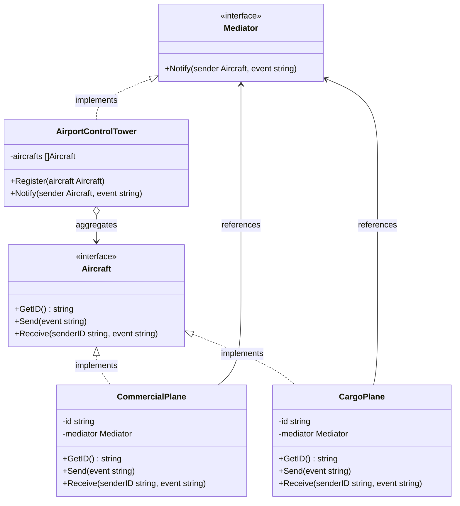

Mediator adalah behavioral design pattern yang mengurangi ketergantungan yang kacau antar-objek. Pola ini membatasi komunikasi langsung antar-objek dan memaksa mereka untuk berkolaborasi hanya melalui objek mediator. Di Go, kita mengimplementasikan pola ini dengan mendefinisikan interface Mediator, struct mediator konkret, serta komponen (seperti pesawat) yang berkomunikasi satu sama lain melalui mediator alih-alih secara langsung.

## Penjelasan Konseptual & Analogi Dunia Nyata

Bayangkan Anda adalah seorang pilot yang menerbangkan pesawat komersial. Ketika Anda mendekati bandara, Anda tidak dapat berkomunikasi langsung dengan puluhan pilot lain yang berada di ruang udara yang sama. Jika setiap pilot mencoba mengoordinasikan waktu pendaratan dan lepas landas secara langsung satu sama lain, hal itu akan menyebabkan kekacauan komunikasi dan memicu kecelakaan fatal.

Sebaliknya, semua pesawat berkomunikasi langsung dengan menara Air Traffic Control (ATC) atau Kontrol Lalu Lintas Udara. Menara tersebut bertindak sebagai mediator. ATC mengetahui posisi dan status semua pesawat, mengelola prioritas pendaratan, dan mengarahkan lalu lintas landasan pacu.

Dalam skenario ini:
1. **Mediator Interface**: Antarmuka umum yang mewakili protokol komunikasi menara pengawas.
2. **Concrete Mediator**: Menara pengawas tertentu yang mengelola daftar penerbangan yang terdaftar dan merutekan pesan di antara mereka.
3. **Colleagues (Components)**: Pesawat terbang (misalnya pesawat komersial atau pesawat kargo) yang hanya mengetahui tentang mediator dan mengirimkan sinyal ke mediator tersebut.

---

## Diagram Konseptual

Berikut adalah diagram kelas Mermaid yang menunjukkan struktur pola Mediator di Go:



---

## Use Case / Skenario Masalah

Mengapa kita membutuhkan pola ini?
Dalam aplikasi yang kompleks, Anda sering kali memiliki beberapa komponen (seperti kontrol UI, microservices, atau aktor game) yang perlu berinteraksi. Jika Anda membiarkan mereka berinteraksi secara langsung, mereka menjadi terikat erat (tightly coupled). Perubahan pada satu komponen mungkin mengharuskan Anda memperbarui beberapa komponen lainnya. Hal ini membuat penggunaan kembali (reuse) komponen menjadi sulit karena setiap komponen mengharapkan keberadaan komponen spesifik lainnya.

Dengan memperkenalkan Mediator:
- Komponen kehilangan keterikatan eratnya. Mereka hanya mengetahui keberadaan Mediator.
- Anda dapat mengubah cara komponen berinteraksi satu sama lain dengan memodifikasi kelas/struct Mediator, tanpa menyentuh komponen individual.
- Komponen individual menjadi jauh lebih mudah digunakan kembali di bagian lain aplikasi karena mereka didekopel sepenuhnya satu sama lain.

---

## Contoh Kode Golang

Di bawah ini adalah program Go lengkap yang dapat dikompilasi, mendemonstrasikan pola Mediator menggunakan gaya Refactoring Guru.

```go
package main

import (
	"fmt"
)

// Mediator mendefinisikan interface yang mengoordinasikan komunikasi antara Aircraft.
type Mediator interface {
	Notify(sender Aircraft, event string)
}

// Aircraft adalah interface yang mewakili komponen kolega.
type Aircraft interface {
	GetID() string
	Send(event string)
	Receive(senderID string, event string)
}

// CommercialPlane adalah komponen pesawat komersial konkret.
type CommercialPlane struct {
	id       string
	mediator Mediator
}

// GetID mengembalikan pengidentifikasi unik pesawat.
func (c *CommercialPlane) GetID() string {
	return c.id
}

// Send menyiarkan pesan melalui mediator.
func (c *CommercialPlane) Send(event string) {
	fmt.Printf("CommercialPlane [%s]: Mengirim permintaan -> \"%s\"\n", c.id, event)
	c.mediator.Notify(c, event)
}

// Receive menangani pesan yang diteruskan oleh mediator.
func (c *CommercialPlane) Receive(senderID string, event string) {
	fmt.Printf("CommercialPlane [%s]: Menerima pesan dari [%s] -> \"%s\"\n", c.id, senderID, event)
}

// CargoPlane adalah komponen pesawat kargo konkret.
type CargoPlane struct {
	id       string
	mediator Mediator
}

// GetID mengembalikan pengidentifikasi unik pesawat kargo.
func (cp *CargoPlane) GetID() string {
	return cp.id
}

// Send menyiarkan pesan melalui mediator.
func (cp *CargoPlane) Send(event string) {
	fmt.Printf("CargoPlane [%s]: Mengirim permintaan -> \"%s\"\n", cp.id, event)
	cp.mediator.Notify(cp, event)
}

// Receive menangani pesan yang diteruskan oleh mediator.
func (cp *CargoPlane) Receive(senderID string, event string) {
	fmt.Printf("CargoPlane [%s]: Menerima pesan dari [%s] -> \"%s\"\n", cp.id, senderID, event)
}

// AirportControlTower adalah Concrete Mediator.
type AirportControlTower struct {
	aircrafts []Aircraft
}

// Register menambahkan pesawat ke daftar komunikasi menara pengawas.
func (a *AirportControlTower) Register(aircraft Aircraft) {
	a.aircrafts = append(a.aircrafts, aircraft)
}

// Notify mengarahkan event ke semua pesawat yang terdaftar kecuali pengirim.
func (a *AirportControlTower) Notify(sender Aircraft, event string) {
	for _, aircraft := range a.aircrafts {
		if aircraft.GetID() != sender.GetID() {
			aircraft.Receive(sender.GetID(), event)
		}
	}
}

func main() {
	tower := &AirportControlTower{}

	flight1 := &CommercialPlane{id: "CP-101", mediator: tower}
	flight2 := &CargoPlane{id: "CARGO-888", mediator: tower}
	flight3 := &CommercialPlane{id: "CP-202", mediator: tower}

	tower.Register(flight1)
	tower.Register(flight2)
	tower.Register(flight3)

	flight1.Send("Meminta izin mendarat di Landasan Pacu 1A")
	fmt.Println()
	flight2.Send("Landasan Pacu 1A telah bersih, mulai bergerak di taxiway")
}
```

---

## Ringkasan

### Keuntungan
- **Single Responsibility Principle**: Anda dapat mengekstrak komunikasi antar-komponen ke satu tempat tunggal, membuatnya lebih mudah dipelihara dan dipahami.
- **Open/Closed Principle**: Anda dapat memperkenalkan mediator baru tanpa harus mengubah komponen yang sebenarnya.
- **Decoupling**: Anda mengurangi keterikatan erat antar-komponen, membuat mereka sangat reusable.
- **Penyederhanaan**: Anda mengganti hubungan many-to-many yang rumit dengan hubungan one-to-many yang lebih sederhana.

### Kekurangan
- **God Object**: Seiring waktu, mediator dapat berkembang menjadi God Object yang berisi seluruh logika koordinasi aplikasi yang sangat kompleks, menjadikannya sulit dipelihara.

### Kapan Menggunakan
- Gunakan pola Mediator ketika sulit untuk mengubah beberapa class/struct karena mereka terikat erat ke banyak class lainnya.
- Gunakan pola ini ketika Anda tidak dapat menggunakan kembali sebuah komponen di konteks yang berbeda karena ketergantungannya pada komponen lain terlalu besar.
- Gunakan pola ini ketika Anda mendapati diri Anda membuat banyak subclass komponen hanya untuk menggunakan kembali beberapa perilaku dasar di konteks yang berbeda.
