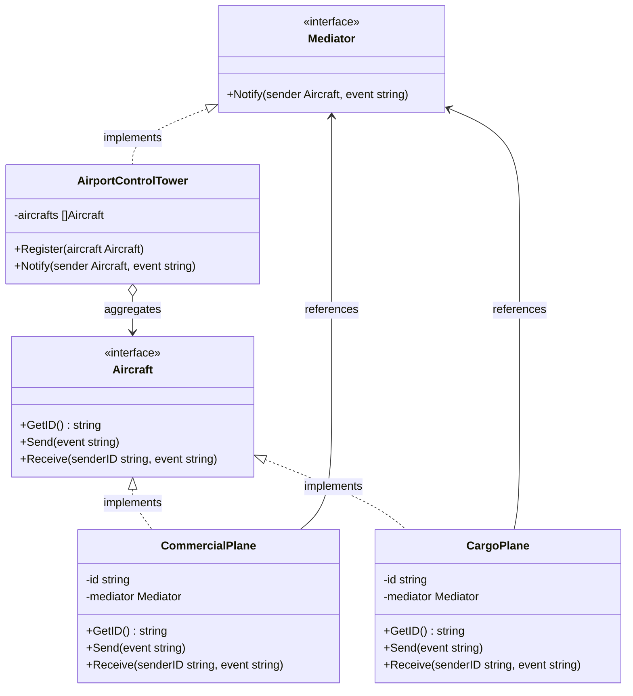

The Mediator is a behavioral design pattern that reduces chaotic dependencies between objects. The pattern restricts direct communications between the objects and forces them to collaborate only via a mediator object. In Go, we implement this pattern by defining a Mediator interface, concrete mediator structs, and aircraft/components that communicate with each other through the mediator rather than directly.

## Conceptual Explanation & Real-World Analogy

Imagine you are a pilot flying a commercial airliner. When you are approaching an airport, you cannot communicate directly with the dozens of other pilots in the airspace. If every pilot tried to coordinate landing and takeoff times with everyone else directly, it would result in communication chaos and inevitably lead to catastrophic accidents.

Instead, all planes communicate directly with the Air Traffic Control (ATC) tower. The tower acts as a mediator. It knows the positions and statuses of all aircraft, manages landing priority, and directs traffic. 

In this scenario:
1. **Mediator Interface**: The general interface representing the tower's communication protocol.
2. **Concrete Mediator**: The specific control tower managing a list of registered flights and routing messages between them.
3. **Colleagues (Components)**: The aircraft (e.g., commercial or cargo planes) that only know about the mediator and send signals to it.

---

## Conceptual Diagram

Here is a Mermaid class diagram that shows the structure of the Mediator pattern in Go:



---

## Use Case / Problem Scenario

Why do we need this pattern?
In complex applications, you often have multiple parts (e.g., UI controls, microservices, or game actors) that need to interact. If you allow them to interact directly, they become tightly coupled. A change to one component might require updating multiple other components. This makes class/struct reuse difficult because any component you want to reuse expects a specific set of other components to be present.

By introducing a Mediator:
- Components lose their tight coupling. They only know about the Mediator.
- You can change how components interact with each other by modifying the Mediator class/struct, leaving the individual components untouched.
- Individual components are much easier to reuse in other parts of the application since they are completely decoupled from each other.

---

## Golang Code Example

Below is a complete, compilable Go program demonstrating the Mediator pattern using the Refactoring Guru style.

```go
package main

import (
	"fmt"
)

// Mediator defines the interface that coordinates communication between Aircraft.
type Mediator interface {
	Notify(sender Aircraft, event string)
}

// Aircraft is the interface representing a colleague component.
type Aircraft interface {
	GetID() string
	Send(event string)
	Receive(senderID string, event string)
}

// CommercialPlane is a concrete aircraft component.
type CommercialPlane struct {
	id       string
	mediator Mediator
}

// GetID returns the plane's unique identifier.
func (c *CommercialPlane) GetID() string {
	return c.id
}

// Send broadcasts a message through the mediator.
func (c *CommercialPlane) Send(event string) {
	fmt.Printf("CommercialPlane [%s]: Sending request -> \"%s\"\n", c.id, event)
	c.mediator.Notify(c, event)
}

// Receive handles messages relayed by the mediator.
func (c *CommercialPlane) Receive(senderID string, event string) {
	fmt.Printf("CommercialPlane [%s]: Received message from [%s] -> \"%s\"\n", c.id, senderID, event)
}

// CargoPlane is another concrete aircraft component.
type CargoPlane struct {
	id       string
	mediator Mediator
}

// GetID returns the cargo plane's unique identifier.
func (cp *CargoPlane) GetID() string {
	return cp.id
}

// Send broadcasts a message through the mediator.
func (cp *CargoPlane) Send(event string) {
	fmt.Printf("CargoPlane [%s]: Sending request -> \"%s\"\n", cp.id, event)
	cp.mediator.Notify(cp, event)
}

// Receive handles messages relayed by the mediator.
func (cp *CargoPlane) Receive(senderID string, event string) {
	fmt.Printf("CargoPlane [%s]: Received message from [%s] -> \"%s\"\n", cp.id, senderID, event)
}

// AirportControlTower is the Concrete Mediator.
type AirportControlTower struct {
	aircrafts []Aircraft
}

// Register adds an aircraft to the tower's communication list.
func (a *AirportControlTower) Register(aircraft Aircraft) {
	a.aircrafts = append(a.aircrafts, aircraft)
}

// Notify routes the events to all registered aircraft except the sender.
func (a *AirportControlTower) Notify(sender Aircraft, event string) {
	for _, aircraft := range a.aircrafts {
		if aircraft.GetID() != sender.GetID() {
			aircraft.Receive(sender.GetID(), event)
		}
	}
}

func main() {
	tower := &AirportControlTower{}

	flight1 := &CommercialPlane{id: "CP-101", mediator: tower}
	flight2 := &CargoPlane{id: "CARGO-888", mediator: tower}
	flight3 := &CommercialPlane{id: "CP-202", mediator: tower}

	tower.Register(flight1)
	tower.Register(flight2)
	tower.Register(flight3)

	flight1.Send("Requesting permission to land on Runway 1A")
	fmt.Println()
	flight2.Send("Runway 1A is cleared, starting taxiing")
}
```

---

## Summary

### Advantages
- **Single Responsibility Principle**: You can extract the communications between various components into a single place, making it easier to maintain and understand.
- **Open/Closed Principle**: You can introduce new mediators without having to change the actual components.
- **Decoupling**: You reduce coupling between components, making them highly reusable.
- **Simplification**: You replace complex many-to-many relationships with simpler one-to-many relationships.

### Disadvantages
- **God Object**: Over time, a mediator can evolve into a God Object, containing all of the application's complex logic and coordination code, making it difficult to maintain.

### When to Use
- Use the Mediator pattern when it’s hard to change some of the classes/structs because they are tightly coupled to a dozen of other classes.
- Use the pattern when you can’t reuse a component in a different context because it's too dependent on other components.
- Use the pattern when you find yourself creating tons of component subclasses just to reuse some basic behavior in different contexts.
