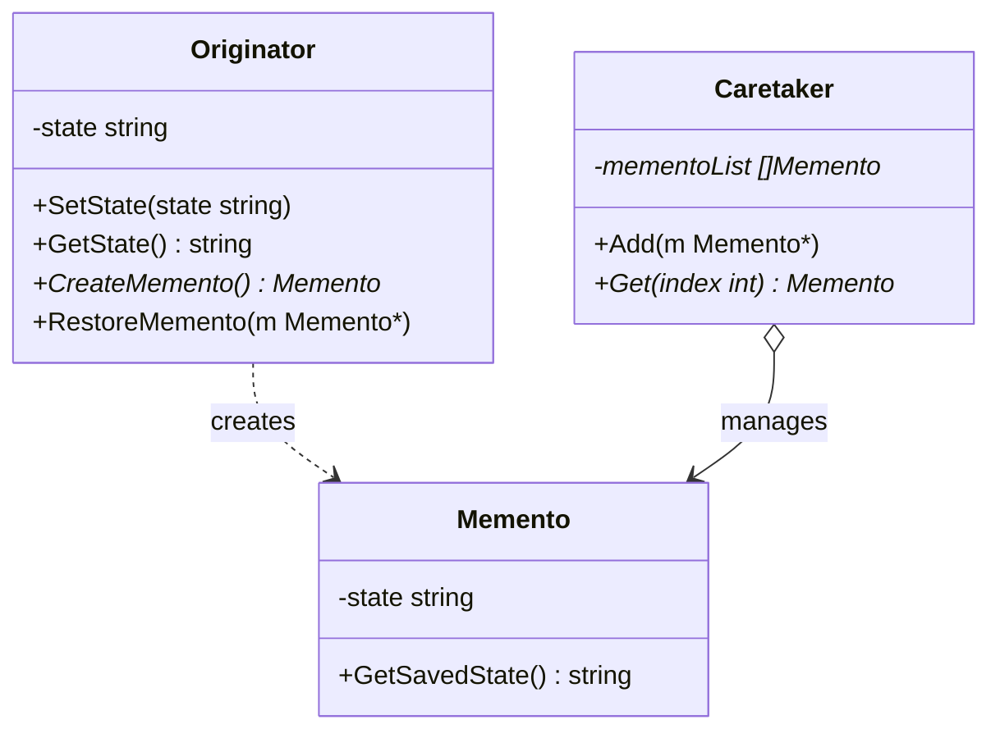

Memento adalah behavioral design pattern yang memungkinkan Anda menyimpan dan mengembalikan status (state) objek sebelumnya tanpa memaparkan detail implementasinya. Di Go, kita mengimplementasikan pola ini dengan membuat struct Memento yang menampung status privat dari Originator (objek yang statusnya ingin disimpan), dan Caretaker (penjaga riwayat) yang mengelola Memento tersebut.

## Penjelasan Konseptual & Analogi Dunia Nyata

Bayangkan Anda sedang memainkan video game role-playing yang kompleks. Sebelum memasuki arena bos yang berbahaya, Anda membuat checkpoint penyimpanan (save file). Jika karakter Anda dikalahkan atau Anda membuat keputusan buruk yang berujung pada akhir yang buruk, Anda tidak perlu mengulang seluruh permainan dari awal. Sebaliknya, Anda cukup memuat checkpoint tersebut dan mengembalikan status karakter Anda (darah, peralatan, level, inventaris) tepat seperti sebelum pertempuran terjadi.

Sistem penyimpanan game bertindak sebagai pola Memento:
1. **Originator**: Game/karakter aktif itu sendiri. Ia memiliki status internal kompleks yang berubah selama permainan.
2. **Memento**: Save file. Ini adalah snapshot status internal permainan. Save file ini bersifat read-only untuk apa pun di luar mesin game itu sendiri.
3. **Caretaker**: Menu atau sistem simpan/muat (save/load). Sistem ini menyimpan daftar file penyimpanan, mengetahui kapan harus menyimpan, dan kapan harus mengembalikan, tetapi ia tidak dapat mengubah data di dalam file penyimpanan itu sendiri.

---

## Diagram Konseptual

Berikut adalah diagram kelas Mermaid yang menunjukkan struktur pola Memento di Go:



---

## Use Case / Skenario Masalah

Mengapa kita membutuhkan pola ini?
Biasanya, untuk membuat fitur undo atau simpan status, Anda mungkin menyalin semua properti objek ke variabel cadangan. Namun, ini memiliki kelemahan besar:
1. **Kerusakan Enkapsulasi**: Sebagian besar objek memiliki field privat yang berisi status penting. Untuk menyalinnya, Anda harus membuat field tersebut menjadi publik, memaparkan struktur internal objek ke kelas/struct lain.
2. **Beban Pemeliharaan**: Jika Anda mengubah field di dalam objek (misalnya, menambahkan posisi kursor atau struct konfigurasi), Anda harus memperbarui semua bagian aplikasi yang menyalin status ini.

Pola Memento mendelegasikan tanggung jawab pembuatan snapshot kepada pemilik status itu sendiri (Originator). Karena Originator menanganinya secara internal, tidak ada detail privat yang terekspos, menjaga enkapsulasi tetap ketat.

---

## Contoh Kode Golang

Di bawah ini adalah program Go lengkap yang dapat dikompilasi, mendemonstrasikan pola Memento menggunakan gaya Refactoring Guru.

```go
package main

import (
	"fmt"
)

// Memento menyimpan status internal dari Originator.
// Di Go, enkapsulasi status dapat dicapai dengan menggunakan field unexported (huruf kecil).
type Memento struct {
	state string
}

// GetSavedState mengambil status yang disimpan di dalam memento.
func (m *Memento) GetSavedState() string {
	return m.state
}

// Originator mewakili objek yang statusnya perlu disimpan dan dikembalikan.
type Originator struct {
	state string
}

// SetState memodifikasi status originator saat ini.
func (o *Originator) SetState(state string) {
	fmt.Printf("Originator: Mengatur status ke -> \"%s\"\n", state)
	o.state = state
}

// GetState mengembalikan status saat ini.
func (o *Originator) GetState() string {
	return o.state
}

// CreateMemento menangkap status saat ini dan mengembalikan Memento baru.
func (o *Originator) CreateMemento() *Memento {
	fmt.Printf("Originator: Menyimpan status ke Memento...\n")
	return &Memento{state: o.state}
}

// RestoreMemento mengembalikan status originator dari Memento.
func (o *Originator) RestoreMemento(m *Memento) {
	if m == nil {
		fmt.Println("Originator: Memento tidak valid, pemulihan gagal.")
		return
	}
	o.state = m.GetSavedState()
	fmt.Printf("Originator: Status berhasil dikembalikan ke -> \"%s\"\n", o.state)
}

// Caretaker mengelola daftar status yang disimpan (riwayat).
type Caretaker struct {
	mementoList []*Memento
}

// Add menambahkan Memento baru ke log riwayat.
func (c *Caretaker) Add(m *Memento) {
	c.mementoList = append(c.mementoList, m)
}

// Get mengambil Memento berdasarkan indeks dari log riwayat.
func (c *Caretaker) Get(index int) *Memento {
	if index < 0 || index >= len(c.mementoList) {
		return nil
	}
	return c.mementoList[index]
}

func main() {
	originator := &Originator{}
	caretaker := &Caretaker{}

	// Langkah 1: Inisialisasi dan simpan beberapa status
	originator.SetState("Status #1 (Draf Konten)")
	originator.SetState("Status #2 (Menambahkan Paragraf Pertama)")
	caretaker.Add(originator.CreateMemento()) // Checkpoint 0

	originator.SetState("Status #3 (Menambahkan Gambar dan Tautan)")
	caretaker.Add(originator.CreateMemento()) // Checkpoint 1

	originator.SetState("Status #4 (Menghapus setengah isi dokumen secara tidak sengaja)")
	fmt.Printf("\n[Status Saat Ini]: %s\n\n", originator.GetState())

	// Langkah 2: Mengembalikan status ke checkpoint sebelumnya
	fmt.Println("--- AKSI UNDO 1 (Kembali ke Checkpoint 1) ---")
	originator.RestoreMemento(caretaker.Get(1))
	fmt.Printf("[Status Saat Ini]: %s\n\n", originator.GetState())

	fmt.Println("--- AKSI UNDO 2 (Kembali ke Checkpoint 0) ---")
	originator.RestoreMemento(caretaker.Get(0))
	fmt.Printf("[Status Saat Ini]: %s\n", originator.GetState())
}
```

---

## Ringkasan

### Keuntungan
- **Enkapsulasi**: Anda dapat menghasilkan snapshot status objek tanpa melanggar enkapsulasinya (tidak perlu membuat field privat menjadi publik).
- **Penyederhanaan**: Caretaker mengelola riwayat, memungkinkan Originator fokus pada tugas utamanya yaitu menjalankan logika bisnis dan transisi status.

### Kekurangan
- **Konsumsi Memori**: Jika klien membuat memento terlalu sering, hal ini dapat menghabiskan RAM dalam jumlah besar.
- **Manajemen Sumber Daya**: Pada bahasa tanpa pengumpul sampah (garbage collector) otomatis, melacak checkpoint lama bisa menjadi mahal.
- **Siklus Hidup Caretaker**: Caretaker harus melacak siklus hidup originator agar tidak menyimpan referensi ke originator yang sudah dihapus (kebocoran memori).

### Kapan Menggunakan
- Gunakan pola Memento ketika Anda ingin menghasilkan snapshot status objek agar dapat mengembalikan status objek sebelumnya (misalnya, fitur undo/redo).
- Gunakan pola ini ketika akses langsung ke field/getter/setter objek melanggar enkapsulasinya.
