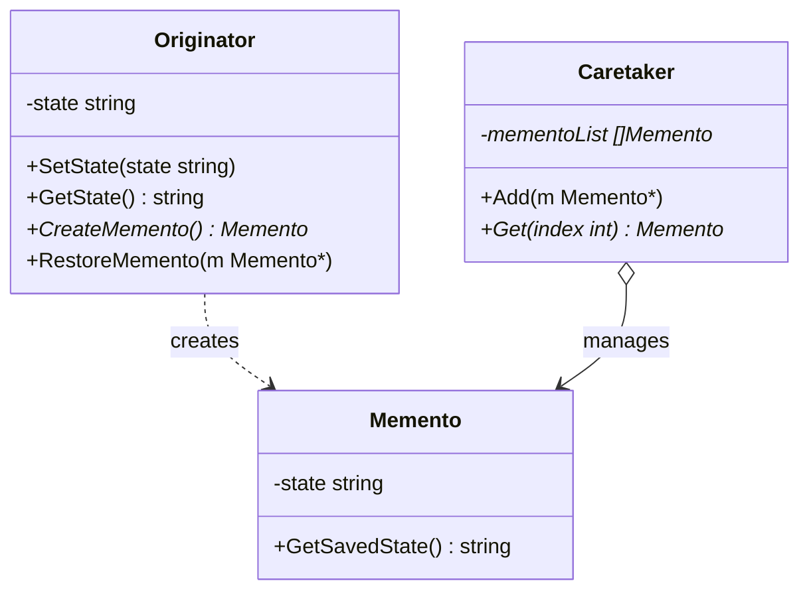

The Memento is a behavioral design pattern that lets you save and restore the previous state of an object without revealing the details of its implementation. In Go, we implement this pattern by creating a Memento struct that holds the private state of an Originator (the object whose state needs to be saved), and a Caretaker (the history keeper) that manages these Mementos.

## Conceptual Explanation & Real-World Analogy

Imagine you are playing a complex role-playing video game. Before you enter a dangerous boss arena, you create a save checkpoint (a save file). If your character is defeated or you make choices that lead to a bad ending, you don't have to restart the entire game from the beginning. Instead, you simply load the checkpoint and restore your character's state (health, equipment, level, inventory) to exactly how it was before the battle.

The game's save system acts as the Memento pattern:
1. **Originator**: The active game/character itself. It has a complex internal state that changes during gameplay.
2. **Memento**: The save file. It is a snapshot of the game's internal state. It is read-only for anything outside the game engine itself.
3. **Caretaker**: The save/load menu or system. It stores the list of save files, knows when to save, and knows when to restore, but it cannot modify the actual data inside the save file.

---

## Conceptual Diagram

Here is a Mermaid class diagram that shows the structure of the Memento pattern in Go:



---

## Use Case / Problem Scenario

Why do we need this pattern?
Normally, to create an undo feature or save state, you might copy all properties of an object to a backup variable. However, this has major downsides:
1. **Encapsulation Breakdown**: Most objects have private fields containing important state. To copy them, you would have to make these fields public, exposing the object's internal structure to other classes/structs.
2. **Maintenance Overhead**: If you change the fields inside the object (e.g., adding cursor positions or a configuration struct), you must update all parts of the application that copy this state.

The Memento pattern delegates the responsibility of creating the snapshot to the owner of the state (the Originator). Since the Originator handles it internally, no private details are exposed, maintaining strict encapsulation.

---

## Golang Code Example

Below is a complete, compilable Go program demonstrating the Memento pattern using the Refactoring Guru style.

```go
package main

import (
	"fmt"
)

// Memento stores the internal state of the Originator.
// In Go, state encapsulation can be achieved by using unexported fields.
type Memento struct {
	state string
}

// GetSavedState retrieves the state stored in the memento.
func (m *Memento) GetSavedState() string {
	return m.state
}

// Originator represents the object whose state needs to be saved and restored.
type Originator struct {
	state string
}

// SetState modifies the current state of the originator.
func (o *Originator) SetState(state string) {
	fmt.Printf("Originator: Setting state to -> \"%s\"\n", state)
	o.state = state
}

// GetState returns the current state.
func (o *Originator) GetState() string {
	return o.state
}

// CreateMemento captures the current state and returns a new Memento.
func (o *Originator) CreateMemento() *Memento {
	fmt.Printf("Originator: Saving state to Memento...\n")
	return &Memento{state: o.state}
}

// RestoreMemento restores the originator's state from a Memento.
func (o *Originator) RestoreMemento(m *Memento) {
	if m == nil {
		fmt.Println("Originator: Invalid Memento, restore failed.")
		return
	}
	o.state = m.GetSavedState()
	fmt.Printf("Originator: State restored to -> \"%s\"\n", o.state)
}

// Caretaker manages the list of saved states (history).
type Caretaker struct {
	mementoList []*Memento
}

// Add appends a new Memento to the history log.
func (c *Caretaker) Add(m *Memento) {
	c.mementoList = append(c.mementoList, m)
}

// Get retrieves a Memento by index from the history log.
func (c *Caretaker) Get(index int) *Memento {
	if index < 0 || index >= len(c.mementoList) {
		return nil
	}
	return c.mementoList[index]
}

func main() {
	originator := &Originator{}
	caretaker := &Caretaker{}

	// Step 1: Initialize and save states
	originator.SetState("State #1 (Draft Content)")
	originator.SetState("State #2 (Added First Paragraph)")
	caretaker.Add(originator.CreateMemento()) // Checkpoint 0

	originator.SetState("State #3 (Added Images and Links)")
	caretaker.Add(originator.CreateMemento()) // Checkpoint 1

	originator.SetState("State #4 (Deleted half of the document by mistake)")
	fmt.Printf("\n[Current State]: %s\n\n", originator.GetState())

	// Step 2: Restore back to previous state
	fmt.Println("--- UNDO ACTION 1 (Go back to Checkpoint 1) ---")
	originator.RestoreMemento(caretaker.Get(1))
	fmt.Printf("[Current State]: %s\n\n", originator.GetState())

	fmt.Println("--- UNDO ACTION 2 (Go back to Checkpoint 0) ---")
	originator.RestoreMemento(caretaker.Get(0))
	fmt.Printf("[Current State]: %s\n", originator.GetState())
}
```

---

## Summary

### Advantages
- **Encapsulation**: You can produce snapshots of an object's state without violating its encapsulation (no need to make private fields public).
- **Simplification**: The Caretaker manages the history, allowing the Originator to focus on its primary task of executing business logic and state transitions.

### Disadvantages
- **Memory Consumption**: If clients create mementos too frequently, it can consume a large amount of RAM.
- **Resource Management**: In languages without automatic garbage collection or with heavy resource requirements, tracking old checkpoints can be expensive.
- **Caretaker Lifecycle**: The caretaker must track the originator's lifecycle to avoid storing references to deleted originators (memory leaks).

### When to Use
- Use the Memento pattern when you want to produce snapshots of the object's state to be able to restore a previous state of the object (e.g., undo/redo features).
- Use the pattern when direct access to the object's fields/getters/setters violates its encapsulation.
