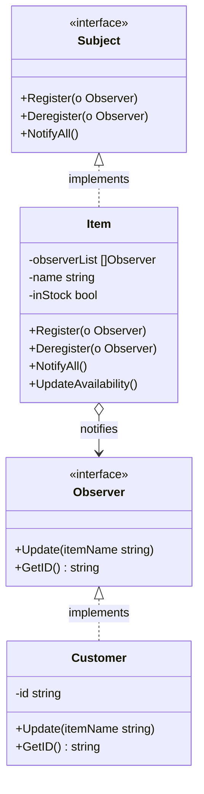

Observer adalah behavioral design pattern yang memungkinkan Anda mendefinisikan mekanisme berlangganan (subscription) untuk memberi tahu banyak objek tentang peristiwa (event) apa pun yang terjadi pada objek yang sedang mereka amati. Di Go, kita mengimplementasikan pola ini menggunakan interface untuk Subject (Observable) dan Observers, memungkinkan keterikatan yang longgar (loose coupling) yang fleksibel antara penghasil event (producer) dan konsumen (consumer).

## Penjelasan Konseptual & Analogi Dunia Nyata

Bayangkan Anda tertarik untuk membeli sepasang sepatu kets langka di toko online. Sepatu tersebut saat ini sedang habis stok. Anda memiliki dua pilihan untuk memeriksa ketersediaannya:
1. **Polling (Pemeriksaan Berkala)**: Anda mengunjungi situs web toko setiap jam. Ini sangat tidak efisien. Anda membuang waktu Anda sendiri, dan server toko terbebani dengan lalu lintas kunjungan yang sia-sia.
2. **Subscription (Berlangganan)**: Anda mendaftarkan email Anda ke sistem notifikasi toko. Saat sepatu tersebut kembali tersedia, toko secara otomatis mengirimkan email ke semua orang yang berlangganan.

Model berlangganan ini adalah pola Observer:
1. **Subject (Publisher / Observable)**: Toko online tersebut. Ia menyimpan status (status stok) dan mencatat daftar pelanggan.
2. **Observers (Subscribers)**: Pelanggan yang mendaftarkan email mereka. Mereka ingin diberi tahu ketika status toko berubah.

---

## Diagram Konseptual

Berikut adalah diagram kelas Mermaid yang menunjukkan struktur pola Observer di Go:



---

## Use Case / Skenario Masalah

Mengapa kita membutuhkan pola ini?
Dalam pengembangan perangkat lunak, Anda sering kali memiliki komponen yang perlu merespons perubahan status pada komponen lain. Sebagai contoh:
- Elemen antarmuka pengguna (UI) perlu diperbarui ketika query database latar belakang selesai.
- Layanan pencatatan (logging) perlu menulis entri log saat terjadi error.
- Modul analitik perlu melacak tindakan checkout pengguna.

Tanpa pola Observer, penghasil event (producer) harus menyimpan referensi langsung ke setiap konsumen (consumer), yang menyebabkan keterikatan yang erat (tight coupling). Jika Anda ingin menambahkan konsumen baru, Anda harus memodifikasi kode producer.

Dengan menggunakan pola Observer:
- Subject (producer) didekopel sepenuhnya dari observers (consumers). Subject hanya mengetahui bahwa observers mengimplementasikan interface tertentu.
- Anda dapat mendaftarkan atau menghapus observers secara dinamis saat program berjalan (runtime).
- Menambahkan observer baru tidak memerlukan modifikasi pada kode subject, yang mematuhi Open/Closed Principle.

---

## Contoh Kode Golang

Di bawah ini adalah program Go lengkap yang dapat dikompilasi, mendemonstrasikan pola Observer menggunakan gaya Refactoring Guru.

```go
package main

import (
	"fmt"
)

// Subject mendefinisikan interface untuk mendaftarkan, menghapus, dan memberi tahu observer.
type Subject interface {
	Register(observer Observer)
	Deregister(observer Observer)
	NotifyAll()
}

// Observer mendefinisikan interface untuk menerima pembaruan dari subject.
type Observer interface {
	Update(itemName string)
	GetID() string
}

// Item adalah subject konkret yang mewakili produk toko.
type Item struct {
	observerList []Observer
	name         string
	inStock      bool
}

// NewItem membuat instans Item baru.
func NewItem(name string) *Item {
	return &Item{name: name}
}

// UpdateAvailability mengubah status stok dan memberi tahu semua observer yang terdaftar.
func (i *Item) UpdateAvailability() {
	fmt.Printf("\n[Pembaruan Toko]: Barang \"%s\" sekarang tersedia kembali!\n", i.name)
	i.inStock = true
	i.NotifyAll()
}

// Register menambahkan observer ke daftar langganan.
func (i *Item) Register(o Observer) {
	i.observerList = append(i.observerList, o)
	fmt.Printf("Sistem: Mendaftarkan pelanggan [%s] untuk barang \"%s\"\n", o.GetID(), i.name)
}

// Deregister menghapus observer dari daftar langganan.
func (i *Item) Deregister(o Observer) {
	i.observerList = removeFromSlice(i.observerList, o)
	fmt.Printf("Sistem: Menghapus pelanggan [%s] dari barang \"%s\"\n", o.GetID(), i.name)
}

// NotifyAll mengirimkan notifikasi ke semua observer yang terdaftar.
func (i *Item) NotifyAll() {
	for _, observer := range i.observerList {
		observer.Update(i.name)
	}
}

// Fungsi pembantu untuk menghapus observer dari slice.
func removeFromSlice(observerList []Observer, observerToRemove Observer) []Observer {
	length := len(observerList)
	for idx, observer := range observerList {
		if observerToRemove.GetID() == observer.GetID() {
			observerList[idx] = observerList[length-1]
			return observerList[:length-1]
		}
	}
	return observerList
}

// Customer adalah observer konkret.
type Customer struct {
	email string
}

// Update menangani notifikasi yang diterima dari subject.
func (c *Customer) Update(itemName string) {
	fmt.Printf("Server Email: Mengirim email notifikasi ke [%s] -> \"%s\" siap dipesan!\n", c.email, itemName)
}

// GetID mengembalikan pengidentifikasi unik milik observer (email).
func (c *Customer) GetID() string {
	return c.email
}

func main() {
	// Membuat subject konkret (sepatu kets)
	sneakerItem := NewItem("Nike Air Max")

	// Membuat observer (pelanggan)
	customer1 := &Customer{email: "alice@gmail.com"}
	customer2 := &Customer{email: "bob@yahoo.com"}
	customer3 := &Customer{email: "charlie@outlook.com"}

	// Mendaftarkan observer
	sneakerItem.Register(customer1)
	sneakerItem.Register(customer2)
	sneakerItem.Register(customer3)

	// Memicu notifikasi
	sneakerItem.UpdateAvailability()

	// Menghapus satu pelanggan
	fmt.Println()
	sneakerItem.Deregister(customer2)

	// Memicu notifikasi lagi (hanya alice dan charlie yang menerima)
	sneakerItem.UpdateAvailability()
}
```

---

## Ringkasan

### Keuntungan
- **Open/Closed Principle**: Anda dapat menambahkan kelas subscriber baru tanpa harus mengubah kode publisher (dan sebaliknya jika ada interface publisher).
- **Loose Coupling**: Hubungan antara subject dan observers bersifat abstrak dan fleksibel.
- **Fleksibilitas Runtime**: Observers dapat ditambahkan atau dihapus secara dinamis selama aplikasi berjalan.

### Kekurangan
- **Urutan Notifikasi**: Observers diberi tahu dalam urutan acak, yang dapat menyebabkan masalah jika logika Anda bergantung pada urutan tertentu.
- **Kebocoran Memori (Memory Leaks)**: Jika observer didaftarkan tetapi tidak pernah dihapus, hal itu dapat menyebabkan kebocoran memori, karena subject menahan referensi kuat ke mereka (sering disebut *lapsed listener problem*).
- **Beban Performa**: Jika terdapat ribuan observer, penyiaran notifikasi ke semuanya secara sinkron dapat memperlambat thread eksekusi utama.

### Kapan Menggunakan
- Gunakan pola Observer ketika perubahan status satu objek mengharuskan perubahan pada objek lain, dan set objek tersebut tidak diketahui sebelumnya atau berubah secara dinamis.
- Gunakan pola ini ketika beberapa objek dalam aplikasi Anda harus mengamati objek lain, tetapi hanya untuk waktu terbatas atau dalam kasus tertentu saja.
