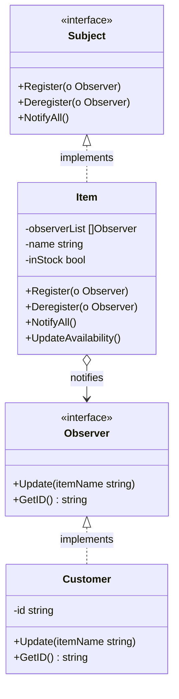

The Observer is a behavioral design pattern that lets you define a subscription mechanism to notify multiple objects about any events that happen to the object they’re observing. In Go, we implement this pattern using interfaces for the Subject (Observable) and the Observers, enabling flexible, loose coupling between event producers and consumers.

## Conceptual Explanation & Real-World Analogy

Imagine you are interested in buying a rare pair of sneakers at an online store. The sneakers are currently out of stock. You have two options to check their availability:
1. **Polling**: You visit the store website every hour. This is extremely inefficient. You waste your own time, and the store server gets hammered with useless traffic.
2. **Subscription**: You subscribe to the store's email notification system. When the sneakers are back in stock, the store automatically sends an email to everyone who subscribed.

The subscription model is the Observer pattern:
1. **Subject (Publisher / Observable)**: The online store. It holds the state (stock status) and keeps track of subscribers.
2. **Observers (Subscribers)**: The customers who registered their emails. They want to be notified when the store's state changes.

---

## Conceptual Diagram

Here is a Mermaid class diagram that shows the structure of the Observer pattern in Go:



---

## Use Case / Problem Scenario

Why do we need this pattern?
In software development, you often have components that need to respond to state changes in other components. For example:
- A user interface element needs to refresh when a background database query completes.
- A logging service needs to write a log entry when an error occurs.
- An analytics module needs to track user checkout actions.

Without the Observer pattern, the producer of the event would need to hold direct references to every single consumer, resulting in tight coupling. If you wanted to add a new consumer, you would have to modify the producer's code.

By using the Observer pattern:
- The subject (producer) is completely decoupled from the observers (consumers). The subject only knows that observers implement a specific interface.
- You can register or remove observers dynamically at runtime.
- Adding a new observer doesn't require modifying the subject's code, adhering to the Open/Closed Principle.

---

## Golang Code Example

Below is a complete, compilable Go program demonstrating the Observer pattern using the Refactoring Guru style.

```go
package main

import (
	"fmt"
)

// Subject defines the interface for registering, deregistering, and notifying observers.
type Subject interface {
	Register(observer Observer)
	Deregister(observer Observer)
	NotifyAll()
}

// Observer defines the interface to receive updates from subjects.
type Observer interface {
	Update(itemName string)
	GetID() string
}

// Item is a concrete subject representing a store item.
type Item struct {
	observerList []Observer
	name         string
	inStock      bool
}

// NewItem creates a new Item instance.
func NewItem(name string) *Item {
	return &Item{name: name}
}

// UpdateAvailability changes the stock status and notifies all registered observers.
func (i *Item) UpdateAvailability() {
	fmt.Printf("\n[Store Update]: Item \"%s\" is now back in stock!\n", i.name)
	i.inStock = true
	i.NotifyAll()
}

// Register adds an observer to the subscription list.
func (i *Item) Register(o Observer) {
	i.observerList = append(i.observerList, o)
	fmt.Printf("System: Registered subscriber [%s] for item \"%s\"\n", o.GetID(), i.name)
}

// Deregister removes an observer from the subscription list.
func (i *Item) Deregister(o Observer) {
	i.observerList = removeFromSlice(i.observerList, o)
	fmt.Printf("System: Deregistered subscriber [%s] for item \"%s\"\n", o.GetID(), i.name)
}

// NotifyAll sends notifications to all registered observers.
func (i *Item) NotifyAll() {
	for _, observer := range i.observerList {
		observer.Update(i.name)
	}
}

// Helper function to remove an observer from the slice.
func removeFromSlice(observerList []Observer, observerToRemove Observer) []Observer {
	length := len(observerList)
	for idx, observer := range observerList {
		if observerToRemove.GetID() == observer.GetID() {
			observerList[idx] = observerList[length-1]
			return observerList[:length-1]
		}
	}
	return observerList
}

// Customer is a concrete observer.
type Customer struct {
	email string
}

// Update handles notifications received from the subject.
func (c *Customer) Update(itemName string) {
	fmt.Printf("Email Server: Sending notification email to [%s] -> \"%s\" is ready to order!\n", c.email, itemName)
}

// GetID returns the observer's unique identifier (email).
func (c *Customer) GetID() string {
	return c.email
}

func main() {
	// Create a concrete subject (sneakers)
	sneakerItem := NewItem("Nike Air Max")

	// Create observers (customers)
	customer1 := &Customer{email: "alice@gmail.com"}
	customer2 := &Customer{email: "bob@yahoo.com"}
	customer3 := &Customer{email: "charlie@outlook.com"}

	// Register observers
	sneakerItem.Register(customer1)
	sneakerItem.Register(customer2)
	sneakerItem.Register(customer3)

	// Trigger notifications
	sneakerItem.UpdateAvailability()

	// Deregister one subscriber
	fmt.Println()
	sneakerItem.Deregister(customer2)

	// Trigger notification again (only alice and charlie should receive it)
	sneakerItem.UpdateAvailability()
}
```

---

## Summary

### Advantages
- **Open/Closed Principle**: You can introduce new subscriber classes without having to change the publisher’s code (and vice versa if there’s a publisher interface).
- **Loose Coupling**: The relationship between subjects and observers is abstract and flexible.
- **Runtime Flexibility**: Observers can be added or removed dynamically at runtime.

### Disadvantages
- **Order of Notifications**: Observers are notified in random order, which can cause issues if your logic depends on a specific order.
- **Memory Leaks**: If observers are registered but never deregistered, it can lead to memory leaks, as the subject holds strong references to them (often called the *lapsed listener problem*).
- **Performance Overhead**: If there are thousands of observers, broadcasting notifications to all of them synchronously can slow down the main execution thread.

### When to Use
- Use the Observer pattern when changes to the state of one object may require changing other objects, and the actual set of objects is unknown beforehand or changes dynamically.
- Use the pattern when some objects in your app must observe others, but only for a limited time or in specific cases.
