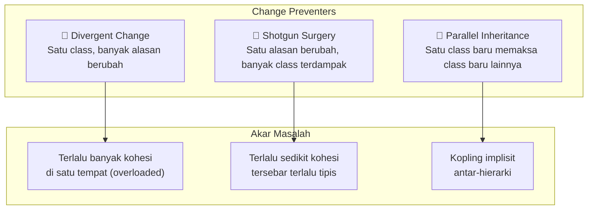
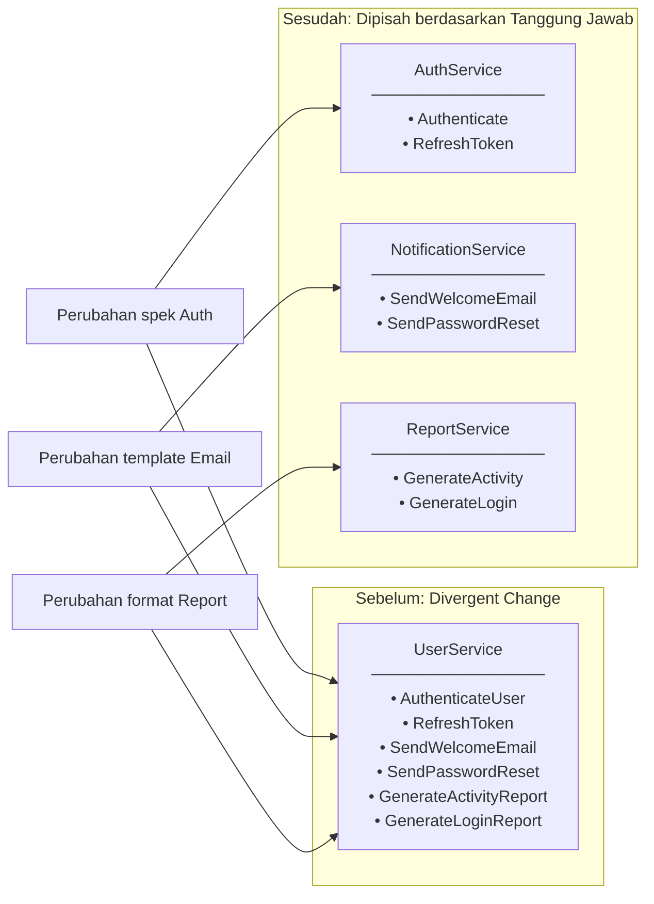
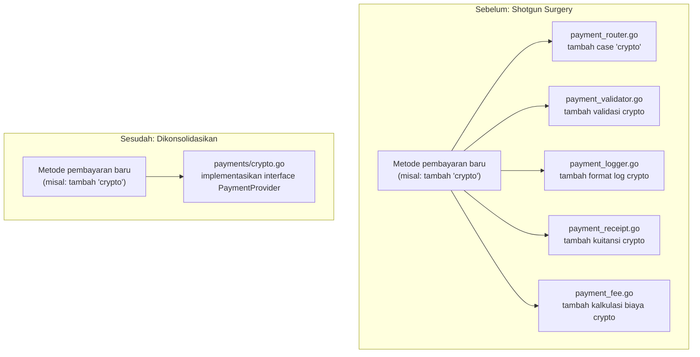
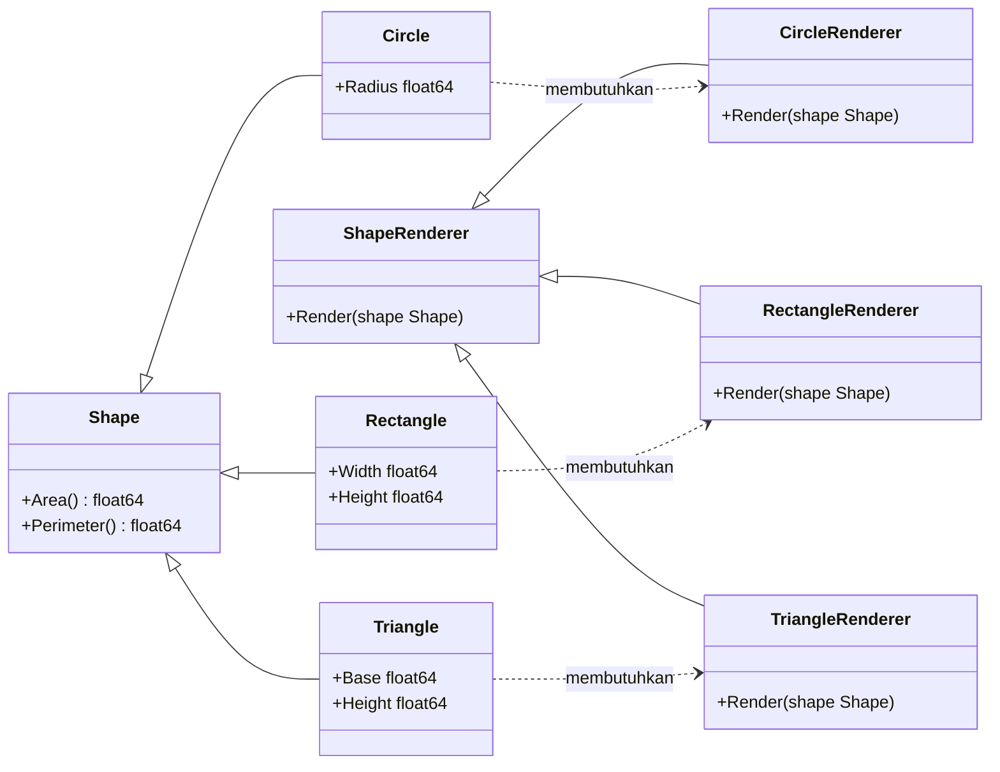
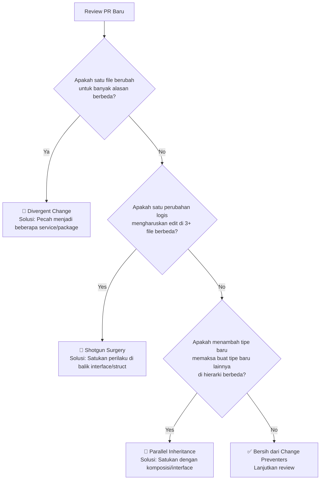

Kamu pernah melakukan perubahan kecil pada satu baris kode, lalu tiba-tiba compiler atau IDE milikmu menunjukkan error di lima file yang berbeda? Atau saat kamu ingin mengubah cara sistem melakukan otentikasi user, kamu juga terpaksa harus menyentuh kode untuk template email dan reporting di file yang sama? Jika skenario ini terasa familiar, selamat — kamu sedang berhadapan dengan **Change Preventers** (Pencegah Perubahan). 

Change Preventers adalah salah satu kategori *code smell* yang diidentifikasi oleh Martin Fowler. Kode jenis ini tidak hanya terlihat kotor, tetapi secara aktif "melawan balik" setiap kali kamu mencoba mengembangkan sistem. Dalam codebase Go di dunia nyata, Change Preventers adalah salah satu bentuk *technical debt* yang paling mahal karena mereka memperbesar dampak (*blast radius*) dari setiap perubahan kecil, sehingga penambahan fitur sederhana bisa berubah menjadi petualangan refactoring berhari-hari.

Di post ini, kita akan membedah tiga jenis *code smell* yang termasuk dalam Change Preventers — **Divergent Change**, **Shotgun Surgery**, dan **Parallel Inheritance Hierarchies** — memahami mengapa mereka bisa terbentuk, dan mempelajari cara membasminya dengan contoh kode Go yang konkret.

---

## 🎯 Takeaway

Setelah membaca artikel ini, kamu akan:

- 🔍 **Mengenali** ketiga jenis smell Change Preventers di dalam codebase Go milikmu
- 💡 **Memahami** akar masalah di balik setiap smell (petunjuk: ini selalu tentang pembagian tanggung jawab)
- 🛠️ **Menerapkan** strategi refactoring yang tepat: Pemisahan Struct (Split Class), Konsolidasi (Consolidation), dan Komposisi (Composition)
- ✍️ **Menulis** kode Go yang terstruktur sehingga satu perubahan logis hanya perlu menyentuh satu tempat saja
- 📊 **Menggambarkan** arsitektur sebelum/sesudah refactoring menggunakan diagram mental yang tepat

---

## Apa Itu Change Preventers?

Change Preventers adalah kelompok *code smell* di mana **struktur kodemu** membuat perubahan menjadi sangat sulit dilakukan tanpa alasan yang masuk akal. Berbeda dengan *bloater smells* (yang berkaitan dengan ukuran file/fungsi), Change Preventers berfokus pada masalah **kohesi dan kopling (cohesion and coupling)** — alias meletakkan tanggung jawab (*responsibility*) di tempat yang salah.

Ada tiga jenis utama:

| Smell | Gejala | Akar Masalah |
|---|---|---|
| **Divergent Change** | Satu class/struct diubah untuk banyak alasan yang berbeda | Terlalu banyak tanggung jawab di satu tempat |
| **Shotgun Surgery** | Satu perubahan logis mengharuskan kita mengedit banyak class/struct berbeda | Satu tanggung jawab tersebar di terlalu banyak tempat |
| **Parallel Inheritance** | Setiap kali membuat subclass baru, kita terpaksa harus membuat subclass lain di tempat berbeda | Dua hierarki kelas yang terikat secara implisit |

Perhatikan bahwa **Divergent Change** dan **Shotgun Surgery** adalah dua hal yang **saling berlawanan** — yang satu menumpuk terlalu banyak hal di satu tempat, sedangkan yang lainnya menyebarkan satu hal ke terlalu banyak tempat. Keduanya sama-sama melanggar **Single Responsibility Principle (SRP)**, hanya saja dari arah yang berbeda.



---

## 1. Divergent Change

### Apa Itu?

Sebuah class atau struct mengalami **Divergent Change** (Perubahan Bercabang) jika kamu mendapati dirimu harus memodifikasinya untuk **berbagai alasan yang sama sekali tidak saling berhubungan**. Dinamakan "divergent" karena class tersebut berkembang ke berbagai arah yang berbeda secara bersamaan.

Uji sederhana dari Martin Fowler: *"Jika kamu melihat sebuah class dan berkata 'Saya mengubah class ini setiap kali menambahkan database baru', dan juga 'Saya mengubah class ini setiap kali menambahkan instrumen keuangan baru', maka itu adalah Divergent Change."*

### Mengapa Bisa Terjadi?

Smell ini biasanya muncul ketika developer terus-menerus menambahkan fitur baru ke struct yang "paling mudah diakses" tanpa memikirkan apakah struct tersebut adalah pemilik tanggung jawab yang tepat. Lama-kelamaan, sebuah struct seperti `UserService` berubah menjadi "dewa" yang tahu segalanya (*God Service*).

### Visualisasi Masalah



### Contoh Bad Code (❌)

Di bawah ini adalah contoh `UserService` yang melanggar SRP karena menangani otentikasi, pengiriman email, sekaligus pembuatan laporan.

```go
// ❌ BAD: UserService menangani otentikasi, notifikasi email,
// DAN pelaporan sekaligus. Tiga alasan berbeda untuk melakukan perubahan.

package user

import (
	"fmt"
	"log"
	"time"
)

type User struct {
	ID       int
	Name     string
	Email    string
	Password string // hash
}

// UserService: sebuah "god service" dengan tanggung jawab yang bercabang
type UserService struct {
	db     Database
	mailer Mailer
}

// --- Domain 1: Otentikasi ---

func (s *UserService) AuthenticateUser(email, password string) (*User, error) {
	user, err := s.db.FindByEmail(email)
	if err != nil {
		return nil, fmt.Errorf("user tidak ditemukan: %w", err)
	}
	if !checkPasswordHash(password, user.Password) {
		return nil, fmt.Errorf("kredensial tidak valid")
	}
	log.Printf("User %s berhasil login", user.Email)
	return user, nil
}

func (s *UserService) RefreshToken(userID int) (string, error) {
	user, err := s.db.FindByID(userID)
	if err != nil {
		return "", err
	}
	token := generateToken(user)
	return token, nil
}

// --- Domain 2: Notifikasi ---

func (s *UserService) SendWelcomeEmail(user *User) error {
	subject := "Selamat datang di platform kami!"
	body := fmt.Sprintf("Halo %s, terima kasih telah mendaftar.", user.Name)
	return s.mailer.Send(user.Email, subject, body)
}

func (s *UserService) SendPasswordResetEmail(user *User, token string) error {
	subject := "Reset password Anda"
	body := fmt.Sprintf("Klik tautan berikut untuk reset: https://app.example.com/reset?token=%s", token)
	return s.mailer.Send(user.Email, subject, body)
}

// --- Domain 3: Pelaporan (Reporting) ---

func (s *UserService) GenerateActivityReport(from, to time.Time) ([]byte, error) {
	users, err := s.db.FindActiveUsers(from, to)
	if err != nil {
		return nil, err
	}
	return formatReport(users, "Laporan Aktivitas"), nil
}

func (s *UserService) GenerateLoginReport(from, to time.Time) ([]byte, error) {
	logins, err := s.db.FindLogins(from, to)
	if err != nil {
		return nil, err
	}
	return formatReport(logins, "Laporan Login"), nil
}
```

**Mengapa kode di atas bermasalah:**
- Perubahan pada template email memaksamu mengubah `UserService` — padahal secara logika logika bisnis otentikasi tidak perlu tahu-menahu tentang format teks email.
- Format laporan/report baru mengharuskan perubahan di file yang sama dengan logika kritis keamanan login.
- Unit testing untuk otentikasi memerlukan mock email sender. Testing email memerlukan mock database. Ini membuat pembuatan unit test menjadi sangat menyebalkan.
- `UserService` menjadi dependency dari hampir semua package di aplikasimu, menjadikannya rentan menimbulkan efek domino jika diubah.

### Perbaikan (✅)

Untuk menyembuhkan Divergent Change, kita memecah class tersebut berdasarkan domain tanggung jawabnya menggunakan package yang terpisah dan terfokus.

```go
// ✅ GOOD: Setiap service memegang tepat satu tanggung jawab saja.
// Ubah satu hal -> cukup edit satu file yang relevan.

// --- package auth ---

// AuthService hanya mengurus hal-hal terkait otentikasi.
type AuthService struct {
	db       UserRepository
	tokenGen TokenGenerator
}

func (s *AuthService) Authenticate(email, password string) (*User, error) {
	user, err := s.db.FindByEmail(email)
	if err != nil {
		return nil, fmt.Errorf("user tidak ditemukan: %w", err)
	}
	if !checkPasswordHash(password, user.Password) {
		return nil, fmt.Errorf("kredensial tidak valid")
	}
	return user, nil
}

func (s *AuthService) RefreshToken(userID int) (string, error) {
	user, err := s.db.FindByID(userID)
	if err != nil {
		return "", fmt.Errorf("user %d tidak ditemukan: %w", userID, err)
	}
	return s.tokenGen.Generate(user), nil
}

// --- package notification ---

// NotificationService hanya mengurus komunikasi dan template email.
type NotificationService struct {
	mailer Mailer
	tmpl   TemplateEngine
}

func (s *NotificationService) SendWelcome(user User) error {
	body, err := s.tmpl.Render("welcome", user)
	if err != nil {
		return fmt.Errorf("gagal render template welcome: %w", err)
	}
	return s.mailer.Send(user.Email, "Selamat datang di platform kami!", body)
}

func (s *NotificationService) SendPasswordReset(user User, token string) error {
	body, err := s.tmpl.Render("password_reset", map[string]string{
		"name":  user.Name,
		"token": token,
	})
	if err != nil {
		return fmt.Errorf("gagal render template reset: %w", err)
	}
	return s.mailer.Send(user.Email, "Reset password Anda", body)
}

// --- package report ---

// ReportService hanya mengurus pembuatan analitik dan laporan.
type ReportService struct {
	db     ReportRepository
	format ReportFormatter
}

func (s *ReportService) GenerateActivity(from, to time.Time) ([]byte, error) {
	data, err := s.db.FetchActiveUsers(from, to)
	if err != nil {
		return nil, fmt.Errorf("gagal mengambil user aktif: %w", err)
	}
	return s.format.Render("activity", data)
}

func (s *ReportService) GenerateLogin(from, to time.Time) ([]byte, error) {
	data, err := s.db.FetchLogins(from, to)
	if err != nil {
		return nil, fmt.Errorf("gagal mengambil data login: %w", err)
	}
	return s.format.Render("login", data)
}
```

**Hasil refactoring:** Jika ingin mengganti template email, kamu cukup menyentuh package `notification`. Jika ingin memodifikasi algoritma token otentikasi, kamu cukup fokus pada package `auth`. Setiap service kini dapat ditest secara mandiri dengan mock yang ringkas dan terfokus.

---

## 2. Shotgun Surgery

### Apa Itu?

**Shotgun Surgery** (Operasi Senapan Sebar) adalah kebalikan dari Divergent Change. Jika pada Divergent Change kita menaruh terlalu banyak tanggung jawab di satu file, pada Shotgun Surgery, **satu konsep logis tersebar secara acak di banyak file atau package**.

Akibatnya, setiap kali kamu ingin membuat satu perubahan logis (misalnya menambah metode pembayaran baru), kamu terpaksa melakukan perubahan kecil di banyak sekali file yang tersebar — mirip seperti luka tembakan senapan *shotgun* yang menyebar ke seluruh tubuh.

### Mengapa Bisa Terjadi?

Smell ini sering kali lahir dari kebiasaan *copy-paste* kode (*duplication*), *feature envy* (saat logika suatu objek ditarik keluar dan dieksekusi di tempat lain), atau evolusi fitur bertahap tanpa pernah meluangkan waktu untuk melakukan konsolidasi desain.

### Visualisasi Masalah



### Contoh Bad Code (❌)

Di bawah ini, menambahkan metode pembayaran baru bernama `"crypto"` memaksa kita mengubah lima file yang berbeda.

```go
// ❌ BAD: Menambahkan metode pembayaran baru (contoh: "crypto")
// mengharuskan perubahan di 5 file berbeda di seluruh codebase.

// --- file: payment_router.go ---
func RoutePayment(method string, amount float64) error {
	switch method {
	case "credit_card":
		return processCreditCard(amount)
	case "bank_transfer":
		return processBankTransfer(amount)
	// ❌ Untuk menambahkan crypto: kamu wajib mengubah file INI
	case "crypto":
		return processCrypto(amount)
	default:
		return fmt.Errorf("metode pembayaran tidak dikenal: %s", method)
	}
}

// --- file: payment_validator.go ---
func ValidatePayment(method string, amount float64) error {
	switch method {
	case "credit_card":
		if amount > 50_000_000 {
			return fmt.Errorf("limit kartu kredit terlampaui")
		}
	case "bank_transfer":
		if amount < 10_000 {
			return fmt.Errorf("minimum transfer bank tidak terpenuhi")
		}
	// ❌ Kamu juga wajib mengubah file INI
	case "crypto":
		if amount < 100_000 {
			return fmt.Errorf("minimum crypto tidak terpenuhi")
		}
	}
	return nil
}

// --- file: payment_fee.go ---
func CalculateFee(method string, amount float64) float64 {
	switch method {
	case "credit_card":
		return amount * 0.029
	case "bank_transfer":
		return 5_000
	// ❌ Dan file INI
	case "crypto":
		return amount * 0.01
	default:
		return 0
	}
}

// --- file: payment_logger.go ---
func LogPayment(method string, amount float64, status string) {
	switch method {
	case "credit_card":
		log.Printf("[CC] nominal=%.0f status=%s", amount, status)
	case "bank_transfer":
		log.Printf("[BT] nominal=%.0f status=%s", amount, status)
	// ❌ Dan file INI juga
	case "crypto":
		log.Printf("[CX] nominal=%.0f status=%s", amount, status)
	}
}

// --- file: payment_receipt.go ---
func GenerateReceipt(method string, amount float64) string {
	switch method {
	case "credit_card":
		return fmt.Sprintf("Pembayaran Kartu Kredit: Rp %.0f", amount)
	case "bank_transfer":
		return fmt.Sprintf("Transfer Bank: Rp %.0f", amount)
	// ❌ Total ada 5 file yang harus diubah hanya untuk satu metode pembayaran baru!
	case "crypto":
		return fmt.Sprintf("Pembayaran Crypto: %.8f BTC", amount/1_000_000_000)
	}
	return ""
}
```

**Mengapa kode di atas bermasalah:**
- Menambahkan satu cara pembayaran mengharuskan kita memodifikasi 5 file terpisah.
- Sangat mudah lupa mengupdate salah satu file, sehingga menghasilkan implementasi yang setengah matang dan rusak di production.
- Tidak ada jaminan dari compiler — compiler Go tidak akan memprotes jika kamu lupa menambahkan case baru di file `payment_fee.go`.
- Definisi sebuah metode pembayaran tidak punya tempat tunggal (Single Source of Truth).

### Perbaikan (✅)

Untuk mengatasi Shotgun Surgery, kita mendefinisikan sebuah interface `PaymentProvider` yang membungkus semua perilaku yang harus dimiliki oleh sebuah metode pembayaran. Menambahkan metode pembayaran baru berarti membuat satu file baru yang mengimplementasikan interface tersebut.

```go
// ✅ GOOD: Definisikan interface PaymentProvider.
// Menambah metode pembayaran baru = membuat 1 file baru yang mengimplementasi interface tersebut.

package payment

import (
	"fmt"
	"log"
)

// PaymentProvider adalah interface tunggal yang memuat seluruh
// kebutuhan sebuah metode pembayaran. Konsep ini sekarang menyatu di SATU tempat.
type PaymentProvider interface {
	Validate(amount float64) error
	CalculateFee(amount float64) float64
	Process(amount float64) error
	Receipt(amount float64) string
	LogTag() string
}

// --- credit_card.go ---
type CreditCardProvider struct{}

func (p CreditCardProvider) Validate(amount float64) error {
	if amount > 50_000_000 {
		return fmt.Errorf("limit kartu kredit terlampaui")
	}
	return nil
}

func (p CreditCardProvider) CalculateFee(amount float64) float64 { return amount * 0.029 }
func (p CreditCardProvider) Process(amount float64) error        { return processCreditCardGateway(amount) }
func (p CreditCardProvider) Receipt(amount float64) string {
	return fmt.Sprintf("Pembayaran Kartu Kredit: Rp %.0f", amount)
}
func (p CreditCardProvider) LogTag() string { return "CC" }

// --- bank_transfer.go ---
type BankTransferProvider struct{}

func (p BankTransferProvider) Validate(amount float64) error {
	if amount < 10_000 {
		return fmt.Errorf("minimum transfer bank tidak terpenuhi")
	}
	return nil
}

func (p BankTransferProvider) CalculateFee(amount float64) float64 { return 5_000 }
func (p BankTransferProvider) Process(amount float64) error        { return processBankGateway(amount) }
func (p BankTransferProvider) Receipt(amount float64) string {
	return fmt.Sprintf("Transfer Bank: Rp %.0f", amount)
}
func (p BankTransferProvider) LogTag() string { return "BT" }

// ✅ Menambahkan "crypto"? Cukup buat SATU file baru: crypto.go
// Tidak ada file lama yang perlu kita ubah isinya.

// --- crypto.go ---
type CryptoProvider struct{}

func (p CryptoProvider) Validate(amount float64) error {
	if amount < 100_000 {
		return fmt.Errorf("minimum crypto tidak terpenuhi")
	}
	return nil
}

func (p CryptoProvider) CalculateFee(amount float64) float64 { return amount * 0.01 }
func (p CryptoProvider) Process(amount float64) error        { return processCryptoGateway(amount) }
func (p CryptoProvider) Receipt(amount float64) string {
	return fmt.Sprintf("Pembayaran Crypto: %.8f BTC", amount/1_000_000_000)
}
func (p CryptoProvider) LogTag() string { return "CX" }

// --- payment_service.go ---
// Service ini hanya berinteraksi dengan interface — bebas dari switch statement.
type PaymentService struct {
	providers map[string]PaymentProvider
}

func NewPaymentService() *PaymentService {
	return &PaymentService{
		providers: map[string]PaymentProvider{
			"credit_card":   CreditCardProvider{},
			"bank_transfer": BankTransferProvider{},
			"crypto":        CryptoProvider{}, // daftarkan sekali di sini
		},
	}
}

func (s *PaymentService) Execute(method string, amount float64) error {
	provider, ok := s.providers[method]
	if !ok {
		return fmt.Errorf("metode pembayaran tidak dikenal: %s", method)
	}

	if err := provider.Validate(amount); err != nil {
		return fmt.Errorf("validasi gagal: %w", err)
	}

	fee := provider.CalculateFee(amount)
	total := amount + fee

	if err := provider.Process(total); err != nil {
		return fmt.Errorf("proses pembayaran gagal: %w", err)
	}

	log.Printf("[%s] nominal=%.0f biaya=%.0f status=success receipt=%s",
		provider.LogTag(), amount, fee, provider.Receipt(amount))

	return nil
}
```

**Hasil refactoring:** Menambah metode pembayaran baru kini hanya membutuhkan dua langkah sederhana:
1. Buat file `crypto.go` dan implementasikan interface `PaymentProvider`.
2. Daftarkan di registry `NewPaymentService()`.

Selesai. Kamu tidak menyentuh kode router, validator, logger, ataupun billing fee bawaan. Selain itu, compiler Go akan langsung memprotes di awal jika kamu tidak mengimplementasikan salah satu fungsi wajib dari interface `PaymentProvider` (compile-time safety!).

---

## 3. Parallel Inheritance Hierarchies

### Apa Itu?

**Parallel Inheritance Hierarchies** (Hierarki Pewarisan Paralel) sebenarnya adalah bentuk khusus dari Shotgun Surgery. Smell ini terjadi ketika setiap kali kamu membuat subclass di sebuah hierarki kelas, kamu **secara paksa** harus membuat subclass baru di hierarki kelas lain yang sejajar. Kedua pohon kelas ini tumbuh secara beriringan dan saling bergantung secara implisit.

Dalam bahasa pemrograman Go yang tidak mendukung pewarisan (*inheritance*) tradisional berbasis kelas, smell ini sering kali bermanifestasi dalam bentuk interface atau struct yang saling berpasangan di package berbeda (contoh: struct `ShapeCircle` pasangannya `RendererCircle`, `AnimalDog` pasangannya `SoundDog`).

### Mengapa Bisa Terjadi?

Biasanya ini berawal dari niat baik untuk memisahkan tanggung jawab (misalnya memisahkan model geometri dengan cara penggambarannya). Namun, karena desainnya kurang matang dan tidak menggunakan polimorfisme/komposisi yang baik, kedua hierarki tersebut justru menjadi terikat mati.

### Visualisasi Masalah



Setiap pembuatan bentuk bangun datar baru memaksa pembuatan renderer baru. Kedua pohon struktur ini terus dipaksa berkembang sejajar.

### Contoh Bad Code (❌)

Di bawah ini, menambahkan tipe bangun datar baru seperti `Triangle` mengharuskan kita membuat struct `Triangle` sekaligus `TriangleRenderer`.

```go
// ❌ BAD: Dua hierarki yang berjalan paralel.
// Menambahkan Triangle mengharuskan kita membuat Triangle shape DAN TriangleRenderer.

package shape

import "fmt"

// --- Hierarki 1: Bentuk Bangun Datar ---

type Shape interface {
	Area() float64
	Perimeter() float64
	ShapeType() string // ← dibutuhkan agar renderer tahu tipe bangun datar apa ini
}

type Circle struct {
	Radius float64
}

func (c Circle) Area() float64      { return 3.14159 * c.Radius * c.Radius }
func (c Circle) Perimeter() float64 { return 2 * 3.14159 * c.Radius }
func (c Circle) ShapeType() string  { return "circle" }

type Rectangle struct {
	Width, Height float64
}

func (r Rectangle) Area() float64      { return r.Width * r.Height }
func (r Rectangle) Perimeter() float64 { return 2 * (r.Width + r.Height) }
func (r Rectangle) ShapeType() string  { return "rectangle" }

// ❌ Menambahkan Triangle ke Hierarki 1...
type Triangle struct {
	Base, Height, SideA, SideB, SideC float64
}

func (t Triangle) Area() float64      { return 0.5 * t.Base * t.Height }
func (t Triangle) Perimeter() float64 { return t.SideA + t.SideB + t.SideC }
func (t Triangle) ShapeType() string  { return "triangle" }

// --- Hierarki 2: Renderer (paralel terhadap Shape) ---

type ShapeRenderer interface {
	Render(s Shape) string
}

type CircleRenderer struct{}

func (r CircleRenderer) Render(s Shape) string {
	c := s.(Circle) // type assertion — sangat rapuh!
	return fmt.Sprintf("Menggambar lingkaran dengan radius=%.2f", c.Radius)
}

type RectangleRenderer struct{}

func (r RectangleRenderer) Render(s Shape) string {
	rect := s.(Rectangle)
	return fmt.Sprintf("Menggambar persegi panjang %.2f x %.2f", rect.Width, rect.Height)
}

// ❌ ...membuat kita WAJIB menambahkan TriangleRenderer ke Hierarki 2.
type TriangleRenderer struct{}

func (r TriangleRenderer) Render(s Shape) string {
	t := s.(Triangle)
	return fmt.Sprintf("Menggambar segitiga base=%.2f height=%.2f", t.Base, t.Height)
}

// Map registry untuk memetakan bentuk ke renderernya — code smell tambahan:
// setiap bentuk baru wajib mendaftarkan diri di sini.
func GetRenderer(s Shape) ShapeRenderer {
	switch s.ShapeType() {
	case "circle":
		return CircleRenderer{}
	case "rectangle":
		return RectangleRenderer{}
	case "triangle":
		return TriangleRenderer{}
	default:
		panic(fmt.Sprintf("tidak ada renderer untuk tipe: %s", s.ShapeType()))
	}
}
```

**Mengapa kode di atas bermasalah:**
- Kita harus membuat dua file/struct baru sekaligus untuk setiap modifikasi bisnis.
- *Type assertion* `s.(Circle)` rawan memicu panic di run-time jika salah kirim objek.
- Kedua hierarki terikat mati; jika lupa membuat renderer untuk salah satu bangun, aplikasi akan crash saat dijalankan.

### Perbaikan (✅)

Pendekatan terbaik untuk mengatasi ini adalah **menyembunyikan/menggabungkan** perilakunya ke dalam struct utama (*collapse hierarchy*), atau membalikkan dependensi menggunakan komposisi.

```go
// ✅ GOOD: Menggabungkan kedua hierarki.
// Bangun datar memiliki fungsi render-nya sendiri — tidak perlu hierarki terpisah.

package shape

import "fmt"

// Shape adalah satu-satunya interface. Ia tahu cara menghitung geometri
// sekaligus cara menggambarkan dirinya sendiri.
type Shape interface {
	Area() float64
	Perimeter() float64
	Render() string
}

type Circle struct {
	Radius float64
}

func (c Circle) Area() float64      { return 3.14159 * c.Radius * c.Radius }
func (c Circle) Perimeter() float64 { return 2 * 3.14159 * c.Radius }
func (c Circle) Render() string {
	return fmt.Sprintf("○ Lingkaran — radius=%.2f, luas=%.2f", c.Radius, c.Area())
}

type Rectangle struct {
	Width, Height float64
}

func (r Rectangle) Area() float64      { return r.Width * r.Height }
func (r Rectangle) Perimeter() float64 { return 2 * (r.Width + r.Height) }
func (r Rectangle) Render() string {
	return fmt.Sprintf("▭ Persegi Panjang — %.2fx%.2f, luas=%.2f", r.Width, r.Height, r.Area())
}

// ✅ Menambahkan Triangle: cukup 1 tipe data baru yang mandiri.
// Tidak perlu class/struct renderer paralel lagi.
type Triangle struct {
	Base, Height        float64
	SideA, SideB, SideC float64
}

func (t Triangle) Area() float64      { return 0.5 * t.Base * t.Height }
func (t Triangle) Perimeter() float64 { return t.SideA + t.SideB + t.SideC }
func (t Triangle) Render() string {
	return fmt.Sprintf("△ Segitiga — base=%.2f height=%.2f, luas=%.2f", t.Base, t.Height, t.Area())
}

// Canvas hanya bekerja dengan interface Shape. Bebas switch case.
type Canvas struct {
	shapes []Shape
}

func (c *Canvas) Add(s Shape) {
	c.shapes = append(c.shapes, s)
}

func (c *Canvas) RenderAll() {
	for _, s := range c.shapes {
		fmt.Println(s.Render())
	}
}

// Cara penggunaan yang aman, modular, dan bersih:
func ExampleCanvas() {
	canvas := &Canvas{}
	canvas.Add(Circle{Radius: 5})
	canvas.Add(Rectangle{Width: 4, Height: 6})
	canvas.Add(Triangle{Base: 3, Height: 4, SideA: 3, SideB: 4, SideC: 5})
	canvas.RenderAll()
	// Output:
	// ○ Lingkaran — radius=5.00, luas=78.54
	// ▭ Persegi Panjang — 4.00x6.00, luas=24.00
	// △ Segitiga — base=3.00 height=4.00, luas=6.00
}
```

Jika kamu memang benar-benar membutuhkan rendering yang dinamis (misalnya render ke output PNG, SVG, atau Terminal teks), kamu tidak perlu membuat subclass renderer baru untuk setiap shape. Cukup buat **satu renderer generic** yang memproses data bawaan dari shape tersebut:

```go
// ✅ Solusi Alternatif jika membutuhkan multi-target rendering:
// Gunakan satu Renderer tanpa melahirkan hierarki paralel.

type ShapeData struct {
	Type   string
	Params map[string]float64
}

type Shape interface {
	Area() float64
	Perimeter() float64
	Data() ShapeData // menyuplai deskripsi data terstruktur untuk dikonsumsi renderer
}

func (c Circle) Data() ShapeData {
	return ShapeData{Type: "circle", Params: map[string]float64{"radius": c.Radius}}
}

func (r Rectangle) Data() ShapeData {
	return ShapeData{Type: "rectangle", Params: map[string]float64{"width": r.Width, "height": r.Height}}
}

// Cukup buat SATU SVGRenderer untuk menangani seluruh jenis bangun datar.
type SVGRenderer struct{}

func (r SVGRenderer) Render(d ShapeData) string {
	switch d.Type {
	case "circle":
		return fmt.Sprintf(`<circle r="%.2f"/>`, d.Params["radius"])
	case "rectangle":
		return fmt.Sprintf(`<rect width="%.2f" height="%.2f"/>`,
			d.Params["width"], d.Params["height"])
	default:
		return fmt.Sprintf(`<!-- shape tidak dikenal: %s -->`, d.Type)
	}
}
```

Perbedaannya sangat krusial: sekarang kita hanya memiliki **satu** `SVGRenderer`, bukan satu renderer per bangun datar. Jika kita menambah bangun datar baru, kita hanya perlu mengupdate logic case di dalam `SVGRenderer`, tanpa harus melahirkan class/struct renderer baru.

---

## Cara Mendeteksi Change Preventers Saat Code Review

Gunakan alur panduan berikut saat kamu meninjau Pull Request (PR) rekan timmu:



---

## Ringkasan Strategi Refactoring

| Code Smell | Refactoring Utama | Teknik di Go |
|---|---|---|
| **Divergent Change** | Split Class / Extract Service | Pisahkan package, buat struct yang lebih spesifik |
| **Shotgun Surgery** | Move Method / Inline Class | Definisikan interface tunggal; sembunyikan switch case |
| **Parallel Inheritance** | Collapse Hierarchy | Satukan behavior ke dalam tipe asli; gunakan komposisi |

**Langkah aman melakukan Refactoring:**
1. Tulis *characterization tests* untuk memastikan perilaku fitur yang ada saat ini tidak berubah.
2. Definisikan interface baru atau pecah struct secara perlahan.
3. Pindahkan logika (fungsi/method) satu per satu.
4. Jalankan pengujian unit test setelah setiap kali memindahkan sebaris kode.
5. Hapus kode lama hanya ketika semua rangkaian pengujian berjalan sukses (*green*).

---

## 📝 Ringkasan

Change Preventers adalah musuh utama dari agilitas sebuah codebase. Mereka membuat para developer takut untuk menyentuh kode karena takut merusak bagian sistem yang lain. Mari kita rekap poin pentingnya:

- 🔀 **Divergent Change** — Satu struct memiliki terlalu banyak alasan untuk berubah. **Obatnya:** Pecah menjadi struct-struct kecil yang memiliki satu tugas terfokus.
- 💥 **Shotgun Surgery** — Satu tugas tersebar luas di berbagai file. **Obatnya:** Satukan kembali seluruh varian fungsi di balik sebuah interface yang solid, hilangkan switch case yang redundan.
- 🪞 **Parallel Inheritance** — Struktur class ganda yang harus berkembang berdampingan secara paksa. **Obatnya:** Hancurkan paralelisme tersebut dengan menggabungkan perilakunya ke struct asli atau gunakan komposisi data yang modular.
- 📐 **Prinsip Utama:** Usahakan agar **satu alasan perubahan hanya berdampak pada satu tempat di kode**. Itulah inti dari Single Responsibility Principle (SRP) yang sesungguhnya.

---

🇮🇩 Versi Indonesia | [🇬🇧 English Version](/refactoring-part-3-change-preventers)
