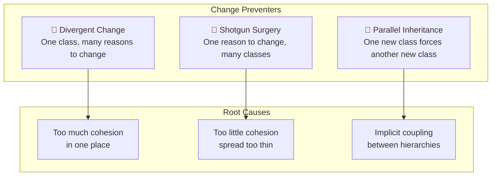
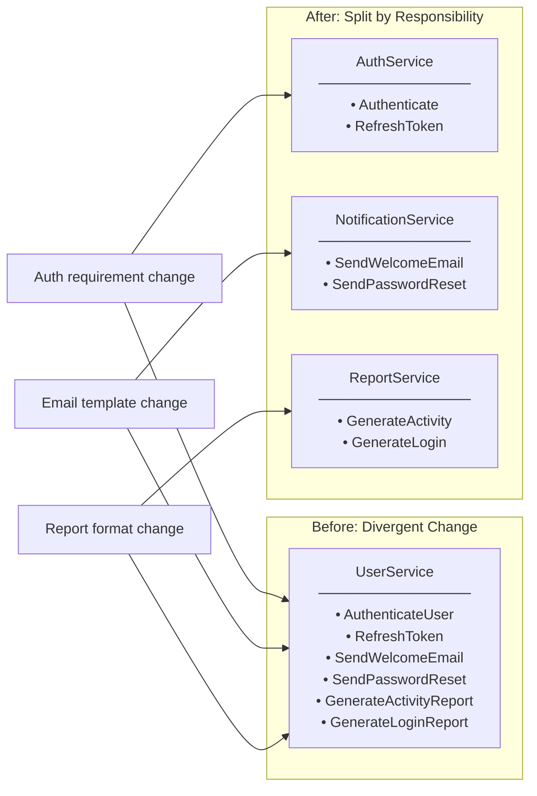
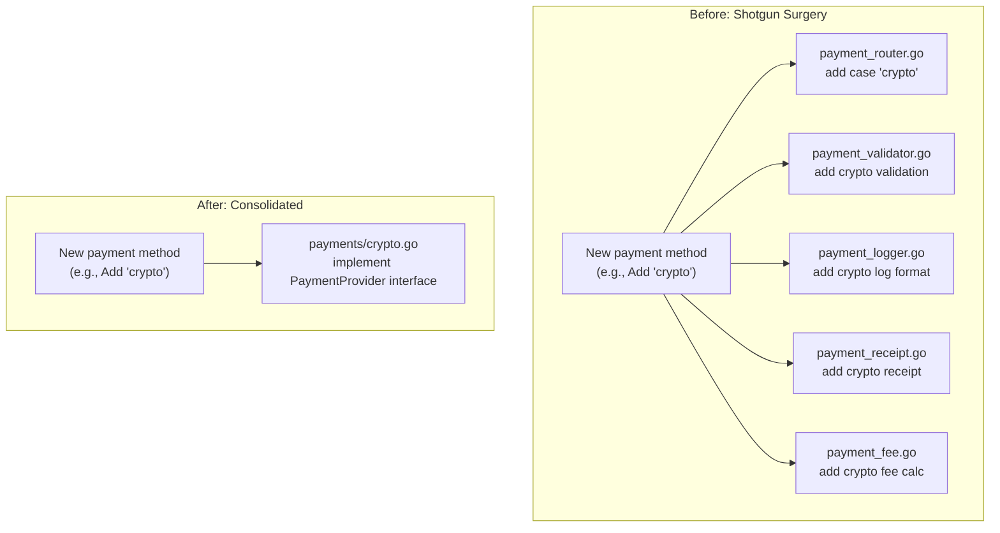
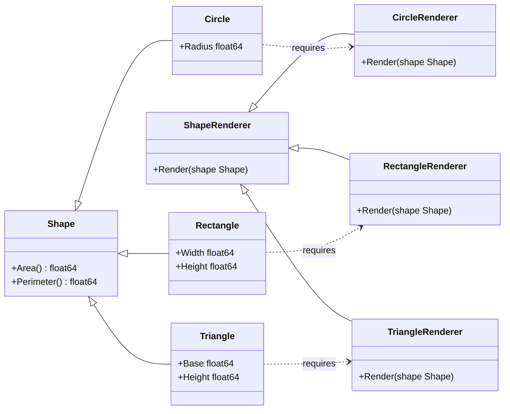
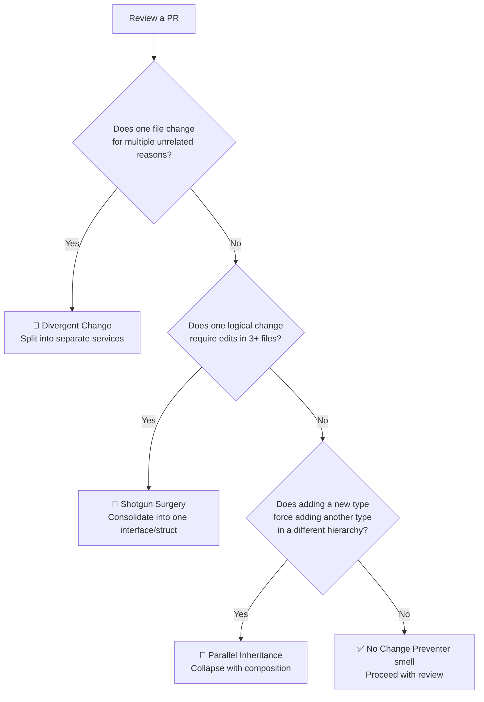

You push a small feature. You update one file — and then your IDE starts highlighting six others that need touching too. You fix those, and suddenly three tests are broken in a completely unrelated package. Sound familiar? This experience has a name: **Change Preventers**. These are a category of code smells identified by Martin Fowler that don't just make code ugly — they actively *fight back* every time you try to evolve the system. In a production Go codebase, Change Preventers are some of the most costly technical debt you can carry, because they multiply the blast radius of every change and turn routine feature additions into multi-day refactoring adventures.

In this post, we'll dissect all three Change Preventer smells — **Divergent Change**, **Shotgun Surgery**, and **Parallel Inheritance Hierarchies** — understand why they form, and learn how to eliminate them with concrete Go examples.

---

## 🎯 Takeaway

By the end of this post, you will be able to:

- **Recognize** all three Change Preventer smells in real Go codebases
- **Understand** the root cause behind each smell (hint: it's always a responsibility problem)
- **Apply** the correct refactoring strategy: Split Class, Consolidation, and Composition
- **Write** Go code structured so a single change only touches one place
- **Draw** the before/after architecture using the correct mental model

---

## What Are Change Preventers?

Change Preventers are code smells where the **structure of your code** makes change unnecessarily difficult. Unlike bloater smells (which are about size), Change Preventers are about **cohesion and coupling** — responsibilities in the wrong places.

There are three distinct flavors:

| Smell | Symptom | Root Cause |
|---|---|---|
| **Divergent Change** | One class changes for many different reasons | Too many responsibilities in one place |
| **Shotgun Surgery** | One logical change requires edits across many files | One responsibility spread across many places |
| **Parallel Inheritance** | Adding a subclass always requires adding another one | Two hierarchies that are implicitly coupled |

Notice that Divergent Change and Shotgun Surgery are **opposites** of each other — one is too much crammed in, the other is too much spread out. Both violate the **Single Responsibility Principle (SRP)**, just in different directions.



---

## 1. Divergent Change

### What Is It?

A class suffers from **Divergent Change** when you find yourself modifying it for **more than one kind of reason**. It's named "divergent" because the class evolves in multiple, diverging directions simultaneously.

Martin Fowler's original test: *"If you look at a class and say 'I change this class when I add a new database', and also 'I change this class when I add a new financial instrument', that's Divergent Change."*

### Why Does It Happen?

It happens when developers keep adding new features to the "most convenient" existing class without asking whether the class is the *right* owner of that feature. Over time, `UserService` becomes an everything-service.

### The Problem Visualized



### Bad Code Example (❌)

```go
// ❌ BAD: UserService is doing authentication, email notifications,
// AND reporting. Three completely different reasons to change.

package user

import (
    "fmt"
    "log"
    "time"
)

type User struct {
    ID       int
    Name     string
    Email    string
    Password string // hashed
}

// UserService: a "god service" with diverging responsibilities
type UserService struct {
    db     Database
    mailer Mailer
}

// --- Authentication concern ---

func (s *UserService) AuthenticateUser(email, password string) (*User, error) {
    user, err := s.db.FindByEmail(email)
    if err != nil {
        return nil, fmt.Errorf("user not found: %w", err)
    }
    if !checkPasswordHash(password, user.Password) {
        return nil, fmt.Errorf("invalid credentials")
    }
    log.Printf("User %s authenticated", user.Email)
    return user, nil
}

func (s *UserService) RefreshToken(userID int) (string, error) {
    user, err := s.db.FindByID(userID)
    if err != nil {
        return "", err
    }
    token := generateToken(user)
    return token, nil
}

// --- Notification concern ---

func (s *UserService) SendWelcomeEmail(user *User) error {
    subject := "Welcome to our platform!"
    body := fmt.Sprintf("Hi %s, thanks for signing up.", user.Name)
    return s.mailer.Send(user.Email, subject, body)
}

func (s *UserService) SendPasswordResetEmail(user *User, token string) error {
    subject := "Reset your password"
    body := fmt.Sprintf("Click here to reset: https://app.example.com/reset?token=%s", token)
    return s.mailer.Send(user.Email, subject, body)
}

// --- Reporting concern ---

func (s *UserService) GenerateActivityReport(from, to time.Time) ([]byte, error) {
    users, err := s.db.FindActiveUsers(from, to)
    if err != nil {
        return nil, err
    }
    return formatReport(users, "Activity Report"), nil
}

func (s *UserService) GenerateLoginReport(from, to time.Time) ([]byte, error) {
    logins, err := s.db.FindLogins(from, to)
    if err != nil {
        return nil, err
    }
    return formatReport(logins, "Login Report"), nil
}
```

**Why this hurts:**
- A new email template change requires editing `UserService` — but why would an auth service need to know about email formatting?
- A new report format means touching the same class as authentication logic — completely unrelated concerns.
- Testing authentication requires mocking a mailer. Testing email requires a database connection.
- `UserService` becomes a dependency of almost every package, making it impossible to change without wide impact.

### Refactored Code (✅)

```go
// ✅ GOOD: Each service owns exactly one responsibility.
// Change one thing → touch one file.

// --- package auth ---

// AuthService owns ONLY authentication concerns.
type AuthService struct {
    db       UserRepository
    tokenGen TokenGenerator
}

func (s *AuthService) Authenticate(email, password string) (*User, error) {
    user, err := s.db.FindByEmail(email)
    if err != nil {
        return nil, fmt.Errorf("user not found: %w", err)
    }
    if !checkPasswordHash(password, user.Password) {
        return nil, fmt.Errorf("invalid credentials")
    }
    return user, nil
}

func (s *AuthService) RefreshToken(userID int) (string, error) {
    user, err := s.db.FindByID(userID)
    if err != nil {
        return "", fmt.Errorf("user %d not found: %w", userID, err)
    }
    return s.tokenGen.Generate(user), nil
}

// --- package notification ---

// NotificationService owns ONLY communication/email concerns.
type NotificationService struct {
    mailer Mailer
    tmpl   TemplateEngine
}

func (s *NotificationService) SendWelcome(user User) error {
    body, err := s.tmpl.Render("welcome", user)
    if err != nil {
        return fmt.Errorf("render welcome template: %w", err)
    }
    return s.mailer.Send(user.Email, "Welcome to our platform!", body)
}

func (s *NotificationService) SendPasswordReset(user User, token string) error {
    body, err := s.tmpl.Render("password_reset", map[string]string{
        "name":  user.Name,
        "token": token,
    })
    if err != nil {
        return fmt.Errorf("render reset template: %w", err)
    }
    return s.mailer.Send(user.Email, "Reset your password", body)
}

// --- package report ---

// ReportService owns ONLY analytics/reporting concerns.
type ReportService struct {
    db     ReportRepository
    format ReportFormatter
}

func (s *ReportService) GenerateActivity(from, to time.Time) ([]byte, error) {
    data, err := s.db.FetchActiveUsers(from, to)
    if err != nil {
        return nil, fmt.Errorf("fetch active users: %w", err)
    }
    return s.format.Render("activity", data)
}

func (s *ReportService) GenerateLogin(from, to time.Time) ([]byte, error) {
    data, err := s.db.FetchLogins(from, to)
    if err != nil {
        return nil, fmt.Errorf("fetch logins: %w", err)
    }
    return s.format.Render("login", data)
}
```

**The key improvement:** Change authentication → touch `auth` package only. Change email templates → touch `notification` package only. Each service is independently testable with simple, focused mocks.

---

## 2. Shotgun Surgery

### What Is It?

**Shotgun Surgery** is the opposite of Divergent Change. Here, a **single logical concept** is scattered across many files, packages, or classes. Every time you need to change that concept, you have to make small edits in many different places — like firing a shotgun that hits everything at once.

The name is intentionally uncomfortable: it implies that every change you make is a messy, risky operation with unpredictable blast radius.

### Why Does It Happen?

It often happens through feature envy (logic that "reaches into" too many places), copy-paste development, or incremental feature additions where no one ever consolidated the related logic.

### The Problem Visualized



### Bad Code Example (❌)

```go
// ❌ BAD: Adding a new payment method (e.g., "crypto") requires
// changes in 5 different files across the codebase.

// --- file: payment_router.go ---
func RoutePayment(method string, amount float64) error {
    switch method {
    case "credit_card":
        return processCreditCard(amount)
    case "bank_transfer":
        return processBankTransfer(amount)
    // ❌ To add crypto: you must edit THIS file
    case "crypto":
        return processCrypto(amount)
    default:
        return fmt.Errorf("unknown payment method: %s", method)
    }
}

// --- file: payment_validator.go ---
func ValidatePayment(method string, amount float64) error {
    switch method {
    case "credit_card":
        if amount > 50_000_000 {
            return fmt.Errorf("credit card limit exceeded")
        }
    case "bank_transfer":
        if amount < 10_000 {
            return fmt.Errorf("bank transfer minimum not met")
        }
    // ❌ To add crypto: you must edit THIS file too
    case "crypto":
        if amount < 100_000 {
            return fmt.Errorf("crypto minimum not met")
        }
    }
    return nil
}

// --- file: payment_fee.go ---
func CalculateFee(method string, amount float64) float64 {
    switch method {
    case "credit_card":
        return amount * 0.029
    case "bank_transfer":
        return 5_000
    // ❌ And THIS file
    case "crypto":
        return amount * 0.01
    default:
        return 0
    }
}

// --- file: payment_logger.go ---
func LogPayment(method string, amount float64, status string) {
    switch method {
    case "credit_card":
        log.Printf("[CC] amount=%.0f status=%s", amount, status)
    case "bank_transfer":
        log.Printf("[BT] amount=%.0f status=%s", amount, status)
    // ❌ And THIS file
    case "crypto":
        log.Printf("[CX] amount=%.0f status=%s", amount, status)
    }
}

// --- file: payment_receipt.go ---
func GenerateReceipt(method string, amount float64) string {
    switch method {
    case "credit_card":
        return fmt.Sprintf("Credit Card Payment: Rp %.0f", amount)
    case "bank_transfer":
        return fmt.Sprintf("Bank Transfer: Rp %.0f", amount)
    // ❌ And THIS file — 5 files total for one new payment method
    case "crypto":
        return fmt.Sprintf("Crypto Payment: %.8f BTC", amount/1_000_000_000)
    }
    return ""
}
```

**Why this hurts:**
- Adding one new payment method requires editing 5 separate files.
- Forget to update one of them and you have a partial, broken implementation.
- There's no compile-time enforcement — the type system can't catch a missing `case`.
- The concept of "what a payment method is" has no single home in the codebase.

### Refactored Code (✅)

```go
// ✅ GOOD: Define a PaymentProvider interface.
// Adding a new payment method = implementing one interface in one new file.

package payment

import (
    "fmt"
    "log"
)

// PaymentProvider is the single interface that captures everything
// a payment method must do. The concept lives in ONE place.
type PaymentProvider interface {
    Validate(amount float64) error
    CalculateFee(amount float64) float64
    Process(amount float64) error
    Receipt(amount float64) string
    LogTag() string
}

// --- credit_card.go ---
type CreditCardProvider struct{}

func (p CreditCardProvider) Validate(amount float64) error {
    if amount > 50_000_000 {
        return fmt.Errorf("credit card limit exceeded")
    }
    return nil
}

func (p CreditCardProvider) CalculateFee(amount float64) float64 { return amount * 0.029 }
func (p CreditCardProvider) Process(amount float64) error        { return processCreditCardGateway(amount) }
func (p CreditCardProvider) Receipt(amount float64) string {
    return fmt.Sprintf("Credit Card Payment: Rp %.0f", amount)
}
func (p CreditCardProvider) LogTag() string { return "CC" }

// --- bank_transfer.go ---
type BankTransferProvider struct{}

func (p BankTransferProvider) Validate(amount float64) error {
    if amount < 10_000 {
        return fmt.Errorf("bank transfer minimum not met")
    }
    return nil
}

func (p BankTransferProvider) CalculateFee(amount float64) float64 { return 5_000 }
func (p BankTransferProvider) Process(amount float64) error        { return processBankGateway(amount) }
func (p BankTransferProvider) Receipt(amount float64) string {
    return fmt.Sprintf("Bank Transfer: Rp %.0f", amount)
}
func (p BankTransferProvider) LogTag() string { return "BT" }

// ✅ Adding "crypto"? Create ONE new file: crypto.go
// No existing file needs to change.

// --- crypto.go ---
type CryptoProvider struct{}

func (p CryptoProvider) Validate(amount float64) error {
    if amount < 100_000 {
        return fmt.Errorf("crypto minimum not met")
    }
    return nil
}

func (p CryptoProvider) CalculateFee(amount float64) float64 { return amount * 0.01 }
func (p CryptoProvider) Process(amount float64) error        { return processCryptoGateway(amount) }
func (p CryptoProvider) Receipt(amount float64) string {
    return fmt.Sprintf("Crypto Payment: %.8f BTC", amount/1_000_000_000)
}
func (p CryptoProvider) LogTag() string { return "CX" }

// --- payment_service.go ---
// The service only knows about the interface — zero switch statements.
type PaymentService struct {
    providers map[string]PaymentProvider
}

func NewPaymentService() *PaymentService {
    return &PaymentService{
        providers: map[string]PaymentProvider{
            "credit_card":   CreditCardProvider{},
            "bank_transfer": BankTransferProvider{},
            "crypto":        CryptoProvider{}, // register once here
        },
    }
}

func (s *PaymentService) Execute(method string, amount float64) error {
    provider, ok := s.providers[method]
    if !ok {
        return fmt.Errorf("unknown payment method: %s", method)
    }

    if err := provider.Validate(amount); err != nil {
        return fmt.Errorf("validation failed: %w", err)
    }

    fee := provider.CalculateFee(amount)
    total := amount + fee

    if err := provider.Process(total); err != nil {
        return fmt.Errorf("processing failed: %w", err)
    }

    log.Printf("[%s] amount=%.0f fee=%.0f status=success receipt=%s",
        provider.LogTag(), amount, fee, provider.Receipt(amount))

    return nil
}
```

**The key improvement:** Adding a new payment method now means:
1. Create `crypto.go` implementing `PaymentProvider`
2. Register it in `NewPaymentService()`

That's it. No other file changes. The Go interface gives you compile-time enforcement — if `CryptoProvider` doesn't implement all methods, it won't compile.

---

## 3. Parallel Inheritance Hierarchies

### What Is It?

**Parallel Inheritance Hierarchies** is a special case of Shotgun Surgery. Every time you create a subclass in one inheritance hierarchy, you're forced to create a corresponding subclass in another, parallel hierarchy. The two class trees are implicitly coupled — they grow in lockstep.

The most common signal: package or type names that mirror each other (`ShapeCircle` / `RendererCircle`, `AnimalDog` / `SoundDog`).

### Why Does It Happen?

It typically emerges when someone separates two concerns into different hierarchies (which is good!) but then fails to use composition or interfaces to bridge them (which is bad). The inheritance hierarchies then become implicitly coupled.

### The Problem Visualized



Every new shape forces a new renderer. The hierarchies are chained together.

### Bad Code Example (❌)

```go
// ❌ BAD: Two parallel hierarchies.
// Adding Triangle requires creating BOTH a Triangle shape AND a TriangleRenderer.

package shape

import "fmt"

// --- Hierarchy 1: Shapes ---

type Shape interface {
    Area() float64
    Perimeter() float64
    ShapeType() string // ← needed so renderers know what to do
}

type Circle struct {
    Radius float64
}

func (c Circle) Area() float64      { return 3.14159 * c.Radius * c.Radius }
func (c Circle) Perimeter() float64 { return 2 * 3.14159 * c.Radius }
func (c Circle) ShapeType() string  { return "circle" }

type Rectangle struct {
    Width, Height float64
}

func (r Rectangle) Area() float64      { return r.Width * r.Height }
func (r Rectangle) Perimeter() float64 { return 2 * (r.Width + r.Height) }
func (r Rectangle) ShapeType() string  { return "rectangle" }

// ❌ Add Triangle to Hierarchy 1...
type Triangle struct {
    Base, Height, SideA, SideB, SideC float64
}

func (t Triangle) Area() float64      { return 0.5 * t.Base * t.Height }
func (t Triangle) Perimeter() float64 { return t.SideA + t.SideB + t.SideC }
func (t Triangle) ShapeType() string  { return "triangle" }

// --- Hierarchy 2: Renderers (parallel to Shapes) ---

type ShapeRenderer interface {
    Render(s Shape) string
}

type CircleRenderer struct{}

func (r CircleRenderer) Render(s Shape) string {
    c := s.(Circle) // type assertion — fragile!
    return fmt.Sprintf("Drawing circle with radius=%.2f", c.Radius)
}

type RectangleRenderer struct{}

func (r RectangleRenderer) Render(s Shape) string {
    rect := s.(Rectangle)
    return fmt.Sprintf("Drawing rectangle %.2f x %.2f", rect.Width, rect.Height)
}

// ❌ ...now MUST add TriangleRenderer to Hierarchy 2. Forced parallel growth.
type TriangleRenderer struct{}

func (r TriangleRenderer) Render(s Shape) string {
    t := s.(Triangle)
    return fmt.Sprintf("Drawing triangle base=%.2f height=%.2f", t.Base, t.Height)
}

// A registry that maps shape types to renderers — another smell:
// every new shape = update this map too.
func GetRenderer(s Shape) ShapeRenderer {
    switch s.ShapeType() {
    case "circle":
        return CircleRenderer{}
    case "rectangle":
        return RectangleRenderer{}
    case "triangle":
        return TriangleRenderer{}
    default:
        panic(fmt.Sprintf("no renderer for shape type: %s", s.ShapeType()))
    }
}
```

**Why this hurts:**
- Adding any new shape requires two new types (the shape + its renderer) plus updating the switch registry.
- The type assertion `s.(Circle)` is fragile and panics at runtime if misused.
- The two hierarchies are implicitly coupled — forget to add a renderer and you get a runtime panic, not a compile error.
- Testing a `Triangle` requires knowing about `TriangleRenderer` even if you only care about geometry.

### Refactored Code (✅)

```go
// ✅ GOOD: Collapse the two hierarchies.
// Shape owns its own rendering behavior — no separate renderer hierarchy needed.

package shape

import "fmt"

// Shape is the single interface. It knows how to describe and render itself.
type Shape interface {
    Area() float64
    Perimeter() float64
    Render() string
}

type Circle struct {
    Radius float64
}

func (c Circle) Area() float64      { return 3.14159 * c.Radius * c.Radius }
func (c Circle) Perimeter() float64 { return 2 * 3.14159 * c.Radius }
func (c Circle) Render() string {
    return fmt.Sprintf("○ Circle — radius=%.2f, area=%.2f", c.Radius, c.Area())
}

type Rectangle struct {
    Width, Height float64
}

func (r Rectangle) Area() float64      { return r.Width * r.Height }
func (r Rectangle) Perimeter() float64 { return 2 * (r.Width + r.Height) }
func (r Rectangle) Render() string {
    return fmt.Sprintf("▭ Rectangle — %.2fx%.2f, area=%.2f", r.Width, r.Height, r.Area())
}

// ✅ Adding Triangle: ONE new type, fully self-contained.
// No parallel renderer class needed.
type Triangle struct {
    Base, Height        float64
    SideA, SideB, SideC float64
}

func (t Triangle) Area() float64      { return 0.5 * t.Base * t.Height }
func (t Triangle) Perimeter() float64 { return t.SideA + t.SideB + t.SideC }
func (t Triangle) Render() string {
    return fmt.Sprintf("△ Triangle — base=%.2f height=%.2f, area=%.2f", t.Base, t.Height, t.Area())
}

// Canvas works with the single Shape interface. No switch, no registry.
type Canvas struct {
    shapes []Shape
}

func (c *Canvas) Add(s Shape) {
    c.shapes = append(c.shapes, s)
}

func (c *Canvas) RenderAll() {
    for _, s := range c.shapes {
        fmt.Println(s.Render())
    }
}

// Usage — clean, extensible, compile-time safe:
func ExampleCanvas() {
    canvas := &Canvas{}
    canvas.Add(Circle{Radius: 5})
    canvas.Add(Rectangle{Width: 4, Height: 6})
    canvas.Add(Triangle{Base: 3, Height: 4, SideA: 3, SideB: 4, SideC: 5})
    canvas.RenderAll()
    // Output:
    // ○ Circle — radius=5.00, area=78.54
    // ▭ Rectangle — 4.00x6.00, area=24.00
    // △ Triangle — base=3.00 height=4.00, area=6.00
}
```

**For cases where you genuinely need multiple rendering backends** (SVG vs PNG vs Terminal), use a single generic `Renderer` that handles all shapes via the shape's data — not a parallel type per shape:

```go
// ✅ Alternative for multiple render targets:
// One Renderer, zero parallel hierarchy.

type ShapeData struct {
    Type   string
    Params map[string]float64
}

type Shape interface {
    Area() float64
    Perimeter() float64
    Data() ShapeData // structured description for renderers
}

func (c Circle) Data() ShapeData {
    return ShapeData{Type: "circle", Params: map[string]float64{"radius": c.Radius}}
}

func (r Rectangle) Data() ShapeData {
    return ShapeData{Type: "rectangle", Params: map[string]float64{"width": r.Width, "height": r.Height}}
}

// ONE SVGRenderer handles ALL shapes — no parallel hierarchy.
type SVGRenderer struct{}

func (r SVGRenderer) Render(d ShapeData) string {
    switch d.Type {
    case "circle":
        return fmt.Sprintf(`<circle r="%.2f"/>`, d.Params["radius"])
    case "rectangle":
        return fmt.Sprintf(`<rect width="%.2f" height="%.2f"/>`,
            d.Params["width"], d.Params["height"])
    default:
        return fmt.Sprintf(`<!-- unknown shape: %s -->`, d.Type)
    }
}
```

The crucial difference: there is **one** `SVGRenderer`, not one per shape. When you add a new shape, you update the `Render` switch in `SVGRenderer` only — no new renderer type is ever created.

---

## How to Spot These Smells in Code Review

A practical checklist for your next PR review:



---

## Refactoring Strategies at a Glance

| Smell | Primary Refactoring | Go Technique |
|---|---|---|
| **Divergent Change** | Split Class / Extract Service | Separate packages, focused structs |
| **Shotgun Surgery** | Move Method / Inline Class | Define an interface; move all logic behind it |
| **Parallel Inheritance** | Collapse Hierarchy | Embed behavior in the type itself; use composition |

**Safe refactoring order:**
1. Write characterization tests to cover the existing behavior
2. Extract the interface or split the struct
3. Move logic one method at a time
4. Run tests after every move
5. Delete the old code only when everything passes

---

## 📝 Summary / Recap

Change Preventers are the code smells that don't just make your code messy — they make your system **afraid of change**. Here's what to remember:

- 🔀 **Divergent Change** — One class, too many reasons to change. **Fix:** Split into classes where each has a single, cohesive responsibility. In Go, this means separate packages with focused interfaces.

- 💥 **Shotgun Surgery** — One concept, scattered across many files. **Fix:** Consolidate related behaviors behind a single interface or struct. In Go, define an interface and implement it once per variant — no more `switch` statements scattered across files.

- 🪞 **Parallel Inheritance Hierarchies** — Two class trees that grow in lockstep. **Fix:** Collapse the hierarchies using composition. Let the type own its own behavior, or use a single generic handler that doesn't require a parallel type for each new variant.

- 🧪 **Always refactor with tests.** Change Preventers accumulate slowly. Fixing them is surgery — don't do it without a safety net of passing tests.

- 📐 **The goal is one reason to change, one place to change it.** That's the Single Responsibility Principle at work, and it's the cure for all three smells.

---

**[🇮🇩 Versi Indonesia](/refactoring-part-3-change-preventers-id)** | 🇬🇧 English Version
