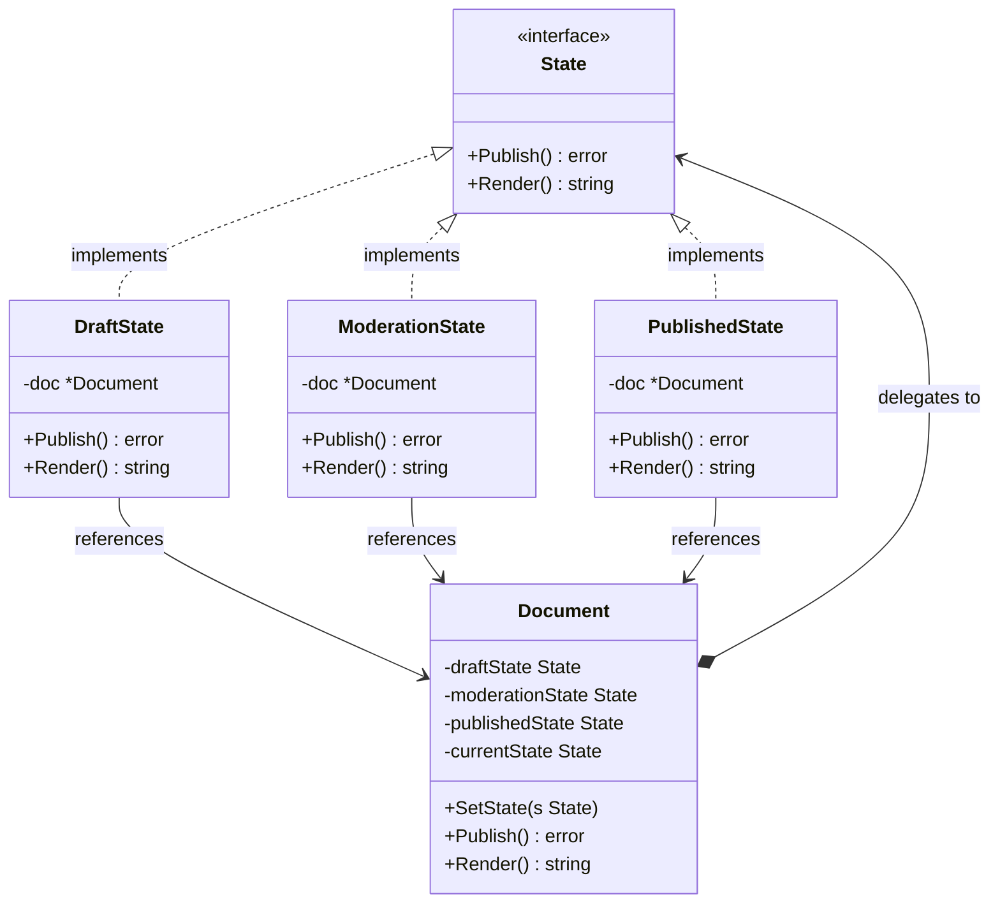

State adalah behavioral design pattern yang memungkinkan suatu objek mengubah perilakunya ketika status (state) internalnya berubah. Objek tersebut akan terlihat seolah-olah mengubah kelasnya. Di Go, karena kita tidak memiliki pewarisan (inheritance) atau polimorfisme kelas tradisional, kita mengimplementasikan pola ini dengan merepresentasikan status sebagai struct terpisah yang mengimplementasikan interface bersama, dan mendelegasikan tindakan dari struct context ke objek state saat ini.

## Penjelasan Konseptual & Analogi Dunia Nyata

Bayangkan Anda sedang bekerja dengan sistem manajemen dokumen (seperti CMS atau penerbit blog). Sebuah dokumen dapat berada dalam beberapa status:
1. **Draft (Draf)**: Dokumen dapat diedit, tetapi tidak terlihat oleh publik. Jika Anda mencoba menerbitkannya, dokumen tersebut akan masuk ke tahap peninjauan (review).
2. **Moderation (Moderasi/Peninjauan)**: Editor meninjau dokumen tersebut. Dokumen bersifat read-only (hanya-baca). Jika disetujui, dokumen menjadi publik (Published). Jika ditolak, dokumen kembali ke status Draft.
3. **Published (Diterbitkan)**: Dokumen bersifat publik dan hanya-baca. Jika Anda mencoba menerbitkannya lagi, sistem tidak melakukan apa-apa karena dokumen sudah publik.

Pendekatan naif adalah dengan menggunakan banyak pernyataan kondisional `if-else` atau `switch` di dalam method struct `Document`. Namun, seiring bertambahnya status (misalnya, Diarsipkan, Ditangguhkan), blok kondisional ini akan membengkak dan menjadi mimpi buruk untuk dipelihara.

Pola State menyarankan agar Anda membuat struct baru untuk setiap kemungkinan status objek dan mengekstrak semua perilaku spesifik status ke dalam struct tersebut.

---

## Diagram Konseptual

Berikut adalah diagram kelas Mermaid yang menunjukkan struktur pola State di Go:



---

## Use Case / Skenario Masalah

Mengapa kita membutuhkan pola ini?
Ketika Anda memiliki struct yang berperilaku berbeda tergantung pada statusnya saat ini, dan jumlah statusnya sangat banyak, kode Anda akan dipenuhi dengan blok kondisional yang masif. Jika logika transisi status tersebar di berbagai method, memodifikasi perilaku satu status dapat memicu bug pada status lainnya.

Dengan menggunakan pola State:
- Anda mengatur kode yang terkait dengan status tertentu ke dalam struct terpisah. Hal ini mematuhi **Single Responsibility Principle**.
- Anda dapat memperkenalkan status baru tanpa mengubah kelas status yang ada atau kelas context, mematuhi **Open/Closed Principle**.
- Transisi status menjadi eksplisit dan mudah dikelola karena didorong oleh objek status itu sendiri.

---

## Contoh Kode Golang

Di bawah ini adalah program Go lengkap yang dapat dikompilasi, mendemonstrasikan pola State menggunakan gaya Refactoring Guru.

```go
package main

import (
	"fmt"
)

// State mendefinisikan interface bersama untuk semua implementasi status konkret.
type State interface {
	Publish() error
	Render() string
}

// Document adalah Context yang menyimpan referensi ke State saat ini.
type Document struct {
	draftState      State
	moderationState State
	publishedState  State

	currentState State
}

// NewDocument menginisialisasi Document beserta statusnya masing-masing.
func NewDocument() *Document {
	doc := &Document{}

	// Menginisialisasi status konkret dan memberikan referensi ke context
	doc.draftState = &DraftState{doc: doc}
	doc.moderationState = &ModerationState{doc: doc}
	doc.publishedState = &PublishedState{doc: doc}

	// Mengatur status awal ke Draft
	doc.currentState = doc.draftState
	return doc
}

// SetState memperbarui status dokumen saat ini.
func (d *Document) SetState(s State) {
	d.currentState = s
}

// Publish mendelegasikan operasi publikasi ke status saat ini.
func (d *Document) Publish() error {
	return d.currentState.Publish()
}

// Render mendelegasikan operasi render ke status saat ini.
func (d *Document) Render() string {
	return d.currentState.Render()
}

// DraftState mewakili dokumen dalam mode draf.
type DraftState struct {
	doc *Document
}

// Publish mentransisikan dokumen draf ke status moderasi.
func (s *DraftState) Publish() error {
	fmt.Println("DraftState: Mengirimkan dokumen untuk ditinjau oleh moderator.")
	s.doc.SetState(s.doc.moderationState)
	return nil
}

// Render mengembalikan pratinjau untuk status draf.
func (s *DraftState) Render() string {
	return "Versi Draf: [Hanya untuk Pengguna Berwenang]"
}

// ModerationState mewakili dokumen yang sedang ditinjau.
type ModerationState struct {
	doc *Document
}

// Publish mentransisikan dokumen ke status diterbitkan.
func (s *ModerationState) Publish() error {
	fmt.Println("ModerationState: Peninjauan disetujui. Menerbitkan dokumen.")
	s.doc.SetState(s.doc.publishedState)
	return nil
}

// Render mengembalikan pratinjau untuk status moderasi.
func (s *ModerationState) Render() string {
	return "Versi Moderasi: [Hanya untuk Editor dan Admin]"
}

// PublishedState mewakili dokumen yang telah final dan publik.
type PublishedState struct {
	doc *Document
}

// Publish mengembalikan error karena dokumen yang telah diterbitkan tidak dapat diterbitkan kembali.
func (s *PublishedState) Publish() error {
	return fmt.Errorf("PublishedState: Dokumen sudah berstatus publik dan diterbitkan")
}

// Render mengembalikan tampilan publik dokumen.
func (s *PublishedState) Render() string {
	return "Dokumen Publik: [Tersedia untuk semua orang]"
}

func main() {
	// 1. Membuat context dokumen baru (dimulai dalam DraftState)
	doc := NewDocument()
	fmt.Printf("Tampilan Dokumen: %s\n\n", doc.Render())

	// 2. Publish dari Draft -> bertransisi ke ModerationState
	fmt.Println("Aksi: Penulis mengeklik 'Publish'")
	if err := doc.Publish(); err != nil {
		fmt.Printf("Error: %v\n", err)
	}
	fmt.Printf("Tampilan Dokumen: %s\n\n", doc.Render())

	// 3. Publish dari Moderation -> bertransisi ke PublishedState
	fmt.Println("Aksi: Editor mengeklik 'Approve & Publish'")
	if err := doc.Publish(); err != nil {
		fmt.Printf("Error: %v\n", err)
	}
	fmt.Printf("Tampilan Dokumen: %s\n\n", doc.Render())

	// 4. Mencoba mempublikasikan kembali dari PublishedState -> harus mengembalikan error
	fmt.Println("Aksi: Mencoba mempublikasikan dokumen yang sudah diterbitkan...")
	if err := doc.Publish(); err != nil {
		fmt.Printf("Error: %v\n", err)
	}
}
```

---

## Ringkasan

### Keuntungan
- **Single Responsibility Principle**: Mengatur kode yang terkait dengan status tertentu ke dalam struct terpisah.
- **Open/Closed Principle**: Memperkenalkan status baru tanpa mengubah struct status yang ada atau class context.
- **Menghilangkan Kode Kondisional yang Rumit**: Menyederhanakan kode Context dengan menghilangkan kondisional transisi yang besar (`if` atau `switch`).

### Kekurangan
- **Kompleksitas**: Menerapkan pola State dapat menjadi berlebihan jika mesin status hanya memiliki sedikit status atau transisi jarang berubah.

### Kapan Menggunakan
- Gunakan pola State ketika Anda memiliki objek yang perilakunya berubah-ubah tergantung pada statusnya saat ini, jumlah statusnya banyak, dan kode spesifik status sering berubah.
- Gunakan pola ini ketika Anda memiliki struct yang dipenuhi dengan kondisional besar yang menduplikasi transisi status di berbagai method.
- Gunakan pola ini ketika Anda memiliki banyak kode duplikat di antara status dan transisi serupa.
