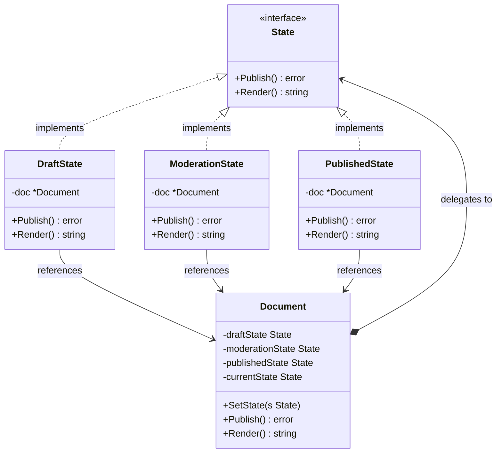

The State is a behavioral design pattern that lets an object alter its behavior when its internal state changes. The object will appear to change its class. In Go, because we do not have inheritance or class polymorphism, we implement this pattern by representing states as separate structs implementing a common interface, and having the context struct delegate actions to its current state object.

## Conceptual Explanation & Real-World Analogy

Imagine you are working with a document management system (like a CMS or a blog publisher). A document can exist in several states:
1. **Draft**: The document is editable, but invisible to the public. If you try to publish it, it goes to the review stage.
2. **Moderation (Review)**: The editor reviews the document. It is read-only. If you approve it, it becomes public (Published). If you reject it, it returns to Draft.
3. **Published**: The document is public and read-only. If you try to publish it again, it does nothing because it's already public.

A naive approach would use a lot of `if-else` or `switch` statements inside the `Document` struct's methods. However, as you add more states (e.g., Archived, Flagged), these conditional blocks grow, becoming a nightmare to maintain.

The State pattern suggests that you create new structs for all possible states of an object and extract all state-specific behaviors into these structs.

---

## Conceptual Diagram

Here is a Mermaid class diagram that shows the structure of the State pattern in Go:



---

## Use Case / Problem Scenario

Why do we need this pattern?
When you have a struct that behaves differently depending on its current state, and the number of states is large, the code will contain massive conditional blocks. If the state transition logic is scattered across various methods, modifying one state's behavior might introduce bugs in others.

By using the State pattern:
- You organize the code related to specific states into separate structs. This adheres to the **Single Responsibility Principle**.
- You can introduce new states without changing existing state classes or the context class, adhering to the **Open/Closed Principle**.
- State transitions become explicit and easy to manage since they are driven by the state objects themselves.

---

## Golang Code Example

Below is a complete, compilable Go program demonstrating the State pattern using the Refactoring Guru style.

```go
package main

import (
	"fmt"
)

// State defines the common interface for all concrete state implementations.
type State interface {
	Publish() error
	Render() string
}

// Document is the Context that maintains a reference to the current State.
type Document struct {
	draftState      State
	moderationState State
	publishedState  State

	currentState State
}

// NewDocument initializes a Document with its respective states.
func NewDocument() *Document {
	doc := &Document{}

	// Initialize concrete states and pass reference to the context
	doc.draftState = &DraftState{doc: doc}
	doc.moderationState = &ModerationState{doc: doc}
	doc.publishedState = &PublishedState{doc: doc}

	// Set initial state to Draft
	doc.currentState = doc.draftState
	return doc
}

// SetState updates the current state of the document.
func (d *Document) SetState(s State) {
	d.currentState = s
}

// Publish delegates the publish operation to the current state.
func (d *Document) Publish() error {
	return d.currentState.Publish()
}

// Render delegates the render operation to the current state.
func (d *Document) Render() string {
	return d.currentState.Render()
}

// DraftState represents the document in draft mode.
type DraftState struct {
	doc *Document
}

// Publish transitions the draft document to moderation state.
func (s *DraftState) Publish() error {
	fmt.Println("DraftState: Submitting document for moderator review.")
	s.doc.SetState(s.doc.moderationState)
	return nil
}

// Render returns a preview for the draft state.
func (s *DraftState) Render() string {
	return "Draft Version: [Authorized Users Only]"
}

// ModerationState represents the document under review.
type ModerationState struct {
	doc *Document
}

// Publish transitions the document to published state.
func (s *ModerationState) Publish() error {
	fmt.Println("ModerationState: Review approved. Publishing the document.")
	s.doc.SetState(s.doc.publishedState)
	return nil
}

// Render returns a preview for the moderation state.
func (s *ModerationState) Render() string {
	return "Moderation Version: [Editors and Admins Only]"
}

// PublishedState represents a finalized, public document.
type PublishedState struct {
	doc *Document
}

// Publish returns an error as a published document cannot be published again.
func (s *PublishedState) Publish() error {
	return fmt.Errorf("PublishedState: Document is already public and published")
}

// Render returns the public view of the document.
func (s *PublishedState) Render() string {
	return "Public Document: [Available to everyone]"
}

func main() {
	// 1. Create a new document context (starts in DraftState)
	doc := NewDocument()
	fmt.Printf("Document View: %s\n\n", doc.Render())

	// 2. Publish from Draft -> transitions to ModerationState
	fmt.Println("Action: Author clicks 'Publish'")
	if err := doc.Publish(); err != nil {
		fmt.Printf("Error: %v\n", err)
	}
	fmt.Printf("Document View: %s\n\n", doc.Render())

	// 3. Publish from Moderation -> transitions to PublishedState
	fmt.Println("Action: Editor clicks 'Approve & Publish'")
	if err := doc.Publish(); err != nil {
		fmt.Printf("Error: %v\n", err)
	}
	fmt.Printf("Document View: %s\n\n", doc.Render())

	// 4. Try publishing again from PublishedState -> should return an error
	fmt.Println("Action: Trying to publish an already published document...")
	if err := doc.Publish(); err != nil {
		fmt.Printf("Error: %v\n", err)
	}
}
```

---

## Summary

### Advantages
- **Single Responsibility Principle**: Organize the code related to particular states into separate structs.
- **Open/Closed Principle**: Introduce new states without changing existing state structs or the context.
- **Eliminate Conditional Bloat**: Simplify Context code by eliminating bulky transition conditionals (`if` or `switch`).

### Disadvantages
- **Complexity**: Implementing the State pattern can be overkill if the state machine only has a couple of states or transitions rarely change.

### When to Use
- Use the State pattern when you have an object that behaves differently depending on its current state, the number of states is enormous, and the state-specific code changes frequently.
- Use the pattern when you have a struct polluted with massive conditionals that duplicate state transitions across multiple methods.
- Use the pattern when you have a lot of duplicate code across similar states and transitions.
