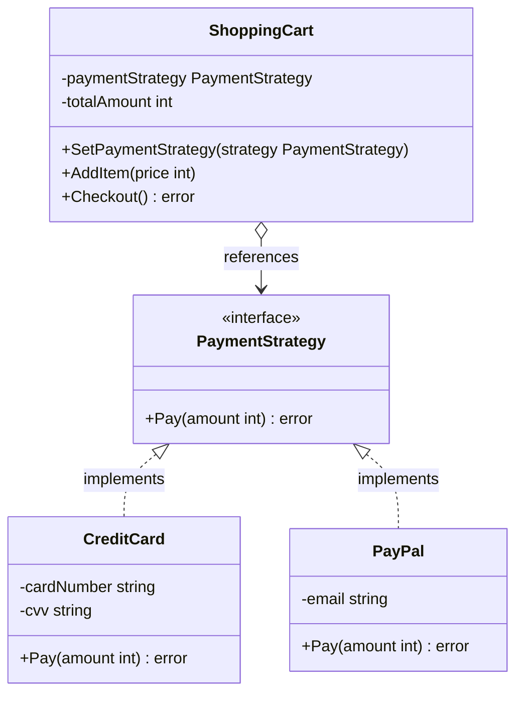

Strategy adalah behavioral design pattern yang memungkinkan Anda mendefinisikan keluarga algoritma, menempatkan masing-masing algoritma ke dalam struct terpisah, dan membuat objek mereka saling bertukar (interchangeable). Di Go, kita mengimplementasikan pola ini menggunakan interface untuk mewakili strategi umum, struct konkret untuk mendefinisikan masing-masing algoritma, dan struct context yang menyimpan referensi ke interface strategi dan mendelegasikan pekerjaan kepadanya.

## Penjelasan Konseptual & Analogi Dunia Nyata

Bayangkan Anda harus pergi ke bandara. Anda memiliki beberapa opsi (strategi) untuk mencapai tujuan Anda:
1. **Mengendarai mobil pribadi** (cepat, tetapi biaya parkir mahal).
2. **Naik bus kota** (sangat murah, tetapi lambat).
3. **Memanggil taksi / ojek online** (nyaman, tetapi relatif mahal).
4. **Bersepeda** (gratis dan sehat, tetapi melelahkan secara fisik dan lambat).

Semua opsi ini mencapai tujuan yang sama: mengantarkan Anda ke bandara. Pilihan mana yang Anda gunakan bergantung pada konteks saat ini, seperti anggaran (budget), keterbatasan waktu, atau kondisi cuaca.

Dalam skenario ini:
- **Context**: Anda (pelancong). Anda memiliki lokasi awal dan tujuan, serta perlu melakukan perjalanan.
- **Strategy Interface**: Konsep umum "mode transportasi" yang mendefinisikan method `Travel(start, destination)`.
- **Concrete Strategies**: `CarStrategy`, `BusStrategy`, `TaxiStrategy`, dan `BicycleStrategy`.

---

## Diagram Konseptual

Berikut adalah diagram kelas Mermaid yang menunjukkan struktur pola Strategy di Go:



---

## Use Case / Skenario Masalah

Mengapa kita membutuhkan pola ini?
Misalkan Anda sedang membangun sistem checkout untuk platform e-commerce. Awalnya, platform Anda hanya menerima Kartu Kredit. Anda menulis logika pemrosesan langsung di dalam method utama `Checkout`.

Sebulan kemudian, manajer Anda meminta penambahan dukungan PayPal. Anda menambahkan kondisi `if-else`. Sebulan kemudian lagi, mereka ingin mendukung Google Pay, Apple Pay, dan Bitcoin.

Method `Checkout` Anda dengan cepat tumbuh menjadi tumpukan pernyataan kondisional yang besar dan sulit dipelihara. Mengubah logika metode pembayaran apa pun berisiko merusak seluruh sistem checkout.

Pola Strategy memecahkan masalah ini dengan mendelegasikan eksekusi algoritma pembayaran ke struct yang terpisah.

---

## Contoh Kode Golang

Di bawah ini adalah program Go lengkap yang dapat dikompilasi, mendemonstrasikan pola Strategy menggunakan gaya Refactoring Guru.

```go
package main

import (
	"fmt"
)

// PaymentStrategy mendefinisikan interface yang harus diimplementasikan oleh semua algoritma pembayaran.
type PaymentStrategy interface {
	Pay(amount int) error
}

// CreditCard adalah strategi konkret yang mengimplementasikan PaymentStrategy.
type CreditCard struct {
	cardNumber string
	cvv        string
}

// NewCreditCard membuat instans strategi CreditCard baru.
func NewCreditCard(cardNumber, cvv string) *CreditCard {
	return &CreditCard{
		cardNumber: cardNumber,
		cvv:        cvv,
	}
}

// Pay mengeksekusi pembayaran melalui Kartu Kredit.
func (c *CreditCard) Pay(amount int) error {
	fmt.Printf("Membayar $%d menggunakan Kartu Kredit (Nomor Kartu: %s)\n", amount, c.cardNumber)
	return nil
}

// PayPal adalah strategi konkret lainnya yang mengimplementasikan PaymentStrategy.
type PayPal struct {
	email string
}

// NewPayPal membuat instans strategi PayPal baru.
func NewPayPal(email string) *PayPal {
	return &PayPal{
		email: email,
	}
}

// Pay mengeksekusi pembayaran melalui PayPal.
func (p *PayPal) Pay(amount int) error {
	fmt.Printf("Membayar $%d menggunakan PayPal (Email: %s)\n", amount, p.email)
	return nil
}

// ShoppingCart adalah Context yang menggunakan PaymentStrategy.
type ShoppingCart struct {
	paymentStrategy PaymentStrategy
	totalAmount     int
}

// SetPaymentStrategy secara dinamis mengubah strategi pembayaran saat runtime.
func (s *ShoppingCart) SetPaymentStrategy(strategy PaymentStrategy) {
	s.paymentStrategy = strategy
}

// AddItem menambahkan harga barang ke total keranjang belanja.
func (s *ShoppingCart) AddItem(price int) {
	s.totalAmount += price
}

// Checkout mendelegasikan tugas pembayaran ke strategi yang dipilih.
func (s *ShoppingCart) Checkout() error {
	if s.paymentStrategy == nil {
		return fmt.Errorf("ShoppingCart: Strategi pembayaran belum dikonfigurasi")
	}
	return s.paymentStrategy.Pay(s.totalAmount)
}

func main() {
	cart := &ShoppingCart{}

	// Menambahkan beberapa barang ke keranjang
	cart.AddItem(150)
	cart.AddItem(350)
	fmt.Printf("ShoppingCart: Total nilai keranjang adalah $%d\n\n", cart.totalAmount)

	// Strategi 1: Membayar menggunakan Kartu Kredit
	fmt.Println("--- Pelanggan memilih Kartu Kredit ---")
	ccPayment := NewCreditCard("1234-5678-9012-3456", "999")
	cart.SetPaymentStrategy(ccPayment)
	if err := cart.Checkout(); err != nil {
		fmt.Printf("Error Checkout: %v\n", err)
	}
	fmt.Println()

	// Strategi 2: Membayar menggunakan PayPal
	fmt.Println("--- Pelanggan mengubah metode pembayaran ke PayPal ---")
	paypalPayment := NewPayPal("john.doe@example.com")
	cart.SetPaymentStrategy(paypalPayment)
	if err := cart.Checkout(); err != nil {
		fmt.Printf("Error Checkout: %v\n", err)
	}
}
```

---

## Ringkasan

### Keuntungan
- **Open/Closed Principle**: Anda dapat memperkenalkan opsi pembayaran (strategi) baru tanpa mengubah kode apa pun di context (`ShoppingCart`) atau strategi yang ada.
- **Runtime Swap (Pertukaran Runtime)**: Anda dapat menukar algoritma yang digunakan di dalam objek selama aplikasi berjalan.
- **Isolasi**: Anda memisahkan detail implementasi algoritma dari kode yang menggunakannya.
- **Merampingkan Kode**: Anda mengganti pernyataan kondisional yang rumit di context dengan polimorfisme.

### Kekurangan
- **Over-engineering (Rekayasa Berlebih)**: Jika Anda hanya memiliki beberapa algoritma yang jarang berubah, tidak perlu mempersulit program dengan interface dan struct baru.
- **Kesadaran Klien**: Klien harus mengetahui perbedaan antara strategi untuk memilih strategi yang tepat.
- **Alternatif Fungsional**: Di Go, Anda sering kali dapat mengganti struct strategi lengkap dengan tipe fungsi sederhana (anonymous function/closure), yang dapat membuat kode menjadi lebih ringkas.

### Kapan Menggunakan
- Gunakan pola Strategy ketika Anda ingin menggunakan varian algoritma yang berbeda di dalam suatu objek dan dapat beralih dari satu algoritma ke algoritma lainnya saat program berjalan.
- Gunakan pola ini ketika Anda memiliki banyak class/struct serupa yang hanya berbeda dalam cara mereka mengeksekusi suatu perilaku.
- Gunakan pola ini untuk mengisolasi logika bisnis utama dari detail implementasi algoritma pendukung.
