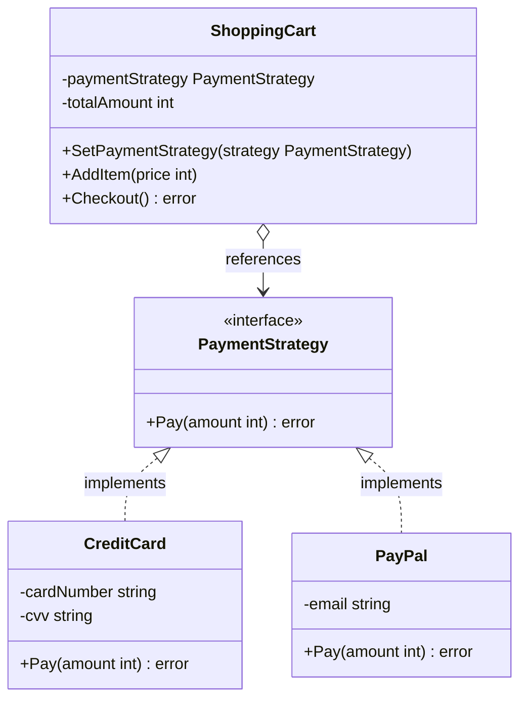

The Strategy is a behavioral design pattern that lets you define a family of algorithms, put each of them into a separate class/struct, and make their objects interchangeable. In Go, we implement this pattern using interfaces to represent the generic strategy, concrete structs to define each algorithm, and a context struct that holds a reference to a strategy interface and delegates work to it.

## Conceptual Explanation & Real-World Analogy

Imagine you need to get to the airport. You have several options (strategies) to reach your destination:
1. **Drive your personal car** (fast, but expensive parking).
2. **Take a city bus** (very cheap, but slow).
3. **Call a taxi / ride-sharing service** (convenient, but relatively expensive).
4. **Ride a bicycle** (free and healthy, but physically demanding and slow).

All these options achieve the exact same goal: getting you to the airport. Which option you choose depends on your current context, such as your budget, time constraints, or weather conditions. 

In this scenario:
- **Context**: You (the traveler). You have a start location and destination, and you need to travel.
- **Strategy Interface**: The general concept of "transportation mode" that defines a method `Travel(start, destination)`.
- **Concrete Strategies**: `CarStrategy`, `BusStrategy`, `TaxiStrategy`, and `BicycleStrategy`.

---

## Conceptual Diagram

Here is a Mermaid class diagram that shows the structure of the Strategy pattern in Go:



---

## Use Case / Problem Scenario

Why do we need this pattern?
Suppose you are building a checkout system for an e-commerce platform. Initially, your platform only accepts Credit Cards. You write the processing logic directly inside the main `Checkout` method. 

A month later, your manager requests adding PayPal support. You add an `if-else` condition. Another month later, they want to support Google Pay, Apple Pay, and Bitcoin. 

Your `Checkout` method rapidly grows into a massive, unmaintainable mess of conditional statements. Changing the logic of any payment method risks breaking the entire checkout system.

The Strategy pattern solves this by delegating the execution of the payment algorithm to separate structs. 

---

## Golang Code Example

Below is a complete, compilable Go program demonstrating the Strategy pattern using the Refactoring Guru style.

```go
package main

import (
	"fmt"
)

// PaymentStrategy defines the interface that all payment algorithms must implement.
type PaymentStrategy interface {
	Pay(amount int) error
}

// CreditCard is a concrete strategy that implements PaymentStrategy.
type CreditCard struct {
	cardNumber string
	cvv        string
}

// NewCreditCard creates a new CreditCard strategy instance.
func NewCreditCard(cardNumber, cvv string) *CreditCard {
	return &CreditCard{
		cardNumber: cardNumber,
		cvv:        cvv,
	}
}

// Pay executes payment via Credit Card.
func (c *CreditCard) Pay(amount int) error {
	fmt.Printf("Paying $%d using Credit Card (Card Number: %s)\n", amount, c.cardNumber)
	return nil
}

// PayPal is another concrete strategy that implements PaymentStrategy.
type PayPal struct {
	email string
}

// NewPayPal creates a new PayPal strategy instance.
func NewPayPal(email string) *PayPal {
	return &PayPal{
		email: email,
	}
}

// Pay executes payment via PayPal.
func (p *PayPal) Pay(amount int) error {
	fmt.Printf("Paying $%d using PayPal (Email: %s)\n", amount, p.email)
	return nil
}

// ShoppingCart is the Context that utilizes a PaymentStrategy.
type ShoppingCart struct {
	paymentStrategy PaymentStrategy
	totalAmount     int
}

// SetPaymentStrategy dynamically alters the payment strategy at runtime.
func (s *ShoppingCart) SetPaymentStrategy(strategy PaymentStrategy) {
	s.paymentStrategy = strategy
}

// AddItem appends an item's price to the cart total.
func (s *ShoppingCart) AddItem(price int) {
	s.totalAmount += price
}

// Checkout delegates the payment task to the selected strategy.
func (s *ShoppingCart) Checkout() error {
	if s.paymentStrategy == nil {
		return fmt.Errorf("ShoppingCart: Payment strategy is not configured")
	}
	return s.paymentStrategy.Pay(s.totalAmount)
}

func main() {
	cart := &ShoppingCart{}

	// Add items to the cart
	cart.AddItem(150)
	cart.AddItem(350)
	fmt.Printf("ShoppingCart: Total cart value is $%d\n\n", cart.totalAmount)

	// Strategy 1: Pay using Credit Card
	fmt.Println("--- Customer selects Credit Card ---")
	ccPayment := NewCreditCard("1234-5678-9012-3456", "999")
	cart.SetPaymentStrategy(ccPayment)
	if err := cart.Checkout(); err != nil {
		fmt.Printf("Checkout Error: %v\n", err)
	}
	fmt.Println()

	// Strategy 2: Pay using PayPal
	fmt.Println("--- Customer changes payment method to PayPal ---")
	paypalPayment := NewPayPal("john.doe@example.com")
	cart.SetPaymentStrategy(paypalPayment)
	if err := cart.Checkout(); err != nil {
		fmt.Printf("Checkout Error: %v\n", err)
	}
}
```

---

## Summary

### Advantages
- **Open/Closed Principle**: You can introduce new payment options (strategies) without changing any code in the context (`ShoppingCart`) or existing strategies.
- **Runtime Swap**: You can swap the algorithm used inside an object at runtime.
- **Isolation**: You isolate the implementation details of an algorithm from the code that uses it.
- **De-clutter Code**: You replace conditional statements in the context with polymorphism.

### Disadvantages
- **Over-engineering**: If you only have a couple of algorithms that rarely change, there's no need to overcomplicate the program with new interfaces and structs.
- **Client Awareness**: Clients must be aware of the differences between strategies to select the appropriate one.
- **Functional Alternative**: In Go, you can often replace full strategy structs with simple function types (anonymous functions/closures), which can make the code cleaner.

### When to Use
- Use the Strategy pattern when you want to use different variants of an algorithm within an object and be able to switch from one algorithm to another during runtime.
- Use the pattern when you have a lot of similar classes/structs that only differ in the way they execute some behavior.
- Use the pattern to isolate the business logic of a class from the implementation details of algorithms that may not be as important in the context of that logic.
