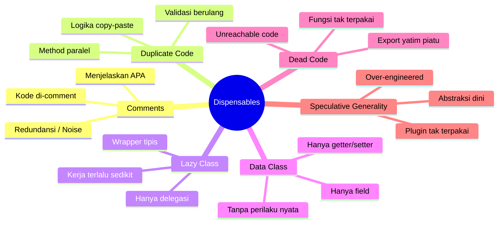
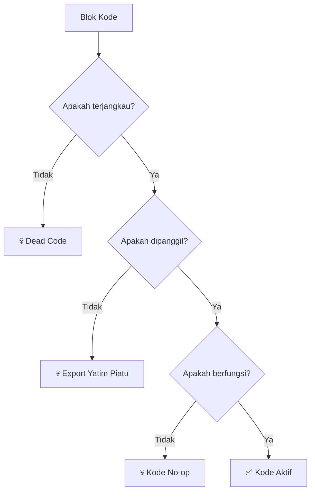

Bayangkan sebuah codebase seperti sebuah rumah. Selama bertahun-tahun, setiap developer yang tinggal di sana meninggalkan sesuatu — lampu rusak di sudut ruangan, furnitur yang ditutupi kain debu yang "mungkin berguna suatu hari nanti", atau gudang penuh peralatan yang tidak ada seorang pun ingat kapan membelinya. Rumah tersebut masih berfungsi, tetapi menavigasinya sangat melelahkan. Setiap orang baru yang pindah menghabiskan separuh waktu mereka untuk melangkahi barang-barang tidak berguna tersebut sebelum mereka bisa menyelesaikan pekerjaan apa pun.

**Dispensable code smells** adalah jenis kekacauan (clutter) seperti itu. Mereka adalah hal-hal yang menambah kebisingan (noise), kompleksitas, atau kebingungan tanpa memberikan nilai tambah apa pun. Berbeda dengan code smells lain yang menggambarkan hal-hal yang *salah*, dispensables menggambarkan hal-hal yang **seharusnya tidak ada sama sekali**. Menghapusnya tidak akan mengubah perilaku aplikasi — tetapi membuat codebase menjadi lebih ringan, lebih cepat dibaca, dan lebih mudah dipelihara.

---

## 🎯 Takeaway

Setelah membaca artikel ini, kamu akan:

- **Mengidentifikasi** enam jenis dispensable code smells: Comments (Komentar Berlebihan), Duplicate Code (Kode Duplikat), Lazy Class, Data Class, Dead Code (Kode Mati), dan Speculative Generality
- **Memahami** mengapa masing-masing tipe merupakan masalah dan risiko yang ditimbulkannya
- **Menerapkan** teknik refactoring Go yang praktis dan idiomatik untuk mengeliminasi setiap smell
- **Membiasakan diri** memeriksa kode Anda sendiri dari kekacauan sebelum membuat Pull Request (PR)

---

## Sekilas tentang Enam Dispensables



---

## 1. 💬 Comments (Komentar Berlebihan)

### Apa Masalahnya?

Komentar tidak selalu merupakan code smell. Komentar yang baik menjelaskan **mengapa (why)** sebuah keputusan diambil, memberikan konteks untuk batasan yang tidak jelas, atau menautkan ke tiket tugas dan dokumentasi yang relevan. Bau kode (smell) muncul ketika komentar digunakan untuk menjelaskan **apa (what)** yang sedang dilakukan oleh kode tersebut — sebuah gejala bahwa kode itu sendiri tidak cukup jelas untuk mendokumentasikan dirinya sendiri (self-documenting).

Jenis komentar lain yang termasuk code smell:
- **Komentar redundan** yang hanya menulis ulang apa yang sudah dinyatakan oleh kode.
- **Kumpulan kode yang dinonaktifkan (commented-out code)** yang ditinggalkan di dalam file "jaga-jaga jika nanti dibutuhkan".
- **Komentar usang (outdated comments)** yang sudah tidak mencerminkan kenyataan kode saat ini.

> **Aturan utama:** Jika Anda membutuhkan komentar untuk menjelaskan *apa* yang dilakukan oleh suatu blok kode, pertimbangkan untuk mengubah nama variabel/fungsi atau mengekstraknya terlebih dahulu. Cadangkan komentar hanya untuk menjelaskan *mengapa*.

### Contoh Bad Code (❌)

```go
// ❌ BAD: Komentar menjelaskan APA bukan MENGAPA,
// redundan, dan kuburan kode yang di-comment

// Struct User
type User struct {
    // ID user
    ID int
    // Nama user
    Name string
    // Email user
    Email string
    // Usia user
    Age int
}

// GetDiscount mengembalikan diskon
func GetDiscount(u User) float64 {
    // periksa jika usia lebih dari atau sama dengan 60
    if u.Age >= 60 {
        // kembalikan diskon 20% untuk lansia
        return 0.20
    }

    // periksa jika usia kurang dari 18
    if u.Age < 18 {
        // kembalikan diskon 15% untuk anak-anak
        return 0.15
    }

    // tidak ada diskon
    return 0
}

// ApplyPromo menerapkan harga promosi
// Menerima harga dan diskon lalu mengembalikan harga akhir
// Parameter:
//   - price: harga asli
//   - discount: diskon yang diterapkan
// Kembalian: harga setelah diskon
func ApplyPromo(price, discount float64) float64 {
    // kalikan harga dengan (1 - discount)
    return price * (1 - discount)
}

func ProcessOrder(u User, price float64) float64 {
    // dapatkan diskon
    discount := GetDiscount(u)
    // terapkan promo
    result := ApplyPromo(price, discount)
    // TODO: tambah poin loyalitas (dihapus sementara)
    // result += u.LoyaltyPoints * 0.01
    // log.Printf("Menerapkan diskon %.2f untuk user %s", discount, u.Name)
    // notifyUser(u.Email, result) -- dinonaktifkan di prod
    return result
}
```

**Masalah:**
- Setiap field struct memiliki komentar yang hanya mengulang namanya — murni kebisingan (noise).
- Komentar pada `GetDiscount` menjelaskan apa yang diperiksa oleh setiap kondisi `if`, padahal kodenya sendiri sudah sangat jelas.
- `ApplyPromo` memiliki blok komentar gaya JavaDoc yang sangat panjang untuk fungsi yang hanya satu baris.
- Tiga baris kode yang di-comment di bagian bawah menimbulkan kebingungan tentang maksud kode tersebut.

### Perbaikan (✅)

```go
// ✅ GOOD: Kode yang mendokumentasikan dirinya sendiri. Komentar menjelaskan MENGAPA, bukan APA.

const (
    seniorAgeThreshold = 60
    minorAgeThreshold  = 18
    seniorDiscount     = 0.20
    minorDiscount      = 0.15
)

type User struct {
    ID    int
    Name  string
    Email string
    Age   int
}

// discountForAge mengembalikan tingkat diskon berdasarkan usia.
// Segmen lansia (60+) dan anak-anak (<18) menerima harga khusus
// sesuai kebijakan harga perusahaan — lihat: docs/pricing-policy.md
func discountForAge(age int) float64 {
    switch {
    case age >= seniorAgeThreshold:
        return seniorDiscount
    case age < minorAgeThreshold:
        return minorDiscount
    default:
        return 0
    }
}

func applyDiscount(price, discountRate float64) float64 {
    return price * (1 - discountRate)
}

func ProcessOrder(u User, price float64) float64 {
    discount := discountForAge(u.Age)
    return applyDiscount(price, discount)
}
```

**Mengapa ini lebih baik:**
- Konstanta bernama membuat angka `60`, `18`, `0.20`, `0.15` menjelaskan dirinya sendiri.
- Satu komentar yang bermakna pada `discountForAge` menjelaskan **mengapa** batasan usia tersebut ada (kebijakan harga), bukan apa yang dilakukan kode.
- Tidak ada kode yang di-comment — jika Anda butuh riwayat versi, gunakan `git log`.

---

## 2. 🔁 Duplicate Code (Kode Duplikat)

### Apa Masalahnya?

Duplicate Code adalah salah satu smell yang paling umum dan paling mahal dampaknya. Ketika logika yang sama ada di dua tempat berbeda, setiap kali ada perbaikan bug atau perubahan kebutuhan, Anda harus mengubahnya di kedua tempat tersebut — dan hampir pasti, seseorang akan lupa memperbarui salah satu salinannya.

Di dalam layanan Go, hal ini sering muncul berupa logika validasi request yang di-copy-paste, pola penanganan error, atau kode pembentukan response HTTP di beberapa handler yang berbeda.

### Contoh Bad Code (❌)

```go
// ❌ BAD: Logika validasi request di-copy-paste
// di dua handler berbeda. Perubahan harus dilakukan dua kali.

type CreateProductRequest struct {
    Name     string  `json:"name"`
    Price    float64 `json:"price"`
    Stock    int     `json:"stock"`
    Category string  `json:"category"`
}

type UpdateProductRequest struct {
    Name     string  `json:"name"`
    Price    float64 `json:"price"`
    Stock    int     `json:"stock"`
    Category string  `json:"category"`
}

func CreateProductHandler(w http.ResponseWriter, r *http.Request) {
    var req CreateProductRequest
    if err := json.NewDecoder(r.Body).Decode(&req); err != nil {
        http.Error(w, "invalid request body", http.StatusBadRequest)
        return
    }

    // --- BLOK VALIDASI DUPLIKAT ---
    if req.Name == "" {
        http.Error(w, "name is required", http.StatusBadRequest)
        return
    }
    if req.Price <= 0 {
        http.Error(w, "price must be positive", http.StatusBadRequest)
        return
    }
    if req.Stock < 0 {
        http.Error(w, "stock cannot be negative", http.StatusBadRequest)
        return
    }
    if req.Category == "" {
        http.Error(w, "category is required", http.StatusBadRequest)
        return
    }
    // --- AKHIR BLOK DUPLIKAT ---

    // ... logika pembuatan produk
    w.WriteHeader(http.StatusCreated)
}

func UpdateProductHandler(w http.ResponseWriter, r *http.Request) {
    var req UpdateProductRequest
    if err := json.NewDecoder(r.Body).Decode(&req); err != nil {
        http.Error(w, "invalid request body", http.StatusBadRequest)
        return
    }

    // --- BLOK VALIDASI DUPLIKAT (Lagi) ---
    if req.Name == "" {
        http.Error(w, "name is required", http.StatusBadRequest)
        return
    }
    if req.Price <= 0 {
        http.Error(w, "price must be positive", http.StatusBadRequest)
        return
    }
    if req.Stock < 0 {
        http.Error(w, "stock cannot be negative", http.StatusBadRequest)
        return
    }
    if req.Category == "" {
        http.Error(w, "category is required", http.StatusBadRequest)
        return
    }
    // --- AKHIR BLOK DUPLIKAT ---

    // ... logika pembaruan produk
    w.WriteHeader(http.StatusOK)
}
```

### Perbaikan (✅)

```go
// ✅ GOOD: Logika validasi diekstrak ke type bersama dengan method Validate.
// Kedua handler memanggil jalur kode yang sama.

type ProductRequest struct {
    Name     string  `json:"name"`
    Price    float64 `json:"price"`
    Stock    int     `json:"stock"`
    Category string  `json:"category"`
}

// Validate memastikan aturan bisnis pada product request terpenuhi.
// Mengembalikan error yang menjelaskan batasan pertama yang dilanggar.
func (r ProductRequest) Validate() error {
    if r.Name == "" {
        return errors.New("name is required")
    }
    if r.Price <= 0 {
        return errors.New("price must be positive")
    }
    if r.Stock < 0 {
        return errors.New("stock cannot be negative")
    }
    if r.Category == "" {
        return errors.New("category is required")
    }
    return nil
}

// decodeAndValidate adalah helper yang digunakan oleh semua handler produk.
func decodeAndValidate(r *http.Request) (ProductRequest, error) {
    var req ProductRequest
    if err := json.NewDecoder(r.Body).Decode(&req); err != nil {
        return req, fmt.Errorf("invalid request body: %w", err)
    }
    return req, req.Validate()
}

func CreateProductHandler(w http.ResponseWriter, r *http.Request) {
    req, err := decodeAndValidate(r)
    if err != nil {
        http.Error(w, err.Error(), http.StatusBadRequest)
        return
    }
    _ = req
    // ... logika pembuatan produk
    w.WriteHeader(http.StatusCreated)
}

func UpdateProductHandler(w http.ResponseWriter, r *http.Request) {
    req, err := decodeAndValidate(r)
    if err != nil {
        http.Error(w, err.Error(), http.StatusBadRequest)
        return
    }
    _ = req
    // ... logika pembaruan produk
    w.WriteHeader(http.StatusOK)
}
```

**Mengapa ini lebih baik:**
- Logika validasi sekarang berada di satu tempat saja — `Validate()` pada `ProductRequest`.
- Menambahkan aturan baru (misalnya, `Price <= 10_000`) hanya perlu dilakukan sekali.
- Fungsi `decodeAndValidate` dapat di-unit-test secara independen.
- Handler baru di masa depan (misal: `BulkCreateHandler`) mendapatkan fitur validasi ini secara gratis.

---

## 3. 😴 Lazy Class

### Apa Masalahnya?

Lazy Class adalah sebuah class (atau struct, dalam Go) yang tidak melakukan cukup banyak hal untuk membenarkan keberadaannya. Class ini mungkin dibuat untuk antisipasi pengembangan fitur di masa depan yang ternyata tidak pernah terwujud, atau sisa-sisa dari proses refactoring yang memindahkan sebagian besar tanggung jawabnya ke tempat lain. Jika sebuah struct hanya menyimpan satu nilai dan tidak menawarkan behavior yang unik, struct tersebut hanyalah beban tambahan — gabungkan kembali ke pemanggilnya (caller).

### Contoh Bad Code (❌)

```go
// ❌ BAD: TokenValidator adalah lazy class. Ia hanya membungkus satu pemanggilan fungsi
// dan tidak memberikan nilai tambah. Setiap pemanggil harus membuat instansiasi secara tidak perlu.

type TokenValidator struct {
    secretKey string
}

func NewTokenValidator(secretKey string) *TokenValidator {
    return &TokenValidator{secretKey: secretKey}
}

// Validate hanya meneruskan ke fungsi tingkat paket.
// Tidak ada state, konfigurasi, caching — tidak ada hal ekstra di sini.
func (tv *TokenValidator) Validate(token string) bool {
    return validateJWT(token, tv.secretKey)
}

// --- Pemanggil ---
func AuthMiddleware(secretKey string) func(http.Handler) http.Handler {
    validator := NewTokenValidator(secretKey) // Mengapa kita membuat ini?

    return func(next http.Handler) http.Handler {
        return http.HandlerFunc(func(w http.ResponseWriter, r *http.Request) {
            token := r.Header.Get("Authorization")
            if !validator.Validate(token) {
                http.Error(w, "unauthorized", http.StatusUnauthorized)
                return
            }
            next.ServeHTTP(w, r)
        })
    }
}
```

### Perbaikan (✅)

```go
// ✅ GOOD: Tidak ada tipe wrapper yang tidak perlu. Fungsi validasi
// digunakan langsung di tempat yang membutuhkan. Sederhana dan langsung.

// ValidateToken memeriksa tanda tangan JWT dengan secret key yang diberikan.
// Mengembalikan true jika token valid dan belum kedaluwarsa.
func ValidateToken(token, secretKey string) bool {
    return validateJWT(token, secretKey)
}

// --- Pemanggil ---
func AuthMiddleware(secretKey string) func(http.Handler) http.Handler {
    return func(next http.Handler) http.Handler {
        return http.HandlerFunc(func(w http.ResponseWriter, r *http.Request) {
            token := r.Header.Get("Authorization")
            if !ValidateToken(token, secretKey) {
                http.Error(w, "unauthorized", http.StatusUnauthorized)
                return
            }
            next.ServeHTTP(w, r)
        })
    }
}
```

> **Pengecualian:** Sebuah struct dapat dibenarkan jika ia mengelola **state** (misalnya, connection pool, cache, rate limiter) atau **mengoordinasikan beberapa dependensi**. Smell ini secara khusus merujuk pada struct yang hanya membungkus satu pemanggilan fungsi tanpa state (stateless).

---

## 4. 📦 Data Class

### Apa Masalahnya?

Data Class adalah struct yang hanya menampung data tetapi tidak memiliki perilaku (behavior) — ia hanya wadah pasif. Sebuah struct yang hanya berisi field sebenarnya bukan masalah secara otomatis. Smell ini muncul ketika Anda menyadari bahwa semua logika penting yang *beroperasi pada* data tersebut justru berada di tempat lain, tersebar di lapisan service atau handler. Perilaku yang menjadi hak milik dari data tersebut seharusnya hidup *bersama* data itu sendiri.

### Contoh Bad Code (❌)

```go
// ❌ BAD: Order adalah wadah data murni.
// Semua logika bisnis yang "dimiliki" oleh order
// tersebar di lapisan service yang terpisah jauh.

type Order struct {
    ID         string
    Items      []OrderItem
    Status     string
    TotalPrice float64
    CreatedAt  time.Time
}

// --- service.go (di suatu tempat yang jauh) ---

func IsOrderComplete(o Order) bool {
    return o.Status == "completed"
}

func CanOrderBeCancelled(o Order) bool {
    return o.Status == "pending" || o.Status == "processing"
}

func FormatOrderSummary(o Order) string {
    return fmt.Sprintf("Order %s | Status: %s | Total: %.2f", o.ID, o.Status, o.TotalPrice)
}

func GetOrderAge(o Order) time.Duration {
    return time.Since(o.CreatedAt)
}
```

### Perbaikan (✅)

```go
// ✅ GOOD: Order memiliki perilaku yang menjadi hak miliknya sendiri.
// Method-method berada langsung pada tipe data tersebut, membuat kode
// lebih kohesif dan lebih mudah ditemukan.

type OrderStatus string

const (
    StatusPending    OrderStatus = "pending"
    StatusProcessing OrderStatus = "processing"
    StatusCompleted  OrderStatus = "completed"
    StatusCancelled  OrderStatus = "cancelled"
)

type Order struct {
    ID         string
    Items      []OrderItem
    Status     OrderStatus
    TotalPrice float64
    CreatedAt  time.Time
}

func (o Order) IsComplete() bool {
    return o.Status == StatusCompleted
}

func (o Order) CanBeCancelled() bool {
    return o.Status == StatusPending || o.Status == StatusProcessing
}

func (o Order) Summary() string {
    return fmt.Sprintf("Order %s | Status: %s | Total: %.2f", o.ID, o.Status, o.TotalPrice)
}

func (o Order) Age() time.Duration {
    return time.Since(o.CreatedAt)
}

// --- Pemanggil sekarang menjadi lebih mudah dibaca ---
func processRefund(o Order) error {
    if !o.CanBeCancelled() {
        return fmt.Errorf("order %s tidak bisa dibatalkan: status saat ini %s", o.ID, o.Status)
    }
    // ... lanjutkan dengan proses pembatalan
    return nil
}
```

**Mengapa ini lebih baik:**
- `o.CanBeCancelled()` terasa seperti bahasa alami yang mudah dibaca di tempat pemanggilan.
- Logika diletakkan di tempat yang sama dengan data yang diprosesnya.
- Menggunakan type khusus `OrderStatus` (bukan sekadar `string` biasa) mencegah kesalahan pengetikan (typo) dan mendukung autocomplete pada IDE.

---

## 5. 💀 Dead Code (Kode Mati)

### Apa Masalahnya?

Dead Code adalah bagian kode yang tidak pernah dieksekusi: cabang kondisional yang tidak terjangkau (unreachable) setelah pernyataan `return`, fungsi ter-export yang tidak pernah dipanggil oleh siapa pun, flag fitur (feature flag) yang selalu bernilai `false`, atau seluruh file dari fitur lama yang telah dibatalkan tetapi tidak pernah dihapus. Dead Code adalah beban pemeliharaan — ia akan tetap ikut di-refactor, di-copy, dan di-test seperti kode aktif, padahal tidak memberikan kontribusi apa pun.



### Contoh Bad Code (❌)

```go
// ❌ BAD: Berbagai bentuk dead code

// 1. Kode tak terjangkau (unreachable code) setelah return
func classify(score int) string {
    if score >= 90 {
        return "A"
    } else if score >= 80 {
        return "B"
    } else if score >= 70 {
        return "C"
    } else {
        return "F"
    }
    // Baris ini tidak akan pernah terjangkau — compiler tidak akan mendeteksinya sebagai error,
    // tetapi tetap akan membingungkan pembaca kode.
    log.Println("klasifikasi selesai")
    return "unknown"
}

// 2. Fungsi ter-export yang digunakan di v1, sekarang benar-benar menjadi yatim piatu (orphaned).
// Tidak ada pemanggil internal. Tidak ada konsumen eksternal dalam dependency graph go.sum.
// Fungsi ini tetap ada hanya karena inersia / kebiasaan.
func ExportDataToLegacyCSV(records []Record) ([]byte, error) {
    // ... 80 baris logika konversi CSV untuk format
    // yang sudah tidak diterima lagi oleh sistem hilir sejak tahun 2024
    return nil, nil
}

// 3. Flag fitur yang selalu bernilai false — seluruh cabang di dalamnya mati
const enableBetaCheckout = false

func Checkout(cart Cart) error {
    if enableBetaCheckout {
        // Seluruh blok ini mati. Tidak akan pernah berjalan.
        return betaCheckoutFlow(cart)
    }
    return legacyCheckoutFlow(cart)
}

// 4. Nilai error yang selalu diabaikan
func riskyOperation() error {
    result, _ := doSomethingThatCanFail() // error diabaikan secara diam-diam
    _ = result
    return nil // selalu mengembalikan nil, menyembunyikan kegagalan yang sebenarnya
}
```

### Perbaikan (✅)

```go
// ✅ GOOD: Dead code dihapus. Hanya menyisakan kode yang aktif dan bertujuan jelas.

// 1. classify — kode tak terjangkau dihapus. Logika menjadi bersih.
func classify(score int) string {
    switch {
    case score >= 90:
        return "A"
    case score >= 80:
        return "B"
    case score >= 70:
        return "C"
    default:
        return "F"
    }
}

// 2. ExportDataToLegacyCSV — dihapus seluruhnya.
//    Alasan: export CSV legacy telah didepresiasi sejak Q1 2024.
//    Konsumen terakhir dihapus pada commit abc1234.
//    Gunakan ExportDataToJSON sebagai gantinya.

// 3. Beta checkout — jika flag selalu bernilai false, hapus cabangnya.
//    Jika betaCheckoutFlow sekarang menjadi standar, hapus legacyCheckoutFlow.
func Checkout(cart Cart) error {
    return checkoutFlow(cart) // satu jalur utama, tidak ada cabang mati
}

// 4. Error ditangani dengan benar
func riskyOperation() error {
    result, err := doSomethingThatCanFail()
    if err != nil {
        return fmt.Errorf("riskyOperation: %w", err)
    }
    _ = result
    return nil
}
```

> **Tips Profesional:** Gunakan `go vet`, `staticcheck`, dan tool `deadcode` (bagian dari Go tools resmi) untuk menemukan fungsi-fungsi yatim piatu di codebase Anda:
> ```bash
> go install golang.org/x/tools/cmd/deadcode@latest
> deadcode -test ./...
> ```

---

## 6. 🔮 Speculative Generality

### Apa Masalahnya?

Speculative Generality adalah smell yang lahir dari pola pikir "jaga-jaga jika nanti butuh". Ini adalah kode yang ditulis bukan untuk kebutuhan saat ini, melainkan untuk skenario masa depan yang masih berupa hipotesis: sistem plugin untuk produk yang baru memiliki satu integrasi, abstract factory untuk service yang hanya akan memiliki satu implementasi, atau event bus generik yang dibuat sebelum ada yang meminta sistem berbasis event.

> *"You Aren't Gonna Need It"* — YAGNI

Over-engineering memiliki biaya nyata: area testing yang lebih luas, lebih banyak konsep yang harus dipelajari oleh developer baru, penelusuran (indirection) yang membingungkan saat debugging, dan — ironisnya — resistensi yang lebih besar terhadap perubahan ketika kebutuhan nyata akhirnya datang namun ternyata tidak cocok dengan desain spekulatif yang telah dibuat.

### Contoh Bad Code (❌)

```go
// ❌ BAD: Sistem plugin lengkap dibuat untuk sebuah notification service
// yang hanya memiliki satu channel (email) dan belum ada rencana menambah yang lain.
// Ini adalah spekulasi murni yang dipaksakan masuk ke kode produksi.

// NotificationPlugin adalah interface untuk "setiap channel notifikasi di masa depan"
type NotificationPlugin interface {
    Send(recipient, subject, body string) error
    Name() string
    IsHealthy() bool
    Configure(cfg map[string]string) error
    Shutdown() error
}

// PluginRegistry mengelola semua plugin yang terdaftar
type PluginRegistry struct {
    mu      sync.RWMutex
    plugins map[string]NotificationPlugin
}

func NewPluginRegistry() *PluginRegistry {
    return &PluginRegistry{plugins: make(map[string]NotificationPlugin)}
}

func (r *PluginRegistry) Register(p NotificationPlugin) error {
    r.mu.Lock()
    defer r.mu.Unlock()
    if _, exists := r.plugins[p.Name()]; exists {
        return fmt.Errorf("plugin %q sudah terdaftar", p.Name())
    }
    r.plugins[p.Name()] = p
    return nil
}

func (r *PluginRegistry) Get(name string) (NotificationPlugin, error) {
    r.mu.RLock()
    defer r.mu.RUnlock()
    p, ok := r.plugins[name]
    if !ok {
        return nil, fmt.Errorf("plugin %q tidak ditemukan", name)
    }
    return p, nil
}

func (r *PluginRegistry) SendVia(name, recipient, subject, body string) error {
    p, err := r.Get(name)
    if err != nil {
        return err
    }
    if !p.IsHealthy() {
        return fmt.Errorf("plugin %q sedang tidak sehat", name)
    }
    return p.Send(recipient, subject, body)
}

// EmailPlugin adalah SATU-SATUNYA implementasi nyata — yang sebenarnya kita butuhkan sejak awal
type EmailPlugin struct{ smtpHost string }

func (e *EmailPlugin) Name() string                          { return "email" }
func (e *EmailPlugin) IsHealthy() bool                       { return true }
func (e *EmailPlugin) Configure(cfg map[string]string) error { return nil }
func (e *EmailPlugin) Shutdown() error                       { return nil }
func (e *EmailPlugin) Send(recipient, subject, body string) error {
    return sendSMTP(e.smtpHost, recipient, subject, body)
}

// --- Pemanggil harus melewati seluruh mesin ini hanya untuk mengirim email ---
func notifyUser(registry *PluginRegistry, email, subject, body string) error {
    return registry.SendVia("email", email, subject, body)
}
```

### Perbaikan (✅)

```go
// ✅ GOOD: Bangun tepat apa yang Anda butuhkan saat ini.
// Ketika SMS atau Slack benar-benar dibutuhkan, barulah perkenalkan abstraksi —
// didorong oleh kebutuhan nyata, bukan spekulasi masa depan.

// EmailSender mengirim email transaksional via SMTP.
type EmailSender struct {
    smtpHost string
}

func NewEmailSender(smtpHost string) *EmailSender {
    return &EmailSender{smtpHost: smtpHost}
}

func (e *EmailSender) Send(recipient, subject, body string) error {
    return sendSMTP(e.smtpHost, recipient, subject, body)
}

// --- Pemanggil menjadi sangat sederhana ---
func notifyUser(sender *EmailSender, email, subject, body string) error {
    return sender.Send(email, subject, body)
}
```

**Ketika kebutuhan nyata tiba** (misalnya, "sekarang kita juga perlu mengirim SMS"), *saat itulah* waktu yang tepat untuk memperkenalkan interface:

```go
// ✅ Abstraksi diperkenalkan ketika implementasi nyata KEDUA sudah ada
type Notifier interface {
    Send(recipient, subject, body string) error
}

// Baik EmailSender maupun SMSSender sudah otomatis memenuhi interface ini
// karena keduanya memiliki method Send() dengan signature yang cocok.
// Tidak perlu mengubah kode yang sudah ada.
```

Ini adalah esensi dari YAGNI: interface tidak memakan biaya apa pun jika ditambahkan *saat dibutuhkan*, tetapi memakan biaya pemeliharaan setiap hari jika dibuat sebelum waktunya.

---

## Menyatukan Semuanya

Berikut adalah panduan cepat untuk mendiagnosis dan mengatasi setiap tipe dispensable code smell:

| Code Smell | Gejala / Indikasi | Cara Mengatasi |
|---|---|---|
| **Comments** | Komentar menjelaskan *apa* yang dilakukan kode; banyak baris kode dinonaktifkan | Ubah nama atau ekstrak hingga kode jelas secara mandiri; percayakan riwayat pada `git` |
| **Duplicate Code** | Copy-paste logika dengan sedikit modifikasi; handler HTTP serupa | Ekstrak ke fungsi/method/struct bersama; gunakan pola `Validate()` |
| **Lazy Class** | Struct yang hanya membungkus satu fungsi tanpa state atau logika tambahan | Hapus wrapper; panggil fungsi secara langsung |
| **Data Class** | Semua logika bisnis berada di luar struct yang menyimpan data | Pindahkan perilaku *ke dalam* struct sebagai method |
| **Dead Code** | Percabangan tak terjangkau, export yatim piatu, flag selalu `false` | Hapus tanpa ragu; gunakan tool `deadcode` untuk melacak |
| **Speculative Generality** | Sistem plugin/abstraksi rumit padahal baru ada satu implementasi nyata | Terapkan YAGNI; buat implementasi sederhana dan tunda abstraksi |

---

## 📝 Ringkasan

Dispensables adalah kategori code smell yang didefinisikan oleh satu hal: **mereka seharusnya tidak ada**. Berbeda dengan code smell lain yang mewakili implementasi yang buruk, dispensables mewakili hal-hal yang murni *tidak perlu*. Menghapusnya tidak akan mengubah fungsionalitas software Anda — tetapi akan secara dramatis mempermudah pembacaan, pengujian, dan pengembangannya.

Poin penting yang perlu diingat:

- 💬 **Comments** seharusnya menjelaskan *mengapa*, bukan *apa*. Jika Anda butuh komentar untuk menjelaskan apa yang dilakukan kode, maka kodenya lah yang bermasalah.
- 🔁 **Duplicate Code** adalah risiko dalam manajemen perubahan. Setiap blok duplikat adalah calon bug di masa depan. Ekstrak kodenya.
- 😴 **Lazy Class** berupa struct yang hanya meneruskan panggilan ke satu fungsi tanpa nilai tambah hanya akan menambah lapisan tidak penting. Integrasikan langsung.
- 📦 **Data Class** yang hidup tanpa perilaku (behavior) akan menyebarkan logika terkait di seluruh codebase. Satukan perilaku tersebut dengan datanya.
- 💀 **Dead Code** adalah beban kognitif. Developer membacanya, mengujinya, dan memeliharanya tanpa hasil. Hapus tanpa ragu.
- 🔮 **Speculative Generality** adalah over-engineering yang didorong oleh kecemasan akan masa depan. Tulislah kode untuk kebutuhan hari ini. Perkenalkan abstraksi saat Anda memiliki dua kasus nyata, bukan satu kasus hipotetis.

Slogan refactoring untuk dispensables: **jika ragu, buang saja**.

---

🇮🇩 Versi Indonesia | **[🇬🇧 English Version](/refactoring-part-4-dispensables)**

← [Part 3: Code Smells — Change Preventers](/refactoring-part-3-change-preventers-id) | [Part 5: Code Smells — Couplers](/refactoring-part-5-couplers-id) →
