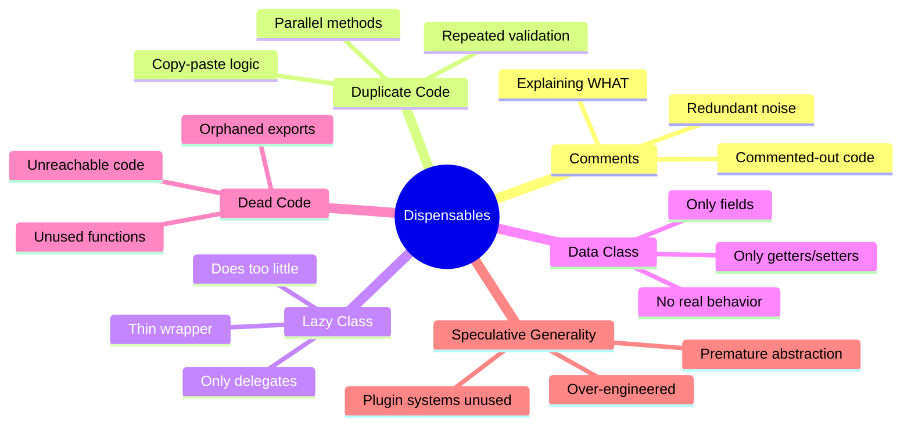
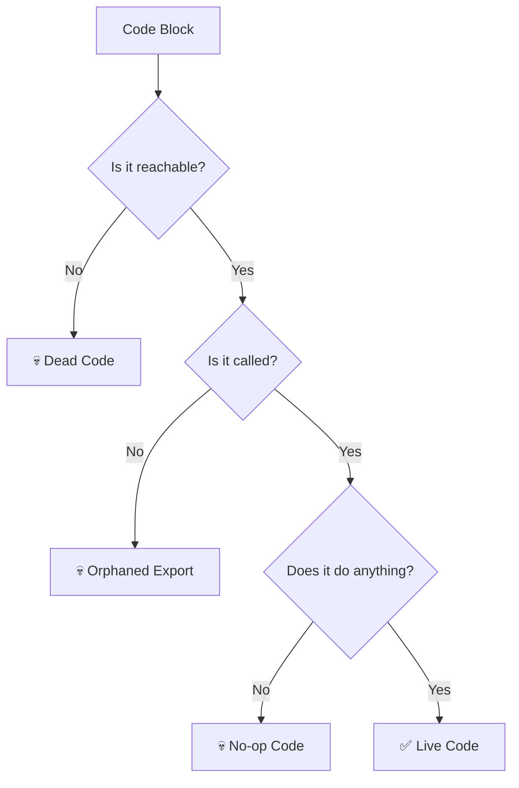

Picture a codebase as a house. Over the years, each developer who lived there left something behind — a broken lamp in the corner, furniture covered in dust sheets that "might be useful someday," a storage room full of appliances no one remembers buying. The house still functions, but navigating it is exhausting. Every new person who moves in spends half their time stepping around the junk before they can get anything done.

**Dispensable code smells** are exactly this kind of clutter. They are things that add noise, complexity, or confusion without contributing any value. Unlike other code smells that describe things that are *wrong*, dispensables describe things that simply **shouldn't be there at all**. Removing them doesn't change behavior — it makes the codebase lighter, faster to read, and easier to maintain.

---

## 🎯 Takeaway

By the end of this post, you will be able to:

- **Identify** the six dispensable code smells: Comments, Duplicate Code, Lazy Class, Data Class, Dead Code, and Speculative Generality
- **Understand** why each one is a problem and the risks it introduces
- **Apply** practical, idiomatic Go refactoring techniques to eliminate each smell
- **Develop** the habit of reviewing your own code for clutter before opening a pull request

---

## The Six Dispensable Smells at a Glance



---

## 1. 💬 Comments

### The Smell

Comments are not always a smell. Good comments explain **why** a decision was made, provide context for non-obvious constraints, or link to relevant tickets and documentation. The smell arises when comments are used to explain **what** the code is doing — a symptom that the code itself isn't clear enough to be self-documenting.

Other comment smells include:
- **Redundant comments** that just restate what the code says
- **Commented-out code** blocks left in the file "just in case"
- **Outdated comments** that no longer reflect reality

> **The rule:** If you need a comment to explain *what* a block of code does, consider renaming or extracting instead. Reserve comments for *why*.

### Bad Code (❌)

```go
// ❌ BAD: Comments explain WHAT instead of WHY,
// redundant noise, and commented-out code graveyard

// User struct
type User struct {
    // user id
    ID int
    // user name
    Name string
    // user email
    Email string
    // user age
    Age int
}

// GetDiscount returns the discount
func GetDiscount(u User) float64 {
    // check if age is greater than or equal to 60
    if u.Age >= 60 {
        // return 20% discount for senior citizens
        return 0.20
    }

    // check if age is less than 18
    if u.Age < 18 {
        // return 15% discount for minors
        return 0.15
    }

    // no discount
    return 0
}

// ApplyPromo applies promotional pricing
// It takes a price and a discount and returns the final price
// Parameters:
//   - price: the original price
//   - discount: the discount to apply
// Returns: the discounted price
func ApplyPromo(price, discount float64) float64 {
    // multiply price by (1 - discount)
    return price * (1 - discount)
}

func ProcessOrder(u User, price float64) float64 {
    // get the discount
    discount := GetDiscount(u)
    // apply promo
    result := ApplyPromo(price, discount)
    // TODO: add loyalty points (removed for now)
    // result += u.LoyaltyPoints * 0.01
    // log.Printf("Applied discount %.2f for user %s", discount, u.Name)
    // notifyUser(u.Email, result) -- disabled in prod
    return result
}
```

**Problems:**
- Every struct field has a comment restating its name — pure noise
- `GetDiscount` comments explain what each `if` condition checks, which the code already shows clearly
- `ApplyPromo` has a full JavaDoc-style comment block for a one-liner function
- Three lines of commented-out code sit at the bottom, creating confusion about intent

### Fix (✅)

```go
// ✅ GOOD: Self-documenting code. Comments explain WHY, not WHAT.

const (
    seniorAgeThreshold = 60
    minorAgeThreshold  = 18
    seniorDiscount     = 0.20
    minorDiscount      = 0.15
)

type User struct {
    ID    int
    Name  string
    Email string
    Age   int
}

// discountForAge returns an age-based discount rate.
// Senior (60+) and minor (<18) segments receive preferential pricing
// per our pricing policy — see: docs/pricing-policy.md
func discountForAge(age int) float64 {
    switch {
    case age >= seniorAgeThreshold:
        return seniorDiscount
    case age < minorAgeThreshold:
        return minorDiscount
    default:
        return 0
    }
}

func applyDiscount(price, discountRate float64) float64 {
    return price * (1 - discountRate)
}

func ProcessOrder(u User, price float64) float64 {
    discount := discountForAge(u.Age)
    return applyDiscount(price, discount)
}
```

**Why it's better:**
- Named constants make `60`, `18`, `0.20`, `0.15` explain themselves
- The one meaningful comment on `discountForAge` explains **why** those age thresholds exist, not what the code does
- No commented-out code — if you need version history, that's what `git log` is for

---

## 2. 🔁 Duplicate Code

### The Smell

Duplicate code is one of the most common and most costly smells. When the same logic exists in two places, every bug fix and every requirement change must be applied twice — and almost certainly, someone will forget to update one of the copies.

In Go services, this often appears as copy-pasted validation logic, error-handling patterns, or response-building code across multiple HTTP handlers.

### Bad Code (❌)

```go
// ❌ BAD: Request validation logic is copy-pasted
// across two handlers. Any change must be made twice.

type CreateProductRequest struct {
    Name     string  `json:"name"`
    Price    float64 `json:"price"`
    Stock    int     `json:"stock"`
    Category string  `json:"category"`
}

type UpdateProductRequest struct {
    Name     string  `json:"name"`
    Price    float64 `json:"price"`
    Stock    int     `json:"stock"`
    Category string  `json:"category"`
}

func CreateProductHandler(w http.ResponseWriter, r *http.Request) {
    var req CreateProductRequest
    if err := json.NewDecoder(r.Body).Decode(&req); err != nil {
        http.Error(w, "invalid request body", http.StatusBadRequest)
        return
    }

    // --- DUPLICATED VALIDATION BLOCK ---
    if req.Name == "" {
        http.Error(w, "name is required", http.StatusBadRequest)
        return
    }
    if req.Price <= 0 {
        http.Error(w, "price must be positive", http.StatusBadRequest)
        return
    }
    if req.Stock < 0 {
        http.Error(w, "stock cannot be negative", http.StatusBadRequest)
        return
    }
    if req.Category == "" {
        http.Error(w, "category is required", http.StatusBadRequest)
        return
    }
    // --- END DUPLICATED BLOCK ---

    // ... create product logic
    w.WriteHeader(http.StatusCreated)
}

func UpdateProductHandler(w http.ResponseWriter, r *http.Request) {
    var req UpdateProductRequest
    if err := json.NewDecoder(r.Body).Decode(&req); err != nil {
        http.Error(w, "invalid request body", http.StatusBadRequest)
        return
    }

    // --- DUPLICATED VALIDATION BLOCK (again) ---
    if req.Name == "" {
        http.Error(w, "name is required", http.StatusBadRequest)
        return
    }
    if req.Price <= 0 {
        http.Error(w, "price must be positive", http.StatusBadRequest)
        return
    }
    if req.Stock < 0 {
        http.Error(w, "stock cannot be negative", http.StatusBadRequest)
        return
    }
    if req.Category == "" {
        http.Error(w, "category is required", http.StatusBadRequest)
        return
    }
    // --- END DUPLICATED BLOCK ---

    // ... update product logic
    w.WriteHeader(http.StatusOK)
}
```

### Fix (✅)

```go
// ✅ GOOD: Validation logic is extracted to a shared type with a Validate method.
// Both handlers call the same code path.

type ProductRequest struct {
    Name     string  `json:"name"`
    Price    float64 `json:"price"`
    Stock    int     `json:"stock"`
    Category string  `json:"category"`
}

// Validate enforces business invariants on a product request.
// Returns a non-nil error describing the first violated constraint.
func (r ProductRequest) Validate() error {
    if r.Name == "" {
        return errors.New("name is required")
    }
    if r.Price <= 0 {
        return errors.New("price must be positive")
    }
    if r.Stock < 0 {
        return errors.New("stock cannot be negative")
    }
    if r.Category == "" {
        return errors.New("category is required")
    }
    return nil
}

// decodeAndValidate is a helper used by all product handlers.
func decodeAndValidate(r *http.Request) (ProductRequest, error) {
    var req ProductRequest
    if err := json.NewDecoder(r.Body).Decode(&req); err != nil {
        return req, fmt.Errorf("invalid request body: %w", err)
    }
    return req, req.Validate()
}

func CreateProductHandler(w http.ResponseWriter, r *http.Request) {
    req, err := decodeAndValidate(r)
    if err != nil {
        http.Error(w, err.Error(), http.StatusBadRequest)
        return
    }
    _ = req
    // ... create product logic
    w.WriteHeader(http.StatusCreated)
}

func UpdateProductHandler(w http.ResponseWriter, r *http.Request) {
    req, err := decodeAndValidate(r)
    if err != nil {
        http.Error(w, err.Error(), http.StatusBadRequest)
        return
    }
    _ = req
    // ... update product logic
    w.WriteHeader(http.StatusOK)
}
```

**Why it's better:**
- Validation logic lives in one place — `Validate()` on `ProductRequest`
- Adding a new constraint (e.g., `Price <= 10_000`) only needs to happen once
- `decodeAndValidate` is independently unit-testable
- Future handlers (e.g., `BulkCreateHandler`) get validation for free

---

## 3. 😴 Lazy Class

### The Smell

A Lazy Class is a class (or struct, in Go) that doesn't do enough to justify its existence. It might have been created in anticipation of future growth that never came, or it may be a leftover from a refactoring that made most of its responsibilities disappear. If a struct only holds a single value and offers no unique behavior, it's dead weight — fold it into the caller.

### Bad Code (❌)

```go
// ❌ BAD: TokenValidator is a lazy class. It wraps one function call
// and adds no value. Every caller must instantiate it unnecessarily.

type TokenValidator struct {
    secretKey string
}

func NewTokenValidator(secretKey string) *TokenValidator {
    return &TokenValidator{secretKey: secretKey}
}

// Validate just delegates to a package-level function.
// There is no state, no config, no caching — nothing extra here.
func (tv *TokenValidator) Validate(token string) bool {
    return validateJWT(token, tv.secretKey)
}

// --- Caller ---
func AuthMiddleware(secretKey string) func(http.Handler) http.Handler {
    validator := NewTokenValidator(secretKey) // Why are we building this?

    return func(next http.Handler) http.Handler {
        return http.HandlerFunc(func(w http.ResponseWriter, r *http.Request) {
            token := r.Header.Get("Authorization")
            if !validator.Validate(token) {
                http.Error(w, "unauthorized", http.StatusUnauthorized)
                return
            }
            next.ServeHTTP(w, r)
        })
    }
}
```

### Fix (✅)

```go
// ✅ GOOD: No unnecessary wrapper type. The validation function is
// used directly where it's needed. Simple and direct.

// ValidateToken checks the JWT signature against the provided secret key.
// Returns true if the token is valid and unexpired.
func ValidateToken(token, secretKey string) bool {
    return validateJWT(token, secretKey)
}

// --- Caller ---
func AuthMiddleware(secretKey string) func(http.Handler) http.Handler {
    return func(next http.Handler) http.Handler {
        return http.HandlerFunc(func(w http.ResponseWriter, r *http.Request) {
            token := r.Header.Get("Authorization")
            if !ValidateToken(token, secretKey) {
                http.Error(w, "unauthorized", http.StatusUnauthorized)
                return
            }
            next.ServeHTTP(w, r)
        })
    }
}
```

> **Exception:** A struct is justified when it manages **state** (e.g., a connection pool, a cache, a rate limiter) or **coordinates multiple dependencies**. The smell is specifically about a struct that only wraps a single, stateless function call.

---

## 4. 📦 Data Class

### The Smell

A Data Class is a struct that holds data but has no behavior — it's just a passive container. In itself, a struct with fields isn't automatically a smell. The smell emerges when you notice that all the interesting logic that *operates on* that data lives somewhere else, scattered across service or handler layers. Behavior that belongs to the data should live *with* the data.

### Bad Code (❌)

```go
// ❌ BAD: Order is a pure data container.
// All business logic that "belongs" to an order
// is scattered across the service layer.

type Order struct {
    ID         string
    Items      []OrderItem
    Status     string
    TotalPrice float64
    CreatedAt  time.Time
}

// --- service.go (somewhere far away) ---

func IsOrderComplete(o Order) bool {
    return o.Status == "completed"
}

func CanOrderBeCancelled(o Order) bool {
    return o.Status == "pending" || o.Status == "processing"
}

func FormatOrderSummary(o Order) string {
    return fmt.Sprintf("Order %s | Status: %s | Total: %.2f", o.ID, o.Status, o.TotalPrice)
}

func GetOrderAge(o Order) time.Duration {
    return time.Since(o.CreatedAt)
}
```

### Fix (✅)

```go
// ✅ GOOD: Order has behavior that belongs to it.
// Methods live on the type, making the code more cohesive
// and easier to discover.

type OrderStatus string

const (
    StatusPending    OrderStatus = "pending"
    StatusProcessing OrderStatus = "processing"
    StatusCompleted  OrderStatus = "completed"
    StatusCancelled  OrderStatus = "cancelled"
)

type Order struct {
    ID         string
    Items      []OrderItem
    Status     OrderStatus
    TotalPrice float64
    CreatedAt  time.Time
}

func (o Order) IsComplete() bool {
    return o.Status == StatusCompleted
}

func (o Order) CanBeCancelled() bool {
    return o.Status == StatusPending || o.Status == StatusProcessing
}

func (o Order) Summary() string {
    return fmt.Sprintf("Order %s | Status: %s | Total: %.2f", o.ID, o.Status, o.TotalPrice)
}

func (o Order) Age() time.Duration {
    return time.Since(o.CreatedAt)
}

// --- Caller is now more readable ---
func processRefund(o Order) error {
    if !o.CanBeCancelled() {
        return fmt.Errorf("order %s cannot be cancelled: status is %s", o.ID, o.Status)
    }
    // ... proceed with cancellation
    return nil
}
```

**Why it's better:**
- `o.CanBeCancelled()` reads like natural language at the call site
- The logic is co-located with the data it reasons about
- `OrderStatus` as a named type (instead of a plain `string`) prevents typos and enables IDE autocomplete

---

## 5. 💀 Dead Code

### The Smell

Dead code is code that is never executed: unreachable branches after a `return`, unused exported functions that no one calls, feature flags that are always `false`, or entire files from a feature that was rolled back but never deleted. Dead code is a maintenance liability — it gets refactored, copied, and tested just like live code, but it contributes nothing.



### Bad Code (❌)

```go
// ❌ BAD: Multiple forms of dead code

// 1. Unreachable code after return
func classify(score int) string {
    if score >= 90 {
        return "A"
    } else if score >= 80 {
        return "B"
    } else if score >= 70 {
        return "C"
    } else {
        return "F"
    }
    // This line is unreachable — the compiler won't catch it,
    // but it still confuses readers
    log.Println("classification complete")
    return "unknown"
}

// 2. Exported function that was used in v1, now fully orphaned.
// No internal caller. No external consumer in go.sum graph.
// It exists only out of inertia.
func ExportDataToLegacyCSV(records []Record) ([]byte, error) {
    // ... 80 lines of CSV marshaling for a format
    // that the downstream system stopped accepting in 2024
    return nil, nil
}

// 3. Feature flag that is always false — entire branch is dead
const enableBetaCheckout = false

func Checkout(cart Cart) error {
    if enableBetaCheckout {
        // This entire block is dead. It will never run.
        return betaCheckoutFlow(cart)
    }
    return legacyCheckoutFlow(cart)
}

// 4. Error value that is always ignored
func riskyOperation() error {
    result, _ := doSomethingThatCanFail() // error silently discarded
    _ = result
    return nil // always returns nil, hiding real failures
}
```

### Fix (✅)

```go
// ✅ GOOD: Dead code deleted. Only live, purposeful code remains.

// 1. classify — unreachable code removed. Logic is clean.
func classify(score int) string {
    switch {
    case score >= 90:
        return "A"
    case score >= 80:
        return "B"
    case score >= 70:
        return "C"
    default:
        return "F"
    }
}

// 2. ExportDataToLegacyCSV — deleted entirely.
//    Reason: legacy CSV export was deprecated in Q1 2024.
//    Last consumer removed in commit abc1234.
//    Use ExportDataToJSON instead.

// 3. Beta checkout — if the flag is always false, remove the branch.
//    If betaCheckoutFlow is now the standard, delete legacyCheckoutFlow.
func Checkout(cart Cart) error {
    return checkoutFlow(cart) // one path, no dead branches
}

// 4. Errors are surfaced properly
func riskyOperation() error {
    result, err := doSomethingThatCanFail()
    if err != nil {
        return fmt.Errorf("riskyOperation: %w", err)
    }
    _ = result
    return nil
}
```

> **Pro tip:** Use `go vet`, `staticcheck`, and `deadcode` (part of the Go tools) to find orphaned functions in your codebase:
> ```bash
> go install golang.org/x/tools/cmd/deadcode@latest
> deadcode -test ./...
> ```

---

## 6. 🔮 Speculative Generality

### The Smell

Speculative Generality is the "just in case" smell. It's code that was written not for a current requirement, but for an imagined future one: a plugin system for a product with one integration, an abstract factory for a service that will only ever have one implementation, a generic event bus built before anyone has asked for events.

> *"You Aren't Gonna Need It"* — YAGNI

Over-engineering has real costs: more surface area to test, more concepts new developers must learn, more indirection to trace through during debugging, and — ironically — more resistance to change when the real requirement finally arrives and doesn't match the speculative design.

### Bad Code (❌)

```go
// ❌ BAD: A full plugin system was built for a notification service
// that has exactly one channel (email) and no plans to add more.
// This is pure speculation turned into production code.

// NotificationPlugin is an interface for "any future notification channel"
type NotificationPlugin interface {
    Send(recipient, subject, body string) error
    Name() string
    IsHealthy() bool
    Configure(cfg map[string]string) error
    Shutdown() error
}

// PluginRegistry manages all registered plugins
type PluginRegistry struct {
    mu      sync.RWMutex
    plugins map[string]NotificationPlugin
}

func NewPluginRegistry() *PluginRegistry {
    return &PluginRegistry{plugins: make(map[string]NotificationPlugin)}
}

func (r *PluginRegistry) Register(p NotificationPlugin) error {
    r.mu.Lock()
    defer r.mu.Unlock()
    if _, exists := r.plugins[p.Name()]; exists {
        return fmt.Errorf("plugin %q already registered", p.Name())
    }
    r.plugins[p.Name()] = p
    return nil
}

func (r *PluginRegistry) Get(name string) (NotificationPlugin, error) {
    r.mu.RLock()
    defer r.mu.RUnlock()
    p, ok := r.plugins[name]
    if !ok {
        return nil, fmt.Errorf("plugin %q not found", name)
    }
    return p, nil
}

func (r *PluginRegistry) SendVia(name, recipient, subject, body string) error {
    p, err := r.Get(name)
    if err != nil {
        return err
    }
    if !p.IsHealthy() {
        return fmt.Errorf("plugin %q is not healthy", name)
    }
    return p.Send(recipient, subject, body)
}

// EmailPlugin is the ONLY actual implementation — the one we needed all along
type EmailPlugin struct{ smtpHost string }

func (e *EmailPlugin) Name() string                          { return "email" }
func (e *EmailPlugin) IsHealthy() bool                       { return true }
func (e *EmailPlugin) Configure(cfg map[string]string) error { return nil }
func (e *EmailPlugin) Shutdown() error                       { return nil }
func (e *EmailPlugin) Send(recipient, subject, body string) error {
    return sendSMTP(e.smtpHost, recipient, subject, body)
}

// --- Caller has to navigate all this machinery just to send an email ---
func notifyUser(registry *PluginRegistry, email, subject, body string) error {
    return registry.SendVia("email", email, subject, body)
}
```

### Fix (✅)

```go
// ✅ GOOD: Build exactly what you need today.
// When SMS or Slack is actually required, introduce the abstraction then —
// driven by a real requirement, not speculation.

// EmailSender sends transactional emails via SMTP.
type EmailSender struct {
    smtpHost string
}

func NewEmailSender(smtpHost string) *EmailSender {
    return &EmailSender{smtpHost: smtpHost}
}

func (e *EmailSender) Send(recipient, subject, body string) error {
    return sendSMTP(e.smtpHost, recipient, subject, body)
}

// --- Caller is trivially simple ---
func notifyUser(sender *EmailSender, email, subject, body string) error {
    return sender.Send(email, subject, body)
}
```

**When the real requirement arrives** (e.g., "we now need to also send SMS"), *then* is the right time to introduce an interface:

```go
// ✅ Abstraction introduced when a SECOND real implementation exists
type Notifier interface {
    Send(recipient, subject, body string) error
}

// Both EmailSender and SMSSender already satisfy this interface
// because they both have Send() with the same signature.
// No changes to existing code needed.
```

This is the heart of YAGNI: the interface costs nothing to add *when you need it*, but it costs real maintenance overhead every day it exists before you do.

---

## Putting It All Together

Here's a quick reference for diagnosing and treating each dispensable smell:

| Smell | Symptom | Treatment |
|---|---|---|
| **Comments** | Comments explain *what* code does; commented-out blocks | Rename/extract until code is self-explanatory; use `git` for history |
| **Duplicate Code** | Copy-paste with minor tweaks; parallel handlers | Extract function/method/struct; use `Validate()` pattern |
| **Lazy Class** | Struct that wraps one function, adds no state or logic | Inline the function; delete the wrapper type |
| **Data Class** | All logic lives outside the struct that owns the data | Move behavior *onto* the struct as methods |
| **Dead Code** | Unreachable branches, orphaned exports, always-false flags | Delete it; use `deadcode` tool to find orphans |
| **Speculative Generality** | Plugin systems, abstract factories, hooks with one user | Build the simplest thing; add abstraction when second use case arrives |

---

## 📝 Summary / Recap

Dispensables are a category of code smell defined by one thing: **they shouldn't be there**. Unlike smells that represent things done badly, dispensables represent things that are simply *unnecessary*. Removing them doesn't change what your software does — but it dramatically changes how easy it is to read, test, and evolve.

Key takeaways:

- 💬 **Comments** should explain *why*, not *what*. If you need a comment to explain what the code does, the code is the problem.
- 🔁 **Duplicate Code** is a change-management risk. Every duplicated block is a future bug waiting to happen. Extract it.
- 😴 **Lazy Class** structs that only delegate to a single function add indirection without value. Inline them.
- 📦 **Data Class** structs that live without behavior scatter related logic across the codebase. Bring the behavior home.
- 💀 **Dead Code** is a cognitive burden. Developers read it, test it, and maintain it for nothing. Delete it without mercy.
- 🔮 **Speculative Generality** is over-engineering driven by anxiety about the future. Build for today's requirements. Introduce abstractions when you have two real use cases, not one imagined one.

The refactoring motto for dispensables: **when in doubt, take it out**.

---

**[🇮🇩 Versi Indonesia](/refactoring-part-4-dispensables-id)** | 🇬🇧 English Version
