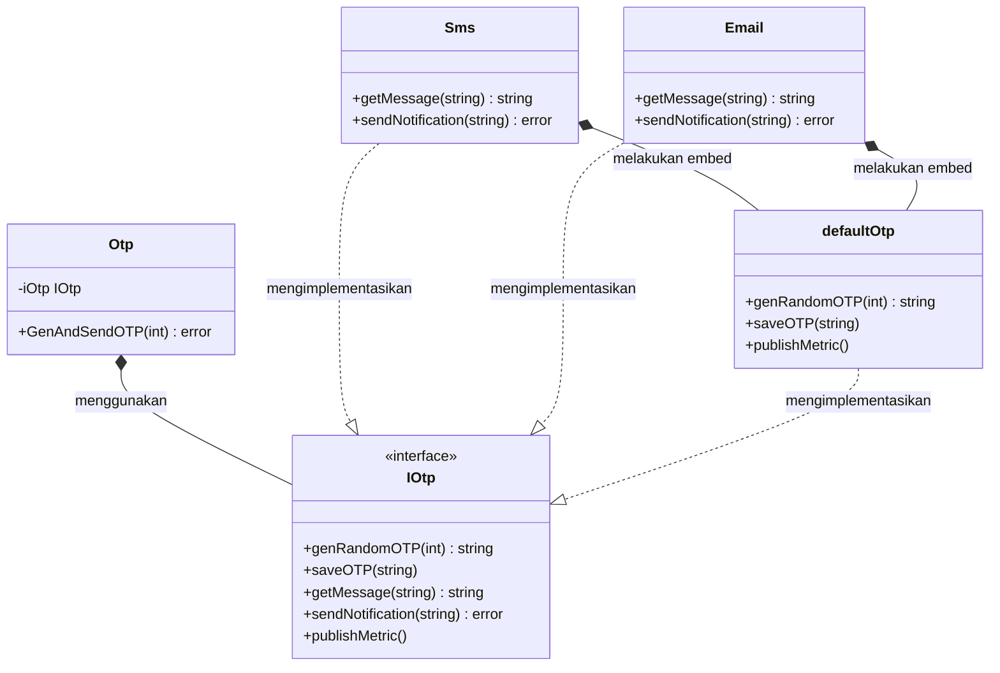

Dalam rekayasa perangkat lunak, kita sering kali menemui situasi di mana kita perlu mengeksekusi serangkaian langkah dalam urutan yang pasti dan tidak boleh diubah, tetapi implementasi mendetail dari beberapa langkah tersebut bergantung pada konteksnya. Alih-alih menduplikasi seluruh kerangka kerja proses untuk setiap variasi, kita dapat memanfaatkan design pattern **Template Method**.

Artikel ini akan membahas cara mengimplementasikan Template Method secara idiomatik dalam bahasa pemrograman Go (Golang), dilengkapi dengan skenario dunia nyata, diagram konseptual, dan contoh kode utuh yang siap dijalankan.

---

### Memahami Template Method Pattern

**Template Method** adalah behavioral design pattern yang mendefinisikan kerangka (skeleton) dari suatu algoritma di dalam base class (atau dalam konteks Go, sebuah struct orchestrator template) dan menyerahkan eksekusi langkah-langkah individu kepada implementasi konkret. Hal ini memungkinkan sub-struct atau tipe konkret untuk mendefinisikan kembali langkah-langkah tertentu dari suatu algoritma tanpa mengubah struktur keseluruhan dan alur dari algoritma tersebut.

#### Analogi Dunia Nyata: Membangun Rumah
Bayangkan proses pembangunan rumah. Alur kerja umumnya bersifat tetap:
1. Membangun fondasi.
2. Membangun dinding.
3. Memasang jendela.
4. Memasang pintu.
5. Memasang atap.

Apakah Anda sedang membangun kabin kayu atau gedung beton, langkah-langkah ini harus dieksekusi dalam urutan yang tepat. Anda tidak bisa memasang atap sebelum meletakkan fondasi. Namun, bahan dan metode konstruksi untuk dinding (kayu vs. bata) dan atap (genteng vs. seng) bervariasi bergantung pada jenis rumah. Di sini, cetak biru pembangunan rumah bertindak sebagai **Template Method**, sedangkan pemilihan material bangunan spesifik bertindak sebagai **langkah yang di-override**.

---

### Diagram Konseptual

Karena Go tidak mendukung konsep pewarisan kelas (*class inheritance*), kita menerapkan Template Method menggunakan **komposisi antarmuka (interface composition)**. Kita mendefinisikan struct yang menampung interface yang merepresentasikan langkah-langkah individu, dan sebuah method pada struct tersebut yang mengoordinasikan alur kerjanya.



---

### Skenario Masalah: Mengirimkan One-Time Password (OTP)

Bayangkan sebuah sistem autentikasi yang mengirimkan One-Time Password (OTP) untuk memverifikasi pengguna. Alur pengiriman OTP terdiri dari:
1. Membuat kode acak sebanyak N digit.
2. Menyimpan kode yang dibuat ke cache cepat (seperti Redis) untuk verifikasi nanti.
3. Membuat teks isi pesan.
4. Mengirimkan pesan ke pengguna (melalui SMS, Email, atau Push Notification).
5. Mempublikasikan metrik dan log untuk audit.

Langkah 1, 2, dan 5 akan selalu sama terlepas dari saluran pengiriman yang digunakan. Namun, langkah 3 dan 4 berbeda:
- **SMS** membutuhkan pesan teks pendek dan menggunakan API gerbang SMS (misalnya, Twilio).
- **Email** memerlukan format HTML, baris subjek (*subject line*), dan server SMTP.

Tanpa Template Method, kita harus menulis kode orkestrasi yang sama berulang kali untuk SMS dan Email. Hal ini melanggar prinsip **DRY (Don't Repeat Yourself)** dan meningkatkan beban pemeliharaan kode.

---

### Contoh Kode Go yang Idiomatik

Berikut adalah contoh kode Go lengkap yang menerapkan alur pengiriman OTP menggunakan Template Method pattern.

```go
package main

import (
	"crypto/rand"
	"fmt"
	"math/big"
)

// IOtp mendefinisikan langkah-langkah individu dari algoritma pengiriman OTP.
type IOtp interface {
	genRandomOTP(length int) string
	saveOTP(otp string)
	getMessage(otp string) string
	sendNotification(message string) error
	publishMetric()
}

// Otp adalah orchestrator (struct Template).
// Struct ini bertugas mengoordinasikan eksekusi dari setiap langkah alur kerja.
type Otp struct {
	iOtp IOtp
}

// GenAndSendOTP adalah Template Method. Method ini menetapkan alur kerja yang kaku.
func (o *Otp) GenAndSendOTP(length int) error {
	otp := o.iOtp.genRandomOTP(length)
	o.iOtp.saveOTP(otp)
	message := o.iOtp.getMessage(otp)
	err := o.iOtp.sendNotification(message)
	if err != nil {
		return fmt.Errorf("gagal mengirimkan OTP: %w", err)
	}
	o.iOtp.publishMetric()
	return nil
}

// defaultOtp menyediakan implementasi bawaan/umum untuk langkah-langkah generik.
// Struct konkret dapat melakukan embed pada struct ini untuk mewarisi perilaku bawaan.
type defaultOtp struct{}

func (d *defaultOtp) genRandomOTP(length int) string {
	const letters = "0123456789"
	result := make([]byte, length)
	for i := 0; i < length; i++ {
		num, _ := rand.Int(rand.Reader, big.NewInt(int64(len(letters))))
		result[i] = letters[num.Int64()]
	}
	return string(result)
}

func (d *defaultOtp) saveOTP(otp string) {
	fmt.Printf("Cache: Menyimpan OTP '%s' ke memori cache (TTL: 5 menit)\n", otp)
}

func (d *defaultOtp) publishMetric() {
	fmt.Println("Telemetri: Mempublikasikan metrik pengiriman OTP ke Prometheus")
}

// Sms adalah implementasi konkret dari alur OTP untuk pengiriman melalui SMS.
type Sms struct {
	defaultOtp // Embed perilaku default untuk genRandomOTP, saveOTP, dan publishMetric
}

func (s *Sms) getMessage(otp string) string {
	return fmt.Sprintf("Kode verifikasi SMS Anda adalah: %s. Jangan bagikan kode ini.", otp)
}

func (s *Sms) sendNotification(message string) error {
	fmt.Printf("SMS gateway: Mengirim pesan teks -> '%s'\n", message)
	return nil
}

// Email adalah implementasi konkret dari alur OTP untuk pengiriman melalui Email.
type Email struct {
	defaultOtp // Embed perilaku default
}

func (e *Email) getMessage(otp string) string {
	return fmt.Sprintf("Subject: Verifikasi OTP\n\nHalo, kode verifikasi email Anda adalah: %s.", otp)
}

func (e *Email) sendNotification(message string) error {
	fmt.Printf("SMTP server: Mengirim email -> '%s'\n", message)
	return nil
}

// Eksekusi Utama
func main() {
	// 1. Mengirim OTP via SMS
	smsSender := &Sms{}
	smsOtp := Otp{iOtp: smsSender}
	fmt.Println("--- Memulai Alur OTP via SMS ---")
	if err := smsOtp.GenAndSendOTP(6); err != nil {
		fmt.Printf("Error: %v\n", err)
	}

	fmt.Println()

	// 2. Mengirim OTP via Email
	emailSender := &Email{}
	emailOtp := Otp{iOtp: emailSender}
	fmt.Println("--- Memulai Alur OTP via Email ---")
	if err := emailOtp.GenAndSendOTP(8); err != nil {
		fmt.Printf("Error: %v\n", err)
	}
}
```

---

### Ringkasan

#### Keuntungan
- **Guna Ulang Kode (Code Reuse):** Langkah-langkah bersama (seperti pembuatan OTP, caching, dan telemetri) diimplementasikan sekali saja di dalam defaultOtp, menghindari duplikasi kode.
- **Fleksibilitas:** Implementasi konkret dapat menimpa (override) langkah tertentu dari algoritma tanpa memengaruhi alur kontrol utama.
- **Open/Closed Principle:** Anda dapat dengan mudah menambahkan metode pengiriman baru (seperti WhatsApp atau Push Notification) hanya dengan menulis struct baru tanpa mengubah orchestrator utama atau kode yang sudah mapan.

#### Kekurangan
- **Struktur Kerangka yang Kaku:** Klien mungkin merasa urutan langkah yang ditentukan dalam Template Method terlalu membatasi ruang gerak mereka.
- **Overhead Komposisi:** Karena Go tidak memiliki pewarisan kelas, kita harus bergantung pada teknik embedding dan interface, yang bisa membuat hierarki delegasi menjadi rumit jika tidak direncanakan dengan baik.
- **Sulit Dilacak:** Alur algoritma tersebar di antara struct template dan struct konkret, sehingga bisa membutuhkan waktu lebih lama bagi pengembang baru untuk menelusuri jalannya eksekusi program.

#### Kapan Harus Digunakan
- Saat Anda memiliki beberapa algoritma yang memiliki kesamaan alur kerja, namun berbeda detail eksekusi langkah spesifiknya.
- Saat Anda ingin mengontrol urutan alur kerja secara ketat sembari memberikan keleluasaan bagi klien untuk memodifikasi detail langkah tertentu atau menambahkan callback (hook).
- Saat melakukan refactoring kode duplikat yang bertugas mengorkestrasi alur kerja serupa di berbagai bagian sistem.
