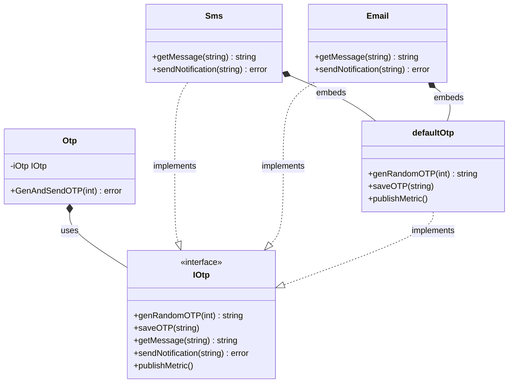

In software engineering, we often encounter scenarios where we need to execute a series of steps in a specific, immutable order, but the exact implementation of certain steps depends on the context. Instead of duplicating the entire process skeleton for each variation, we can leverage the **Template Method** design pattern.

This article explores how to implement the Template Method pattern idiomatically in Go (Golang), using a real-world scenario, a conceptual diagram, and clean, runnable code.

---

### Understanding the Template Method Pattern

The **Template Method** is a behavioral design pattern that defines the skeleton of an algorithm in a base class (or in Go, a template orchestrator struct) and delegates the execution of individual steps to concrete implementations. This allows subclasses or concrete structs to redefine certain steps of an algorithm without changing the overall structure and flow of the algorithm itself.

#### Real-World Analogy: Building a House
Consider the process of constructing a house. The general workflow is fixed:
1. Build foundations.
2. Build walls.
3. Install windows.
4. Install doors.
5. Put on the roof.

Whether you are building a wooden cabin or a concrete building, these steps must execute in this exact sequence. You cannot put on the roof before laying the foundations. However, the materials and construction methods for the walls (wood vs. brick) and the roof (tiles vs. metal sheets) vary depending on the house type. Here, the house construction plan acts as the **Template Method**, and the specific building materials are the **overridden steps**.

---

### Conceptual Diagram

Since Go does not support class inheritance, we achieve the Template Method pattern using **interface composition**. We define a struct that holds an interface representing the individual steps, and a method on that struct orchestrates the workflow.



---

### The Problem Scenario: Sending One-Time Passwords (OTP)

Imagine an authentication system that sends One-Time Passwords (OTP) to verify users. The OTP generation flow consists of:
1. Generating a random N-digit code.
2. Saving the generated code to a fast cache (e.g., Redis) for verification.
3. Creating the message body text.
4. Sending the message to the user (via SMS, Email, or Push Notification).
5. Publishing metrics and logs for auditing.

Steps 1, 2, and 5 remain identical regardless of the channel. However, steps 3 and 4 differ:
- **SMS** requires short texts and uses an SMS gateway API (e.g., Twilio).
- **Email** requires HTML formatting, a subject line, and an SMTP server.

Without Template Method, we would write redundant orchestrator logic for both SMS and Email, violating the **DRY (Don't Repeat Yourself)** principle and increasing maintenance overhead.

---

### Idiomatic Go Code Example

Here is a fully complete, compilable Go example implementing the OTP workflow using the Template Method pattern.

```go
package main

import (
	"crypto/rand"
	"fmt"
	"math/big"
)

// IOtp defines the individual steps of the OTP sending algorithm.
type IOtp interface {
	genRandomOTP(length int) string
	saveOTP(otp string)
	getMessage(otp string) string
	sendNotification(message string) error
	publishMetric()
}

// Otp is the orchestrator (the Template struct).
// It coordinates the execution of the workflow steps.
type Otp struct {
	iOtp IOtp
}

// GenAndSendOTP is the Template Method. It defines the rigid workflow.
func (o *Otp) GenAndSendOTP(length int) error {
	otp := o.iOtp.genRandomOTP(length)
	o.iOtp.saveOTP(otp)
	message := o.iOtp.getMessage(otp)
	err := o.iOtp.sendNotification(message)
	if err != nil {
		return fmt.Errorf("failed to send OTP: %w", err)
	}
	o.iOtp.publishMetric()
	return nil
}

// defaultOtp provides common/default implementations of the generic steps.
// Concrete types can embed this struct to inherit default behavior.
type defaultOtp struct{}

func (d *defaultOtp) genRandomOTP(length int) string {
	const letters = "0123456789"
	result := make([]byte, length)
	for i := 0; i < length; i++ {
		num, _ := rand.Int(rand.Reader, big.NewInt(int64(len(letters))))
		result[i] = letters[num.Int64()]
	}
	return string(result)
}

func (d *defaultOtp) saveOTP(otp string) {
	fmt.Printf("Cache: Saving generated OTP '%s' to cache memory (TTL: 5 mins)\n", otp)
}

func (d *defaultOtp) publishMetric() {
	fmt.Println("Telemetry: Publishing OTP sending metrics to Prometheus")
}

// Sms is a concrete implementation of the OTP flow for SMS delivery.
type Sms struct {
	defaultOtp // Embedding default behavior for genRandomOTP, saveOTP, and publishMetric
}

func (s *Sms) getMessage(otp string) string {
	return fmt.Sprintf("Your SMS verification code is: %s. Do not share this code.", otp)
}

func (s *Sms) sendNotification(message string) error {
	fmt.Printf("SMS gateway: Sending text message -> '%s'\n", message)
	return nil
}

// Email is a concrete implementation of the OTP flow for Email delivery.
type Email struct {
	defaultOtp // Embedding default behavior
}

func (e *Email) getMessage(otp string) string {
	return fmt.Sprintf("Subject: OTP Verification\n\nHello, your email verification code is: %s.", otp)
}

func (e *Email) sendNotification(message string) error {
	fmt.Printf("SMTP server: Sending email -> '%s'\n", message)
	return nil
}

// Main execution
func main() {
	// 1. Sending OTP via SMS
	smsSender := &Sms{}
	smsOtp := Otp{iOtp: smsSender}
	fmt.Println("--- Starting SMS OTP Flow ---")
	if err := smsOtp.GenAndSendOTP(6); err != nil {
		fmt.Printf("Error: %v\n", err)
	}

	fmt.Println()

	// 2. Sending OTP via Email
	emailSender := &Email{}
	emailOtp := Otp{iOtp: emailSender}
	fmt.Println("--- Starting Email OTP Flow ---")
	if err := emailOtp.GenAndSendOTP(8); err != nil {
		fmt.Printf("Error: %v\n", err)
	}
}
```

---

### Summary

#### Advantages
- **Code Reuse:** Shared steps (OTP generation, caching, telemetry) are implemented once in the default or parent implementation, preventing code duplication.
- **Flexibility:** Concrete implementations can override specific steps of the algorithm without changing the overarching control flow.
- **Open/Closed Principle:** You can introduce new delivery methods (like Push Notification or WhatsApp) by writing a new concrete struct without altering the template orchestrator or existing classes.

#### Disadvantages
- **Rigid Skeleton:** Some clients might find the predefined sequence of the template method too restrictive.
- **Composition Overhead:** Go does not have subclassing, so we must rely on embedding and interfaces, which can lead to complex delegation hierarchies if not managed carefully.
- **Harder to Trace:** Since the algorithm is split between the template struct and concrete implementations, it might take developers longer to trace the code execution path.

#### When to Use
- When you have multiple algorithms that share identical flow structures but differ only in minor details.
- When you want to control the exact execution sequence of a workflow while letting clients extend specific hooks or custom steps.
- When refactoring duplicate orchestrating code across multiple similar workflows.
