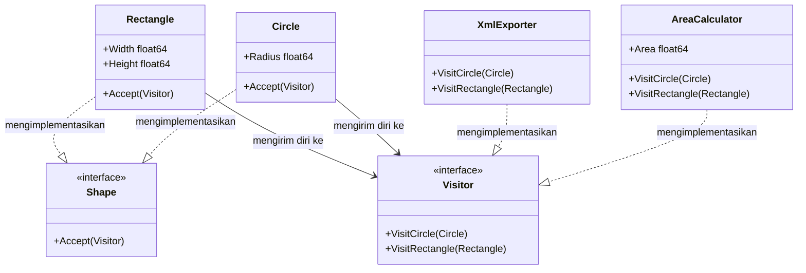

Dalam arsitektur perangkat lunak, seiring berkembangnya suatu sistem, Anda sering kali perlu menambahkan operasi baru ke dalam hierarki struktur objek yang sudah ada. Mengubah kode struktur asli setiap kali ada tindakan baru melanggar prinsip **Open/Closed Principle** serta mengotori model domain dengan logika yang tidak saling berhubungan. Design pattern **Visitor** menawarkan solusi yang bersih untuk masalah ini.

Artikel ini akan membahas secara mendalam implementasi Visitor pattern dalam bahasa Go (Golang), mencakup struktur konseptual, diagram Mermaid, skenario kasus penggunaan, serta contoh kode lengkap yang siap dijalankan.

---

### Memahami Visitor Pattern

**Visitor** adalah behavioral design pattern yang memungkinkan Anda memisahkan algoritma dari objek tempat algoritma tersebut beroperasi. Pola ini memanfaatkan teknik yang disebut **double dispatch**, sehingga Anda bisa menyematkan operasi baru ke dalam struktur objek tanpa perlu memodifikasi kode dari struktur itu sendiri.

#### Analogi Dunia Nyata: Agen Asuransi
Bayangkan seorang agen asuransi yang berkunjung ke berbagai jenis properti: rumah tinggal, gedung perkantoran, dan pabrik industri.
- Bangunan-bangunan tersebut bertindak sebagai **Element**. Mereka menerima kunjungan dan membukakan pintu untuk agen.
- Agen asuransi bertindak sebagai **Visitor**.
- Bergantung pada jenis bangunan yang dikunjungi, agen akan melakukan aktivitas yang berbeda (misalnya, memeriksa bahaya kebakaran di rumah tinggal vs. memeriksa keselamatan mesin industri di pabrik).
- Pemilik bangunan tidak perlu mengubah desain atau fungsi dasar bangunan mereka; seluruh logika penilaian asuransi sepenuhnya berada pada agen.

---

### Diagram Konseptual

Di dalam Go, Visitor pattern diimplementasikan dengan memanfaatkan interface baik untuk elemen (yang menerima visitor) maupun visitor itu sendiri (yang mendefinisikan method kunjungan untuk setiap tipe elemen konkret).



---

### Skenario Masalah: Menambahkan Operasi pada Hierarki Shape

Bayangkan Anda sedang membangun aplikasi desain grafis yang memiliki bentuk konkret: `Circle` (Lingkaran) dan `Rectangle` (Persegi Panjang). Pada awalnya, Anda hanya perlu merender bentuk-bentuk tersebut ke layar. Namun, kemudian ada kebutuhan untuk mendukung:
1. **Perhitungan Luas (Area Calculation):** Menghitung total luas area dari seluruh bentuk dalam kanvas gambar.
2. **Ekspor XML/JSON:** Menghasilkan representasi dokumen XML dari setiap bentuk untuk disimpan ke penyimpanan lokal.

Jika Anda menambahkan method `GetArea()` dan `ExportToXML()` secara langsung ke dalam interface `Shape` dan semua struct konkretnya, Anda akan menghadapi beberapa masalah:
- Melanggar **Single Responsibility Principle (SRP)** karena struct bentuk domain menjadi penuh dengan logika rendering, matematika perhitungan luas, dan serialisasi data.
- Setiap kali ada fitur baru (seperti ekspor SVG atau deteksi tabrakan), Anda harus mengedit semua file struct bentuk konkret, yang berisiko memunculkan bug baru (*regression*).

Dengan menggunakan Visitor pattern, kita dapat mengisolasi perilaku tambahan ini ke dalam struct visitor terpisah.

---

### Contoh Kode Go yang Idiomatik

Berikut adalah contoh program Go lengkap dan siap dikompilasi yang mendemonstrasikan bagaimana tipe bentuk dapat menerima visitor untuk menghitung luas dan mengekspor datanya.

```go
package main

import (
	"fmt"
	"math"
)

// Shape adalah interface Element. Tipe ini harus mendeklarasikan method Accept.
type Shape interface {
	Accept(v Visitor)
}

// Visitor adalah interface Visitor. Tipe ini mendefinisikan method kunjungan untuk semua bentuk konkret.
type Visitor interface {
	VisitCircle(*Circle)
	VisitRectangle(*Rectangle)
}

// Circle adalah elemen konkret berupa lingkaran.
type Circle struct {
	Radius float64
}

// Accept meneruskan eksekusi ke method visitor yang sesuai.
func (c *Circle) Accept(v Visitor) {
	v.VisitCircle(c)
}

// Rectangle adalah elemen konkret berupa persegi panjang.
type Rectangle struct {
	Width  float64
	Height float64
}

// Accept meneruskan eksekusi ke method visitor yang sesuai.
func (r *Rectangle) Accept(v Visitor) {
	v.VisitRectangle(r)
}

// AreaCalculator adalah Visitor konkret yang menghitung luas bentuk.
type AreaCalculator struct {
	TotalArea float64
}

func (a *AreaCalculator) VisitCircle(c *Circle) {
	area := math.Pi * math.Pow(c.Radius, 2)
	a.TotalArea += area
	fmt.Printf("AreaCalculator: Lingkaran dengan jari-jari %.2f memiliki luas %.2f\n", c.Radius, area)
}

func (a *AreaCalculator) VisitRectangle(r *Rectangle) {
	area := r.Width * r.Height
	a.TotalArea += area
	fmt.Printf("AreaCalculator: Persegi Panjang dengan ukuran %.2fx%.2f memiliki luas %.2f\n", r.Width, r.Height, area)
}

// XmlExporter adalah Visitor konkret yang menghasilkan representasi XML.
type XmlExporter struct{}

func (x *XmlExporter) VisitCircle(c *Circle) {
	fmt.Printf("<circle><radius>%.2f</radius></circle>\n", c.Radius)
}

func (x *XmlExporter) VisitRectangle(r *Rectangle) {
	fmt.Printf("<rectangle><width>%.2f</width><height>%.2f</height></rectangle>\n", r.Width, r.Height)
}

// Eksekusi Utama
func main() {
	// Menyiapkan elemen-elemen (shapes)
	shapes := []Shape{
		&Circle{Radius: 5.0},
		&Rectangle{Width: 4.0, Height: 6.0},
		&Circle{Radius: 2.5},
	}

	fmt.Println("--- Operasi 1: Menghitung Total Luas ---")
	areaCalc := &AreaCalculator{}
	for _, shape := range shapes {
		shape.Accept(areaCalc)
	}
	fmt.Printf("Hasil: Total luas dari semua bentuk adalah %.2f\n\n", areaCalc.TotalArea)

	fmt.Println("--- Operasi 2: Mengekspor Bentuk ke XML ---")
	xmlExport := &XmlExporter{}
	for _, shape := range shapes {
		shape.Accept(xmlExport)
	}
}
```

---

### Ringkasan

#### Keuntungan
- **Single Responsibility Principle:** Anda dapat menyatukan berbagai versi perilaku yang sama ke dalam satu tempat/struct (misalnya, semua logika kalkulasi luas disatukan dalam `AreaCalculator`).
- **Open/Closed Principle:** Anda dapat menambahkan operasi baru pada struktur objek yang kompleks tanpa perlu mengubah definisi struct aslinya.
- **Akumulasi State:** Objek visitor dapat mengakumulasi atau menyimpan state selama ia menelusuri struktur objek (misalnya, menjumlahkan total luas atau menyusun dokumen XML).

#### Kekurangan
- **Kekakuan Double Dispatch:** Jika Anda menambahkan Element konkret baru (misalnya, `Triangle`), Anda wajib memperbarui interface `Visitor` serta semua implementasi konkretnya (seperti `AreaCalculator`, `XmlExporter`).
- **Pelemahan Enkapsulasi:** Visitor mungkin membutuhkan akses ke properti internal atau field private dari struktur objek yang mereka kunjungi, yang berpotensi merusak batas enkapsulasi data.
- **Alur Kontrol Tidak Langsung:** Alur program melompat dari koleksi objek ke elemen, kemudian ke visitor, lalu kembali lagi. Indireksi ganda ini membuat penelusuran kode saat debugging menjadi lebih rumit.

#### Kapan Harus Digunakan
- Saat Anda perlu melakukan operasi pada seluruh elemen dari struktur objek yang rumit (seperti pohon sintaks abstrak / AST atau struktur direktori file).
- Saat tipe struct objek cenderung stabil (tidak sering bertambah baru), tetapi Anda sangat sering perlu menambahkan fungsionalitas atau algoritma baru di atasnya.
- Saat Anda ingin membersihkan perilaku pembantu (*utility behavior*) agar terpisah dari logika bisnis inti struct domain Anda.
