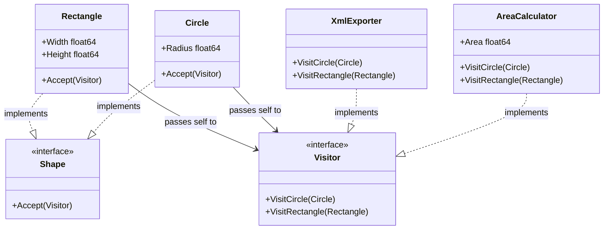

In software architecture, as a system grows, you often need to perform new operations on existing hierarchies of structures. Modifying the original structures every time a new action is required violates the **Open/Closed Principle** and pollutes the domain model with unrelated logic. The **Visitor** design pattern provides a clean solution to this problem.

This article delves into implementing the Visitor pattern in Go (Golang), detailing the conceptual layout, a Mermaid diagram, a complete use case, and compilable code.

---

### Understanding the Visitor Pattern

The **Visitor** is a behavioral design pattern that allows you to separate algorithms from the objects on which they operate. It accomplishes this through a technique called **double dispatch**, allowing you to add new operations to an object structure without modifying the structures themselves.

#### Real-World Analogy: An Insurance Agent
Consider an insurance agent who visits various types of properties: a residential house, a commercial building, and an industrial factory.
- The buildings are the **Elements**. They accept the visitor and open their doors.
- The insurance agent is the **Visitor**. 
- Depending on the building type, the agent conducts different activities (e.g., checking fire hazards in a home vs. checking industrial machinery safety in a factory).
- The buildings do not need to change their design or functions; the entire assessment logic resides in the agent.

---

### Conceptual Diagram

In Go, the Visitor pattern is implemented using interfaces for both the elements (which accept a visitor) and the visitors (which define visiting methods for each concrete element type).



---

### The Problem Scenario: Operating on a Shape Hierarchy

Suppose you are building a graphic design package with concrete shapes: `Circle` and `Rectangle`. Initially, you only need to render these shapes. Later, you are asked to support:
1. **Area Calculation:** Calculating the total surface area of all shapes in a drawing layout.
2. **XML/JSON Export:** Generating an XML representation of each shape for saving.

If you add `GetArea()` and `ExportToXML()` methods directly to the `Shape` interface and all concrete structs, you run into several issues:
- You violate the **Single Responsibility Principle (SRP)** by bloating the domain shape structs with rendering, calculations, and serialization logic.
- Every time a new feature (like SVG export or collision detection) is added, you must edit all concrete shape files, risking regressions.

By using the Visitor pattern, we can isolate these auxiliary behaviors into separate visitor structs.

---

### Idiomatic Go Code Example

Below is a complete, compilable Go example illustrating how shapes can accept visitors to calculate their areas and export their data.

```go
package main

import (
	"fmt"
	"math"
)

// Shape is the Element interface. It must declare the Accept method.
type Shape interface {
	Accept(v Visitor)
}

// Visitor is the Visitor interface. It defines visits for all concrete shapes.
type Visitor interface {
	VisitCircle(*Circle)
	VisitRectangle(*Rectangle)
}

// Circle is a concrete element.
type Circle struct {
	Radius float64
}

// Accept dispatches execution to the corresponding visitor method.
func (c *Circle) Accept(v Visitor) {
	v.VisitCircle(c)
}

// Rectangle is another concrete element.
type Rectangle struct {
	Width  float64
	Height float64
}

// Accept dispatches execution to the corresponding visitor method.
func (r *Rectangle) Accept(v Visitor) {
	v.VisitRectangle(r)
}

// AreaCalculator is a concrete Visitor that calculates shape areas.
type AreaCalculator struct {
	TotalArea float64
}

func (a *AreaCalculator) VisitCircle(c *Circle) {
	area := math.Pi * math.Pow(c.Radius, 2)
	a.TotalArea += area
	fmt.Printf("AreaCalculator: Circle with radius %.2f has area %.2f\n", c.Radius, area)
}

func (a *AreaCalculator) VisitRectangle(r *Rectangle) {
	area := r.Width * r.Height
	a.TotalArea += area
	fmt.Printf("AreaCalculator: Rectangle with dimensions %.2fx%.2f has area %.2f\n", r.Width, r.Height, area)
}

// XmlExporter is a concrete Visitor that generates XML representation.
type XmlExporter struct{}

func (x *XmlExporter) VisitCircle(c *Circle) {
	fmt.Printf("<circle><radius>%.2f</radius></circle>\n", c.Radius)
}

func (x *XmlExporter) VisitRectangle(r *Rectangle) {
	fmt.Printf("<rectangle><width>%.2f</width><height>%.2f</height></rectangle>\n", r.Width, r.Height)
}

// Main execution
func main() {
	// Setup our elements (shapes)
	shapes := []Shape{
		&Circle{Radius: 5.0},
		&Rectangle{Width: 4.0, Height: 6.0},
		&Circle{Radius: 2.5},
	}

	fmt.Println("--- Operation 1: Calculate Total Area ---")
	areaCalc := &AreaCalculator{}
	for _, shape := range shapes {
		shape.Accept(areaCalc)
	}
	fmt.Printf("Result: Total Area of all shapes is %.2f\n\n", areaCalc.TotalArea)

	fmt.Println("--- Operation 2: Export Shapes to XML ---")
	xmlExport := &XmlExporter{}
	for _, shape := range shapes {
		shape.Accept(xmlExport)
	}
}
```

---

### Summary

#### Advantages
- **Single Responsibility Principle:** You can group multiple versions of the same behavior into a single class/struct (e.g., all area calculations in `AreaCalculator`).
- **Open/Closed Principle:** You can introduce new operations on complex object structures without modifying their classes or definitions.
- **State Accumulation:** A visitor can accumulate state as it traverses the structure (e.g., summing up total areas or nesting XML files).

#### Disadvantages
- **Double Dispatch Rigidity:** If you add a new concrete Element (e.g., `Triangle`), you must update the `Visitor` interface and all of its concrete implementations (e.g., `AreaCalculator`, `XmlExporter`).
- **Encapsulation Breakdown:** Visitors might require access to the internal details or private fields of the structures they visit, which can compromise encapsulation.
- **Indirect Control Flow:** The flow hops from the collection to the element, then to the visitor, and back. This double indirection makes the runtime path harder to debug.

#### When to Use
- When you need to perform an operation on all elements of a complex object structure (like an Abstract Syntax Tree or File Directory Tree).
- When a set of structs has stable types, but you frequently need to add new operations or algorithms to them.
- When you want to clean up helper behaviors from your core business logic classes to focus them on their primary data responsibilities.
