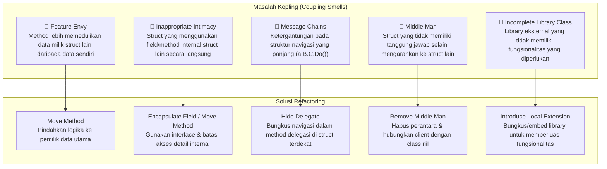

Bayangkan kamu sedang bekerja dalam sebuah tim di mana setiap kali ada satu orang ingin melakukan tugasnya, ia harus terus-menerus meminjam alat, menanyakan informasi sensitif, atau bahkan mengutak-atik barang milik anggota tim yang lain. Alih-alih bekerja secara mandiri dan fokus pada tugas masing-masing, setiap orang terus-menerus saling ketergantungan. Akibatnya, alur kerja menjadi lambat, kacau, dan ketika satu orang absen atau melakukan perubahan, alur kerja orang lain langsung terganggu.

Dalam dunia rekayasa perangkat lunak, fenomena ini disebut sebagai **tight coupling** (keterikatan yang erat). Dan ketika keterikatan ini sudah mulai merusak dan mengotori struktur kode kita, kita sedang berhadapan dengan kelompok *code smell* yang bernama **Couplers** (Penyambung).

Couplers adalah kelompok *code smell* yang menunjukkan hubungan antar objek, struct, atau modul yang terlalu intim, saling bergantung secara berlebihan, atau justru tidak melakukan apa-apa selain menjadi perantara yang tidak berguna. Hubungan yang terlalu erat ini membuat sistem kita kaku, sulit diuji secara terisolasi, dan rentan terhadap efek domino (perubahan di satu tempat merusak tempat lain).

Di artikel ini, kita akan membahas secara tuntas 5 jenis Couplers: **Feature Envy**, **Inappropriate Intimacy**, **Message Chains**, **Middle Man**, dan **Incomplete Library Class**, lengkap dengan contoh nyata menggunakan bahasa pemrograman Go.

---

## 🎯 Takeaway

Setelah membaca artikel ini, kamu akan:

- ✅ **Mengenali** 5 jenis smell dalam kelompok Couplers: Feature Envy, Inappropriate Intimacy, Message Chains, Middle Man, dan Incomplete Library Class.
- ✅ **Memahami** mengapa keterikatan erat (coupling) yang berlebihan berbahaya bagi kesehatan codebase.
- ✅ **Mengidentifikasi** tanda-tanda Couplers di dalam proyek Go milikmu.
- ✅ **Menerapkan** teknik refactoring yang tepat untuk memutuskan keterikatan yang tidak sehat.
- ✅ **Menulis** kode Go yang memiliki kohesi tinggi (high cohesion) dan ketergantungan rendah (low coupling).

---

## Peta Masalah & Solusi Couplers



---

## 1. Feature Envy (Iri Hati Terhadap Fitur)

### Apa itu?

*Feature Envy* terjadi ketika sebuah method pada suatu struct tampak lebih tertarik pada data milik struct lain daripada data milik struct-nya sendiri. Method ini terus-menerus mengakses data, memanggil getter, atau membaca field dari objek lain untuk melakukan kalkulasi atau logika bisnis tertentu.

Ini adalah pelanggaran terhadap prinsip dasar Object-Oriented Programming (dan pemrograman modular): **letakkan data dan perilaku (behavior) di tempat yang sama**.

### Mengapa Ini Masalah?
Jika data suatu struct sering digunakan oleh method luar untuk menghitung sesuatu, maka setiap kali struktur data tersebut berubah, semua method luar yang memanfaatkannya juga harus diubah. Hal ini menurunkan kohesi dan menyebarkan aturan bisnis ke luar dari struct yang seharusnya bertanggung jawab.

### Contoh Bad Code (❌)

Di bawah ini, `OrderService` memiliki method `calculateDiscount` yang sangat bergantung pada field-field di dalam struct `Customer`. `OrderService` tidak menggunakan state miliknya sendiri sama sekali untuk menghitung diskon ini.

```go
package main

import "fmt"

type Customer struct {
	ID           int
	Name         string
	LoyaltyYears int
	IsVIP        bool
	TotalSpent   float64
}

type OrderService struct{}

// ❌ BAD: calculateDiscount sangat 'iri' dengan data Customer. 
// Method ini meminjam banyak data Customer untuk menghitung diskon 
// tanpa menggunakan state dari OrderService sendiri.
func (s *OrderService) calculateDiscount(c Customer, orderAmount float64) float64 {
	var discountRate float64

	if c.IsVIP {
		discountRate = 0.20
	} else if c.LoyaltyYears > 5 {
		discountRate = 0.15
	} else if c.TotalSpent > 10000000 {
		discountRate = 0.10
	} else {
		discountRate = 0.05
	}

	return orderAmount * discountRate
}
```

### Perbaikan (✅)

Pindahkan logika perhitungan tersebut langsung ke dalam struct `Customer` sebagai method-nya sendiri. Dengan begitu, `OrderService` cukup memanggil method tersebut.

```go
package main

type Customer struct {
	ID           int
	Name         string
	LoyaltyYears int
	IsVIP        bool
	TotalSpent   float64
}

// ✅ GOOD: Pindahkan logika penentuan diskon langsung ke Customer sebagai method-nya sendiri.
// Customer sekarang memiliki encapsulation yang baik atas aturan diskon mereka.
func (c *Customer) GetDiscountRate() float64 {
	if c.IsVIP {
		return 0.20
	}
	if c.LoyaltyYears > 5 {
		return 0.15
	}
	if c.TotalSpent > 10000000 {
		return 0.10
	}
	return 0.05
}

type OrderService struct{}

func (s *OrderService) calculateDiscount(c Customer, orderAmount float64) float64 {
	// OrderService sekarang hanya memanggil perilaku (behavior) milik Customer
	return orderAmount * c.GetDiscountRate()
}
```

**Mengapa ini lebih baik:**
Aturan tentang bagaimana diskon ditentukan sekarang terkonsentrasi di dalam struct `Customer`. Jika besok perusahaan ingin mengubah aturan diskon VIP dari `20%` menjadi `25%`, kita hanya perlu mengubah satu file/method saja di struct `Customer`.

---

## 2. Inappropriate Intimacy (Keintiman yang Tidak Pantas)

### Apa itu?

*Inappropriate Intimacy* terjadi ketika dua struct atau kelas terlalu dekat dan saling mengetahui detail internal satu sama lain secara mendalam. Dalam Go, enkapsulasi biasanya diatur di tingkat *package*. Namun, di dalam package yang sama, struct dapat mengakses field *unexported* (huruf kecil) dari struct lain. 

Smell ini muncul ketika struct pemanggil secara langsung membaca atau memodifikasi field internal/private struct lain, alih-alih berinteraksi melalui API publik yang disediakan.

### Mengapa Ini Masalah?
Ketika Struct A langsung mengubah field internal Struct B, Struct A menjadi sangat bergantung pada *bagaimana* Struct B merepresentasikan datanya. Jika kita ingin mengganti tipe data field internal Struct B atau mengubah cara perubahan state divalidasi, Struct A akan langsung rusak. Enkapsulasi menjadi hancur.

### Contoh Bad Code (❌)

Pada contoh ini, `PaymentProcessor` langsung mengakses dan mengubah field internal (`internalStatus` dan `lastUpdated`) milik struct `Order` untuk menandai pembayaran telah selesai.

```go
package billing

import (
	"time"
)

type Order struct {
	ID             string
	Amount         float64
	internalStatus string    // Field unexported (private dalam package)
	lastUpdated    time.Time // Field unexported (private dalam package)
}

type PaymentProcessor struct{}

// ❌ BAD: PaymentProcessor sangat intim dengan struktur internal Order.
// Ia secara langsung memanipulasi field internalStatus dan lastUpdated milik Order.
func (pp *PaymentProcessor) Process(order *Order, paymentID string) {
	// Simulasi pemrosesan pembayaran...
	
	// Melanggar batasan keintiman dengan mengutak-atik state internal Order secara langsung
	order.internalStatus = "PAID"
	order.lastUpdated = time.Now()
}
```

### Perbaikan (✅)

Sediakan method publik/terekspor pada `Order` yang menangani perubahan status tersebut, lengkap dengan validasi atau efek samping yang diperlukan.

```go
package billing

import (
	"fmt"
	"time"
)

type Order struct {
	ID             string
	Amount         float64
	internalStatus string
	lastUpdated    time.Time
}

// ✅ GOOD: Sediakan method publik pada Order untuk memanipulasi statusnya sendiri.
// Hal ini menjaga aturan transisi status tetap terkapsul di satu tempat.
func (o *Order) MarkAsPaid() error {
	if o.internalStatus == "PAID" {
		return fmt.Errorf("order is already paid")
	}
	o.internalStatus = "PAID"
	o.lastUpdated = time.Now()
	return nil
}

type PaymentProcessor struct{}

func (pp *PaymentProcessor) Process(order *Order, paymentID string) error {
	// Simulasi pemrosesan pembayaran...
	
	// Berinteraksi melalui interface/method publik resmi.
	// PaymentProcessor tidak perlu tahu field apa saja yang diubah di dalam Order.
	return order.MarkAsPaid()
}
```

**Mengapa ini lebih baik:**
`PaymentProcessor` tidak lagi peduli bagaimana status `Order` disimpan (apakah menggunakan string, enum integer, atau struct status khusus). Seluruh logika transisi status dan audit waktu pembaruan dikelola secara mandiri oleh `Order`.

---

## 3. Message Chains (Rantai Pesan Panjang)

### Apa itu?

*Message Chains* adalah kode dengan pola panggilan berantai seperti `a.GetB().GetC().GetD().DoSomething()`. Dalam Go, ini sering terlihat seperti rantai akses struct: `user.Account.Profile.Address.City.Name`.

Smell ini melanggar **Hukum Demeter (Law of Demeter)** yang menyatakan: *"Hanya berbicaralah dengan teman terdekatmu, jangan dengan orang asing."*

### Mengapa Ini Masalah?
Klien menjadi sangat bergantung pada navigasi struktur internal seluruh grafik objek. Jika relasi di tengah rantai berubah (misalnya, `Profile` tidak lagi memiliki `Address`, tetapi langsung di bawah `Account`), maka kode pemanggil di seluruh aplikasi akan rusak. 

Selain itu, di Go, rantai seperti `user.Account.Profile.Address` sangat rentan terhadap **nil pointer dereference (panic)** jika salah satu pointer di tengah rantai bernilai `nil`.

### Contoh Bad Code (❌)

Di bawah ini, fungsi `PrintUserCity` harus melewati rantai panjang dari `User` hingga ke nama kota untuk mencetaknya.

```go
package main

type City struct {
	Name string
}

type Address struct {
	City *City
}

type Profile struct {
	Address *Address
}

type Account struct {
	Profile *Profile
}

type User struct {
	Account *Account
}

// Client Code yang memanggil rantai pesan
func PrintUserCity(u *User) string {
	// ❌ BAD: Rantai pesan yang panjang. Pemanggil harus tahu detail navigasi
	// dari User -> Account -> Profile -> Address -> City -> Name.
	// Kode ini sangat rapuh dan berisiko memicu panic nil pointer jika ada field yang nil.
	return u.Account.Profile.Address.City.Name
}
```

### Perbaikan (✅)

Gunakan teknik **Hide Delegate**. Buat method delegasi pada objek terdekat (`User`) yang menyembunyikan detail navigasi tersebut dari pemanggil eksternal.

```go
package main

type City struct {
	Name string
}

type Address struct {
	City *City
}

type Profile struct {
	Address *Address
}

type Account struct {
	Profile *Profile
}

type User struct {
	Account *Account
}

// ✅ GOOD: Menggunakan teknik Hide Delegate. Pemanggil tidak perlu tahu cara menavigasi
// struktur internal User. Nil check juga diamankan secara rapi di satu tempat.
func (u *User) GetCityName() string {
	if u == nil || u.Account == nil || u.Account.Profile == nil || 
		u.Account.Profile.Address == nil || u.Account.Profile.Address.City == nil {
		return "Unknown"
	}
	return u.Account.Profile.Address.City.Name
}

func PrintUserCity(u *User) string {
	// Pemanggil cukup bertanya apa yang mereka butuhkan langsung ke objek terdekat
	return u.GetCityName()
}
```

**Mengapa ini lebih baik:**
Pemanggil tidak perlu mengetahui susunan hierarki internal dari struct `User`. Jika besok struktur relasi diubah, kita hanya perlu menyesuaikan method `GetCityName()` di dalam file struct `User` tanpa mengganggu kode klien yang memanggilnya. Nil check juga terpusat, mencegah crash aplikasi.

---

## 4. Middle Man (Makelar / Perantara)

### Apa itu?

*Middle Man* adalah kebalikan dari *Message Chains*. Kadang-kadang, demi menghindari Message Chains dan menerapkan Hukum Demeter, kita melakukan refactoring secara berlebihan. Kita membuat sebuah struct yang hampir seluruh method-nya tidak melakukan pekerjaan nyata apa pun selain meneruskan (*delegating*) panggilan ke struct lain.

Jika sebuah struct memiliki 10 method, dan 9 di antaranya hanya berupa wrapper kosong yang mendelegasikan tugas ke struct internal, maka struct tersebut adalah seorang Middle Man.

### Mengapa Ini Masalah?
Perantara yang tidak melakukan apa-apa hanya menambah beban kognitif (boilerplates) dan membuat penelusuran kode menjadi rumit. Setiap kali ada perubahan method pada objek asli, kita terpaksa harus memperbarui perantara tersebut pula.

### Contoh Bad Code (❌)

Di bawah ini, `LoggingService` bertindak murni sebagai makelar. Ia tidak menambah nilai apa pun (seperti logging format khusus, filtering, atau penulisan ke file eksternal) dan hanya meneruskan panggilan langsung ke `Logger`.

```go
package main

import "log"

type Logger struct{}

func (l *Logger) Log(msg string)   { log.Println("[LOG]", msg) }
func (l *Logger) Info(msg string)  { log.Println("[INFO]", msg) }
func (l *Logger) Error(msg string) { log.Println("[ERROR]", msg) }

// ❌ BAD: LoggingService bertindak sebagai Middle Man murni.
// Tidak ada logika bisnis tambahan, tidak ada filter, tidak ada modifikasi.
// Ia hanya membuang-buang baris kode untuk meneruskan panggilan ke Logger.
type LoggingService struct {
	realLogger *Logger
}

func (ls *LoggingService) Log(msg string) {
	ls.realLogger.Log(msg)
}

func (ls *LoggingService) Info(msg string) {
	ls.realLogger.Info(msg)
}

func (ls *LoggingService) Error(msg string) {
	ls.realLogger.Error(msg)
}
```

### Perbaikan (✅)

Terapkan teknik **Remove Middle Man**. Hapus struct perantara tersebut, dan biarkan client berinteraksi langsung dengan objek riil yang melakukan pekerjaan.

```go
package main

import "log"

// Logger utama yang menyediakan fungsionalitas riil
type Logger struct{}

func (l *Logger) Log(msg string)   { log.Println("[LOG]", msg) }
func (l *Logger) Info(msg string)  { log.Println("[INFO]", msg) }
func (l *Logger) Error(msg string) { log.Println("[ERROR]", msg) }

// ✅ GOOD: Hapus Middle Man. Client bisa memanggil logger utama secara langsung
// jika memang tidak ada fungsionalitas tambahan yang disediakan oleh perantara.

type OrderService struct {
	logger *Logger // Gunakan Logger secara langsung, bukan melalui LoggingService
}

func (s *OrderService) ProcessOrder(orderID string) {
	s.logger.Info("Processing order: " + orderID)
}
```

**Mengapa ini lebih baik:**
Kita menghilangkan satu lapisan abstraksi yang tidak berguna. Kode menjadi lebih ramping (*lean*), lebih sedikit baris yang harus dipelihara, dan alur eksekusi program menjadi lebih mudah diikuti.

---

## 5. Incomplete Library Class (Kelas Library yang Tidak Lengkap)

### Apa itu?

Library pihak ketiga (3rd party) atau pustaka standar bawaan sangat membantu mempercepat pengembangan. Namun, pembuat library tidak bisa meramal masa depan dan memenuhi semua kebutuhan spesifik aplikasi kita. Cepat atau lambat, kamu akan menemukan situasi di mana sebuah struct dari library eksternal kekurangan method penting yang sangat kamu butuhkan.

Karena kita tidak bisa mengubah kode library tersebut secara langsung, smell ini muncul ketika developer mulai menulis fungsi helper acak di berbagai tempat atau melakukan modifikasi tidak konsisten di sisi klien untuk melengkapi kekurangan library tersebut.

### Mengapa Ini Masalah?
Jika kita menyebarkan logika tambahan tersebut di berbagai fungsi bisnis secara acak, logika tersebut akan terduplikasi dan sulit dipelihara. Bisnis logic kita juga menjadi terlalu terikat dengan implementasi spesifik dari library eksternal.

### Contoh Bad Code (❌)

Misalnya kita menggunakan tipe `time.Time` bawaan Go. Kita membutuhkan logika bisnis untuk menghitung tanggal pengiriman yang hanya menghitung hari kerja (mengecualikan Sabtu dan Minggu). 

Di bawah ini, logika pengecekan hari kerja diletakkan langsung di dalam fungsi bisnis, dan kemungkinan besar akan di-copy-paste ke tempat lain yang membutuhkan perhitungan serupa.

```go
package main

import (
	"time"
)

// ❌ BAD: Mengulangi pemeriksaan hari kerja (weekend) di dalam bisnis logic,
// atau membuat utility function yang tidak terorganisir.
// Ini membuat bisnis logic kita bergantung langsung pada boilerplate pemrosesan waktu standar.
func CalculateDeliveryDate(orderDate time.Time) time.Time {
	deliveryDate := orderDate
	daysToAdd := 3

	for daysToAdd > 0 {
		deliveryDate = deliveryDate.AddDate(0, 0, 1)
		// Memeriksa weekend secara manual di dalam fungsi bisnis
		if deliveryDate.Weekday() != time.Saturday && deliveryDate.Weekday() != time.Sunday {
			daysToAdd--
		}
	}
	return deliveryDate
}
```

### Perbaikan (✅)

Gunakan teknik **Introduce Local Extension**. Di Go, karena tidak ada sistem pewarisan (*inheritance*), cara terbaik untuk menerapkan teknik ini adalah dengan membuat tipe baru (*custom type*) atau menggunakan **struct embedding** untuk membungkus library tersebut dan menambahkan fungsionalitas baru.

```go
package main

import (
	"time"
)

// ✅ GOOD: Menggunakan Local Extension dengan membungkus / meng-embed time.Time.
// Ini memungkinkan kita menambahkan fungsionalitas baru (AddBusinessDays, IsWeekend)
// tanpa kehilangan method bawaan dari time.Time.

type CustomTime struct {
	time.Time // Embedding tipe asli dari library
}

// IsWeekend mengemas aturan pengecekan akhir pekan
func (ct CustomTime) IsWeekend() bool {
	w := ct.Weekday()
	return w == time.Saturday || w == time.Sunday
}

// AddBusinessDays menghitung hari kerja berikutnya secara aman
func (ct CustomTime) AddBusinessDays(days int) CustomTime {
	curr := ct
	for days > 0 {
		curr = CustomTime{curr.AddDate(0, 0, 1)}
		if !curr.IsWeekend() {
			days--
		}
	}
	return curr
}

// Sekarang, bisnis logic kita menjadi sangat bersih dan deskriptif:
func CalculateDeliveryDate(orderDate time.Time) time.Time {
	ct := CustomTime{Time: orderDate}
	return ct.AddBusinessDays(3).Time
}
```

**Mengapa ini lebih baik:**
Logika ekstensi terhadap library eksternal dikumpulkan di satu tipe khusus (`CustomTime`). Fungsi bisnis tidak lagi dikotori oleh detail kalkulasi hari kerja. Jika kelak kita ingin menambahkan libur nasional, kita cukup memperbarui method `IsWeekend` di dalam `CustomTime` tanpa menyentuh kode kalkulasi pengiriman.

---

## Panduan Cepat Mendiagnosis Couplers

Berikut ringkasan praktis untuk mengenali dan menyelesaikan kelompok smell Couplers:

| Code Smell | Gejala Utama | Teknik Refactoring |
|---|---|---|
| **Feature Envy** | Method memanggil data milik struct lain secara berulang-ulang. | **Move Method**: Pindahkan method tersebut ke struct pemilik data asli. |
| **Inappropriate Intimacy** | Struct mengakses field private atau internal milik struct lain secara bebas. | **Move Method / Encapsulate Field**: Sediakan API publik resmi pada struct tujuan. |
| **Message Chains** | Pemanggilan berantai yang sangat panjang: `a.b.c.d.Do()`. | **Hide Delegate**: Buat method delegasi pada objek terdekat untuk memotong rantai. |
| **Middle Man** | Struct yang isinya hanya mendelegasikan panggilan tanpa menambahkan nilai apa pun. | **Remove Middle Man**: Hapus struct tersebut, panggil objek target secara langsung. |
| **Incomplete Library Class** | Library pihak ketiga tidak memiliki fungsionalitas yang kita butuhkan. | **Introduce Local Extension**: Bungkus tipe library tersebut menggunakan tipe baru atau embedding di Go. |

---

## 📝 Ringkasan

**Couplers** mengingatkan kita bahwa ketergantungan antar komponen dalam perangkat lunak harus dikelola dengan bijak. Keterikatan yang terlalu erat (*tight coupling*) adalah musuh utama dari sistem yang fleksibel dan mudah diuji.

Ingat kembali prinsip-prinsip ini:
- 💡 **Feature Envy** dan **Inappropriate Intimacy** adalah tanda bahwa perilaku diletakkan terpisah dari datanya. Kembalikan fungsionalitas tersebut ke pemilik data aslinya.
- 💡 **Message Chains** membuat kode rentan patah di tengah jalan. Terapkan Hukum Demeter; mintalah hasil akhir pada teman terdekatmu, bukan menelusuri isi dompetnya.
- 💡 **Middle Man** adalah contoh aksi abstraksi yang sia-sia. Jangan takut menghapus kelas perantara jika mereka tidak memberikan nilai tambah apa pun.
- 💡 **Incomplete Library Class** adalah realita industri. Hadapi dengan elegan menggunakan *Local Extension* (seperti struct embedding di Go) agar kode tambahan tidak berserakan di codebase.

Memotong kopling yang tidak perlu akan membuat kode Go milikmu lebih modular, mudah dituliskan unit test-nya, dan menyenangkan untuk dikembangkan di masa mendatang.

---

🇮🇩 Versi Indonesia | [🇬🇧 English Version](/refactoring-part-5-couplers)

← [Part 4: Code Smells — Dispensables](/refactoring-part-4-dispensables-id) | [Part 6: Refactoring Techniques — Composing Methods](/refactoring-part-6-composing-methods-id) →
