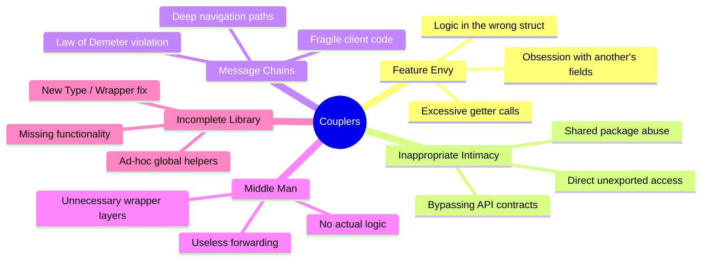

Imagine trying to build a complex Lego model, but instead of the bricks snapping together nicely, someone has superglued half of them together. If you want to replace a single red brick, you now have to disassemble the entire left wing, soak it in solvent, and rebuild three unrelated sections. In software engineering, this superglue is called **tight coupling**. 

In this fifth installment of our refactoring series, we are diving into **Couplers**—a class of code smells characterized by excessive collaboration between objects. When structs know too much about each other’s internals, navigate through deep object graphs, or act as pointless middlemen, your codebase loses its modularity. Any change in one corner of the application triggers a cascade of breakages across others. Let's look at how to identify and dismantle these couplers in Go to restore flexibility and clarity to your codebase.

---

## 🎯 Takeaway

By the end of this post, you will be able to:

- **Recognize** the five Coupler code smells: Feature Envy, Inappropriate Intimacy, Message Chains, Middle Man, and Incomplete Library Class.
- **Understand** how tight coupling destroys encapsulation and makes your Go code fragile to change.
- **Apply** Go-specific refactoring patterns (such as Method Mutation, Local Type Extension, and Delegated Encapsulation) to decouple your structs.
- **Balance** when to delegate behavior and when to inline delegations to avoid over-engineering.

---

## The Map of Couplers

Before we dive into each smell, let's visualize how Couplers manifest in structural dependencies:



---

## 1. 💚 Feature Envy

### The Smell

A method suffers from **Feature Envy** when it is more interested in the data of another struct than its own. In Go, this typically manifests as a method on struct `A` that continuously accesses fields or calls getter methods on struct `B` to perform a calculation or make a decision. 

This violates the classic OOP design principle: **"Tell, Don't Ask."** Instead of asking an object about its state and then computing a result ourselves, we should tell that object to perform the work and return the result. Feature Envy increases coupling because any changes to the fields of struct `B` will force you to modify the method on struct `A`.

### Bad Code Example (❌)

In this example, the `OrderService` needs to calculate a discount. However, its calculation logic is entirely dependent on the details of the `Customer` struct. The service "asks" the customer for its VIP status, loyalty years, and total spend, rather than letting the customer structure handle its own classification.

```go
package discount

type Customer struct {
	ID           string
	IsVIP        bool
	LoyaltyYears int
	TotalSpent   float64
}

type Order struct {
	ID     string
	Amount float64
}

type OrderService struct{}

// CalculateDiscount is highly envious of Customer's fields.
// It retrieves multiple fields of Customer to make decisions.
func (s *OrderService) CalculateDiscount(o *Order, c *Customer) float64 {
	discountRate := 0.0
	
	if c.IsVIP {
		discountRate = 0.15
	} else if c.LoyaltyYears > 5 && c.TotalSpent > 1000 {
		discountRate = 0.10
	} else if c.LoyaltyYears > 2 {
		discountRate = 0.05
	}
	
	return o.Amount * discountRate
}
```

### Fix (✅)

To fix this, we apply the **Move Method** refactoring. We move the logic for determining the discount rate directly to the `Customer` struct. Now, the `OrderService` simply asks the customer for their rate and applies it.

```go
package discount

type Customer struct {
	ID           string
	IsVIP        bool
	LoyaltyYears int
	TotalSpent   float64
}

// DiscountRate encapsulates the logic for deciding the customer's discount tier.
// The Customer struct now manages its own discount policy.
func (c *Customer) DiscountRate() float64 {
	if c.IsVIP {
		return 0.15
	}
	if c.LoyaltyYears > 5 && c.TotalSpent > 1000 {
		return 0.10
	}
	if c.LoyaltyYears > 2 {
		return 0.05
	}
	return 0.0
}

type Order struct {
	ID     string
	Amount float64
}

type OrderService struct{}

// CalculateDiscount now only coordinates the calculations, leaving policy to Customer.
func (s *OrderService) CalculateDiscount(o *Order, c *Customer) float64 {
	return o.Amount * c.DiscountRate()
}
```

**Why it's better:**
- **Encapsulation:** The rules governing VIP tiers and loyalty discounts are co-located with the `Customer` struct. If business requirements change (e.g., VIP discount increases to 20%), you only modify `Customer`.
- **Testability:** You can unit test the customer's discount rate logic independently without setting up an `Order` or `OrderService`.
- **Readability:** `CalculateDiscount` is now a simple, readable single-line math formula.

---

## 2. 🫣 Inappropriate Intimacy

### The Smell

**Inappropriate Intimacy** occurs when one struct is overly familiar with the internal details of another struct. In Go, packages are the primary unit of encapsulation. If two structs reside in the same package, they can read and write each other's unexported fields. 

While package-level access is a language feature, abusing it causes components to couple tightly to each other's implementation details. If struct `A` directly mutates unexported fields of struct `B` bypassing any domain rules, it becomes impossible to guarantee the integrity of `B`'s internal state.

### Bad Code Example (❌)

Here, `PaymentProcessor` directly checks and updates the `internalStatus` of an `Order`. It violates the encapsulation of `Order` by managing the order's state transitions externally.

```go
package checkout

type Order struct {
	ID             string
	Amount         float64
	internalStatus string // unexported field
}

type PaymentProcessor struct{}

// Process is inappropriately intimate with Order. It directly reads 
// and writes to Order's unexported internalStatus field.
func (p *PaymentProcessor) Process(o *Order) error {
	if o.internalStatus == "paid" || o.internalStatus == "cancelled" {
		return nil
	}
	
	o.internalStatus = "processing"
	
	// Simulating external gateway transaction...
	success := true
	if success {
		o.internalStatus = "paid"
	} else {
		o.internalStatus = "payment_failed"
	}
	return nil
}
```

### Fix (✅)

We resolve Inappropriate Intimacy by establishing clear boundaries and exposing behavior rather than state. We define state transition methods on the `Order` struct, ensuring that only the `Order` can alter its own status.

```go
package checkout

import "errors"

type Order struct {
	ID             string
	Amount         float64
	internalStatus string
}

// CanProcessPayment determines if the order is eligible for payment processing.
func (o *Order) CanProcessPayment() bool {
	return o.internalStatus != "paid" && o.internalStatus != "cancelled"
}

func (o *Order) TransitionToProcessing() {
	o.internalStatus = "processing"
}

func (o *Order) MarkAsPaid() {
	o.internalStatus = "paid"
}

func (o *Order) MarkAsFailed() {
	o.internalStatus = "payment_failed"
}

type PaymentProcessor struct{}

// Process now interacts with Order only via its public behavioral API.
func (p *PaymentProcessor) Process(o *Order) error {
	if !o.CanProcessPayment() {
		return errors.New("cannot process payment for order in current state")
	}

	o.TransitionToProcessing()

	// Simulating external gateway transaction...
	success := true
	if success {
		o.MarkAsPaid()
	} else {
		o.MarkAsFailed()
	}
	return nil
}
```

**Why it's better:**
- **State Integrity:** The `Order` struct maintains a safe state machine. It is now impossible for an external processor to put an order into a nonsense status without going through the public methods.
- **Maintainability:** If the underlying status representation changes (e.g., transitioning from string constants to an enum or a `State` pattern), only the `Order` struct’s methods need updates. `PaymentProcessor` remains untouched.

---

## 3. ⛓️ Message Chains

### The Smell

You have likely seen code that looks like this: `user.GetAccount().GetProfile().GetAddress().GetCity().GetName()`. This is a classic **Message Chain**.

A message chain occurs when a client is coupled to the exact navigation structure of the object graph. It violates the **Law of Demeter** (also known as the "Principle of Least Knowledge"), which states that a module should not know about the innards of the objects it manipulates. Any restructuring of intermediate objects along the chain (e.g., if a profile is moved out of the `Account` struct) breaks the client code.

### Bad Code Example (❌)

In this example, the `OrderService` needs to find the delivery city of a user. It has to traverse five layers of nesting to retrieve it. If any link in this chain returns `nil`, the program will crash with a panic.

```go
package user

type City struct {
	Name string
}

type Address struct {
	City *City
}

type Profile struct {
	Address *Address
}

type Account struct {
	Profile *Profile
}

type User struct {
	Account *Account
}

type OrderService struct{}

// GetDeliveryCity is deeply coupled to the nested structure of User.
// It must check every single level for nil to prevent runtime panics.
func (s *OrderService) GetDeliveryCity(u *User) string {
	if u != nil && 
	   u.Account != nil && 
	   u.Account.Profile != nil && 
	   u.Account.Profile.Address != nil && 
	   u.Account.Profile.Address.City != nil {
		return u.Account.Profile.Address.City.Name
	}
	return "Unknown"
}
```

### Fix (✅)

We can resolve Message Chains using **Hide Delegate** refactoring. We add delegation methods to `User` to hide the intermediate relationships, shielding the client from the nested topology. Alternatively, a simpler fix is to pass the required data (`City` or `Address`) directly to the method that needs it, avoiding the chain altogether.

```go
package user

type City struct {
	Name string
}

type Address struct {
	City *City
}

type Profile struct {
	Address *Address
}

type Account struct {
	Profile *Profile
}

type User struct {
	Account *Account
}

// DeliveryCity hides the delegate relationships and returns the city name directly.
// The user struct absorbs the responsibility of traversing its own children.
func (u *User) DeliveryCity() string {
	if u == nil || 
	   u.Account == nil || 
	   u.Account.Profile == nil || 
	   u.Account.Profile.Address == nil || 
	   u.Account.Profile.Address.City == nil {
		return "Unknown"
	}
	return u.Account.Profile.Address.City.Name
}

type OrderService struct{}

// GetDeliveryCity now simply asks the User for its city name directly.
func (s *OrderService) GetDeliveryCity(u *User) string {
	return u.DeliveryCity()
}
```

**Why it's better:**
- **Decoupled Clients:** `OrderService` is now only coupled to `User`. If the `Profile` struct is renamed or `Address` is refactored, only the `User.DeliveryCity()` method needs to change.
- **Safety:** The messy `nil` check logic is isolated to a single place instead of being duplicated by every client that needs the user's city.

---

## 4. 🕴️ Middle Man

### The Smell

While encapsulation and delegate hiding (as shown in the Message Chain fix) are beneficial, overusing them can lead to another code smell: the **Middle Man**.

A Middle Man is a struct that does nothing but delegate work to another struct. If a struct has 10 methods, and 9 of them do nothing but call corresponding methods on an internal component, the struct has lost its purpose. It adds cognitive overhead and indirection without adding any real behavior, validation, or abstraction.

### Bad Code Example (❌)

In this example, the `LoggingService` has been created to wrap a `ConsoleLogger`. However, it does absolutely nothing but delegate calls directly to it. The `PaymentHandler` is forced to use the `LoggingService` wrapper for no functional benefit.

```go
package billing

import "log"

type ConsoleLogger struct{}

func (l *ConsoleLogger) Log(message string) {
	log.Println("[INFO]", message)
}

// LoggingService is a classic Middle Man. It has no internal logic,
// no state, and simply delegates every call directly to ConsoleLogger.
type LoggingService struct {
	logger *ConsoleLogger
}

func (ls *LoggingService) Info(msg string) {
	ls.logger.Log(msg)
}

type PaymentHandler struct {
	logService *LoggingService
}

func (h *PaymentHandler) HandlePayment(amount float64) {
	h.logService.Info("Processing payment transaction")
	// ... payment logic
}
```

### Fix (✅)

To fix this, we apply **Remove Middle Man**. We delete the intermediate delegating layer and have the client communicate directly with the actual service. If we want to maintain flexibility, we can introduce a clean Go interface.

```go
package billing

import "log"

// Logger interface defines the behavior we need.
type Logger interface {
	Log(message string)
}

type ConsoleLogger struct{}

func (l *ConsoleLogger) Log(message string) {
	log.Println("[INFO]", message)
}

// PaymentHandler communicates directly with the Logger interface,
// removing the useless Middle Man entirely.
type PaymentHandler struct {
	logger Logger
}

func (h *PaymentHandler) HandlePayment(amount float64) {
	h.logger.Log("Processing payment transaction")
	// ... payment logic
}
```

**Why it's better:**
- **Simplified Design:** Eliminating the `LoggingService` removes an unnecessary file and structural layer from the codebase.
- **Less Maintenance:** If we decide to add a new method (e.g., `Errorf()`), we only update the logger implementation, instead of updating both the implementation and the middle-man delegator.
- **Idiomatic Go:** Go encourages flat structures and direct communication via lightweight interfaces over deeply nested wrapper frameworks.

---

## 5. 📦 Incomplete Library Class

### The Smell

We rely heavily on standard libraries and third-party packages. However, libraries are read-only. Eventually, you will encounter a situation where an external library class provides 90% of what you need, but lacks a critical function or behavior specific to your domain.

When this happens, developers often resort to creating ad-hoc utility packages (like `utils` or `helpers`) and write global functions that manipulate the library types. Over time, these helper functions become scattered across the codebase, resulting in low cohesion and reduced discoverability.

### Bad Code Example (❌)

Imagine Go's standard library `time.Time` is missing methods to calculate the next business day. Rather than cleanly extending the functionality, the developer has written global helper functions in a generic `utils` package. 

```go
package utils

import "time"

// Incomplete Library Class: Global helper functions are scattered 
// because standard time.Time doesn't have our business-day logic.
func IsBusinessDay(t time.Time) bool {
	w := t.Weekday()
	if w == time.Saturday || w == time.Sunday {
		return false
	}
	// Check for public holidays (e.g., New Year's Day)
	if t.Month() == time.January && t.Day() == 1 {
		return false
	}
	return true
}

func NextBusinessDay(t time.Time) time.Time {
	next := t.AddDate(0, 0, 1)
	for !IsBusinessDay(next) {
		next = next.AddDate(0, 0, 1)
	}
	return next
}
```

### Fix (✅)

Since Go doesn't support class inheritance, we cannot subclass `time.Time`. Instead, we can extend the library class using two idiomatic patterns:
1. **New Type Definition:** Creating a local type based on the library type.
2. **Composition (Wrapper):** Embedding the library type inside a local struct.

Below, we create a new type `WorkCalendar` that embeds `time.Time`. This allows us to attach our custom business-domain methods directly to it.

```go
package calendar

import "time"

// WorkCalendar embeds time.Time, inheriting all its methods 
// while letting us attach our custom business logic.
type WorkCalendar struct {
	time.Time
}

func NewWorkCalendar(t time.Time) WorkCalendar {
	return WorkCalendar{Time: t}
}

// IsBusinessDay checks if the date is a weekday and not a holiday.
func (c WorkCalendar) IsBusinessDay() bool {
	w := c.Weekday()
	if w == time.Saturday || w == time.Sunday {
		return false
	}
	if c.Month() == time.January && c.Day() == 1 {
		return false
	}
	return true
}

// NextBusinessDay finds the next valid business day.
func (c WorkCalendar) NextBusinessDay() WorkCalendar {
	next := c.AddDate(0, 0, 1)
	for {
		nextCal := WorkCalendar{Time: next}
		if nextCal.IsBusinessDay() {
			return nextCal
		}
		next = next.AddDate(0, 0, 1)
	}
}
```

**Why it's better:**
- **Discoverability:** Methods are attached directly to the custom type. Developers don't need to guess which utility package contains the date math; they can just instantiate `WorkCalendar` and use autocomplete.
- **Cohesion:** Data (`time.Time`) and operations on that data (`NextBusinessDay`) are kept together in a clean, self-contained unit.
- **Type Safety:** You can pass `WorkCalendar` to other functions that specifically require business-date calculations, preventing ordinary dates from accidentally skipping validation.

---

## Putting It All Together

Here is a quick reference guide to help you diagnose and treat Coupler smells in your Go codebase:

| Code Smell | Key Symptom | Primary Refactoring Strategy |
| :--- | :--- | :--- |
| **Feature Envy** | A method reads multiple fields or getters of another struct. | **Move Method** (move the logic onto the struct that owns the data). |
| **Inappropriate Intimacy** | A struct directly reads or mutates another struct's unexported fields. | **Encapsulate Behavior** (add state machine methods to the target struct). |
| **Message Chains** | Long navigation paths like `a.B.C.D` that leak structure. | **Hide Delegate** (add a helper method to the root object to delegate). |
| **Middle Man** | A struct does nothing but forward methods to another object. | **Remove Middle Man** (communicate directly with the service). |
| **Incomplete Library Class** | A library is missing a method, leading to messy global helpers. | **Introduce Local Extension** (wrap the type using type embedding). |

---

## 📝 Summary / Recap

Couplers represent code that collaborates too closely. They blur the lines between components, turning modular packages into an intertwined, fragile web. 

- 💚 **Feature Envy** occurs when a struct wants another struct's data. Fix it by moving the behavior to where the data lives.
- 🫣 **Inappropriate Intimacy** is when components bypass APIs to access unexported internals. Fix it by encapsulating state transitions inside methods.
- ⛓️ **Message Chains** couple you to navigation structures. Fix it by hiding the delegate.
- 🕴️ **Middle Man** is the result of over-delegating. Fix it by removing the middle man and talking directly to the performer.
- 📦 **Incomplete Library Class** is solved in Go using **local type extensions** and **embedding** to extend read-only structures cleanly.

Keep your dependencies clear, keep your interfaces clean, and let your structs mind their own business!

---

[🇮🇩 Versi Indonesia](/refactoring-part-5-couplers-id) | 🇬🇧 English Version
