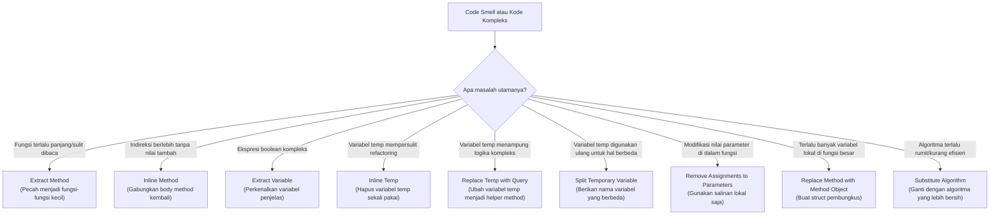

Pernahkah kamu membuka sebuah file Go dan mendapati fungsi raksasa yang panjangnya memenuhi beberapa layar monitor? Kamu mulai membacanya, melacak belasan variabel lokal, nested loop, dan puluhan percabangan kondisi. Begitu sampai di akhir fungsi, kamu sudah lupa apa yang dilakukan di bagian awalnya.

Ini adalah gejala klasik dari buruknya komposisi fungsi (*method composition*). Dalam software engineering, **Composing Methods** adalah proses penataan ulang fungsi-fungsi kita agar masing-masing hanya melakukan satu hal dengan baik (*do one thing and do it well*) dan mudah dibaca. Ketika dilakukan dengan benar, kodemu akan terbaca seperti narasi yang mengalir, di mana setiap fungsi menceritakan satu bab saja dari keseluruhan cerita.

Di bagian ke-6 dari Refactoring Series ini, kita akan membahas teknik-teknik utama dalam composing methods, menunjukkan cara mengubah blok kode yang berantakan dan sulit dikelola menjadi fungsi-fungsi Go yang bersih, modular, dan sangat mudah diuji.

---

## 🎯 Takeaway

Setelah membaca artikel ini, kamu akan:
- ✅ Memahami filosofi inti dari **Composing Methods** dan mengapa hal ini penting
- ✅ Mempelajari **9 teknik composing utama** dari katalog refactoring Martin Fowler
- ✅ Memahami kapan harus mengekstrak kode ke helper function dan kapan harus menggabungkannya kembali (inline)
- ✅ Menguasai cara menyederhanakan ekspresi boolean yang kompleks dengan variabel deskriptif
- ✅ Melihat contoh nyata dalam Go yang membandingkan fungsi panjang tak terstruktur dengan alternatif yang bersih dan terkomposisi

---

## Matriks Keputusan Composing Methods

Bagaimana kamu memutuskan teknik mana yang akan digunakan? Gunakan flowchart ini sebagai panduan untuk mendiagnosis masalah keterbacaan kode dan menerapkan jalur refactoring yang tepat:



---

## 1. Extract Method (⭐⭐⭐)

**Extract Method** adalah teknik refactoring paling penting dalam kategori ini. Jika kamu memiliki fragmen kode yang bisa dikelompokkan bersama, pindahkan kode tersebut ke fungsi (atau method) terpisah dan berikan nama yang menjelaskan apa yang dilakukannya.

### Mengapa menggunakan teknik ini?
- **Keterbacaan**: Fungsi tingkat tinggi menjadi lebih pendek dan terbaca seperti daftar instruksi yang ringkas.
- **Mengurangi Duplikasi**: Kode yang diekstrak dapat dengan mudah digunakan kembali di tempat lain.
- **Pengujian Terisolasi**: Kamu bisa menulis unit test untuk fungsi helper yang kecil dan spesifik, alih-alih mencoba menguji satu fungsi raksasa yang serbaguna.

### Contoh Bad Code (❌)

Di bawah ini adalah contoh fungsi monolitik sepanjang 50 baris yang menangani proses checkout. Fungsi ini mencampuradukkan validasi, kalkulasi harga, panggilan payment gateway, penyimpanan ke database, dan pengiriman email dalam satu blok kode yang padat.

```go
package main

import (
	"errors"
	"fmt"
	"log"
	"time"
)

type Item struct {
	Price    float64
	Quantity int
}

type Cart struct {
	Items []Item
}

type User struct {
	ID        string
	Name      string
	Email     string
	IsActive  bool
	IsPremium bool
}

type Order struct {
	ID        string
	UserID    string
	Total     float64
	Status    string
	CreatedAt time.Time
}

// ❌ BAD: Fungsi monolitik yang panjang dan melakukan segalanya:
// validasi, kalkulasi harga, pemrosesan pembayaran, penyimpanan ke DB, dan notifikasi.
func ProcessCheckout(cart *Cart, user *User, paymentToken string) (*Order, error) {
	// 1. Validasi
	if cart == nil || len(cart.Items) == 0 {
		return nil, errors.New("cart is empty")
	}
	if user == nil || !user.IsActive {
		return nil, errors.New("invalid or inactive user")
	}

	// 2. Kalkulasi Subtotal, Diskon, dan Pajak
	var subtotal float64
	for _, item := range cart.Items {
		subtotal += item.Price * float64(item.Quantity)
	}

	var discount float64
	if user.IsPremium && subtotal > 500 {
		discount = subtotal * 0.15 // diskon 15%
		log.Printf("Applying 15%% premium discount: %.2f", discount)
	} else if subtotal > 200 {
		discount = subtotal * 0.05 // diskon 5%
		log.Printf("Applying 5%% bulk discount: %.2f", discount)
	}

	tax := (subtotal - discount) * 0.11 // PPN 11%
	total := subtotal - discount + tax

	// 3. Proses Pembayaran (Simulasi)
	log.Printf("[PAYMENT] Charging $%.2f via token %s", total, paymentToken)
	if paymentToken == "" || len(paymentToken) < 5 {
		return nil, errors.New("payment authorization failed")
	}

	// 4. Simpan ke Database (Simulasi)
	orderID := fmt.Sprintf("ORD-%d", time.Now().UnixNano())
	order := &Order{
		ID:        orderID,
		UserID:    user.ID,
		Total:     total,
		Status:    "Paid",
		CreatedAt: time.Now(),
	}
	log.Printf("[DB] INSERT INTO orders VALUES (%s, %s, %.2f)", order.ID, order.UserID, order.Total)

	// 5. Kirim Konfirmasi (Simulasi)
	emailBody := fmt.Sprintf("Hello %s, your order %s has been processed. Total: $%.2f", user.Name, order.ID, total)
	log.Printf("[SMTP] Email sent to %s: %s", user.Email, emailBody)

	return order, nil
}
```

### Perbaikan / Fix (✅)

Kita mengekstrak masing-masing dari lima langkah logis tersebut ke dalam fungsi terpisah yang deskriptif. Fungsi `ProcessCheckout` yang utama sekarang terbaca seperti alur kerja (workflow) orkestrasi tingkat tinggi yang sangat bersih:

```go
package main

import (
	"errors"
	"fmt"
	"log"
	"time"
)

type CheckoutSummary struct {
	Subtotal float64
	Discount float64
	Tax      float64
	Total    float64
}

// ✅ GOOD: Proses checkout menjadi bersih dan mendelegasikan tugas spesifik ke helper functions.
func ProcessCheckout(cart *Cart, user *User, paymentToken string) (*Order, error) {
	if err := validateCheckout(cart, user); err != nil {
		return nil, err
	}

	summary := calculateTotals(cart, user)

	if err := processPayment(summary.Total, paymentToken); err != nil {
		return nil, err
	}

	order, err := saveOrder(user.ID, summary.Total)
	if err != nil {
		return nil, err
	}

	sendConfirmation(user, order.ID, summary.Total)

	return order, nil
}

// Helper 1: Logika Validasi
func validateCheckout(cart *Cart, user *User) error {
	if cart == nil || len(cart.Items) == 0 {
		return errors.New("cart is empty")
	}
	if user == nil || !user.IsActive {
		return errors.New("invalid or inactive user")
	}
	return nil
}

// Helper 2: Kalkulasi Harga
func calculateTotals(cart *Cart, user *User) CheckoutSummary {
	var subtotal float64
	for _, item := range cart.Items {
		subtotal += item.Price * float64(item.Quantity)
	}

	var discount float64
	if user.IsPremium && subtotal > 500 {
		discount = subtotal * 0.15
	} else if subtotal > 200 {
		discount = subtotal * 0.05
	}

	tax := (subtotal - discount) * 0.11
	total := subtotal - discount + tax

	return CheckoutSummary{
		Subtotal: subtotal,
		Discount: discount,
		Tax:      tax,
		Total:    total,
	}
}

// Helper 3: Otorisasi Pembayaran
func processPayment(total float64, token string) error {
	log.Printf("[PAYMENT] Charging $%.2f via token %s", total, token)
	if token == "" || len(token) < 5 {
		return errors.New("payment authorization failed")
	}
	return nil
}

// Helper 4: Interaksi Database
func saveOrder(userID string, total float64) (*Order, error) {
	orderID := fmt.Sprintf("ORD-%d", time.Now().UnixNano())
	order := &Order{
		ID:        orderID,
		UserID:    userID,
		Total:     total,
		Status:    "Paid",
		CreatedAt: time.Now(),
	}
	log.Printf("[DB] INSERT INTO orders VALUES (%s, %s, %.2f)", order.ID, order.UserID, order.Total)
	return order, nil
}

// Helper 5: Pengiriman Notifikasi
func sendConfirmation(user *User, orderID string, total float64) {
	emailBody := fmt.Sprintf("Hello %s, your order %s has been processed. Total: $%.2f", user.Name, orderID, total)
	log.Printf("[SMTP] Email sent to %s: %s", user.Email, emailBody)
}
```

---

## 2. Inline Method

Kadang-kadang, kamu menemukan method yang bagian tubuh kodenya sudah sama jelasnya dengan nama method itu sendiri. Dalam kasus ini, indireksi (pendelegasian) tidak memberikan nilai tambah apa pun dan hanya membuat pembaca harus melompat ke sana kemari untuk memahami kodenya.

### Mengapa menggunakan teknik ini?
- Mengurangi pendelegasian dan indireksi yang tidak perlu.
- Membersihkan fungsi "perantara" (middleman) yang tidak melakukan apa pun selain meneruskan data.

### Contoh Bad Code (❌)

```go
// ❌ BAD: Pendelegasian berlebih membuat pembaca melompat-lompat untuk logika yang sangat sederhana.
type Driver struct {
	lateDeliveries int
}

func (d *Driver) GetLateDeliveries() int {
	return d.lateDeliveries
}

func (d *Driver) IsHazardous() bool {
	return d.GetLateDeliveries() > 5
}
```

### Perbaikan / Fix (✅)

```go
// ✅ GOOD: Tulis logika langsung secara inline karena method getter di sini sangat sepele dan tidak memberi nilai tambah.
type Driver struct {
	lateDeliveries int
}

func (d *Driver) IsHazardous() bool {
	return d.lateDeliveries > 5
}
```

---

## 3. Extract Variable (⭐⭐)

Teknik ini juga dikenal sebagai **Introduce Explaining Variable**. Jika kamu memiliki ekspresi bersarang (nested expression) yang kompleks, simpan hasil ekspresi tersebut (atau bagian-bagian kecilnya) ke dalam variabel sementara dengan nama yang menjelaskan artinya.

### Mengapa menggunakan teknik ini?
- Membuat percabangan kondisi boolean yang kompleks menjadi mudah dibaca tanpa memerlukan komentar inline.
- Mempermudah proses debugging karena kamu bisa memeriksa nilai dari setiap komponen boolean secara terpisah.

### Contoh Bad Code (❌)

```go
// ❌ BAD: Kondisi pada statement if sangat panjang, padat, dan sulit dipahami secara sekilas.
func (r *Request) Process() bool {
	if (r.Platform == "macOS" || r.Platform == "Linux") && r.Browser == "Chrome" && r.HasValidToken() && r.Attempts < 3 {
		return true
	}
	return false
}
```

### Perbaikan / Fix (✅)

```go
// ✅ GOOD: Variabel hasil ekstraksi menjelaskan alur logika langkah demi langkah.
func (r *Request) Process() bool {
	isSupportedOS   := r.Platform == "macOS" || r.Platform == "Linux"
	isChrome         := r.Browser == "Chrome"
	isAuthenticated  := r.HasValidToken()
	isUnderRateLimit := r.Attempts < 3

	return isSupportedOS && isChrome && isAuthenticated && isUnderRateLimit
}
```

---

## 4. Inline Temp

Jika kamu memiliki variabel sementara yang menampung hasil ekspresi sederhana dan variabel tersebut hanya digunakan sekali, sebaiknya langsung gabungkan secara inline (ganti referensi variabel dengan ekspresinya).

### Mengapa menggunakan teknik ini?
- Membersihkan variabel sementara yang tidak menambah keterbacaan kode.
- Menyiapkan kode untuk teknik refactoring lainnya (seperti Extract Method).

### Contoh Bad Code (❌)

```go
// ❌ BAD: Variabel basePrice redundan dan hanya menambah noise pada kode.
func (o *Order) IsExpensive() bool {
	basePrice := o.BasePrice()
	return basePrice > 1000
}
```

### Perbaikan / Fix (✅)

```go
// ✅ GOOD: Langsung kembalikan ekspresi secara inline untuk menyederhanakan body fungsi.
func (o *Order) IsExpensive() bool {
	return o.BasePrice() > 1000
}
```

---

## 5. Replace Temp with Query (⭐⭐)

Jika kamu menggunakan variabel sementara untuk menyimpan hasil dari suatu kalkulasi ekspresi, pindahkan ekspresi tersebut ke method/fungsi terpisah (query method).

### Mengapa menggunakan teknik ini?
- Variabel lokal hanya terlihat di dalam fungsi tempat ia dideklarasikan. Jika diekstrak menjadi method pada struct, kalkulasi tersebut bisa digunakan kembali di method mana pun pada struct tersebut.
- Membuat fungsi pemanggil jauh lebih bersih dan lebih mudah dipecah lagi.

### Contoh Bad Code (❌)

```go
type Invoice struct {
	Quantity  int
	UnitPrice float64
}

// ❌ BAD: Variabel discount dihitung dan disimpan secara lokal.
// Jika kita membutuhkan informasi discount atau total harga di tempat lain,
// kita terpaksa menghitung ulang atau menduplikasi kodenya.
func (i *Invoice) GetTotalPrice() float64 {
	basePrice := float64(i.Quantity) * i.UnitPrice
	
	var discount float64
	if basePrice > 1000 {
		discount = basePrice * 0.10
	} else {
		discount = basePrice * 0.05
	}
	
	return basePrice - discount
}
```

### Perbaikan / Fix (✅)

```go
type Invoice struct {
	Quantity  int
	UnitPrice float64
}

// ✅ GOOD: Kalkulasi sementara diekstrak menjadi query method pada struct.
// Kini method lain (seperti PrintInvoice atau GetTaxAmount) dapat menggunakannya kembali tanpa duplikasi.
func (i *Invoice) BasePrice() float64 {
	return float64(i.Quantity) * i.UnitPrice
}

func (i *Invoice) Discount() float64 {
	if i.BasePrice() > 1000 {
		return i.BasePrice() * 0.10
	}
	return i.BasePrice() * 0.05
}

func (i *Invoice) GetTotalPrice() float64 {
	return i.BasePrice() - i.Discount()
}
```

---

## 6. Split Temporary Variable

Jika sebuah variabel sementara diisi nilainya (di-assign) lebih dari sekali untuk tugas atau kalkulasi yang berbeda, buatlah variabel terpisah dengan nama unik untuk masing-masing kalkulasi.

### Mengapa menggunakan teknik ini?
- Menghindari kebingungan. Menggunakan kembali satu variabel untuk dua hal yang berbeda memberi kesan salah bahwa keduanya adalah konsep yang sama.
- Meningkatkan ketepatan penamaan variabel.

### Contoh Bad Code (❌)

```go
// ❌ BAD: Variabel 'temp' digunakan kembali untuk menghitung dua hal yang berbeda (keliling dan luas).
func PrintRectangleDetails(width, height float64) {
	temp := 2 * (width + height)
	fmt.Printf("Perimeter: %.2f\n", temp)

	temp = width * height
	fmt.Printf("Area: %.2f\n", temp)
}
```

### Perbaikan / Fix (✅)

```go
// ✅ GOOD: Gunakan variabel terpisah dengan nama yang jelas untuk masing-masing tujuan.
func PrintRectangleDetails(width, height float64) {
	perimeter := 2 * (width + height)
	fmt.Printf("Perimeter: %.2f\n", perimeter)

	area := width * height
	fmt.Printf("Area: %.2f\n", area)
}
```

---

## 7. Remove Assignments to Parameters

Jika kodemu mengubah nilai dari parameter yang dilewatkan (passed parameter) ke dalam fungsi, simpanlah nilai parameter tersebut ke variabel lokal terlebih dahulu, lalu lakukan operasi pada variabel lokal tersebut.

### Mengapa menggunakan teknik ini?
- Mencegah efek samping (*side effects*) yang tidak diinginkan.
- Menghindari kebingungan bagi pembaca. Parameter seharusnya memberi tahu pembaca tentang nilai apa yang dimasukkan ke dalam fungsi, bukan bertindak sebagai tempat penampung nilai sementara (*temporary accumulator*).

### Contoh Bad Code (❌)

```go
// ❌ BAD: Nilai parameter 'discountPercent' dimodifikasi langsung di dalam fungsi.
func CalculateFinalPrice(price float64, discountPercent int) float64 {
	if price > 500 {
		discountPercent += 5 // Memodifikasi parameter secara langsung
	}
	return price * (1.0 - float64(discountPercent)/100.0)
}
```

### Perbaikan / Fix (✅)

```go
// ✅ GOOD: Variabel lokal digunakan untuk menampung nilai yang dimodifikasi.
func CalculateFinalPrice(price float64, discountPercent int) float64 {
	actualDiscount := discountPercent
	if price > 500 {
		actualDiscount += 5
	}
	return price * (1.0 - float64(actualDiscount)/100.0)
}
```

---

## 8. Replace Method with Method Object

Ketika kamu memiliki method panjang yang berisi terlalu banyak variabel lokal, kamu tidak dapat dengan mudah menerapkan *Extract Method* karena fungsi-fungsi baru yang dihasilkan akan membutuhkan daftar parameter yang sangat panjang dan rumit.

Untuk mengatasinya, ubah method tersebut menjadi struct terpisah (disebut sebagai Method Object). Variabel lokal dari method lama akan menjadi field dari struct baru ini. Dengan begitu, kamu bisa memecah logika besarnya menjadi method-method yang lebih kecil pada struct baru tanpa perlu mengoper parameter ke sana kemari.

### Contoh Bad Code (❌)

```go
type Order struct {
	BaseValue float64
	ItemCount int
}

// ❌ BAD: Kalkulasi yang sangat kompleks dengan banyak variabel lokal yang sulit diekstrak
// karena variabel-variabel tersebut saling terikat satu sama lain.
func (o *Order) ComplexPricing() float64 {
	primaryBase := o.BaseValue * 1.2
	secondaryBase := float64(o.ItemCount) * 15.0
	shippingFee := 5.0
	
	if primaryBase > 100 {
		shippingFee = 0.0
	}
	
	modifier := (primaryBase + secondaryBase) * 0.1
	return primaryBase + secondaryBase + shippingFee - modifier
}
```

### Perbaikan / Fix (✅)

```go
type Order struct {
	BaseValue float64
	ItemCount int
}

// ✅ GOOD: Diekstrak ke dalam Method Object (PricingCalculator).
// Variabel lokal menjadi field struct, memungkinkan pemecahan fungsi secara bersih.
func (o *Order) ComplexPricing() float64 {
	calculator := &PricingCalculator{
		order:         o,
		primaryBase:   o.BaseValue * 1.2,
		secondaryBase: float64(o.ItemCount) * 15.0,
		shippingFee:   5.0,
	}
	return calculator.Compute()
}

type PricingCalculator struct {
	order         *Order
	primaryBase   float64
	secondaryBase float64
	shippingFee   float64
	modifier      float64
}

func (c *PricingCalculator) Compute() float64 {
	c.calculateShipping()
	c.calculateModifier()
	return c.primaryBase + c.secondaryBase + c.shippingFee - c.modifier
}

func (c *PricingCalculator) calculateShipping() {
	if c.primaryBase > 100 {
		c.shippingFee = 0.0
	}
}

func (c *PricingCalculator) calculateModifier() {
	c.modifier = (c.primaryBase + c.secondaryBase) * 0.1
}
```

---

## 9. Substitute Algorithm

Seiring berkembangnya basis kode (*codebase*), kamu mungkin menyadari bahwa suatu algoritma dapat diganti dengan implementasi yang jauh lebih sederhana, bersih, atau menggunakan fitur bawaan bahasa pemrograman yang lebih efisien.

### Mengapa menggunakan teknik ini?
- Mengganti logika kustom yang rumit dengan pendekatan standar atau panggilan library bawaan.
- Meningkatkan keterbacaan serta performa kode.

### Contoh Bad Code (❌)

```go
// ❌ BAD: Pengecekan manual dan bertele-tele untuk mengetahui apakah sebuah list berisi target string.
func FindTarget(items []string) string {
	for _, item := range items {
		if item == "Apple" {
			return "Apple"
		}
		if item == "Banana" {
			return "Banana"
		}
		if item == "Cherry" {
			return "Cherry"
		}
	}
	return ""
}
```

### Perbaikan / Fix (✅)

```go
// ✅ GOOD: Menggunakan algoritma pencarian berbasis map yang lebih bersih dan efisien.
func FindTarget(items []string) string {
	targets := map[string]bool{
		"Apple":  true,
		"Banana": true,
		"Cherry": true,
	}
	for _, item := range items {
		if targets[item] {
			return item
		}
	}
	return ""
}
```

---

## 📝 Ringkasan

Menyusun ulang fungsi (*composing methods*) bukanlah tentang menulis pola kode yang rumit, melainkan tentang **membuat kode kita mudah dibaca, jelas, dan gampang dirawat**. Dengan menjaga agar fungsi tetap fokus pada satu tanggung jawab saja dan meminimalkan kerumitan variabel lokal, kamu memastikan siapa saja (termasuk dirimu sendiri di masa depan) dapat memahami dan memodifikasi kode tersebut tanpa takut menimbulkan bug tersembunyi.

Berikut adalah rangkaman singkat poin-poin penting yang telah kita pelajari:
1. 📏 **Extract Method** adalah senjata utamamu. Jika suatu fungsi melakukan lebih dari satu hal, pecahlah.
2. 🔄 **Inline Method** adalah penawar dari desain kode yang terlalu rumit (*over-engineering*) dan indireksi yang tidak berguna.
3. 🏷️ **Extract Variable** mendokumentasikan logika kompleks langsung di dalam baris kode.
4. 💾 **Replace Temp with Query** membuat kalkulasi dapat digunakan kembali dan membersihkan lingkup variabel lokal fungsi.
5. 🛡️ **Remove Assignments to Parameters** menghindari efek samping (*side effects*) yang membingungkan.
6. 🧩 **Replace Method with Method Object** memungkinkanmu membongkar fungsi warisan (*legacy code*) yang sangat besar dengan variabel lokal yang saling terkait erat.

> 💡 **Tips Refactoring**: Jangan mencoba menerapkan semua teknik ini sekaligus. Mulailah dengan mengidentifikasi fungsi-fungsi panjang di proyekmu, terapkan **Extract Method** terlebih dahulu, dan lihatlah betapa jauh lebih bersih dan rapi kode yang kamu miliki!

---

🇮🇩 Versi Indonesia | [🇬🇧 English Version](/refactoring-part-6-composing-methods)
