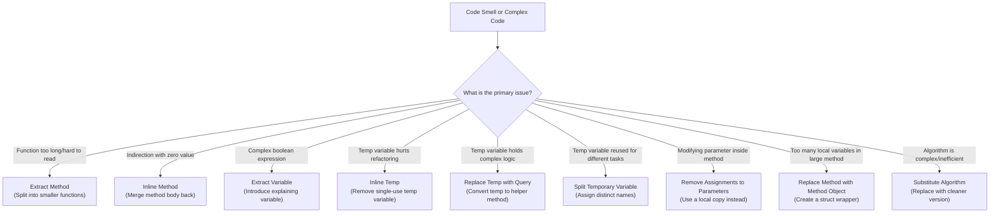

Have you ever opened a Go file only to find a monolithic function that spans multiple screens? You start reading it, tracking several local variables, nested loops, and conditional statements. By the time you reach the end, you’ve forgotten what the beginning was doing. 

This is a classic symptom of poor method composition. In software engineering, **Composing Methods** is the process of structuring your functions so that they do one thing, do it well, and are easily readable. When done right, your code reads like a well-written narrative, where each function tells a single chapter of the story. 

In this part of our Refactoring Series, we will cover the core techniques of composing methods, showing how to transform messy, unmanageable code blocks into clean, modular, and highly testable Go functions.

---

## 🎯 Takeaway

After reading this article, you will:
- ✅ Understand the core philosophy of **Composing Methods** and why it matters
- ✅ Learn the **9 primary composing techniques** from Martin Fowler’s refactoring catalog
- ✅ Learn when to extract code into helper functions and when to inline them back
- ✅ Master how to simplify complex boolean expressions with descriptive variables
- ✅ See real-world Go examples comparing long, unorganized functions with clean, composed alternatives

---

## Composing Methods Decision Matrix

How do you decide which technique to use? Use this flowchart as a guide to diagnose code readability issues and apply the correct refactoring path:



---

## 1. Extract Method (⭐⭐⭐)

**Extract Method** is the most important refactoring technique in this category. If you have a code fragment that can be grouped together, move it to a separate function (or method) and name it based on what it does.

### Why use it?
- **Readability**: High-level functions become short and read like a list of instructions.
- **Reduced Duplication**: Code that is extracted can easily be reused elsewhere.
- **Isolated Testing**: You can write unit tests for small, specific helper functions rather than trying to test a huge, multi-purpose function.

### Contoh Bad Code (❌) / Bad Code Example (❌)

Here is a 50-line monolithic function that handles a checkout process. It mixes validation, pricing math, payment gateway calls, database saving, and email dispatch all in one block.

```go
package main

import (
	"errors"
	"fmt"
	"log"
	"time"
)

type Item struct {
	Price    float64
	Quantity int
}

type Cart struct {
	Items []Item
}

type User struct {
	ID        string
	Name      string
	Email     string
	IsActive  bool
	IsPremium bool
}

type Order struct {
	ID        string
	UserID    string
	Total     float64
	Status    string
	CreatedAt time.Time
}

// ❌ BAD: A long, monolithic function that does everything:
// validation, price calculation, payment processing, DB saving, and notification.
func ProcessCheckout(cart *Cart, user *User, paymentToken string) (*Order, error) {
	// 1. Validation
	if cart == nil || len(cart.Items) == 0 {
		return nil, errors.New("cart is empty")
	}
	if user == nil || !user.IsActive {
		return nil, errors.New("invalid or inactive user")
	}

	// 2. Calculate Subtotal, Discount, and Tax
	var subtotal float64
	for _, item := range cart.Items {
		subtotal += item.Price * float64(item.Quantity)
	}

	var discount float64
	if user.IsPremium && subtotal > 500 {
		discount = subtotal * 0.15 // 15% discount
		log.Printf("Applying 15%% premium discount: %.2f", discount)
	} else if subtotal > 200 {
		discount = subtotal * 0.05 // 5% discount
		log.Printf("Applying 5%% bulk discount: %.2f", discount)
	}

	tax := (subtotal - discount) * 0.11 // 11% VAT tax
	total := subtotal - discount + tax

	// 3. Charge Payment (Simulated)
	log.Printf("[PAYMENT] Charging $%.2f via token %s", total, paymentToken)
	if paymentToken == "" || len(paymentToken) < 5 {
		return nil, errors.New("payment authorization failed")
	}

	// 4. Save to Database (Simulated)
	orderID := fmt.Sprintf("ORD-%d", time.Now().UnixNano())
	order := &Order{
		ID:        orderID,
		UserID:    user.ID,
		Total:     total,
		Status:    "Paid",
		CreatedAt: time.Now(),
	}
	log.Printf("[DB] INSERT INTO orders VALUES (%s, %s, %.2f)", order.ID, order.UserID, order.Total)

	// 5. Send Confirmation (Simulated)
	emailBody := fmt.Sprintf("Hello %s, your order %s has been processed. Total: $%.2f", user.Name, order.ID, total)
	log.Printf("[SMTP] Email sent to %s: %s", user.Email, emailBody)

	return order, nil
}
```

### Perbaikan / Fix (✅)

We extract each of the five logical steps into distinct, self-describing functions. The main `ProcessCheckout` function now reads like a clean, high-level orchestration workflow:

```go
package main

import (
	"errors"
	"fmt"
	"log"
	"time"
)

type CheckoutSummary struct {
	Subtotal float64
	Discount float64
	Tax      float64
	Total    float64
}

// ✅ GOOD: The checkout process is clean and delegates specific tasks to helper functions.
func ProcessCheckout(cart *Cart, user *User, paymentToken string) (*Order, error) {
	if err := validateCheckout(cart, user); err != nil {
		return nil, err
	}

	summary := calculateTotals(cart, user)

	if err := processPayment(summary.Total, paymentToken); err != nil {
		return nil, err
	}

	order, err := saveOrder(user.ID, summary.Total)
	if err != nil {
		return nil, err
	}

	sendConfirmation(user, order.ID, summary.Total)

	return order, nil
}

// Helper 1: Validation logic
func validateCheckout(cart *Cart, user *User) error {
	if cart == nil || len(cart.Items) == 0 {
		return errors.New("cart is empty")
	}
	if user == nil || !user.IsActive {
		return errors.New("invalid or inactive user")
	}
	return nil
}

// Helper 2: Pricing calculations
func calculateTotals(cart *Cart, user *User) CheckoutSummary {
	var subtotal float64
	for _, item := range cart.Items {
		subtotal += item.Price * float64(item.Quantity)
	}

	var discount float64
	if user.IsPremium && subtotal > 500 {
		discount = subtotal * 0.15
	} else if subtotal > 200 {
		discount = subtotal * 0.05
	}

	tax := (subtotal - discount) * 0.11
	total := subtotal - discount + tax

	return CheckoutSummary{
		Subtotal: subtotal,
		Discount: discount,
		Tax:      tax,
		Total:    total,
	}
}

// Helper 3: Payment authorization
func processPayment(total float64, token string) error {
	log.Printf("[PAYMENT] Charging $%.2f via token %s", total, token)
	if token == "" || len(token) < 5 {
		return errors.New("payment authorization failed")
	}
	return nil
}

// Helper 4: Database interaction
func saveOrder(userID string, total float64) (*Order, error) {
	orderID := fmt.Sprintf("ORD-%d", time.Now().UnixNano())
	order := &Order{
		ID:        orderID,
		UserID:    userID,
		Total:     total,
		Status:    "Paid",
		CreatedAt: time.Now(),
	}
	log.Printf("[DB] INSERT INTO orders VALUES (%s, %s, %.2f)", order.ID, order.UserID, order.Total)
	return order, nil
}

// Helper 5: Notification delivery
func sendConfirmation(user *User, orderID string, total float64) {
	emailBody := fmt.Sprintf("Hello %s, your order %s has been processed. Total: $%.2f", user.Name, orderID, total)
	log.Printf("[SMTP] Email sent to %s: %s", user.Email, emailBody)
}
```

---

## 2. Inline Method

Sometimes, you encounter a method whose body is just as clear and descriptive as its name. In these cases, the indirection adds no value and only forces the reader to jump back and forth.

### Why use it?
- Reduces unnecessary delegation and indirection.
- Cleans up "middleman" functions that don't do anything other than pass data.

### Contoh Bad Code (❌) / Bad Code Example (❌)

```go
// ❌ BAD: Excessive delegation makes the reader jump around for simple logic.
type Driver struct {
	lateDeliveries int
}

func (d *Driver) GetLateDeliveries() int {
	return d.lateDeliveries
}

func (d *Driver) IsHazardous() bool {
	return d.GetLateDeliveries() > 5
}
```

### Perbaikan / Fix (✅)

```go
// ✅ GOOD: Inline the getter method since it is trivial and adds no value.
type Driver struct {
	lateDeliveries int
}

func (d *Driver) IsHazardous() bool {
	return d.lateDeliveries > 5
}
```

---

## 3. Extract Variable (⭐⭐)

Also known as **Introduce Explaining Variable**. If you have a complex, nested expression, place the result of the expression (or its sub-parts) into temporary variables with self-explanatory names.

### Why use it?
- Makes complex logical conditionals readable without needing inline comments.
- Eases debugging since you can inspect the values of each boolean component.

### Contoh Bad Code (❌) / Bad Code Example (❌)

```go
// ❌ BAD: The if-statement condition is long, dense, and difficult to comprehend at a glance.
func (r *Request) Process() bool {
	if (r.Platform == "macOS" || r.Platform == "Linux") && r.Browser == "Chrome" && r.HasValidToken() && r.Attempts < 3 {
		return true
	}
	return false
}
```

### Perbaikan / Fix (✅)

```go
// ✅ GOOD: Extracted expressions explain the logic step-by-step.
func (r *Request) Process() bool {
	isSupportedOS   := r.Platform == "macOS" || r.Platform == "Linux"
	isChrome         := r.Browser == "Chrome"
	isAuthenticated  := r.HasValidToken()
	isUnderRateLimit := r.Attempts < 3

	return isSupportedOS && isChrome && isAuthenticated && isUnderRateLimit
}
```

---

## 4. Inline Temp

If you have a temporary variable that is assigned the result of a simple, clean expression and is only used once, it is best to inline it. 

### Why use it?
- Cleans up temporary variables that do not add readability.
- Prepares the code for other refactoring techniques (like Extract Method).

### Contoh Bad Code (❌) / Bad Code Example (❌)

```go
// ❌ BAD: The basePrice variable is redundant and only serves as noise.
func (o *Order) IsExpensive() bool {
	basePrice := o.BasePrice()
	return basePrice > 1000
}
```

### Perbaikan / Fix (✅)

```go
// ✅ GOOD: Inline the temporary variable to simplify the function body.
func (o *Order) IsExpensive() bool {
	return o.BasePrice() > 1000
}
```

---

## 5. Replace Temp with Query (⭐⭐)

If you use a temporary variable to store the result of an expression, move the expression to a separate method/query instead. 

### Why use it?
- Local variables are only visible inside their containing function. If they are turned into methods, they can be reused across the entire struct.
- It makes the caller method much cleaner and easier to break down.

### Contoh Bad Code (❌) / Bad Code Example (❌)

```go
type Invoice struct {
	Quantity  int
	UnitPrice float64
}

// ❌ BAD: The discount variable is computed and held locally.
// If we need the discount or final price elsewhere, we'd have to recalculate or copy-paste it.
func (i *Invoice) GetTotalPrice() float64 {
	basePrice := float64(i.Quantity) * i.UnitPrice
	
	var discount float64
	if basePrice > 1000 {
		discount = basePrice * 0.10
	} else {
		discount = basePrice * 0.05
	}
	
	return basePrice - discount
}
```

### Perbaikan / Fix (✅)

```go
type Invoice struct {
	Quantity  int
	UnitPrice float64
}

// ✅ GOOD: The temporary calculations are extracted into query methods.
// They can now be reused by other methods (e.g., PrintInvoice, GetTaxAmount).
func (i *Invoice) BasePrice() float64 {
	return float64(i.Quantity) * i.UnitPrice
}

func (i *Invoice) Discount() float64 {
	if i.BasePrice() > 1000 {
		return i.BasePrice() * 0.10
	}
	return i.BasePrice() * 0.05
}

func (i *Invoice) GetTotalPrice() float64 {
	return i.BasePrice() - i.Discount()
}
```

---

## 6. Split Temporary Variable

If a temporary variable is assigned more than once for different, unrelated tasks, create a separate variable with a distinct name for each calculation.

### Why use it?
- Avoids confusion. Reusing a variable for two different things suggests they are the same concept when they are not.
- Improves naming accuracy.

### Contoh Bad Code (❌) / Bad Code Example (❌)

```go
// ❌ BAD: 'temp' is reused for calculating two completely different things (perimeter and area).
func PrintRectangleDetails(width, height float64) {
	temp := 2 * (width + height)
	fmt.Printf("Perimeter: %.2f\n", temp)

	temp = width * height
	fmt.Printf("Area: %.2f\n", temp)
}
```

### Perbaikan / Fix (✅)

```go
// ✅ GOOD: Use separate, descriptive variables for each purpose.
func PrintRectangleDetails(width, height float64) {
	perimeter := 2 * (width + height)
	fmt.Printf("Perimeter: %.2f\n", perimeter)

	area := width * height
	fmt.Printf("Area: %.2f\n", area)
}
```

---

## 7. Remove Assignments to Parameters

If your code modifies the value of a passed parameter within the function body, assign that parameter to a local variable instead and work with the local copy.

### Why use it?
- Prevents side effects. 
- Avoids confusing the reader. A parameter should tell the reader what was passed into the function, not act as a temporary accumulator.

### Contoh Bad Code (❌) / Bad Code Example (❌)

```go
// ❌ BAD: The 'discountPercent' parameter is reassigned inside the function.
func CalculateFinalPrice(price float64, discountPercent int) float64 {
	if price > 500 {
		discountPercent += 5 // Modifying parameter directly
	}
	return price * (1.0 - float64(discountPercent)/100.0)
}
```

### Perbaikan / Fix (✅)

```go
// ✅ GOOD: A local variable is used to hold the modified value.
func CalculateFinalPrice(price float64, discountPercent int) float64 {
	actualDiscount := discountPercent
	if price > 500 {
		actualDiscount += 5
	}
	return price * (1.0 - float64(actualDiscount)/100.0)
}
```

---

## 8. Replace Method with Method Object

When you have a long method that contains too many local variables, you cannot easily perform *Extract Method* because the resulting functions would require massive parameter lists. 

To fix this, turn the method into a separate struct (a Method Object). The local variables of the method become fields of this struct. You can then decompose the logic into smaller methods on this new struct without passing parameters.

### Contoh Bad Code (❌) / Bad Code Example (❌)

```go
type Order struct {
	BaseValue float64
	ItemCount int
}

// ❌ BAD: A highly complex calculation with many local variables that are hard to extract
// because they are closely tied to each other.
func (o *Order) ComplexPricing() float64 {
	primaryBase := o.BaseValue * 1.2
	secondaryBase := float64(o.ItemCount) * 15.0
	shippingFee := 5.0
	
	if primaryBase > 100 {
		shippingFee = 0.0
	}
	
	modifier := (primaryBase + secondaryBase) * 0.1
	return primaryBase + secondaryBase + shippingFee - modifier
}
```

### Perbaikan / Fix (✅)

```go
type Order struct {
	BaseValue float64
	ItemCount int
}

// ✅ GOOD: Extracted into a Method Object (PricingCalculator).
// The local variables become struct fields, allowing clean decomposition.
func (o *Order) ComplexPricing() float64 {
	calculator := &PricingCalculator{
		order:         o,
		primaryBase:   o.BaseValue * 1.2,
		secondaryBase: float64(o.ItemCount) * 15.0,
		shippingFee:   5.0,
	}
	return calculator.Compute()
}

type PricingCalculator struct {
	order         *Order
	primaryBase   float64
	secondaryBase float64
	shippingFee   float64
	modifier      float64
}

func (c *PricingCalculator) Compute() float64 {
	c.calculateShipping()
	c.calculateModifier()
	return c.primaryBase + c.secondaryBase + c.shippingFee - c.modifier
}

func (c *PricingCalculator) calculateShipping() {
	if c.primaryBase > 100 {
		c.shippingFee = 0.0
	}
}

func (c *PricingCalculator) calculateModifier() {
	c.modifier = (c.primaryBase + c.secondaryBase) * 0.1
}
```

---

## 9. Substitute Algorithm

Sometimes, as your codebase evolves, you realize that an algorithm can be replaced with a much simpler or cleaner implementation. 

### Why use it?
- Replaces complex, custom logic with cleaner, more standard approaches or standard library calls.
- Improves readability and performance.

### Contoh Bad Code (❌) / Bad Code Example (❌)

```go
// ❌ BAD: Manual and verbose check to see if a list contains target strings.
func FindTarget(items []string) string {
	for _, item := range items {
		if item == "Apple" {
			return "Apple"
		}
		if item == "Banana" {
			return "Banana"
		}
		if item == "Cherry" {
			return "Cherry"
		}
	}
	return ""
}
```

### Perbaikan / Fix (✅)

```go
// ✅ GOOD: Using a cleaner, map-based lookup algorithm.
func FindTarget(items []string) string {
	targets := map[string]bool{
		"Apple":  true,
		"Banana": true,
		"Cherry": true,
	}
	for _, item := range items {
		if targets[item] {
			return item
		}
	}
	return ""
}
```

---

## 📝 Summary / Recap

Composing methods is not about writing complex patterns; it’s about **making your code readable, clear, and easy to maintain**. By keeping functions focused and minimizing local variable clutter, you ensure that anyone (including your future self) can understand and modify your code without fear of introducing hidden bugs.

Here is a quick summary of the key takeaways:
1. 📏 **Extract Method** is your primary tool. If a function does more than one thing, split it.
2. 🔄 **Inline Method** is the antidote to over-engineering and useless indirection.
3. 🏷️ **Extract Variable** documents complex logic directly in the code.
4. 💾 **Replace Temp with Query** makes calculations reusable and cleans up local function scope.
5. 🛡️ **Remove Assignments to Parameters** avoids confusing side effects.
6. 🧩 **Replace Method with Method Object** lets you dismantle massive legacy methods that have too many interconnected local variables.

> 💡 **Refactoring Tip**: Don't try to apply all of these techniques at once. Start by identifying long functions in your project, apply **Extract Method** first, and watch how much cleaner your code becomes!

---

[🇮🇩 Versi Indonesia](/refactoring-part-6-composing-methods-id) | 🇬🇧 English Version
