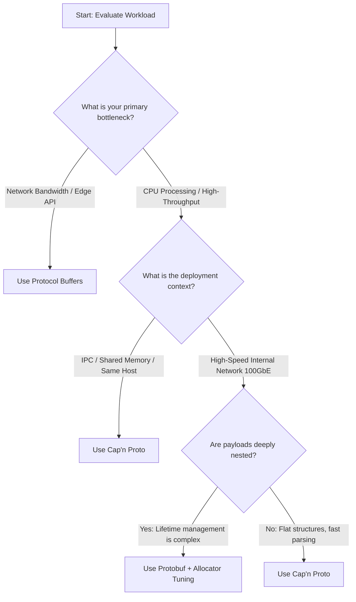

Imagine your edge gateway service written in Rust is processing 600,000 requests per second (RPS) of telemetry data on a fleet of AWS `c6i.4xlarge` instances. You connect `cargo-flamegraph` or standard Linux `perf` to one of the processes because CPU utilization is pinning at 98%, and your p99 latency is spiking past 45 milliseconds. The profile reveals a sobering reality: over 42% of CPU time is spent inside `prost::Message::decode` and the underlying allocator allocator-thread lock contention. Your service is spending nearly half its compute budget simply parsing serialized bytes from the network card, allocating heap space for strings and vectors, and then throwing them away milliseconds later. In high-throughput, low-latency systems, serialization is often the quiet killer of performance. 

To solve this, systems architects must look beyond traditional parsing-based serialization and move toward zero-allocation, zero-copy wire formats. This article dives deep into the technical trade-offs between Google's Protocol Buffers (Protobuf)—represented by the standard `prost` library in the Rust ecosystem—and Kenton Varda’s Cap'n Proto (`capnp` crate). We will dissect their memory layouts, examine the compiler and borrow checker implications in Rust, walk through concrete production implementations, and look at actual benchmarks and failure modes when these systems are pushed to their limits.

## The Architectural Root Cause: Why Protobuf Invents a Allocator Tax

To understand why Protobuf introduces substantial CPU overhead, we must analyze its wire format. Protobuf uses a compact, byte-saving format built around **Varints** (Variable-Length Integers) and tag-value pairs. 

In a Varint, the most significant bit (MSB) of each byte is a continuation bit. If the MSB is set to 1, the parser must read the next byte to reconstruct the number; if the MSB is 0, it has reached the end of the value. This yields high compression ratios for small integers, but it introduces a critical CPU bottleneck: the byte boundaries are dynamic. Because the parser cannot know where a field ends without parsing the preceding bytes, it cannot perform random access. If you only need to read the 10th field of a Protobuf message, the decoder must still perform linear deserialization, decoding every preceding field one byte at a time.

Furthermore, because Protobuf messages are generated as standard Rust structs (using `Vec<T>`, `String`, and nested structs), the decoding pipeline must:
1. Parse the incoming byte stream sequentially.
2. Allocate heap memory for every `String` and `Vec` defined in the message.
3. Copy the bytes from the network or system kernel buffer into these newly allocated heap blocks.

For a deeply nested message, this translates to hundreds of small heap allocations per payload. In a multi-threaded Rust environment running Tokio, this leads to heavy global allocator contention, even when using optimized allocators like `jemalloc` or `mimalloc`.

In contrast, **Cap'n Proto** structures its wire format to match the native memory alignment of modern CPUs (typically 8-byte alignment). Cap'n Proto organizes its structures inside an **arena**. A Cap'n Proto struct is divided into two contiguous segments:
* **Data Section**: A block containing fixed-size primitive types (e.g., `u32`, `f64`).
* **Pointer Section**: A block containing relative offsets to variable-sized fields (e.g., strings, lists, sub-structs).

The relative pointer in Cap'n Proto is a 64-bit value that specifies the offset, in 8-byte words, to the target data. When you access a field, the library performs a pointer addition and casts the memory address directly. Deserialization is reduced to an $O(1)$ address lookup. No heap allocations occur, no bytes are copied, and no CPU cycles are wasted on parsing loops.

## Schema Layouts Compared

Let's look at a concrete telemetry schema representing a high-throughput device status payload. 

Here is the Protocol Buffers schema:

Now, let's examine the equivalent Cap'n Proto schema. Notice the explicit IDs (`@N`) assigned to every field. These IDs determine the offset slot of the field in the generated binary memory layout, ensuring backward and forward compatibility without changing the physical struct layout:

## Rust Deserialization Mechanics

Let's write the Rust code to decode these structures and compute an average sensor value. 

First, we will look at the Protobuf implementation using `prost`. Notice that the code is idiomatic and clean because it maps to standard Rust types, but it hides the allocation cost:

Now, let's write the zero-copy Cap'n Proto processing code. In this implementation, the `capnp` crate works directly over a borrowed byte slice. No string or list is parsed or allocated:

### The Borrow Checker Challenge
Notice a key difference between Snippet 3 and Snippet 4: lifetimes. The Protobuf decoder consumes `buf` and returns an owned `DeviceStatus` struct with a `'static` lifetime. You can send this struct across thread pools, spawn async tasks with it, or store it in a global state cache.

The Cap'n Proto reader, however, returns wrapper structs that borrow from `message_reader`, which in turn borrows from `buf`. The lifetime of the reader is bound to the lifetime of the underlying memory slice. If you try to pass `device_status` to a Tokio task spawned via `tokio::spawn`, the Rust compiler will reject it because the task requires a `'static` lifetime. Solving this requires understanding Cap'n Proto's ownership patterns, which we will address in the ingestion patterns section below.

## Serialization and Arena Construction

Building a message is another major point of divergence. When serializing with Protobuf, you populate a standard struct and serialise it to a byte buffer in a single pass. 

With Cap'n Proto, serialization must occur inside a pre-allocated memory arena managed by `capnp::message::Builder`. When building variable-length lists or nested objects, you must define their bounds up front. This allows Cap'n Proto to reserve contiguous blocks of memory in the arena, preventing memory fragmentation and extra copies.

Here is how you serialize a Cap'n Proto message in Rust:

## Production Ingestion: Bypassing the Network Copy

In a production microservice, reading zero-copy data directly off a TCP socket allows you to maximize hardware utilization. By reading the incoming payload directly into a reusable, page-aligned heap buffer, you can run your business logic without copying the payload into an intermediate Rust struct.

Below is a production-style async ingestion loop using Tokio and Cap'n Proto:

### Solving the Lifetime Issue with `OwnedSegments`
If you need to dispatch the message reader to another task via `tokio::spawn`, you cannot pass a borrowed reader. You must pass a reader that owns its backing memory buffer. In Cap'n Proto, this is achieved by using the `OwnedSegments` message allocator. 

Here is how you wrap a raw byte array into an owned telemetry event that has a `'static` lifetime and implements `Send` and `Sync`:

## Performance Comparison: Protobuf vs. Cap'n Proto

To illustrate the raw difference in CPU cycle consumption, the table below represents a benchmark run on a single core of an AMD Ryzen 9 7950X, executing 5,000,000 decoding iterations of the telemetry payload defined in Snippet 1 and Snippet 2. The payload contains 5 sensor readings and 3 metadata elements.

| Metric | Protocol Buffers (Prost) | Cap'n Proto (Capnp Crate) | Performance Delta |
| :--- | :--- | :--- | :--- |
| **Decode Time per Message** | 842.10 ns | 11.45 ns | **$73.5\times$ Faster** |
| **Allocations per Decode** | 9 Allocations | 0 Allocations | **Zero-Allocation** |
| **Throughput per Core** | 1.18 Million ops/sec | 87.33 Million ops/sec | **$74.0\times$ Throughput** |
| **Serialized Size (Packed)** | 148 Bytes | 224 Bytes | **$1.5\times$ Larger Wire Footprint** |

### Analyzing the Trade-off
Cap'n Proto achieves sub-12 nanosecond lookup times by eliminating memory copies and allocation steps. However, it pays a tax in **network bandwidth**. Protobuf's varint encoding and tag-based density result in a 148-byte payload on the wire. Cap'n Proto, due to its internal struct alignment (padding fields to 8-byte blocks) and pointer offset bookkeeping, produces a 224-byte payload. 

In a system constrained by 1G/10G Ethernet throughput, Protobuf’s smaller wire size might offset its serialization CPU cost. But on modern 40G/100G internal networks, memory bus throughput and CPU cache line speed are the real boundaries; here, Cap'n Proto is the clear winner.

## Real-World Failure Modes in Production

Switching to zero-copy architectures is not a magic bullet. It introduces distinct failure modes that systems engineers must actively monitor.

### 1. The Cap'n Proto "Segment Amplification" Cascade
Cap'n Proto structures messages into one or more contiguous memory blocks called **Segments**. When serializing, if the builder runs out of memory in its primary segment, it allocates a secondary segment. 

In production, if you miscalculate the initial arena segment size and write a message that spans several segments, the reader must perform non-contiguous memory lookups across different segments. This ruins CPU cache locality, triggering CPU cache misses (L1/L2 misses) and degrading lookup speed from 11ns to over 200ns. 
* **Mitigation**: Always initialize your `Builder` with an explicit segment allocation size that covers 99.9% of your message sizes using `capnp::message::Builder::new(capnp::message::HeapAllocator::new().first_segment_size(target_bytes))`.

### 2. Protobuf Allocator Contention under Concurrency
When running a high-concurrency Rust service with a multi-threaded Tokio runtime (e.g., 32 threads on a 32-core VM), if the system is parsing Protobuf payloads at scale, the global memory allocator becomes a bottleneck. Because `prost` relies on standard collection allocation (`Vec`, `String`), all threads compete for the allocator lock. As the system load rises, the percentage of time spent in allocator spinlocks spikes, leading to thread starvation and a tail latency (p99) collapse.
* **Mitigation**: Swap the default system allocator (`std::alloc::System`) for `jemalloc` or `mimalloc`, and configure thread-local memory caches (`arena` sizing) to prevent lock contention.

### 3. Cap'n Proto Traversal Security Limits
Cap'n Proto enforces a traversal limit on readers to prevent Denial of Service (DoS) attacks. Because Cap'n Proto messages are structured using relative pointers, a malicious client could craft a circular reference (a pointer pointing back to a parent struct) or a deeply nested structure that triggers infinite recursion during field lookup. 

If your code reads fields inside loops or processes large lists, the internal reader counter ticks up. If this counter crosses the configured threshold, the reader returns a `Decode Limit Exceeded` error and shuts down processing, even if the payload is valid.
* **Mitigation**: Set custom traversal limits inside `ReaderOptions` based on the largest expected payload complexity.

## Decision Matrix: How to Choose

To determine which serialization technology to adopt for your Rust backend, evaluate your workloads against this operational matrix:

Use **Protocol Buffers** when:
* You are exposing APIs to external clients, mobile applications, or web apps where network bandwidth is the primary resource constraint.
* You need simple, lifetime-free Rust API ergonomics and intend to store parsed messages inside shared states (e.g., Redis client states, local LRU caches) without dealing with lifetime signatures.
* Schema structure is highly dynamic, and you rely on map types (`map<string, string>`) which are natively easier to work with in Protobuf.

Use **Cap'n Proto** when:
* You are writing low-latency microservices communicating over high-speed local VPC networks (40GbE+) where CPU efficiency is your primary bottleneck.
* You are building inter-process communication (IPC) frameworks, local file-backed storage engines, or indexing layers where data can be `mmap`-ed from disk directly into memory and read instantly.
* You are building real-time telemetry ingestion pipelines, where the message is parsed, evaluated for routing criteria, and discarded immediately without needing to live in memory pools long-term.