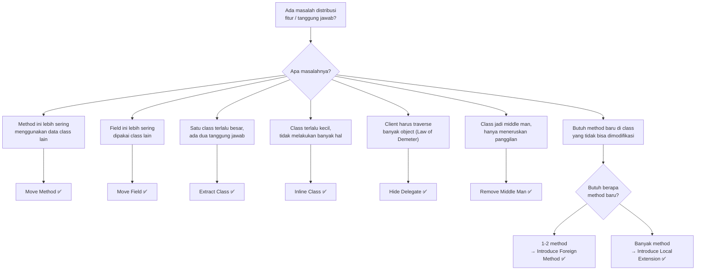

Pernahkah kamu melihat sebuah `struct` yang seperti gurita — tangannya mencengkeram ke mana-mana? Atau sebuah method yang lebih banyak membicarakan data dari `struct` lain daripada miliknya sendiri? Atau justru sebaliknya: sebuah `struct` kecil mungil yang tugasnya hanya meneruskan panggilan ke `struct` lain?

Ini adalah masalah **distribusi tanggung jawab** — fitur berada di tempat yang salah. Salah satu kelompok teknik refactoring yang paling berdampak justru berfokus pada hal ini: **memindahkan fitur ke tempat yang paling tepat**. Kode yang tanggung jawabnya terdistribusi dengan baik jauh lebih mudah dipahami, diuji, dan dikembangkan.

Di artikel ini kita akan menjelajahi 8 teknik dari katalog refactoring Martin Fowler yang semuanya bertemakan "gerakan" — memindahkan method, field, atau bahkan seluruh class ke rumah yang lebih tepat.

---

## 🎯 Takeaway

Setelah membaca artikel ini, kamu akan memahami:

- ✅ **Move Method** — cara memindahkan method ke class yang paling sering memakainya
- ✅ **Move Field** — cara memindahkan field ke class yang paling tepat
- ✅ **Extract Class** — cara memecah class yang terlalu besar menjadi dua class yang fokus
- ✅ **Inline Class** — cara melebur class yang terlalu kecil ke dalam class lain
- ✅ **Hide Delegate** — cara menyembunyikan detail delegasi dari client
- ✅ **Remove Middle Man** — cara menghapus perantara yang tidak berguna
- ✅ **Introduce Foreign Method** — cara menambah method ke class yang tidak bisa dimodifikasi
- ✅ **Introduce Local Extension** — cara memperluas library class via subclass atau wrapper

---

## Peta Teknik: Di Mana Fitur Harus Tinggal?

```mermaid
classDiagram
    direction TB

    class TeknikRefactoring {
        <<interface>>
        Tujuan: Distribusi Tanggung Jawab
    }

    class MoveMethod {
        Method di tempat salah
        → Pindah ke class yang paling memakainya
    }

    class MoveField {
        Field di tempat salah
        → Pindah ke class yang paling memakainya
    }

    class ExtractClass {
        Satu class, dua tanggung jawab
        → Pecah menjadi dua class
    }

    class InlineClass {
        Class terlalu kecil
        → Lebur ke dalam class lain
    }

    class HideDelegate {
        Client tahu terlalu banyak
        → Sembunyikan lewat delegating method
    }

    class RemoveMiddleMan {
        Terlalu banyak delegating
        → Client langsung akses delegate
    }

    class IntroduceForeignMethod {
        Server class tidak bisa dimodifikasi
        → Tambah method di client class
    }

    class IntroduceLocalExtension {
        Butuh banyak foreign methods
        → Buat subclass atau wrapper
    }

    TeknikRefactoring <|-- MoveMethod
    TeknikRefactoring <|-- MoveField
    TeknikRefactoring <|-- ExtractClass
    TeknikRefactoring <|-- InlineClass
    TeknikRefactoring <|-- HideDelegate
    TeknikRefactoring <|-- RemoveMiddleMan
    TeknikRefactoring <|-- IntroduceForeignMethod
    TeknikRefactoring <|-- IntroduceLocalExtension
```



---

## 1. Move Method — Pindahkan Method ke Rumah yang Tepat

### Kapan Digunakan?

Gunakan **Move Method** ketika sebuah method lebih banyak menggunakan data dari class lain daripada class tempat ia tinggal. Ini adalah gejala *Feature Envy* — method "iri" pada data milik tetangganya.

### Contoh Bad Code (❌)

```go
// ❌ BAD: Method CalculateDiscount() ada di Order,
// tapi hampir semua logikanya menggunakan data dari Customer.
// Ini adalah Feature Envy yang klasik.

type Customer struct {
    Name           string
    IsPremium      bool
    TotalPurchases float64
    JoinYear       int
}

type Order struct {
    ID       string
    Amount   float64
    Customer Customer
}

// Method ini tinggal di Order, tapi sepenuhnya bergantung pada Customer
func (o Order) CalculateDiscount() float64 {
    discount := 0.0

    // Semua kondisi ini mengakses o.Customer, bukan data Order sendiri
    if o.Customer.IsPremium {
        discount += 0.10
    }
    if o.Customer.TotalPurchases > 10_000_000 {
        discount += 0.05
    }
    if time.Now().Year()-o.Customer.JoinYear >= 3 {
        discount += 0.03
    }

    return discount
}
```

**Masalah:** `CalculateDiscount` tidak tahu apa-apa tentang `Order`. Semua keputusannya dibuat berdasarkan data `Customer`. Kalau ada perubahan logika diskon, kita harus membuka file `Order` padahal yang berubah adalah aturan untuk `Customer`.

### Perbaikan (✅)

```go
// ✅ GOOD: CalculateDiscount() dipindah ke Customer.
// Kini method tinggal berdampingan dengan data yang digunakannya.

type Customer struct {
    Name           string
    IsPremium      bool
    TotalPurchases float64
    JoinYear       int
}

// Method kini milik Customer — ia menggunakan datanya sendiri
func (c Customer) CalculateDiscount() float64 {
    discount := 0.0

    if c.IsPremium {
        discount += 0.10
    }
    if c.TotalPurchases > 10_000_000 {
        discount += 0.05
    }
    if time.Now().Year()-c.JoinYear >= 3 {
        discount += 0.03
    }

    return discount
}

type Order struct {
    ID       string
    Amount   float64
    Customer Customer
}

// Order tinggal mendelegasikan ke Customer
func (o Order) FinalAmount() float64 {
    discount := o.Customer.CalculateDiscount()
    return o.Amount * (1 - discount)
}
```

---

## 2. Move Field — Pindahkan Field ke Class yang Tepat

### Kapan Digunakan?

Gunakan **Move Field** ketika sebuah field lebih sering digunakan oleh class lain daripada class tempat ia dideklarasikan.

### Contoh Bad Code (❌)

```go
// ❌ BAD: Field InterestRate ada di Account,
// padahal ia sepenuhnya dikendalikan oleh AccountType.

type AccountType struct {
    Name string
}

type Account struct {
    Owner        string
    Balance      float64
    AccountType  AccountType
    InterestRate float64 // ← field ini seharusnya milik AccountType
}

// Setiap akun jenis "Premium" punya interest rate yang sama.
// Tapi kita harus set ulang di setiap instance Account — rawan inkonsistensi!
func NewPremiumAccount(owner string, balance float64) Account {
    return Account{
        Owner:        owner,
        Balance:      balance,
        AccountType:  AccountType{Name: "Premium"},
        InterestRate: 0.08, // magic number yang berulang di mana-mana
    }
}
```

### Perbaikan (✅)

```go
// ✅ GOOD: InterestRate dipindah ke AccountType.
// Sekarang satu jenis akun = satu interest rate, konsisten dan mudah diubah.

type AccountType struct {
    Name         string
    InterestRate float64 // field berpindah ke sini
}

// Interest rate kini terpusat di definisi AccountType
var (
    PremiumAccount  = AccountType{Name: "Premium", InterestRate: 0.08}
    StandardAccount = AccountType{Name: "Standard", InterestRate: 0.05}
    SavingsAccount  = AccountType{Name: "Savings", InterestRate: 0.06}
)

type Account struct {
    Owner       string
    Balance     float64
    AccountType AccountType
}

func (a Account) YearlyInterest() float64 {
    return a.Balance * a.AccountType.InterestRate
}

// Penggunaan: bersih, tidak ada magic number
func NewAccount(owner string, balance float64, accType AccountType) Account {
    return Account{
        Owner:       owner,
        Balance:     balance,
        AccountType: accType,
    }
}
```

---

## 3. Extract Class — Pecah Class yang Terlalu Besar

### Kapan Digunakan?

Gunakan **Extract Class** ketika satu struct melakukan dua pekerjaan yang berbeda. Tanda-tandanya: ada sekelompok field dan method yang selalu "bergerak bersama" dan tidak terlalu bergantung pada anggota struct lainnya.

### Contoh Bad Code (❌)

```go
// ❌ BAD: Struct Employee menyimpan data karyawan DAN
// semua logika telepon/kontak. Dua tanggung jawab dalam satu struct.

type Employee struct {
    // Data karyawan
    ID         string
    Name       string
    Department string
    Salary     float64

    // Data kontak — kelompok data yang berbeda!
    OfficePhone  string
    MobilePhone  string
    PhoneAreaCode string
}

// Method yang sebenarnya urusan kontak, bukan karyawan
func (e Employee) GetFullOfficePhone() string {
    return fmt.Sprintf("(%s) %s", e.PhoneAreaCode, e.OfficePhone)
}

func (e Employee) GetFullMobilePhone() string {
    return fmt.Sprintf("(%s) %s", e.PhoneAreaCode, e.MobilePhone)
}

func (e Employee) HasValidPhone() bool {
    return e.OfficePhone != "" || e.MobilePhone != ""
}
```

### Perbaikan (✅)

```go
// ✅ GOOD: Extract Class — pisahkan TelephoneNumber menjadi struct sendiri.
// Setiap struct kini punya satu tanggung jawab yang jelas.

// Class baru: bertanggung jawab penuh atas nomor telepon
type TelephoneNumber struct {
    AreaCode string
    Number   string
}

func (t TelephoneNumber) String() string {
    if t.AreaCode == "" {
        return t.Number
    }
    return fmt.Sprintf("(%s) %s", t.AreaCode, t.Number)
}

func (t TelephoneNumber) IsValid() bool {
    return t.Number != ""
}

// Employee kini hanya fokus pada data karyawan
type Employee struct {
    ID           string
    Name         string
    Department   string
    Salary       float64
    OfficePhone  TelephoneNumber
    MobilePhone  TelephoneNumber
}

func (e Employee) HasValidPhone() bool {
    return e.OfficePhone.IsValid() || e.MobilePhone.IsValid()
}

// Penggunaan:
func ExampleUsage() {
    emp := Employee{
        ID:         "EMP-001",
        Name:       "Budi Santoso",
        Department: "Engineering",
        Salary:     15_000_000,
        OfficePhone: TelephoneNumber{AreaCode: "021", Number: "555-1234"},
        MobilePhone: TelephoneNumber{AreaCode: "08", Number: "812-9999"},
    }

    fmt.Println(emp.OfficePhone.String()) // (021) 555-1234
    fmt.Println(emp.MobilePhone.String()) // (08) 812-9999
}
```

---

## 4. Inline Class — Lebur Class yang Terlalu Kecil

### Kapan Digunakan?

Gunakan **Inline Class** ketika sebuah class sudah tidak melakukan cukup banyak hal untuk membenarkan keberadaannya — biasanya hasil dari refactoring sebelumnya yang terlalu agresif.

### Contoh Bad Code (❌)

```go
// ❌ BAD: ShippingDetails terlalu kecil dan hanya menyimpan satu string.
// Keberadaannya menambah kompleksitas tanpa nilai tambah.

type ShippingDetails struct {
    TrackingNumber string
}

func (s ShippingDetails) IsTracked() bool {
    return s.TrackingNumber != ""
}

type Order struct {
    ID              string
    Amount          float64
    ShippingDetails ShippingDetails // ← terlalu kecil untuk jadi struct sendiri
}

// Penggunaan terasa bertele-tele
func CheckTracking(o Order) {
    if o.ShippingDetails.IsTracked() {
        fmt.Printf("Order %s: %s\n", o.ID, o.ShippingDetails.TrackingNumber)
    }
}
```

### Perbaikan (✅)

```go
// ✅ GOOD: Inline Class — pindahkan field dan method ShippingDetails
// langsung ke dalam Order. Lebih sederhana dan langsung.

type Order struct {
    ID             string
    Amount         float64
    TrackingNumber string // field langsung di sini
}

func (o Order) IsTracked() bool {
    return o.TrackingNumber != ""
}

// Penggunaan jauh lebih bersih
func CheckTracking(o Order) {
    if o.IsTracked() {
        fmt.Printf("Order %s: %s\n", o.ID, o.TrackingNumber)
    }
}
```

---

## 5. Hide Delegate — Sembunyikan Detail Delegasi

### Kapan Digunakan?

Gunakan **Hide Delegate** ketika client harus melewati serangkaian objek untuk sampai ke method yang diinginkan. Ini melanggar **Law of Demeter**: *"Bicara hanya dengan teman terdekatmu."*

### Contoh Bad Code (❌)

```go
// ❌ BAD: Client (main) harus tahu tentang Department untuk mendapatkan Manager.
// Perubahan pada struktur Department akan memaksa perubahan di semua client.

type Manager struct {
    Name  string
    Email string
}

type Department struct {
    Name    string
    Manager Manager
}

type Person struct {
    Name       string
    Department Department
}

// Client terpaksa "menembus" terlalu dalam
func PrintManagerInfo(p Person) {
    // Violation of Law of Demeter: p.Department.Manager
    manager := p.Department.Manager
    fmt.Printf("Manager of %s: %s <%s>\n", p.Name, manager.Name, manager.Email)
}
```

**Masalah:** `PrintManagerInfo` bergantung pada detail internal `Person` (bahwa `Person` punya `Department`, dan `Department` punya `Manager`). Kalau struktur berubah, semua client harus diupdate.

### Perbaikan (✅)

```go
// ✅ GOOD: Hide Delegate — Person menyediakan delegating method GetManager().
// Client tidak perlu tahu tentang Department sama sekali.

type Manager struct {
    Name  string
    Email string
}

type Department struct {
    Name    string
    Manager Manager
}

type Person struct {
    Name       string
    department Department // lowercase: sembunyikan dari luar package
}

// Delegating method: Person menyembunyikan detail internal Department
func (p Person) GetManager() Manager {
    return p.department.Manager
}

func (p Person) GetDepartmentName() string {
    return p.department.Name
}

// Client kini hanya bergantung pada Person — lebih sederhana!
func PrintManagerInfo(p Person) {
    manager := p.GetManager() // cukup satu panggilan
    fmt.Printf("Manager of %s: %s <%s>\n", p.Name, manager.Name, manager.Email)
}
```

---

## 6. Remove Middle Man — Hapus Perantara Berlebihan

### Kapan Digunakan?

**Remove Middle Man** adalah kebalikan dari Hide Delegate. Gunakan ketika sebuah class sudah terlalu banyak delegating method yang hanya meneruskan panggilan — class itu hanya jadi "pos surat" yang tidak menambah nilai.

### Contoh Bad Code (❌)

```go
// ❌ BAD: Person punya terlalu banyak delegating methods ke Department.
// Person sudah jadi "middle man" murni tanpa logika sendiri.

type Department struct {
    Name    string
    Manager string
    Budget  float64
    Floor   int
}

type Person struct {
    Name       string
    department Department
}

// Person hanya meneruskan panggilan, tanpa logika apapun
func (p Person) GetDepartmentName() string { return p.department.Name }
func (p Person) GetManager() string        { return p.department.Manager }
func (p Person) GetBudget() float64        { return p.department.Budget }
func (p Person) GetFloor() int             { return p.department.Floor }

// Hasilnya: API Person sangat membengkak
func PrintInfo(p Person) {
    fmt.Printf("%s | Dept: %s | Manager: %s | Budget: %.0f | Floor: %d\n",
        p.Name,
        p.GetDepartmentName(),
        p.GetManager(),
        p.GetBudget(),
        p.GetFloor(),
    )
}
```

### Perbaikan (✅)

```go
// ✅ GOOD: Remove Middle Man — ekspos Department langsung.
// Client yang butuh detail Department bisa akses langsung, tanpa perantara.

type Department struct {
    Name    string
    Manager string
    Budget  float64
    Floor   int
}

type Person struct {
    Name       string
    Department Department // Sekarang public — client bisa akses langsung
}

// Tidak ada lagi delegating methods yang tidak perlu
func PrintInfo(p Person) {
    fmt.Printf("%s | Dept: %s | Manager: %s | Budget: %.0f | Floor: %d\n",
        p.Name,
        p.Department.Name,    // akses langsung
        p.Department.Manager, // akses langsung
        p.Department.Budget,
        p.Department.Floor,
    )
}
```

> **💡 Catatan:** Hide Delegate vs Remove Middle Man adalah sebuah **spectrum**. Pilih Hide Delegate ketika enkapsulasi penting (Department sering berubah). Pilih Remove Middle Man ketika delegating methods sudah terlalu banyak dan tidak menambah nilai.

---

## 7. Introduce Foreign Method — Tambah Method di Client

### Kapan Digunakan?

Gunakan **Introduce Foreign Method** ketika kamu butuh method tambahan pada sebuah class (misalnya dari library standar atau external package), tapi **tidak bisa memodifikasi class tersebut**. Solusinya: tambahkan method di sisi client, dengan instance class itu sebagai parameter pertama.

### Contoh Bad Code (❌)

```go
// ❌ BAD: Logika "awal bulan berikutnya" berulang di banyak tempat,
// tapi kita tidak bisa menambahkan method ke time.Time (package standar).
// Akhirnya logika ini tersebar tanpa nama yang jelas.

func GenerateMonthlyReport(from time.Time) {
    // Logika berulang tanpa nama — "apa ini?"
    nextMonth := time.Date(
        from.Year(), from.Month()+1, 1,
        0, 0, 0, 0, from.Location(),
    )
    fmt.Printf("Report period: %s to %s\n", from.Format("2006-01-02"), nextMonth.Format("2006-01-02"))
}

func ScheduleMonthlyJob(startDate time.Time) {
    // Logika yang sama muncul lagi, tidak ada abstraksi
    nextRun := time.Date(
        startDate.Year(), startDate.Month()+1, 1,
        0, 0, 0, 0, startDate.Location(),
    )
    fmt.Printf("Next run: %s\n", nextRun.Format("2006-01-02"))
}
```

### Perbaikan (✅)

```go
// ✅ GOOD: Introduce Foreign Method.
// Buat fungsi helper di sisi client dengan time.Time sebagai parameter pertama.
// Konvensi: parameter pertama adalah "server" yang sedang kita extend.

// Foreign method: parameter pertama adalah `t time.Time` (si "server")
func nextMonthStart(t time.Time) time.Time {
    return time.Date(t.Year(), t.Month()+1, 1, 0, 0, 0, 0, t.Location())
}

func firstDayOfMonth(t time.Time) time.Time {
    return time.Date(t.Year(), t.Month(), 1, 0, 0, 0, 0, t.Location())
}

func lastDayOfMonth(t time.Time) time.Time {
    return nextMonthStart(t).AddDate(0, 0, -1)
}

// Penggunaan: bersih, ekspresif, tidak ada duplikasi
func GenerateMonthlyReport(from time.Time) {
    to := nextMonthStart(from)
    fmt.Printf("Report period: %s to %s\n",
        from.Format("2006-01-02"),
        to.Format("2006-01-02"),
    )
}

func ScheduleMonthlyJob(startDate time.Time) {
    nextRun := nextMonthStart(startDate)
    fmt.Printf("Next run: %s\n", nextRun.Format("2006-01-02"))
}
```

---

## 8. Introduce Local Extension — Extend Library dengan Subclass atau Wrapper

### Kapan Digunakan?

Gunakan **Introduce Local Extension** ketika kamu butuh **banyak** foreign methods untuk sebuah class yang tidak bisa dimodifikasi. Daripada kumpulan fungsi helper yang berserak, buat satu **wrapper struct** yang mengemas semua ekstensi itu secara rapi.

### Contoh Bad Code (❌)

```go
// ❌ BAD: Kumpulan fungsi helper untuk time.Time tersebar di berbagai file.
// Tidak ada kohesi, tidak mudah ditemukan, tidak reusable.

// Di file report.go:
func nextMonth(t time.Time) time.Time { /* ... */ }
func formatDate(t time.Time) string   { /* ... */ }

// Di file scheduler.go (duplikasi!):
func getNextMonth(t time.Time) time.Time { /* hampir sama */ }

// Di file billing.go:
func monthStart(t time.Time) time.Time { /* ... */ }
func monthEnd(t time.Time) time.Time   { /* ... */ }

// Tidak konsisten, berulang, dan tersebar
```

### Perbaikan (✅)

```go
// ✅ GOOD: Introduce Local Extension via Wrapper.
// Buat struct RichTime yang membungkus time.Time dan menambah semua fungsionalitas.

// RichTime adalah local extension dari time.Time
type RichTime struct {
    time.Time // embed time.Time — semua method asli tetap tersedia
}

// Semua "foreign methods" kini terkumpul rapi dalam satu struct

func (rt RichTime) StartOfMonth() RichTime {
    t := time.Date(rt.Year(), rt.Month(), 1, 0, 0, 0, 0, rt.Location())
    return RichTime{t}
}

func (rt RichTime) EndOfMonth() RichTime {
    t := rt.StartOfMonth().AddDate(0, 1, -1)
    return RichTime{t}
}

func (rt RichTime) NextMonthStart() RichTime {
    t := time.Date(rt.Year(), rt.Month()+1, 1, 0, 0, 0, 0, rt.Location())
    return RichTime{t}
}

func (rt RichTime) IsWeekend() bool {
    day := rt.Weekday()
    return day == time.Saturday || day == time.Sunday
}

func (rt RichTime) IsBusinessDay() bool {
    return !rt.IsWeekend()
}

func (rt RichTime) FormatID() string {
    // Format tanggal gaya Indonesia: "19 Juni 2026"
    months := []string{
        "", "Januari", "Februari", "Maret", "April", "Mei", "Juni",
        "Juli", "Agustus", "September", "Oktober", "November", "Desember",
    }
    return fmt.Sprintf("%d %s %d", rt.Day(), months[rt.Month()], rt.Year())
}

func (rt RichTime) AddBusinessDays(days int) RichTime {
    current := rt
    added := 0
    for added < days {
        current = RichTime{current.AddDate(0, 0, 1)}
        if current.IsBusinessDay() {
            added++
        }
    }
    return current
}

// Penggunaan: elegan, konsisten, mudah ditemukan
func GenerateMonthlyReport(from RichTime) {
    start := from.StartOfMonth()
    end := from.EndOfMonth()
    next := from.NextMonthStart()

    fmt.Printf("Laporan Bulan: %s — %s\n", start.FormatID(), end.FormatID())
    fmt.Printf("Periode berikutnya mulai: %s\n", next.FormatID())
}

func CalculatePaymentDueDate(invoiceDate RichTime) RichTime {
    // Jatuh tempo 14 hari kerja setelah tanggal invoice
    return invoiceDate.AddBusinessDays(14)
}

// Contoh penggunaan lengkap:
func ExampleRichTime() {
    today := RichTime{time.Date(2026, 6, 19, 0, 0, 0, 0, time.Local)}

    fmt.Println(today.FormatID())              // "19 Juni 2026"
    fmt.Println(today.StartOfMonth().FormatID()) // "1 Juni 2026"
    fmt.Println(today.EndOfMonth().FormatID())   // "30 Juni 2026"
    fmt.Println(today.IsWeekend())              // false (Jumat)

    dueDate := CalculatePaymentDueDate(today)
    fmt.Println(dueDate.FormatID())            // "9 Juli 2026"
}
```

---

## Panduan Pemilihan Teknik

Bingung harus pakai teknik yang mana? Ikuti flowchart ini:



---

## Rangkuman Perbandingan

| Teknik | Masalah | Solusi | Sinyal |
|---|---|---|---|
| **Move Method** | Feature Envy | Pindah method ke class yang datanya dipakai | Method mengakses data class lain lebih banyak |
| **Move Field** | Field di tempat salah | Pindah field ke class yang memakainya | Field lebih banyak diakses class lain |
| **Extract Class** | God Class / class terlalu besar | Pisah menjadi dua class yang fokus | Ada dua kelompok field/method yang tidak saling bergantung |
| **Inline Class** | Class terlalu kecil / tidak berguna | Lebur ke class lain | Class hampir tidak punya perilaku sendiri |
| **Hide Delegate** | Violation of Law of Demeter | Buat delegating method | `a.b.c.DoSomething()` — terlalu dalam |
| **Remove Middle Man** | Class jadi "pos surat" | Ekspos delegate langsung | Hampir semua method hanya meneruskan panggilan |
| **Introduce Foreign Method** | Library tidak bisa dimodifikasi | Tambah fungsi helper di client | 1-2 method yang dibutuhkan dari class eksternal |
| **Introduce Local Extension** | Library tidak bisa dimodifikasi | Buat wrapper/subclass | Banyak method yang dibutuhkan dari class eksternal |

---

## 📝 Ringkasan

Teknik-teknik "Moving Features" berfokus pada satu prinsip sederhana namun sangat kuat: **setiap fitur harus tinggal di tempat yang paling masuk akal secara konseptual**.

Berikut poin-poin kunci yang perlu diingat:

- 🏠 **Move Method & Move Field** — ikuti data. Method dan field harus tinggal di dekat data yang mereka gunakan. Ini adalah solusi langsung untuk *Feature Envy*.

- ✂️ **Extract Class** — ketika sebuah struct punya dua "kepribadian", pisahkan. Satu struct, satu tanggung jawab.

- 🗜️ **Inline Class** — jangan takut melebur class yang sudah tidak berguna. Kompleksitas yang tidak perlu adalah musuh keterbacaan.

- 🫣 **Hide Delegate** — jangan biarkan client tahu terlalu banyak tentang struktur internal. Lindungi mereka dari perubahan di masa depan.

- 🚫 **Remove Middle Man** — kalau sudah terlalu banyak delegating tanpa nilai tambah, hapus perantaranya. Biarkan client berbicara langsung.

- 🔌 **Introduce Foreign Method** — ketika tidak bisa modifikasi library, tambahkan helper di sisi client. Konvensi: parameter pertama adalah objek yang sedang di-extend.

- 🏗️ **Introduce Local Extension** — untuk kebutuhan ekstensi yang lebih besar, bungkus library dalam wrapper struct. Kumpulkan semua ekstensi di satu tempat yang rapi.

> **Ingat:** Refactoring bukan tujuan akhir. Tujuannya adalah kode yang **lebih mudah dipahami, lebih mudah diubah, dan lebih mudah ditest**. Selalu jalankan test setelah setiap langkah refactoring, dan lakukan perubahan secara bertahap.

---

🇮🇩 **Versi Indonesia** | [🇬🇧 **English Version**](/refactoring-part-7-moving-features)

← [Part 6: Simplifying Conditional Expressions](/refactoring-part-6-simplifying-conditionals-id) | [Part 8: Dealing with Generalization →](/refactoring-part-8-generalization-id)
