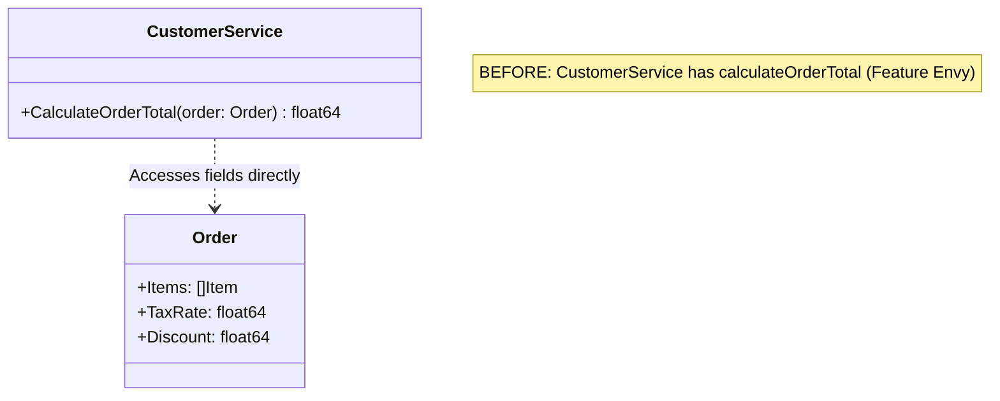
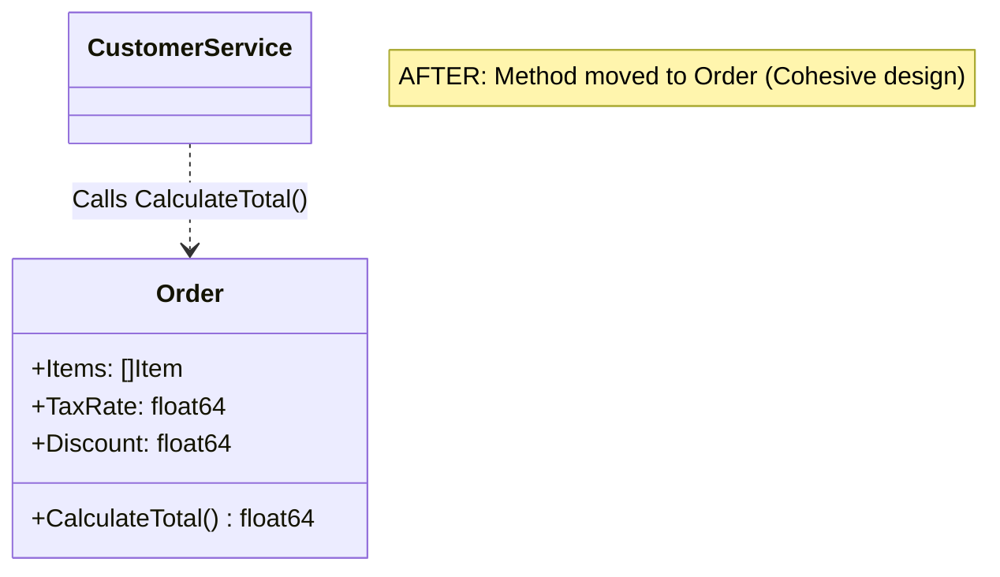
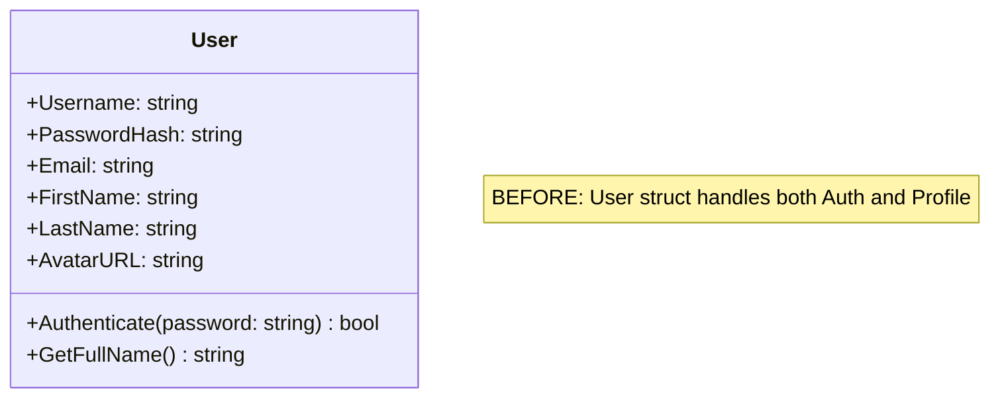
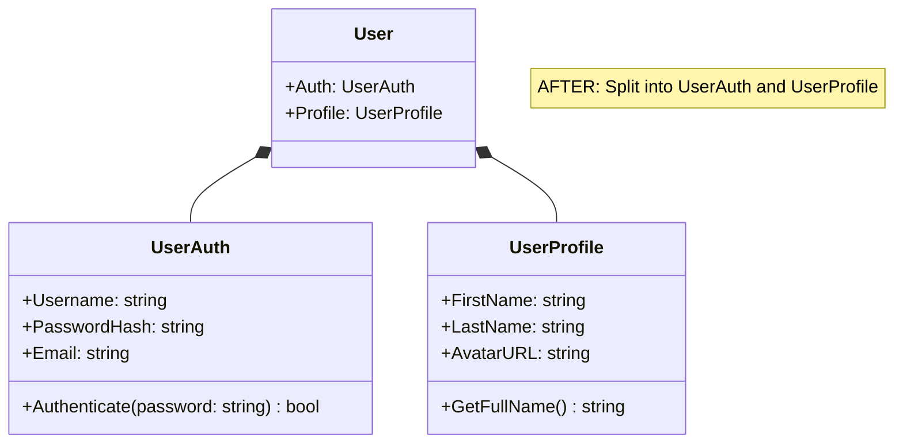
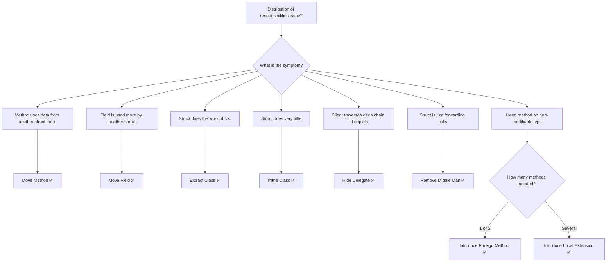

How many times have you opened a Go source file only to find a service struct that acts like an octopus, stretching its tentacles deep into the fields of other structs? Or perhaps you've encountered a method that spends more time querying and manipulating data from another struct than managing its own. Conversely, you might have seen a tiny struct that does almost nothing but delegate every single call to another one.

These issues are symptoms of poor responsibility distribution. In software engineering, designing clean systems is as much about *where* code lives as it is about *how* it is written. The **Moving Features between Objects** group of refactoring techniques focuses on relocating fields, methods, and classes to the places where they make the most sense, improving encapsulation and reducing coupling.

In this seventh installment of our Refactoring Series, we will explore these 8 core techniques from Martin Fowler's refactoring catalog, showing how to apply them to Go code to build a cleaner, more modular application.

---

## 🎯 Takeaway

After reading this article, you will understand:
- ✅ **Move Method** — How to move behavior closer to the data it uses to eliminate Feature Envy.
- ✅ **Move Field** — How to reposition fields to the struct that interacts with them most frequently.
- ✅ **Extract Class** — How to split bloated, multi-responsibility classes into smaller, highly cohesive units.
- ✅ **Inline Class** — How to merge underperforming, low-value helper classes back into their parent.
- ✅ **Hide Delegate** — How to enforce encapsulation and the Law of Demeter via delegating methods.
- ✅ **Remove Middle Man** — How to bypass excessive delegating wrappers when they no longer add value.
- ✅ **Introduce Foreign Method** & **Introduce Local Extension** — How to extend third-party or standard library types when you cannot modify them directly.

---

## 1. Move Method

### When to Use?
Use **Move Method** when a method is defined on a struct, but it accesses or is accessed by another struct more than its own. This is a classic symptom of **Feature Envy**—the method "envies" the data owned by another struct. Moving the method to the struct it uses most makes the system more cohesive and reduces coupling.

### Visualizing Move Method





### Bad Code Example (❌)

In the example below, `CustomerService` contains the `CalculateOrderTotal` method. However, all the calculation logic relies purely on the fields of the `Order` struct and its items. `CustomerService` is acting as a transaction script instead of a rich service.

```go
package main

type Item struct {
	Name  string
	Price float64
	Qty   int
}

type Order struct {
	Items    []Item
	TaxRate  float64
	Discount float64
}

type CustomerService struct {
	// ... potentially other dependencies
}

// ❌ BAD: CustomerService has Feature Envy.
// It calculates the total using data entirely owned by the Order struct.
func (cs *CustomerService) CalculateOrderTotal(order Order) float64 {
	total := 0.0
	for _, item := range order.Items {
		total += item.Price * float64(item.Qty)
	}
	total += total * order.TaxRate
	total -= order.Discount
	return total
}
```

### Fix (✅)

We move `CalculateOrderTotal` to the `Order` struct itself (renamed to `CalculateTotal` or simply `Total` to avoid redundancy). The `CustomerService` now simply calls this method.

```go
package main

import "fmt"

type Item struct {
	Name  string
	Price float64
	Qty   int
}

type Order struct {
	Items    []Item
	TaxRate  float64
	Discount float64
}

// ✅ GOOD: The method has been moved to Order, where the data lives.
// The Order struct now encapsulates its own business logic.
func (o Order) CalculateTotal() float64 {
	total := 0.0
	for _, item := range o.Items {
		total += item.Price * float64(item.Qty)
	}
	total += total * o.TaxRate
	total -= o.Discount
	return total
}

type CustomerService struct {
	// ...
}

func (cs *CustomerService) ProcessOrder(order Order) {
	total := order.CalculateTotal()
	fmt.Printf("Processing order with total: %.2f\n", total)
}
```

---

## 2. Move Field

### When to Use?
Use **Move Field** when a field in a struct is used more by another struct than the one it currently resides in. Keeping a field in the wrong struct forces clients to constantly traverse associations, leading to poor encapsulation and high risk of data inconsistency.

### Bad Code Example (❌)

Here, the `InterestRate` field resides in the `Account` struct. However, the interest rate is conceptually determined by the `AccountType`. Hardcoding it on every individual `Account` instance means we have to set it manually everywhere, risking mismatching rates for the same account types.

```go
type AccountType struct {
	Name string
}

type Account struct {
	Owner        string
	Balance      float64
	AccountType  AccountType
	InterestRate float64 // ❌ BAD: InterestRate belongs to AccountType, not individual Accounts
}

func NewPremiumAccount(owner string, balance float64) Account {
	return Account{
		Owner:        owner,
		Balance:      balance,
		AccountType:  AccountType{Name: "Premium"},
		InterestRate: 0.08, // Duplicated and error-prone setting
	}
}
```

### Fix (✅)

We move the `InterestRate` field to `AccountType`. This consolidates the behavior and ensures that changing an interest rate for a specific type updates all accounts of that type automatically.

```go
type AccountType struct {
	Name         string
	InterestRate float64 // ✅ GOOD: Field moved to AccountType
}

var (
	PremiumAccount  = AccountType{Name: "Premium", InterestRate: 0.08}
	StandardAccount = AccountType{Name: "Standard", InterestRate: 0.05}
)

type Account struct {
	Owner       string
	Balance     float64
	AccountType AccountType
}

func (a Account) YearlyInterest() float64 {
	return a.Balance * a.AccountType.InterestRate
}
```

---

## 3. Extract Class

### When to Use?
Use **Extract Class** when one struct is doing the work of two. A struct should adhere to the **Single Responsibility Principle (SRP)**. If a group of fields and methods can be separated because they serve a distinct sub-purpose, move them into their own struct.

### Visualizing Extract Class





### Bad Code Example (❌)

In this example, the `User` struct is overloaded. It stores both credentials/authentication logic AND personal profile information. If we need to change how authentication works (e.g., adding multi-factor flags), we end up modifying a struct that also controls profile details.

```go
package main

import "time"

// ❌ BAD: User struct handles both authentication details and profile details.
type User struct {
	ID           string
	Username     string
	PasswordHash string
	Email        string
	IsActive     bool
	LastLogin    time.Time

	FirstName string
	LastName  string
	AvatarURL string
	Bio       string
}

func (u *User) Authenticate(password string) bool {
	// Authentication verification logic using PasswordHash
	return true
}

func (u *User) GetFullName() string {
	return u.FirstName + " " + u.LastName
}
```

### Fix (✅)

We extract the authentication details into a `UserAuth` struct and the profile details into a `UserProfile` struct. The original `User` struct simply composes these two, keeping the design clean and maintaining clear boundaries.

```go
package main

import "time"

// ✅ GOOD: Extracted class structures for Auth and Profile details.

type UserAuth struct {
	Username     string
	PasswordHash string
	Email        string
	IsActive     bool
	LastLogin    time.Time
}

func (ua *UserAuth) Authenticate(password string) bool {
	// Authentication verification logic isolated here
	return true
}

type UserProfile struct {
	FirstName string
	LastName  string
	AvatarURL string
	Bio       string
}

func (up *UserProfile) GetFullName() string {
	return up.FirstName + " " + up.LastName
}

type User struct {
	ID      string
	Auth    UserAuth
	Profile UserProfile
}
```

---

## 4. Inline Class

### When to Use?
Use **Inline Class** when a struct isn't doing much to justify its existence. This is the exact opposite of **Extract Class**. It often occurs when a previous refactoring phase was too aggressive, or when a struct's responsibilities have shrunk over time. Inlining it simplifies the codebase by eliminating unnecessary abstractions.

### Bad Code Example (❌)

Here, the `ShippingDetails` struct only holds a single field, `TrackingNumber`. Keeping this separate struct increases nesting and boilerplate without adding any architectural benefit.

```go
type ShippingDetails struct {
	TrackingNumber string // ❌ BAD: Too small to justify a separate struct
}

func (sd ShippingDetails) IsTracked() bool {
	return sd.TrackingNumber != ""
}

type Order struct {
	ID              string
	Amount          float64
	ShippingDetails ShippingDetails
}

func CheckOrder(o Order) {
	if o.ShippingDetails.IsTracked() {
		// nested access is verbose
	}
}
```

### Fix (✅)

We inline `ShippingDetails` directly into the `Order` struct.

```go
type Order struct {
	ID             string
	Amount         float64
	TrackingNumber string // ✅ GOOD: Inlined field directly into Order
}

func (o Order) IsTracked() bool {
	return o.TrackingNumber != ""
}
```

---

## 5. Hide Delegate

### When to Use?
Use **Hide Delegate** when client code has to navigate through an object's relationships to access a dependent object. This violates the **Law of Demeter** ("talk only to your immediate friends"). When you hide the delegate, you create a delegating method on the host object, shielding client code from structural changes in the delegate.

### Bad Code Example (❌)

In this example, the client needs to access the user's city. To do this, it must know that a `User` has an `Address` field, which in turn has a `City` field. If `Address` is later refactored or renamed, the client code breaks.

```go
package main

import "fmt"

type Address struct {
	Street  string
	City    string
	ZipCode string
}

type User struct {
	Name    string
	Address Address // ❌ BAD: Internal delegate Address is exposed directly
}

func PrintUserCity(u User) {
	// Violation of the Law of Demeter (user.Address.City)
	fmt.Println("User lives in:", u.Address.City)
}
```

### Fix (✅)

We hide the `Address` delegate by changing the struct field to private (unexported) or simply creating a delegating method `City()` on the `User` struct. The client now interacts only with the `User`.

```go
package main

import "fmt"

type Address struct {
	Street  string
	City    string
	ZipCode string
}

type User struct {
	Name    string
	address Address // Encapsulated internal detail
}

// ✅ GOOD: Delegating method hides the Address struct from the client
func (u User) City() string {
	return u.address.City
}

func PrintUserCity(u User) {
	// Client only communicates with the immediate object
	fmt.Println("User lives in:", u.City())
}
```

---

## 6. Remove Middle Man

### When to Use?
Use **Remove Middle Man** when a host struct has too many delegating methods that do nothing but forward calls to another struct. This is the counterpart of **Hide Delegate**. If you find yourself writing dozens of wrapper methods that add no value, the encapsulation is hurting readability. Remove the middle man and let clients access the delegate directly.

### Bad Code Example (❌)

In this code, `Person` has multiple delegating methods that simply pass calls straight through to the internal `Department` struct. `Person` has become a useless middle man.

```go
type Department struct {
	Name    string
	Manager string
	Budget  float64
}

type Person struct {
	Name       string
	department Department
}

// ❌ BAD: Too many trivial delegating methods
func (p Person) GetDeptName() string { return p.department.Name }
func (p Person) GetManager() string  { return p.department.Manager }
func (p Person) GetBudget() float64  { return p.department.Budget }
```

### Fix (✅)

We expose `Department` directly as a field. The client accesses the `Department` fields directly, simplifying the `Person` struct's API.

```go
type Department struct {
	Name    string
	Manager string
	Budget  float64
}

type Person struct {
	Name       string
	Department Department // ✅ GOOD: Expose the delegate directly
}
```

---

## 7. Introduce Foreign Method

### When to Use?
Use **Introduce Foreign Method** when you need a utility method on a third-party or standard library type, but **you cannot modify its source code**. Rather than duplicating the logic across multiple helper code blocks, you introduce a helper function at the client level, using the external class instance as the first parameter.

### Bad Code Example (❌)

In Go, you cannot add methods to types defined in other packages (like `time.Time` from the standard library). When developers need to calculate the start of the next month, they often inline the calculation, leading to code duplication.

```go
package main

import (
	"fmt"
	"time"
)

func GenerateMonthlyInvoice(from time.Time) {
	// ❌ BAD: Calculation logic is inlined and duplicated
	nextMonth := time.Date(from.Year(), from.Month()+1, 1, 0, 0, 0, 0, from.Location())
	fmt.Printf("Invoice period ends: %s\n", nextMonth.Format("2006-01-02"))
}

func ScheduleMaintenance(start time.Time) {
	// ❌ BAD: The exact same logic is repeated here
	nextMonth := time.Date(start.Year(), start.Month()+1, 1, 0, 0, 0, 0, start.Location())
	fmt.Printf("Next checkup: %s\n", nextMonth.Format("2006-01-02"))
}
```

### Fix (✅)

We introduce a "foreign method" at the client level. In Go, this is done by writing a helper function where the first argument is the type we are extending.

```go
package main

import (
	"fmt"
	"time"
)

// ✅ GOOD: Foreign Method. The first argument represents the type being extended.
func nextMonthStart(t time.Time) time.Time {
	return time.Date(t.Year(), t.Month()+1, 1, 0, 0, 0, 0, t.Location())
}

func GenerateMonthlyInvoice(from time.Time) {
	nextMonth := nextMonthStart(from)
	fmt.Printf("Invoice period ends: %s\n", nextMonth.Format("2006-01-02"))
}

func ScheduleMaintenance(start time.Time) {
	nextMonth := nextMonthStart(start)
	fmt.Printf("Next checkup: %s\n", nextMonth.Format("2006-01-02"))
}
```

---

## 8. Introduce Local Extension

### When to Use?
Use **Introduce Local Extension** when you need **many** foreign methods for a third-party or library type. Instead of littering your package with independent helper functions, you create a local wrapper struct or subclass. In Go, you can embed the library type in a custom struct, allowing you to attach new methods while keeping the original methods accessible.

### Bad Code Example (❌)

Here, we have helper functions for `time.Time` scattered throughout different files in our application. They are difficult to discover, lack cohesion, and clutter the global namespace.

```go
// in report_helpers.go
func NextMonthStart(t time.Time) time.Time { ... }

// in billing_helpers.go
func IsWeekend(t time.Time) bool { ... }

// in date_utils.go
func FormatISO(t time.Time) string { ... }
```

### Fix (✅)

We build a local extension by creating a custom struct `RichTime` and embedding `time.Time`. This allows us to group all custom date manipulation methods in one cohesive place.

```go
package main

import (
	"fmt"
	"time"
)

// ✅ GOOD: RichTime acts as a local extension wrapping time.Time
type RichTime struct {
	time.Time // Embed time.Time to inherit its native methods
}

func (rt RichTime) NextMonthStart() RichTime {
	t := time.Date(rt.Year(), rt.Month()+1, 1, 0, 0, 0, 0, rt.Location())
	return RichTime{t}
}

func (rt RichTime) IsWeekend() bool {
	day := rt.Weekday()
	return day == time.Saturday || day == time.Sunday
}

func (rt RichTime) FormatCustom() string {
	return rt.Format("02 Jan 2006")
}

func main() {
	today := RichTime{time.Now()}
	
	fmt.Println("Today is:", today.FormatCustom())
	fmt.Println("Is weekend?", today.IsWeekend())
	fmt.Println("Next month start:", today.NextMonthStart().FormatCustom())
}
```

---

## Refactoring Decision Guide

Use the flowchart below to identify the problem you are facing and pick the correct refactoring path:



---

## Summary Comparison Table

| Technique | Core Issue | Refactoring Action | Main Benefit |
|---|---|---|---|
| **Move Method** | Feature Envy | Move method to the target struct | Restores cohesion |
| **Move Field** | Misplaced State | Move field to the target struct | Prevents data inconsistency |
| **Extract Class** | Bloated Struct (SRP violation) | Split into two specialized structs | Improves modularity and focus |
| **Inline Class** | Over-engineered struct | Merge into the parent struct | Eliminates useless abstraction |
| **Hide Delegate** | Law of Demeter violation | Create a delegating method wrapper | Insulates client from structure changes |
| **Remove Middle Man** | Useless delegation bloat | Expose delegate field directly | Simplifies wrapper overhead |
| **Introduce Foreign Method** | Missing logic on unowned library type | Create client helper: `func(Type, ...)` | Stops logic duplication |
| **Introduce Local Extension** | Many missing methods on unowned type | Create custom wrapper / embed type | Clean group of utility features |

---

## 📝 Summary / Recap

Moving features is a fundamental design exercise. In codebases that evolve quickly, behaviors and data naturally drift. By constantly analyzing where fields and methods reside, you can keep coupling low and maintainability high.

Remember the key takeaways:
- 🏠 **Move Method & Move Field** keep logic close to the data it operates on, resolving Feature Envy.
- ✂️ **Extract Class & Inline Class** keep your structs properly sized—not too big, not too small.
- 🫣 **Hide Delegate & Remove Middle Man** balance the encapsulation of relationships so client APIs remain clean.
- 🔌 **Introduce Foreign Method & Local Extension** allow you to cleanly extend third-party libraries without breaking boundaries.

Keep your objects (and structs) focused on their true responsibilities, and your codebase will remain a joy to work in!

---

[🇮🇩 Versi Indonesia](/refactoring-part-7-moving-features-id) | 🇬🇧 English Version

← [Part 6: Simplifying Conditional Expressions](/refactoring-part-6-simplifying-conditionals) | [Part 8: Dealing with Generalization →](/refactoring-part-8-generalization)
