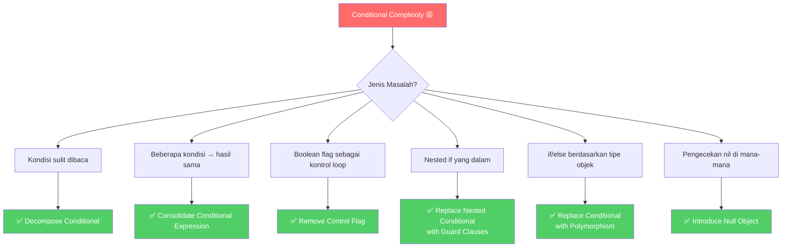
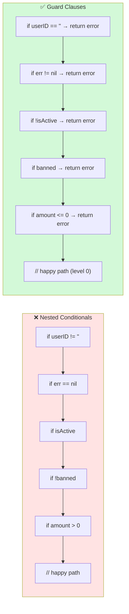

Bayangkan kamu baru bergabung dengan tim dan ditugaskan untuk memperbaiki bug di modul `checkout`. Kamu membuka file-nya, dan disambut oleh ini:

```go
func processPayment(order *Order, user *User, promo *Promo) (string, error) {
    if user != nil && user.IsActive && !user.IsBanned {
        if order != nil && order.Total > 0 {
            if promo != nil && promo.Code != "" && !promo.IsExpired() && promo.MinOrder <= order.Total {
                if order.Total-promo.Discount > 0 {
                    // ... logika pembayaran
                }
            } else {
                // ... logika tanpa promo
            }
        }
    }
    return "", fmt.Errorf("cannot process")
}
```

Kamu harus baca berulang kali hanya untuk memahami apa yang sebenarnya terjadi. Ini bukan masalah yang langka — ini adalah **Conditional Complexity**, salah satu code smell paling merusak di semua codebase.

Kabar baiknya: ada teknik refactoring yang teruji untuk mengatasinya. Dan di Go, beberapa teknik ini bukan sekadar "good practice" — mereka adalah **idiom bahasa** yang digunakan oleh para Gopher terbaik.

---

## 🎯 Takeaway

Setelah membaca artikel ini, kamu akan mampu:

- 🔍 **Mengidentifikasi** berbagai bentuk conditional complexity di kode Go
- ✂️ **Menerapkan Decompose Conditional** untuk mengekstrak kondisi kompleks ke fungsi bernama
- 🔗 **Menerapkan Consolidate Conditional** untuk menggabungkan kondisi dengan hasil yang sama
- 🚩 **Menghilangkan Control Flag** menggunakan `break`, `continue`, dan `return`
- 🛡️ **Menerapkan Guard Clauses** — idiom Go yang paling penting untuk eliminasi nesting
- 🎭 **Menggunakan Polimorfisme** untuk menghilangkan `if-else` berdasarkan tipe
- 🕳️ **Memperkenalkan Null Object** untuk menghindari pengecekan `nil` yang berulang

---

## Peta Teknik Refactoring Kondisional



---

## Teknik 1: Decompose Conditional

### Apa Masalahnya?

Kondisi `if` yang panjang dengan logika gabungan membuat pembaca harus berhenti dan "menghitung" dalam kepala mereka apa yang sebenarnya dicek.

### Contoh Bad Code (❌)

```go
// ❌ BAD: Kondisi sulit dibaca — apa yang sebenarnya sedang dicek?
func calculateShippingCost(order Order, customer Customer) float64 {
    if order.Weight > 5.0 &&
        order.Destination != "Jakarta" &&
        !customer.IsPremium &&
        customer.OrderCount < 10 {
        return order.Weight * 15000
    }

    if customer.IsPremium || customer.OrderCount >= 10 {
        return 0
    }

    return order.Weight * 10000
}
```

Apa yang dimaksud `order.Weight > 5.0 && order.Destination != "Jakarta" && !customer.IsPremium && customer.OrderCount < 10`? Pembaca harus memahami sendiri intensinya.

### Perbaikan (✅)

**Ekstrak setiap kondisi ke fungsi dengan nama yang bermakna:**

```go
// ✅ GOOD: Setiap kondisi punya nama yang menjelaskan intensi

func isHeavyOutOfCityOrder(order Order) bool {
    return order.Weight > 5.0 && order.Destination != "Jakarta"
}

func isLoyalCustomer(customer Customer) bool {
    return customer.IsPremium || customer.OrderCount >= 10
}

func calculateShippingCost(order Order, customer Customer) float64 {
    if isLoyalCustomer(customer) {
        return 0 // gratis ongkir untuk pelanggan setia
    }

    if isHeavyOutOfCityOrder(order) {
        return order.Weight * 15000 // tarif luar kota barang berat
    }

    return order.Weight * 10000 // tarif standar
}
```

Kini `calculateShippingCost` dapat dibaca seperti prosa. Fungsi-fungsi kecil itu juga bisa ditest secara independen!

---

## Teknik 2: Consolidate Conditional Expression

### Apa Masalahnya?

Ketika beberapa kondisi berbeda-beda tetapi semuanya berujung pada aksi yang sama, kode terasa berulang dan membingungkan. Ini sering kali menjadi tanda bahwa ada satu kondisi logis yang belum diberi nama.

### Contoh Bad Code (❌)

```go
// ❌ BAD: Tiga kondisi terpisah, hasil yang sama persis
func calculateDisabilityBenefit(employee Employee) float64 {
    if employee.SickDaysUsed > 20 {
        return 0
    }
    if employee.IsPartTime {
        return 0
    }
    if employee.IsContractor {
        return 0
    }
    return employee.BaseSalary * 0.6
}
```

### Perbaikan (✅)

**Gabungkan kondisi menjadi satu, lalu beri nama yang jelas:**

```go
// ✅ GOOD: Satu kondisi terpadu dengan nama yang bermakna
func isNotEligibleForBenefit(employee Employee) bool {
    return employee.SickDaysUsed > 20 ||
        employee.IsPartTime ||
        employee.IsContractor
}

func calculateDisabilityBenefit(employee Employee) float64 {
    if isNotEligibleForBenefit(employee) {
        return 0
    }
    return employee.BaseSalary * 0.6
}
```

Setelah konsolidasi, intensi kode menjadi sangat jelas: ada satu set aturan yang menentukan kelayakan, dan itu sudah diberi nama yang tepat.

---

## Teknik 3: Remove Control Flag

### Apa Masalahnya?

*Control flag* adalah variabel boolean yang digunakan untuk mengontrol alur loop atau fungsi, biasanya dipasang sebagai `found := false` atau `shouldProcess := true`. Ini adalah pola yang tidak perlu karena Go sudah menyediakan `break`, `continue`, dan `return`.

### Contoh Bad Code (❌)

```go
// ❌ BAD: Control flag yang tidak perlu — membingungkan alur kode
func findFirstPremiumUser(users []User) *User {
    var result *User
    found := false // ← control flag

    for _, u := range users {
        if !found {
            if u.IsPremium && u.IsActive {
                result = &u
                found = true // ← set flag
            }
        }
    }
    return result
}
```

Loop terus berjalan meskipun `found` sudah `true`, membuang siklus CPU secara sia-sia. Logika pembaca juga harus "menelusuri" flag untuk memahami apa yang terjadi.

### Perbaikan (✅)

**Gunakan `return` untuk keluar langsung saat ditemukan:**

```go
// ✅ GOOD: Early return menghilangkan flag dan lebih efisien
func findFirstPremiumUser(users []User) *User {
    for _, u := range users {
        if u.IsPremium && u.IsActive {
            return &u // keluar segera saat ditemukan
        }
    }
    return nil
}
```

Atau untuk kasus nested loop, gunakan `break` dengan label:

```go
// ✅ GOOD: Labeled break untuk nested loop — tanpa control flag
func findFirstActiveItem(matrix [][]Item) *Item {
    var found *Item

outer:
    for _, row := range matrix {
        for _, item := range row {
            if item.IsActive {
                found = &item
                break outer // keluar dari kedua loop sekaligus
            }
        }
    }
    return found
}
```

---

## Teknik 4: Replace Nested Conditional with Guard Clauses

### ⭐ Ini Adalah Idiom Go yang Paling Penting!

Di komunitas Go, ini adalah salah satu konvensi yang paling kuat. Go secara eksplisit mempromosikan *happy path* di sisi kiri indentasi, bukan di dalam nested `if`. Hampir semua kode dari tim Google, Hashicorp, hingga Kubernetes menggunakan pola ini secara konsisten.

> **"Don't indent the happy path."** — Dave Cheney, Go contributor

### Apa Masalahnya?

*Arrow code* atau "Pyramid of Doom" — kondisi yang bersarang terlalu dalam sehingga logika utama berada di level indentasi ketiga atau keempat.

### Contoh Bad Code (❌)

```go
// ❌ BAD: Arrow code — happy path terkubur di dalam tumpukan kondisi
func processOrder(ctx context.Context, req OrderRequest) (*OrderResult, error) {
    if req.UserID != "" {
        user, err := getUserByID(ctx, req.UserID)
        if err == nil {
            if user.IsActive {
                if !user.IsBanned {
                    if req.Amount > 0 {
                        if req.Amount <= user.CreditLimit {
                            // happy path ada di sini... di level indentasi ke-6!
                            result, err := createOrder(ctx, user, req)
                            if err == nil {
                                return result, nil
                            } else {
                                return nil, fmt.Errorf("create order failed: %w", err)
                            }
                        } else {
                            return nil, fmt.Errorf("amount exceeds credit limit")
                        }
                    } else {
                        return nil, fmt.Errorf("amount must be positive")
                    }
                } else {
                    return nil, fmt.Errorf("user is banned")
                }
            } else {
                return nil, fmt.Errorf("user is not active")
            }
        } else {
            return nil, fmt.Errorf("user not found: %w", err)
        }
    } else {
        return nil, fmt.Errorf("userID is required")
    }
}
```

Kamu perlu menggeser mata ke kanan terus-menerus hanya untuk mengikuti alurnya. Ini adalah code smell yang serius.

### Perbaikan (✅)

**Balik setiap kondisi menjadi guard clause dengan early return:**

```go
// ✅ GOOD: Guard clauses — setiap kondisi gagal ditangani lebih dulu,
// happy path berjalan lurus di sisi kiri

func processOrder(ctx context.Context, req OrderRequest) (*OrderResult, error) {
    // Guard clause 1: validasi input awal
    if req.UserID == "" {
        return nil, fmt.Errorf("userID is required")
    }

    // Guard clause 2: ambil user, tangani error
    user, err := getUserByID(ctx, req.UserID)
    if err != nil {
        return nil, fmt.Errorf("user not found: %w", err)
    }

    // Guard clause 3: cek status user
    if !user.IsActive {
        return nil, fmt.Errorf("user is not active")
    }
    if user.IsBanned {
        return nil, fmt.Errorf("user is banned")
    }

    // Guard clause 4: validasi amount
    if req.Amount <= 0 {
        return nil, fmt.Errorf("amount must be positive")
    }
    if req.Amount > user.CreditLimit {
        return nil, fmt.Errorf("amount exceeds credit limit")
    }

    // Happy path: bersih, tidak ada nesting
    result, err := createOrder(ctx, user, req)
    if err != nil {
        return nil, fmt.Errorf("create order failed: %w", err)
    }
    return result, nil
}
```

### Perbandingan Visual



Perhatikan bagaimana di versi Guard Clauses, *happy path* ada di level indentasi nol — ini adalah tujuannya!

---

## Teknik 5: Replace Conditional with Polymorphism

### Apa Masalahnya?

Ketika kamu memiliki blok `if-else` atau `switch` yang terus bertambah setiap kali ada tipe baru, ini adalah tanda bahwa behavior seharusnya di-*dispatch* secara polimorfis menggunakan interface.

### Contoh Bad Code (❌)

```go
// ❌ BAD: Switch berdasarkan tipe — harus dimodifikasi setiap ada tipe baru
type NotificationType string

const (
    NotifEmail NotificationType = "email"
    NotifSMS   NotificationType = "sms"
    NotifPush  NotificationType = "push"
)

type Notification struct {
    Type    NotificationType
    To      string
    Message string
}

func sendNotification(n Notification) error {
    switch n.Type {
    case NotifEmail:
        // logika kirim email
        fmt.Printf("Sending email to %s: %s\n", n.To, n.Message)
        return nil
    case NotifSMS:
        // logika kirim SMS
        fmt.Printf("Sending SMS to %s: %s\n", n.To, n.Message)
        return nil
    case NotifPush:
        // logika kirim push notification
        fmt.Printf("Sending push to %s: %s\n", n.To, n.Message)
        return nil
    default:
        return fmt.Errorf("unknown notification type: %s", n.Type)
    }
}
```

Setiap kali ada tipe notifikasi baru (misalnya WhatsApp, Slack), kamu harus membuka dan memodifikasi fungsi ini. Ini melanggar *Open/Closed Principle*.

### Perbaikan (✅)

**Gunakan interface sehingga setiap tipe bertanggung jawab atas perilakunya sendiri:**

```go
// ✅ GOOD: Interface-based polymorphism — tambah tipe baru tanpa ubah kode lama

// Notifier mendefinisikan kontrak pengiriman notifikasi
type Notifier interface {
    Send(to, message string) error
}

// EmailNotifier — implementasi untuk email
type EmailNotifier struct {
    SMTPHost string
    Port     int
}

func (e *EmailNotifier) Send(to, message string) error {
    fmt.Printf("[EMAIL] Sending to %s via %s:%d → %s\n", to, e.SMTPHost, e.Port, message)
    return nil
}

// SMSNotifier — implementasi untuk SMS
type SMSNotifier struct {
    APIKey  string
    Sender  string
}

func (s *SMSNotifier) Send(to, message string) error {
    fmt.Printf("[SMS] Sending from %s to %s → %s\n", s.Sender, to, message)
    return nil
}

// PushNotifier — implementasi untuk push notification
type PushNotifier struct {
    AppID string
}

func (p *PushNotifier) Send(to, message string) error {
    fmt.Printf("[PUSH] Sending via app %s to %s → %s\n", p.AppID, to, message)
    return nil
}

// NotificationService tidak tahu apa-apa tentang tipe konkret
type NotificationService struct {
    notifier Notifier
}

func NewNotificationService(n Notifier) *NotificationService {
    return &NotificationService{notifier: n}
}

// Send sekarang bersih — tidak ada switch, tidak ada kondisi tipe
func (svc *NotificationService) Send(to, message string) error {
    return svc.notifier.Send(to, message)
}

// Penggunaan:
func main() {
    emailSvc := NewNotificationService(&EmailNotifier{SMTPHost: "smtp.example.com", Port: 587})
    emailSvc.Send("user@example.com", "Pesanan kamu sudah dikirim!")

    smsSvc := NewNotificationService(&SMSNotifier{APIKey: "xxx", Sender: "MyApp"})
    smsSvc.Send("+628123456789", "Kode OTP kamu: 123456")
}
```

Sekarang, untuk menambahkan `WhatsAppNotifier`, kamu cukup buat struct baru yang mengimplementasi interface `Notifier` — tanpa menyentuh kode yang sudah ada sama sekali.

---

## Teknik 6: Introduce Null Object

### Apa Masalahnya?

Pengecekan `nil` yang tersebar di seluruh kode bukan hanya berisik, tapi juga rawan lupa. Satu `nil pointer dereference` bisa menghancurkan production.

### Contoh Bad Code (❌)

```go
// ❌ BAD: Pengecekan nil tersebar di mana-mana — verbose dan rawan bug
type Logger interface {
    Log(level, message string)
}

type AuditService struct {
    logger Logger // bisa nil jika tidak dikonfigurasi
}

func (a *AuditService) RecordAction(userID, action string) {
    // Cek nil setiap kali mau log
    if a.logger != nil {
        a.logger.Log("INFO", fmt.Sprintf("User %s performed: %s", userID, action))
    }

    // ... logika lain
    if a.logger != nil {
        a.logger.Log("DEBUG", "Action recorded successfully")
    }
}

func (a *AuditService) DeleteRecord(recordID string) {
    if a.logger != nil {
        a.logger.Log("WARN", fmt.Sprintf("Deleting record %s", recordID))
    }
    // ... logika delete
}
```

Bayangkan ada 20 method di `AuditService` — setiap method akan punya pengecekan `nil` yang sama.

### Perbaikan (✅)

**Perkenalkan `NullLogger` yang mengimplementasi interface tetapi tidak melakukan apa-apa:**

```go
// ✅ GOOD: Null Object Pattern — tidak perlu cek nil sama sekali

type Logger interface {
    Log(level, message string)
}

// RealLogger — implementasi nyata yang menulis ke output
type RealLogger struct{}

func (l *RealLogger) Log(level, message string) {
    fmt.Printf("[%s] %s\n", level, message)
}

// NullLogger — implementasi kosong (safe no-op)
// Digunakan sebagai default ketika logger tidak dikonfigurasi
type NullLogger struct{}

func (l *NullLogger) Log(level, message string) {
    // sengaja tidak melakukan apa-apa
}

// NewAuditService menggunakan NullLogger sebagai default
func NewAuditService(logger Logger) *AuditService {
    if logger == nil {
        logger = &NullLogger{} // fallback ke null object
    }
    return &AuditService{logger: logger}
}

type AuditService struct {
    logger Logger // dijamin tidak pernah nil
}

func (a *AuditService) RecordAction(userID, action string) {
    // Tidak ada pengecekan nil — langsung panggil
    a.logger.Log("INFO", fmt.Sprintf("User %s performed: %s", userID, action))

    // ... logika lain
    a.logger.Log("DEBUG", "Action recorded successfully")
}

func (a *AuditService) DeleteRecord(recordID string) {
    a.logger.Log("WARN", fmt.Sprintf("Deleting record %s", recordID))
    // ... logika delete
}

// Penggunaan:
func main() {
    // Dengan logger nyata
    svc1 := NewAuditService(&RealLogger{})
    svc1.RecordAction("user-123", "login")

    // Tanpa logger — menggunakan NullLogger secara otomatis
    svc2 := NewAuditService(nil)
    svc2.RecordAction("user-456", "logout") // tidak panik, tidak ada log
}
```

`NullLogger` memastikan kode di dalam `AuditService` tidak perlu tahu apakah logger dikonfigurasi atau tidak. Ini sangat berguna untuk testing juga — kamu bisa inject `NullLogger` tanpa butuh mock framework.

---

## Merangkai Semua Teknik: Studi Kasus Lengkap

Mari kita lihat kode "sebelum" dan "sesudah" yang menggunakan beberapa teknik sekaligus:

### Sebelum (❌) — Semua Code Smells Sekaligus

```go
// ❌ BAD: Nested conditionals + control flag + no decomposition
func processLoan(user *User, loan *Loan, logger Logger) (string, error) {
    approved := false
    reason := ""

    if user != nil {
        if loan != nil {
            if user.CreditScore >= 600 {
                if loan.Amount > 0 && loan.Amount <= 500_000_000 {
                    if user.MonthlyIncome > 0 {
                        ratio := loan.Amount / (user.MonthlyIncome * 12)
                        if ratio <= 3.5 {
                            approved = true
                        } else {
                            reason = "debt-to-income ratio too high"
                        }
                    } else {
                        reason = "no income data"
                    }
                } else {
                    reason = "invalid loan amount"
                }
            } else {
                reason = "credit score too low"
            }
        } else {
            reason = "loan data is nil"
        }
    } else {
        reason = "user is nil"
    }

    if logger != nil {
        if approved {
            logger.Log("INFO", "Loan approved for "+user.Name)
        } else {
            logger.Log("WARN", "Loan rejected: "+reason)
        }
    }

    if approved {
        return "APPROVED-" + loan.ID, nil
    }
    return "", fmt.Errorf("loan rejected: %s", reason)
}
```

### Sesudah (✅) — Semua Teknik Diterapkan

```go
// ✅ GOOD: Guard clauses + Decompose Conditional + Null Object

// NullLogger untuk menghilangkan pengecekan nil logger
type NullLogger struct{}
func (l *NullLogger) Log(level, msg string) {}

// isEligibleCreditScore — Decompose Conditional
func isEligibleCreditScore(user *User) bool {
    return user.CreditScore >= 600
}

// isValidLoanAmount — Decompose Conditional
func isValidLoanAmount(amount float64) bool {
    return amount > 0 && amount <= 500_000_000
}

// isDebtRatioAcceptable — Decompose Conditional
func isDebtRatioAcceptable(loan *Loan, user *User) bool {
    if user.MonthlyIncome <= 0 {
        return false
    }
    ratio := loan.Amount / (user.MonthlyIncome * 12)
    return ratio <= 3.5
}

func processLoan(user *User, loan *Loan, logger Logger) (string, error) {
    // Introduce Null Object — tidak perlu cek nil logger
    if logger == nil {
        logger = &NullLogger{}
    }

    // Guard clauses — tangani error cases lebih dulu
    if user == nil {
        return "", fmt.Errorf("user is nil")
    }
    if loan == nil {
        return "", fmt.Errorf("loan data is nil")
    }
    if !isEligibleCreditScore(user) {
        logger.Log("WARN", fmt.Sprintf("Loan rejected for %s: credit score too low", user.Name))
        return "", fmt.Errorf("credit score too low: %d", user.CreditScore)
    }
    if !isValidLoanAmount(loan.Amount) {
        logger.Log("WARN", "Loan rejected: invalid loan amount")
        return "", fmt.Errorf("invalid loan amount: %.0f", loan.Amount)
    }
    if user.MonthlyIncome <= 0 {
        logger.Log("WARN", "Loan rejected: no income data")
        return "", fmt.Errorf("no income data")
    }
    if !isDebtRatioAcceptable(loan, user) {
        logger.Log("WARN", fmt.Sprintf("Loan rejected for %s: debt-to-income ratio too high", user.Name))
        return "", fmt.Errorf("debt-to-income ratio too high")
    }

    // Happy path — bersih dan jelas
    loanID := "APPROVED-" + loan.ID
    logger.Log("INFO", fmt.Sprintf("Loan approved for %s: %s", user.Name, loanID))
    return loanID, nil
}
```

Perbandingan langsung:

| Aspek | Sebelum | Sesudah |
|---|---|---|
| Level indentasi max | 7 | 1 |
| Pengecekan nil logger | 1 (manual) | 0 (Null Object) |
| Kondisi yang bisa ditest | 0 (tersembunyi) | 4 (fungsi terpisah) |
| Keterbacaan Happy Path | Terkubur di dalam | Langsung terlihat |
| Kemudahan tambah aturan | Harus nest lebih dalam | Tambah guard clause baru |

---

## Kapan Tidak Melakukan Refactoring Ini?

Perlu diingat, seperti semua teknik, ada kondisi di mana kamu sebaiknya **tidak** memaksakan:

- **Guard clauses** tidak cocok jika kondisi sukses dan gagal sama-sama kompleks — pertimbangkan mengekstrak ke fungsi terpisah.
- **Polymorphism** mungkin berlebihan jika hanya ada 2 tipe yang tidak akan pernah bertambah.
- **Null Object** harus hati-hati: jika "tidak melakukan apa-apa" bukan perilaku yang benar secara bisnis, `nil` yang eksplisit lebih aman.
- Selalu **tulis test lebih dulu** sebelum refactoring — teknik ini hanya aman jika ada test coverage yang memadai.

---

## 📝 Ringkasan

Conditional complexity adalah salah satu musuh keterbacaan kode yang paling umum. Enam teknik dalam artikel ini memberikan senjata lengkap untuk melawannya:

| Teknik | Kapan Digunakan | Manfaat Utama |
|---|---|---|
| **Decompose Conditional** | Kondisi kompleks sulit dibaca | Memberi nama pada intensi |
| **Consolidate Conditional** | Beberapa kondisi → hasil sama | Hilangkan duplikasi, beri nama |
| **Remove Control Flag** | Boolean flag dalam loop | Kode lebih simpel & efisien |
| **Guard Clauses** | Nested conditionals yang dalam | Bersihkan happy path ← **Idiom Go!** |
| **Replace with Polymorphism** | Switch/if berdasarkan tipe | Open/Closed Principle terpenuhi |
| **Introduce Null Object** | Cek nil berulang di banyak tempat | Eliminasi defensive nil-checks |

**Takeaway terpenting:** Di Go, *Guard Clauses* bukan pilihan — ini adalah **konvensi komunitas**. Hampir semua project Go berkualitas tinggi (Kubernetes, Terraform, Go stdlib) menggunakan early return secara konsisten. Jika kamu menulis kode Go dengan nested conditionals yang dalam, itu adalah code smell yang jelas.

> 💡 **Mulai dari mana?** Buka satu file Go di project kamu sekarang. Cari fungsi dengan nesting lebih dari 2 level. Terapkan Guard Clauses. Jalankan test. Rasakan perbedaannya.

---

**🇮🇩 Versi Indonesia** | [🇬🇧 English Version](/refactoring-part-8-simplify-conditionals)
