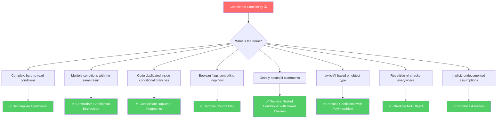
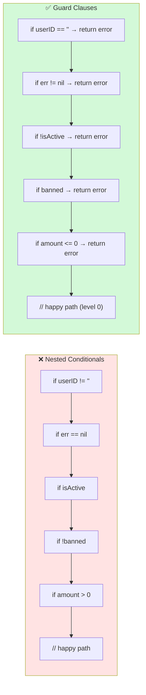

It’s 4:30 PM on a Friday. You are tasked with fixing a bug in your team’s checkout service. You open `payment.go` and find yourself staring at a screen-wide block of nested `if-else` blocks that handles promos, user status checks, credit limit validation, and payment provider routing. You try to trace the execution path in your head, but after the fourth level of indentation, your brain stalls. Every new requirement has been piled on top of the old ones, resulting in a fragile "Pyramid of Doom" that everyone on the team is afraid to touch.

Conditional complexity is one of the most common and destructive code smells in software engineering. Over time, complex branchings make code hard to read, trace, and test. 

In Go, simplifying conditionals is not just about clean code—it is deeply tied to writing *idiomatic* Go. Since Go doesn’t have try/catch blocks and encourages explicit error handling, mastering early returns and guard clauses is essential. Let’s dive into eight powerful techniques to simplify conditional expressions in Go.

---

## 🎯 Takeaway

After reading this article, you will be able to:
- 🔍 **Identify** various forms of conditional complexity in Go code.
- ✂️ **Decompose Conditionals** by extracting complex checks into self-documenting helper functions.
- 🔗 **Consolidate Conditional Expressions** to merge conditions that share the same result.
- 📦 **Consolidate Duplicate Conditional Fragments** to eliminate repetitive code inside branches.
- 🚩 **Remove Control Flags** using `break`, `continue`, and early returns.
- 🛡️ **Apply Guard Clauses**—the most critical Go idiom for eliminating nested conditions.
- 🎭 **Replace Conditionals with Polymorphism** using Go interfaces to handle type-based behaviors.
- 🕳️ **Introduce Null Objects** to avoid repetitive `nil` checks.
- ⚠️ **Introduce Assertions** to explicitly document assumptions and guard critical execution paths.

---

## Conditional Refactoring Decision Map

Use this decision map to choose the right refactoring technique depending on the type of conditional complexity you encounter:



---

## Technique 1: Decompose Conditional

### What is the Problem?
A long `if` condition with combined logic requires the reader to pause and calculate what is being checked. When multiple logical operators (`&&`, `||`, `!`) are combined inline, the intent gets lost.

### Bad Code Example (❌)
```go
// ❌ BAD: Complex inline condition—what does this logic represent?
func calculateShippingCost(order Order, customer Customer) float64 {
    if order.Weight > 5.0 &&
        order.Destination != "Jakarta" &&
        !customer.IsPremium &&
        customer.OrderCount < 10 {
        return order.Weight * 15000
    }

    if customer.IsPremium || customer.OrderCount >= 10 {
        return 0
    }

    return order.Weight * 10000
}
```

### Fix (✅)
Extract each condition into separate helper functions with descriptive, self-documenting names:

```go
// ✅ GOOD: Conditions are extracted into clear, named functions

func isHeavyOutOfCityOrder(order Order) bool {
    return order.Weight > 5.0 && order.Destination != "Jakarta"
}

func isLoyalCustomer(customer Customer) bool {
    return customer.IsPremium || customer.OrderCount >= 10
}

func calculateShippingCost(order Order, customer Customer) float64 {
    if isLoyalCustomer(customer) {
        return 0 // free shipping for loyal customers
    }

    if isHeavyOutOfCityOrder(order) {
        return order.Weight * 15000 // heavy out-of-city rate
    }

    return order.Weight * 10000 // standard rate
}
```
Now, `calculateShippingCost` reads like natural prose. Additionally, the small helper functions can be tested independently!

---

## Technique 2: Consolidate Conditional Expression

### What is the Problem?
Sometimes you have multiple `if` checks that perform different logical checks, but all lead to the exact same outcome or return value. Keeping them separate makes the code repetitive and obscures the unified concept behind those checks.

### Bad Code Example (❌)
```go
// ❌ BAD: Three separate conditions leading to the exact same return value
func calculateDisabilityBenefit(employee Employee) float64 {
    if employee.SickDaysUsed > 20 {
        return 0
    }
    if employee.IsPartTime {
        return 0
    }
    if employee.IsContractor {
        return 0
    }
    return employee.BaseSalary * 0.6
}
```

### Fix (✅)
Merge the conditions using logical operators, and then extract the consolidated check into a named function:

```go
// ✅ GOOD: One consolidated condition with a meaningful name
func isNotEligibleForBenefit(employee Employee) bool {
    return employee.SickDaysUsed > 20 ||
        employee.IsPartTime ||
        employee.IsContractor
}

func calculateDisabilityBenefit(employee Employee) float64 {
    if isNotEligibleForBenefit(employee) {
        return 0
    }
    return employee.BaseSalary * 0.6
}
```

---

## Technique 3: Consolidate Duplicate Conditional Fragments

### What is the Problem?
Duplicate code is sitting inside different branches of a conditional statement. This usually happens when code is added incrementally over time. If a block of code is executed regardless of which branch is taken, it should be moved outside the conditional structure.

### Bad Code Example (❌)
```go
// ❌ BAD: State modification and client call are duplicated in both branches
func processRefund(order *Order, client *PaymentClient) error {
    if order.IsPremium {
        order.Status = StatusRefunded
        err := client.Refund(order.ID, order.Total)
        if err != nil {
            return err
        }
        sendPremiumRefundEmail(order)
    } else {
        order.Status = StatusRefunded
        err := client.Refund(order.ID, order.Total)
        if err != nil {
            return err
        }
        sendStandardRefundNotification(order)
    }
    return nil
}
```

### Fix (✅)
Move the common execution fragments outside of the conditional branches, leaving only the code that actually varies inside the `if-else` branches:

```go
// ✅ GOOD: Common code fragments are consolidated outside the branches
func processRefund(order *Order, client *PaymentClient) error {
    // These steps occur regardless of premium status
    order.Status = StatusRefunded
    if err := client.Refund(order.ID, order.Total); err != nil {
        return err
    }

    // Only the notification logic varies by user status
    if order.IsPremium {
        sendPremiumRefundEmail(order)
    } else {
        sendStandardRefundNotification(order)
    }
    return nil
}
```

---

## Technique 4: Remove Control Flag

### What is the Problem?
A *control flag* is a boolean variable used to control loop execution flow (such as `found := false` or `shouldContinue := true`). Using control flags leads to nested conditionals and unnecessary loop iterations. Go provides idiomatic control flow keywords like `break`, `continue`, and `return` that render these flags obsolete.

### Bad Code Example (❌)
```go
// ❌ BAD: Control flag variable makes the loop hard to follow and inefficient
func findFirstPremiumUser(users []User) *User {
    var result *User
    found := false // ← control flag

    for _, u := range users {
        if !found {
            if u.IsPremium && u.IsActive {
                result = &u
                found = true // ← setting the flag
            }
        }
    }
    return result
}
```

### Fix (✅)
Exit the function immediately using `return` as soon as the target is found:

```go
// ✅ GOOD: Early return eliminates the control flag and stops execution immediately
func findFirstPremiumUser(users []User) *User {
    for _, u := range users {
        if u.IsPremium && u.IsActive {
            return &u // exit immediately upon match
        }
    }
    return nil
}
```

For nested loops, instead of introducing flags, use Go's labeled `break` statements to jump out of the outer loop directly:

```go
// ✅ GOOD: Labeled break for nested loops—no control flags required
func findFirstActiveItem(matrix [][]Item) *Item {
    var found *Item

outer:
    for _, row := range matrix {
        for _, item := range row {
            if item.IsActive {
                found = &item
                break outer // breaks out of both loops immediately
            }
        }
    }
    return found
}
```

---

## Technique 5: Replace Nested Conditional with Guard Clauses

### ⭐ The Most Critical Go Idiom
In Go, keeping the "happy path" aligned to the left side of the screen is an established styling convention. 

> **"Line of sight is the straight path through a function. The happy path should not be indented; it should be aligned to the left."** — Dave Cheney, Go Contributor

By reversing your conditions and returning early, you eliminate nested blocks (the "Pyramid of Doom").

### Bad Code Example (❌)
```go
// ❌ BAD: "Arrow Code" / "Pyramid of Doom" — happy path is nested 6 levels deep
func processOrder(ctx context.Context, req OrderRequest) (*OrderResult, error) {
    if req.UserID != "" {
        user, err := getUserByID(ctx, req.UserID)
        if err == nil {
            if user.IsActive {
                if !user.IsBanned {
                    if req.Amount > 0 {
                        if req.Amount <= user.CreditLimit {
                            // The happy path is buried here at indentation level 6!
                            result, err := createOrder(ctx, user, req)
                            if err == nil {
                                return result, nil
                            } else {
                                return nil, fmt.Errorf("create order failed: %w", err)
                            }
                        } else {
                            return nil, fmt.Errorf("amount exceeds credit limit")
                        }
                    } else {
                        return nil, fmt.Errorf("amount must be positive")
                    }
                } else {
                    return nil, fmt.Errorf("user is banned")
                }
            } else {
                return nil, fmt.Errorf("user is not active")
            }
        } else {
            return nil, fmt.Errorf("user not found: %w", err)
        }
    } else {
        return nil, fmt.Errorf("userID is required")
    }
}
```

### Fix (✅)
Invert the conditions to create **guard clauses** that handle error conditions first and return early:

```go
// ✅ GOOD: Guard clauses handle error cases first, leaving the happy path unindented

func processOrder(ctx context.Context, req OrderRequest) (*OrderResult, error) {
    // Guard clause 1: Request Validation
    if req.UserID == "" {
        return nil, fmt.Errorf("userID is required")
    }

    // Guard clause 2: Fetch User
    user, err := getUserByID(ctx, req.UserID)
    if err != nil {
        return nil, fmt.Errorf("user not found: %w", err)
    }

    // Guard clause 3: User Status Validation
    if !user.IsActive {
        return nil, fmt.Errorf("user is not active")
    }
    if user.IsBanned {
        return nil, fmt.Errorf("user is banned")
    }

    // Guard clause 4: Limit Validation
    if req.Amount <= 0 {
        return nil, fmt.Errorf("amount must be positive")
    }
    if req.Amount > user.CreditLimit {
        return nil, fmt.Errorf("amount exceeds credit limit")
    }

    // Happy path runs straight on the left margin
    result, err := createOrder(ctx, user, req)
    if err != nil {
        return nil, fmt.Errorf("create order failed: %w", err)
    }
    return result, nil
}
```

### Visual Comparison



---

## Technique 6: Replace Conditional with Polymorphism

### What is the Problem?
Having a conditional (like a `switch` or chain of `if-else` blocks) that routes execution based on the *type* of an object is a clear violation of the **Open/Closed Principle**. Every time a new type is added, you must locate and update all corresponding conditional statements.

### Bad Code Example (❌)
```go
// ❌ BAD: Type switch checks require code modifications for every new type added
type NotificationType string

const (
    NotifEmail NotificationType = "email"
    NotifSMS   NotificationType = "sms"
    NotifPush  NotificationType = "push"
)

type Notification struct {
    Type    NotificationType
    To      string
    Message string
}

func sendNotification(n Notification) error {
    switch n.Type {
    case NotifEmail:
        // Email routing logic
        fmt.Printf("Sending email to %s: %s\n", n.To, n.Message)
        return nil
    case NotifSMS:
        // SMS routing logic
        fmt.Printf("Sending SMS to %s: %s\n", n.To, n.Message)
        return nil
    case NotifPush:
        // Push notification routing logic
        fmt.Printf("Sending push to %s: %s\n", n.To, n.Message)
        return nil
    default:
        return fmt.Errorf("unknown notification type: %s", n.Type)
    }
}
```

### Fix (✅)
Define a Go interface, and implement the specific behavior in concrete struct types. Now, the service only depends on the interface:

```go
// ✅ GOOD: Polymorphism via interface allows adding new types without modifying existing code

// Notifier defines the common behavior contract
type Notifier interface {
    Send(to, message string) error
}

// EmailNotifier handles email notifications
type EmailNotifier struct {
    SMTPHost string
    Port     int
}

func (e *EmailNotifier) Send(to, message string) error {
    fmt.Printf("[EMAIL] Sending to %s via %s:%d → %s\n", to, e.SMTPHost, e.Port, message)
    return nil
}

// SMSNotifier handles SMS notifications
type SMSNotifier struct {
    APIKey string
    Sender string
}

func (s *SMSNotifier) Send(to, message string) error {
    fmt.Printf("[SMS] Sending from %s to %s → %s\n", s.Sender, to, message)
    return nil
}

// PushNotifier handles push notifications
type PushNotifier struct {
    AppID string
}

func (p *PushNotifier) Send(to, message string) error {
    fmt.Printf("[PUSH] Sending via app %s to %s → %s\n", p.AppID, to, message)
    return nil
}

// NotificationService has no knowledge of concrete types
type NotificationService struct {
    notifier Notifier
}

func NewNotificationService(n Notifier) *NotificationService {
    return &NotificationService{notifier: n}
}

func (svc *NotificationService) Send(to, message string) error {
    return svc.notifier.Send(to, message)
}
```
If you need to add a `SlackNotifier` in the future, you simply create a new struct that implements the `Notifier` interface. You don't need to modify `NotificationService` at all.

---

## Technique 7: Introduce Null Object

### What is the Problem?
Defensive `nil` checks cluttering your codebase can make simple operations difficult to read. If a field or dependency is optional, checking `if obj != nil` before calling its methods is verbose and error-prone.

### Bad Code Example (❌)
```go
// ❌ BAD: Repetitive nil checks clutter the core logic
type Logger interface {
    Log(level, message string)
}

type AuditService struct {
    logger Logger // can be nil if not configured
}

func (a *AuditService) RecordAction(userID, action string) {
    // Repetitive nil-checks are required in every method
    if a.logger != nil {
        a.logger.Log("INFO", fmt.Sprintf("User %s performed: %s", userID, action))
    }

    // ... business logic ...

    if a.logger != nil {
        a.logger.Log("DEBUG", "Action recorded successfully")
    }
}

func (a *AuditService) DeleteRecord(recordID string) {
    if a.logger != nil {
        a.logger.Log("WARN", fmt.Sprintf("Deleting record %s", recordID))
    }
    // ... delete logic ...
}
```

### Fix (✅)
Create a **Null Object** implementation of the interface that performs a safe no-op. Assign this Null Object as the default value if no implementation is provided:

```go
// ✅ GOOD: NullLogger handles the no-op behavior, eliminating nil checks

type Logger interface {
    Log(level, message string)
}

// NullLogger implements Logger but intentionally does nothing
type NullLogger struct{}

func (l *NullLogger) Log(level, message string) {
    // No-op
}

type RealLogger struct{}

func (l *RealLogger) Log(level, message string) {
    fmt.Printf("[%s] %s\n", level, message)
}

type AuditService struct {
    logger Logger // guaranteed to be non-nil
}

func NewAuditService(logger Logger) *AuditService {
    if logger == nil {
        logger = &NullLogger{} // default fallback to the Null Object
    }
    return &AuditService{logger: logger}
}

func (a *AuditService) RecordAction(userID, action string) {
    // Directly call log without defensive checks
    a.logger.Log("INFO", fmt.Sprintf("User %s performed: %s", userID, action))
    a.logger.Log("DEBUG", "Action recorded successfully")
}
```

---

## Technique 8: Introduce Assertion

### What is the Problem?
Sometimes, a section of your code executes under implicit assumptions—for example, that a database connection is pre-established, or that a parameter value is positive. If these assumptions are violated due to programmer error, they might fail silently, causing hard-to-debug behaviors downstream.

In Go, there is no built-in `assert` keyword. However, you can write explicit runtime checks that panic or throw fatal errors to stop execution immediately when programmer assumptions are broken (fail-fast).

### Bad Code Example (❌)
```go
// ❌ BAD: Implicitly assumes the ExchangeRate is positive and connection is valid.
// Violating these assumptions leads to incorrect calculations or silent errors.
type TransactionProcessor struct {
    ExchangeRate float64
    Connection   *DbConn
}

func (tp *TransactionProcessor) Process(amount float64) float64 {
    // Assumes ExchangeRate > 0 and Connection != nil
    // If ExchangeRate is 0, it silently processes invalid transactions
    return amount * tp.ExchangeRate
}
```

### Fix (✅)
Add explicit assertions (or helper validator checks) that fail fast when structural assumptions are violated:

```go
// ✅ GOOD: Explicit assertion checks fail fast if programmer assumptions are violated

type TransactionProcessor struct {
    ExchangeRate float64
    Connection   *DbConn
}

func (tp *TransactionProcessor) Process(amount float64) float64 {
    // Enforce critical programmer assumptions before executing logic
    tp.assertValid()

    return amount * tp.ExchangeRate
}

func (tp *TransactionProcessor) assertValid() {
    if tp.ExchangeRate <= 0 {
        panic("assertion failed: ExchangeRate must be positive")
    }
    if tp.Connection == nil {
        panic("assertion failed: Connection must not be nil")
    }
}
```
*Note: Only use panics for developer-level bugs (violating structural assumptions or uninitialized dependencies). Regular runtime errors (like invalid user input) should always be handled by returning an `error` interface.*

---

## Putting It All Together: A Comprehensive Case Study

Let's look at a complex loan-processing module that exhibits multiple conditional code smells, and see how applying our techniques cleans it up.

### Before Refactoring (❌)
This version suffers from deeply nested code, manual nil-checks on loggers, inline logical conditions, and control flags:

```go
// ❌ BAD: Deeply nested conditionals, manual nil checks, and complex inline logic
func processLoan(user *User, loan *Loan, logger Logger) (string, error) {
    approved := false
    reason := ""

    if user != nil {
        if loan != nil {
            if user.CreditScore >= 600 {
                if loan.Amount > 0 && loan.Amount <= 500_000_000 {
                    if user.MonthlyIncome > 0 {
                        ratio := loan.Amount / (user.MonthlyIncome * 12)
                        if ratio <= 3.5 {
                            approved = true
                        } else {
                            reason = "debt-to-income ratio too high"
                        }
                    } else {
                        reason = "no income data"
                    }
                } else {
                    reason = "invalid loan amount"
                }
            } else {
                reason = "credit score too low"
            }
        } else {
            reason = "loan data is nil"
        }
    } else {
        reason = "user is nil"
    }

    if logger != nil {
        if approved {
            logger.Log("INFO", "Loan approved for "+user.Name)
        } else {
            logger.Log("WARN", "Loan rejected: "+reason)
        }
    }

    if approved {
        return "APPROVED-" + loan.ID, nil
    }
    return "", fmt.Errorf("loan rejected: %s", reason)
}
```

### After Refactoring (✅)
By introducing a Null Object for the logger, asserting programmer assumptions, decomposing conditions, and using early returns (guard clauses), we get a clean, readable flow:

```go
// ✅ GOOD: Guard clauses + Decomposed Conditionals + Null Object + Assertions

// NullLogger removes the need for manual nil-checks
type NullLogger struct{}
func (l *NullLogger) Log(level, msg string) {}

// isEligibleCreditScore — Decomposed Conditional
func isEligibleCreditScore(user *User) bool {
    return user.CreditScore >= 600
}

// isValidLoanAmount — Decomposed Conditional
func isValidLoanAmount(amount float64) bool {
    return amount > 0 && amount <= 500_000_000
}

// isDebtRatioAcceptable — Decomposed Conditional
func isDebtRatioAcceptable(loan *Loan, user *User) bool {
    if user.MonthlyIncome <= 0 {
        return false
    }
    ratio := loan.Amount / (user.MonthlyIncome * 12)
    return ratio <= 3.5
}

func processLoan(user *User, loan *Loan, logger Logger) (string, error) {
    // 1. Introduce Null Object
    if logger == nil {
        logger = &NullLogger{}
    }

    // 2. Introduce Assertions (Fail-fast for programmer errors)
    if user == nil {
        panic("assertion failed: user object must not be nil")
    }
    if loan == nil {
        panic("assertion failed: loan object must not be nil")
    }

    // 3. Guard Clauses (Fail-fast for business validation failures)
    if !isEligibleCreditScore(user) {
        logger.Log("WARN", fmt.Sprintf("Loan rejected for %s: credit score too low", user.Name))
        return "", fmt.Errorf("credit score too low: %d", user.CreditScore)
    }

    if !isValidLoanAmount(loan.Amount) {
        logger.Log("WARN", "Loan rejected: invalid loan amount")
        return "", fmt.Errorf("invalid loan amount: %.0f", loan.Amount)
    }

    if user.MonthlyIncome <= 0 {
        logger.Log("WARN", "Loan rejected: no income data")
        return "", fmt.Errorf("no income data")
    }

    if !isDebtRatioAcceptable(loan, user) {
        logger.Log("WARN", fmt.Sprintf("Loan rejected for %s: debt-to-income ratio too high", user.Name))
        return "", fmt.Errorf("debt-to-income ratio too high")
    }

    // 4. Happy Path runs cleanly at level-0 indentation
    loanID := "APPROVED-" + loan.ID
    logger.Log("INFO", fmt.Sprintf("Loan approved for %s: %s", user.Name, loanID))
    return loanID, nil
}
```

### Side-by-Side Comparison

| Metric | Before Refactoring | After Refactoring |
| :--- | :--- | :--- |
| **Max Nesting Indentation** | 7 levels | 1 level |
| **Logger Nil Checking** | Manual checking on every call | Safe no-op Null Object |
| **Logical Testability** | Hidden inline conditions | Decomposed, testable functions |
| **Happy Path Visibility** | Buried in nested scopes | Direct path, unindented |
| **Adding Rules** | Requires nesting deeper | Just append a new guard clause |

---

## When Not to Refactor Conditionals

While these refactoring techniques are powerful, you should avoid using them blindly:

- **Polymorphism Overkill**: If you only have two concrete types and they are unlikely to change, introducing an interface can create unnecessary abstraction. A simple `if-else` might be cleaner.
- **Guard Clauses vs complex binary branches**: If both sides of a branch represent complex success logic, forcing one into a guard clause can make the code less readable. In this case, extract both branches into separate methods.
- **Null Object Risks**: If the absence of a value is a critical state that the system *must* handle explicitly (e.g. throwing an error when database configuration is missing), do not mask it with a Null Object.
- **Assertion Misuse**: Do not use assertions for runtime errors (like network failures or invalid user input). Assertions are strictly for catching bugs during development (programmer error).

---

## 📝 Summary / Recap

Simplifying conditional expressions makes code easier to read and less prone to regression bugs. In Go, these patterns are not just cosmetic improvements; they are key to writing idiomatic code.

Here is a summary of the techniques we covered:

| Technique | When to Use | Key Benefit |
| :--- | :--- | :--- |
| **Decompose Conditional** | Conditions are complex or long | Names the business intent of the logic |
| **Consolidate Conditional** | Multiple branches lead to the same result | Merges conditions and reduces clutter |
| **Consolidate Duplicate Fragments** | The same code is executed in all branches | Eliminates repetitive statements |
| **Remove Control Flag** | Boolean flags control loop flows | Replaces manual state tracking with direct keywords |
| **Replace with Guard Clauses** | Deep nested structures (Arrow Code) | Keeps the happy path flat and easy to follow |
| **Replace with Polymorphism** | Conditions route behavior based on type | Adheres to Open/Closed Principle |
| **Introduce Null Object** | Repetitive nil checks exist for optional dependencies | Provides a safe no-op implementation |
| **Introduce Assertion** | Implicit developer assumptions exist | Fails fast to capture bugs early during testing |

Next time you write or review code, look for opportunities to flatten your conditional blocks. Your future self (and your teammates) will thank you.

---

[🇮🇩 Versi Indonesia](/refactoring-part-8-simplify-conditionals-id) | 🇬🇧 English Version
