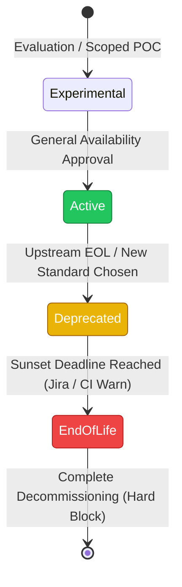

At 2:15 AM, the security operations center triggers an emergency incident: a critical Remote Code Execution (RCE) vulnerability has been discovered in a widely used HTTP client library. Remediation requires upgrading the library from version 2.14 to 3.2. However, when the platform team attempts to roll out the upgrade, they discover that 40 of the company’s 150 microservices are running on Go 1.16—a version that has been End-of-Life (EOL) for years—and the new library version requires at least Go 1.21. Upgrading the Go runtime for these 40 services is blocked because they rely on deprecated internal database wrappers that are incompatible with Go 1.18+'s generic constraints. The product teams responsible for these services haven't touched the codebase in two years, and the original developers have long since departed. What should have been a one-hour dependency bump turns into a multi-week, high-stress architectural overhaul while the company remains exposed to an active exploit. This is the reality of "stack rot." To prevent it, large engineering organizations must implement a programmatic Tech-Stack Lifecycle Policy that treats runtime and library depreciation not as an ad-hoc cleanup project, but as a continuous, automated operational loop.

## The Economic and Operational Cost of Stack Rot

Software rot is a compounding operational liability. The decision to defer upgrading a language runtime, database driver, or framework is often framed as a pragmatic trade-off to prioritize product features. In reality, this decision borrows against future engineering velocity at high interest rates. In production systems, stack rot manifests in three distinct ways:

1. **The Dependency Lock-In Cascade**: Every major library version bump eventually drops support for older runtime versions. If you run a service on Node.js 16 (EOL since September 2023), you cannot upgrade key libraries like `pg` (PostgreSQL client) or `express` to access critical security patches or performance improvements. You are forced to fork and patch upstream packages yourself or run vulnerable software.
2. **Onboarding Friction and Cognitive Load**: When new engineers join an organization, they expect to use modern language features and tools. Forcing developers to navigate legacy constructs (e.g., pre-generic Go, Java 8 streams, or legacy Python 2 codebases) introduces friction, slows down onboarding, and degrades developer morale.
3. **Observability and Infrastructure Drift**: Modern infrastructure platforms (such as Kubernetes clusters running on container runtimes like containerd or gVisor) continuously deprecate older system calls and kernel interfaces. An ancient runtime binary running inside a modern container image may fail under newer OS kernels due to changes in memory allocation behavior or deprecated system calls (e.g., `vfork` changes).

To quantify the cost: an organization running 200 microservices with no formal lifecycle policy spends approximately 15% of its total engineering capacity on reactive upgrades when forced by security audits, rather than proactive, planned upgrades that take minutes when performed continuously.

## The Lifecycle State Machine

A robust lifecycle policy classifies every runtime, framework, database, and internal library into one of four distinct states. Transitions between these states must be deterministic and driven by a published calendar rather than arbitrary architectural reviews.



### 1. Experimental
This state is reserved for new technologies undergoing active evaluation. Engineers can use experimental stacks only within scoped proof-of-concepts (POCs) that meet specific criteria:
* Must not handle production customer traffic.
* Must be sandboxed to a specific staging environment.
* Must have a designated sponsor who commits to either migrating to an "Active" stack or decommissioning the service within 90 days.

### 2. Active (Paved Road)
Technologies in the "Active" state represent the organization's standard stack—the "Paved Road" (or Golden Path). These technologies receive full support from the platform team, including:
* Standardized base container images optimized for security and performance.
* Pre-configured CI/CD templates with integrated linting, security scanning, and deployments.
* Fully instrumented telemetry libraries (OpenTelemetry) out of the box.

*Rule of thumb:* Limit the number of active runtimes. For example, choose one JVM language (Java LTS), one system language (Go), and one scripting/frontend runtime (Node.js LTS). Having more than three active runtimes in a microservice environment significantly dilutes the platform team’s ability to build high-quality tooling.

### 3. Deprecated
A technology enters the "Deprecated" state when an upstream vendor announces an EOL date, a severe structural flaw is uncovered, or the architecture group designates a superior replacement.
* **Impact**: No new services may be built using a deprecated technology. Existing services are granted a fixed migration window (typically 180 days) to upgrade to an active version.
* **Tooling Action**: CI builds emit non-blocking warnings, and the service owner receives automated notifications.

### 4. End-of-Life (EOL)
Once the deprecation grace period expires, the technology transitions to EOL. 
* **Impact**: The technology is no longer permitted in production. 
* **Tooling Action**: CI/CD pipelines actively fail builds, and deployment platforms block new releases of any container using EOL components.

## Building the Stack Registry: Continuous Inventory and Cataloging

To enforce a lifecycle policy, you must have real-time visibility into what is actually running in production. Relying on manual developer surveys or spreadsheets is useless. Instead, implement a two-tier automated discovery architecture: static lockfile analysis and dynamic container image inspection.

### Defining the Lifecycle Policy Schema
The core of the system is a centralized repository containing the `lifecycle-policy.json` file. This file acts as the single source of truth for the validation engine:

```json
{
  "$schema": "https://mohashari.com/schemas/lifecycle-policy.v1.json",
  "policy_version": "2026.06.21",
  "runtimes": {
    "nodejs": {
      "active": [">=20.0.0 <21.0.0", ">=22.0.0"],
      "deprecated": [">=18.0.0 <20.0.0"],
      "eol": ["<18.0.0"]
    },
    "golang": {
      "active": [">=1.22.0"],
      "deprecated": [">=1.20.0 <1.22.0"],
      "eol": ["<1.20.0"]
    }
  },
  "libraries": {
    "github.com/gin-gonic/gin": {
      "active": [">=1.9.0"],
      "deprecated": [">=1.8.0 <1.9.0"],
      "eol": ["<1.8.0"]
    },
    "github.com/mohashari/legacy-db-helper": {
      "active": [],
      "deprecated": [">=2.0.0"],
      "eol": ["<2.0.0"]
    }
  }
}
```

### Integrating with Software Catalogs
If your organization uses Spotify Backstage, you can expose this metadata directly on the service catalog dashboard. Using Backstage's `catalog-info.yaml` specification, ingest service configurations and compare them against the central policy:

```yaml
apiVersion: backstage.io/v1alpha1
kind: Component
metadata:
  name: billing-reconciliation-service
  description: "Processes nightly transactional reconciliation runs."
  annotations:
    mohashari.com/runtime: "nodejs@18.19.0"
    mohashari.com/tech-stack-owner: "billing-squad"
spec:
  type: service
  lifecycle: production
  owner: billing-squad
  system: billing-core
```

A nightly cron job queries the Backstage catalog, pulls the metadata, cross-references it with the active `lifecycle-policy.json`, and calculates an organizational compliance score.

| Component Name | Runtime Version | Lifecycle Status | Target Version | Sunset Deadline |
| :--- | :--- | :--- | :--- | :--- |
| `payment-gateway` | `golang@1.22.2` | **Active** | N/A | N/A |
| `billing-reconciliation` | `nodejs@18.19.0` | **Deprecated** | `nodejs@20.x` | 2026-09-30 |
| `legacy-reports-worker` | `nodejs@16.14.0` | **EOL** | `nodejs@20.x` | Immediate (Blocked) |

## Declarative Policy Enforcement in CI/CD

Static metadata fields in a YAML file can lie. The actual code, dependencies, and container images cannot. To guarantee enforcement, you must embed automated checks directly into the deployment loop.

The most resilient place to enforce this policy is in the CI/CD pipeline, validating both the lockfiles at build time and the generated Software Bill of Materials (SBOM) at deployment time.

### Build-Time Lockfile Parsing
In your central CI pipeline template (e.g., GitHub Actions, GitLab CI), execute a script that parses the repository's native dependency lockfile and compares it against the policy engine. Below is a simplified implementation of a Go validation step inside a GitHub Action:

```yaml
name: Tech-Stack Lifecycle Verification

on:
  pull_request:
    branches: [ main ]

jobs:
  validate-lifecycle:
    runs-on: ubuntu-latest
    steps:
      - name: Checkout Code
        uses: actions/checkout@v4

      - name: Parse go.mod Runtime
        id: parse_runtime
        run: |
          GO_VERSION=$(grep -E "^go [0-9]+\.[0-9]+" go.mod | awk '{print $2}')
          echo "Detected Go Version: $GO_VERSION"
          echo "go_version=$GO_VERSION" >> $GITHUB_OUTPUT

      - name: Validate Against Lifecycle Policy
        run: |
          # Fetch centralized policy
          curl -s https://raw.githubusercontent.com/mohashari/lifecycle-policy/main/policy.json -o policy.json
          
          GO_VERSION="${{ steps.parse_runtime.outputs.go_version }}"
          
          # Check if Go version is EOL using jq version helper
          IS_EOL=$(jq --arg ver "$GO_VERSION" '
            .runtimes.golang.eol[] | 
            select(
              # Clean semver comparison simulator in jq
              split(".") as $p | ($ver | split(".")) as $v |
              ( ($v[0]|tonumber) < ($p[0]|replace("[<>=\\s]"; "")|tonumber) ) or
              ( (($v[0]|tonumber) == ($p[0]|replace("[<>=\\s]"; "")|tonumber)) and (($v[1]|tonumber) < ($p[1]|tonumber)) )
            )
          ' policy.json)
          
          if [ ! -z "$IS_EOL" ]; then
            echo "::error::Go Version $GO_VERSION is marked as End-of-Life (EOL). Deployment blocked."
            exit 1
          fi
          
          IS_DEPRECATED=$(jq --arg ver "$GO_VERSION" '
            .runtimes.golang.deprecated[] | 
            select(
              # Checks deprecation range
              split(".") as $p | ($ver | split(".")) as $v |
              ( ($v[0]|tonumber) == ($p[0]|replace("[<>=\\s]"; "")|tonumber) ) and 
              ( ($v[1]|tonumber) >= ($p[1]|tonumber) )
            )
          ' policy.json)

          if [ ! -z "$IS_DEPRECATED" ]; then
            echo "::warning::Go Version $GO_VERSION is Deprecated. Plan upgrade to active version before deadline."
          fi
```

### Deployment-Time SBOM Verification (Open Policy Agent)
Attackers often bypass build-time checks by injecting compiled binaries directly into container base images. To prevent this, force CI pipelines to output a Software Bill of Materials (SBOM) using tools like **Syft** during the build stage:

```bash
syft output/my-app-image:latest -o json > sbom.json
```

Then, evaluate the output `sbom.json` against an **Open Policy Agent (OPA)** rule file before allowing the deployment to proceed via ArgoCD or a manual Kubernetes apply. Below is an OPA Rego policy (`lifecycle.rego`) that blocks images built using EOL Node.js runtimes:

```rego
package mohashari.lifecycle

import future.keywords.in

default allow = false
default deny_reason = ""

# Define EOL packages from external policy context
eol_runtimes := {
    "node": ["14", "16", "17"]
}

# Allow if no violations are detected
allow {
    count(violations) == 0
}

# Collect violations by analyzing the SBOM packages
violations[pkg_name] {
    some pkg in input.artifacts
    pkg_name := pkg.name
    pkg_name == "node"
    
    # Extract major version number (e.g. "16.14.0" -> "16")
    version_parts := split(pkg.version, ".")
    major_version := version_parts[0]
    
    major_version in eol_runtimes["node"]
}

# Generate clear rejection reasoning
deny_reason = msg {
    count(violations) > 0
    msg := sprintf("Deployment rejected. The following EOL components were detected in the container image: %v", [violations])
}
```

Evaluate this Rego file locally during the release pipeline:

```bash
opa eval -i sbom.json -d lifecycle.rego "data.mohashari.lifecycle.allow"
```

If `allow` evaluates to `false`, the build step returns a non-zero exit code, terminating the pipeline and preventing the deployment from reaching production.

## Programmatic Migrations: Automating Deprecations at Scale

Telling product teams "you must upgrade your library" is ineffective. Engineering resources are finite, and deprecation migrations are rarely prioritized over business deliverables. To scale deprecations, Platform Engineering must pivot from a model of *policing* to a model of *automation*.

### Automated Upgrades with Renovate and Custom Rules
Instead of manually updating dependencies across 200 repositories, deploy an internal instance of **Renovate Bot** configured with custom package rules. You can configure Renovate to continuously open Pull Requests for runtime modifications (such as bumping Go versions in `go.mod` or node versions in `package.json`) and automatically assign them to code owners.

Here is a centralized `renovate.json` configuration that automatically creates upgrades for deprecation paths:

```json
{
  "$schema": "https://docs.renovatebot.com/renovate-schema.json",
  "extends": ["config:recommended"],
  "packageRules": [
    {
      "matchPackageNames": ["go"],
      "matchCurrentVersion": "< 1.22.0",
      "automerge": false,
      "labels": ["lifecycle-update", "go-upgrade"],
      "schedule": ["before 5am on Monday"]
    },
    {
      "matchPackageNames": ["node"],
      "matchCurrentVersion": "< 20.0.0",
      "automerge": false,
      "labels": ["lifecycle-update", "node-upgrade"]
    }
  ]
}
```

### Codemod Migrations for API Deprecations
When deprecating internal library interfaces (e.g., transitioning from a legacy `v1` serialization library to a high-performance protobuf implementation), write structural search-and-replace scripts using tools like **ast-grep** or **OpenRewrite**.

For example, if you deprecate a custom logger initialization signature:

```go
// Legacy signature
logger := log.NewLegacyLogger(log.Config{Level: "debug"})
```

And want to migrate to the structured Go `slog` implementation:

```go
// Target signature
logger := slog.New(slog.NewJSONHandler(os.Stdout, &slog.HandlerOptions{Level: slog.LevelDebug}))
```

Write an `ast-grep` rule file (`migrate-logger.yml`):

```yaml
id: migrate-legacy-logger
language: go
rule:
  pattern: log.NewLegacyLogger(log.Config{Level: $LEVEL})
fix: |
  slog.New(slog.NewJSONHandler(os.Stdout, &slog.HandlerOptions{
    Level: map[string]slog.Level{
      "debug": slog.LevelDebug,
      "info":  slog.LevelInfo,
      "warn":  slog.LevelWarn,
      "error": slog.LevelError,
    }[$LEVEL],
  }))
```

Run this command across all repository folders:

```bash
ast-grep --config migrate-logger.yml --update-all
```

Commit the output, push branches, and open pull requests automatically. By doing this, you remove 90% of the manual labor required by individual product teams, ensuring that the migration is completed before the target deprecation date.

## Governance, Ownership, and the Exception Process

A policy is only as effective as its governance model. If you block deployments without offering a clear, audited escape hatch, developers will find workarounds (such as modifying base image definitions dynamically or masking lockfiles).

### The Lifecycle Exception Configuration
Exceptions to the lifecycle policy must be explicitly configured inside the target repository using a `.lifecycle-exception.yaml` file. The presence of this file allows the pipeline to bypass hard deployment blocks temporarily, but it enforces strict requirements:

```yaml
version: v1
exceptions:
  - id: LC-EX-10492
    component: "nodejs"
    target_version: "16.20.2"
    expiry_date: "2026-09-30"
    justification: "Legacy billing sync processor slated for decommissioning in Q4 2026. Code resides in isolated VPC with no direct ingress paths."
    owner: "billing-squad"
    approver: "security-architecture-board"
    ticket: "JIRA-DEBT-4019"
```

The validation engine matches the configuration against the following constraints:
1. **Expiry Verification**: If the current system date is past `expiry_date`, the build fails immediately. The exception is void, and no override is allowed without a new ticket approval.
2. **Approved IDs**: The exception ID (`LC-EX-10492`) must correspond to a signed cryptographic payload managed by the platform team’s secret vault or a record in the central inventory DB.
3. **Audit Trail**: The justification and JIRA ticket must be present, providing the security team with clear operational context during audits.

### Establishing the Escalation Matrix
The platform team must set operational SLOs based on the severity of the version mismatch:

| State | Remediation SLO | Action if Missed |
| :--- | :--- | :--- |
| **Deprecated** | 180 Days | Warning notifications sent to Engineering Director. |
| **EOL (Non-critical)** | 30 Days | deployment blocks enabled in Staging/Sandbox. |
| **EOL (Known Critical CVE)** | 7 Days | Production deployments disabled. Rollbacks only. |

By aligning lifecycle phases directly with automated gates, platform engineers can transition away from manually chasing teams for upgrades. Product teams are naturally incentivized to keep their dependency stack up to date because doing so is the only path to maintaining continuous deployment speed.