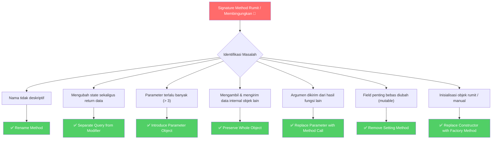

Saat kita menulis kode pertama kali, fokus utama kita adalah membuat kode tersebut berjalan sesuai kebutuhan. Namun, seiring berjalannya waktu dan berkembangnya sistem, cara kita memanggil fungsi dan method sering kali menjadi rumit. Parameter yang terlalu banyak, method yang melakukan dua hal sekaligus, atau inisialisasi objek secara manual yang tersebar di mana-mana adalah beberapa tanda bahwa antarmuka (API) kode kita mulai "berbau busuk" (*code smell*).

Antarmuka method yang bersih dan intuitif adalah kunci utama dari codebase yang mudah dirawat. Di artikel bagian kesembilan dari seri refactoring ini, kita akan membahas tujuh teknik untuk menyederhanakan pemanggilan method, lengkap dengan contoh idiomatic di Go.

---

## 🎯 Takeaway

Setelah membaca artikel ini, kamu akan mampu:

- 🏷️ **Rename Method** dengan tepat untuk memperjelas maksud/intensi kode.
- ⚡ **Separate Query from Modifier** untuk memisahkan fungsi pembaca data dan pengubah data.
- 📦 **Introduce Parameter Object** guna merapikan parameter fungsi yang terlalu banyak.
- 🔍 **Preserve Whole Object** untuk menghindari ekstraksi field yang tidak perlu sebelum memanggil fungsi.
- 🔗 **Replace Parameter with Method Call** untuk memangkas jumlah argumen yang dikirim.
- 🛡️ **Remove Setting Method** demi menjaga immutability objek.
- 🏭 **Replace Constructor with Factory Method** untuk pembuatan objek yang lebih bersih dan aman di Go.

---

## Peta Teknik Menyederhanakan Pemanggilan Method



---

## Teknik 1: Rename Method

### Apa Masalahnya?

Nama fungsi atau method tidak dengan jelas mendeskripsikan apa yang dilakukannya. Nama yang buruk memaksa pembaca untuk melihat implementasi internal fungsi hanya untuk memahami cara menggunakannya. Jangan takut melakukan rename jika nama tersebut mempermudah pemahaman kode.

Di Go, konvensi penamaan menyarankan nama yang singkat, langsung pada intinya, dan menghindari kata seperti `Get` untuk fungsi yang bersifat *getter* (cukup gunakan nama propertinya langsung).

### Contoh Bad Code (❌)

```go
// ❌ BAD: Nama terlalu panjang, melanggar konvensi Go (penggunaan 'Get' untuk getter),
// dan kurang mencerminkan intensi yang ringkas.
func (db *UserDB) GetActiveUsersFromDatabaseAndCheckStatus() []User {
    // ...
}
```

### Perbaikan (✅)

**Gunakan nama yang ringkas, deskriptif, dan sesuai konvensi idiomatic Go:**

```go
// ✅ GOOD: Singkat, jelas, dan mengikuti konvensi penamaan Go.
func (db *UserDB) ActiveUsers() []User {
    // ...
}
```

---

## Teknik 2: Separate Query from Modifier

### Apa Masalahnya?

Sebuah fungsi melakukan dua pekerjaan sekaligus: mengembalikan suatu nilai (Query) **dan** mengubah state dari objek/sistem (Modifier). Hal ini melanggar prinsip **Command-Query Separation (CQS)**. Fungsi yang memiliki efek samping (*side-effect*) tersembunyi seperti ini sulit diuji (*test*), tidak aman dipanggil berulang kali, dan sering menimbulkan bug tak terduga.

### Contoh Bad Code (❌)

```go
// ❌ BAD: Fungsi mengambil token sekaligus mengupdate total pembacaan di database (side-effect).
func (s *TokenService) GetAndIncrementToken(userID string) string {
    token := s.db.FindToken(userID)
    s.db.IncrementUsageCount(userID) // Side-effect!
    return token
}
```

### Perbaikan (✅)

**Pisahkan menjadi dua fungsi terpisah: satu untuk query data, dan satu untuk memodifikasi state:**

```go
// ✅ GOOD: Pemisahan yang jelas antara Query dan Modifier (Command)

// Query: Hanya mengembalikan data token tanpa efek samping
func (s *TokenService) Token(userID string) string {
    return s.db.FindToken(userID)
}

// Modifier: Hanya mengubah state token di database
func (s *TokenService) IncrementUsage(userID string) {
    s.db.IncrementUsageCount(userID)
}
```

---

## Teknik 3: Introduce Parameter Object

### Apa Masalahnya?

Sebuah fungsi menerima daftar parameter yang sangat panjang (biasanya lebih dari tiga parameter). Parameter yang terlalu banyak membuat fungsi sulit dibaca, rentan terhadap kesalahan urutan argumen saat dipanggil, dan sulit untuk ditambahkan parameter baru di kemudian hari.

### Contoh Bad Code (❌)

```go
// ❌ BAD: Terlalu banyak parameter bertipe string yang berurutan. 
// Sangat mudah tertukar saat memanggil fungsi ini!
func CreateUser(username string, email string, firstName string, lastName string, address string, phone string) *User {
    return &User{
        Username:  username,
        Email:     email,
        FirstName: firstName,
        LastName:  lastName,
        Address:   address,
        Phone:     phone,
    }
}
```

### Perbaikan (✅)

**Grup parameter-parameter yang berhubungan ke dalam sebuah struct:**

```go
// ✅ GOOD: Menggunakan struct untuk menampung parameter terkait.

type CreateUserRequest struct {
    Username  string
    Email     string
    FirstName string
    LastName  string
    Address   string
    Phone     string
}

func CreateUser(req CreateUserRequest) *User {
    return &User{
        Username:  req.Username,
        Email:     req.Email,
        FirstName: req.FirstName,
        LastName:  req.LastName,
        Address:   req.Address,
        Phone:     req.Phone,
    }
}
```

---

## Teknik 4: Preserve Whole Object

### Apa Masalahnya?

Kamu mengekstrak beberapa nilai dari sebuah objek, lalu mengirimkan nilai-nilai tersebut secara individual sebagai parameter fungsi. Jika di kemudian hari fungsi tersebut membutuhkan data tambahan dari objek yang sama, kamu terpaksa harus mengubah signature fungsi dan semua tempat di mana fungsi tersebut dipanggil.

### Contoh Bad Code (❌)

```go
type Product struct {
    Price float64
    Width float64
    Height float64
}

// ❌ BAD: Hanya membutuhkan dimensi produk tetapi mengekstrak field-nya satu per satu.
func (s *ShippingService) CalculateCost(width float64, height float64) float64 {
    return (width * height) * 1000
}

// Cara panggil:
cost := shippingSvc.CalculateCost(product.Width, product.Height)
```

### Perbaikan (✅)

**Kirimkan seluruh objek ke fungsi tersebut secara langsung:**

```go
// ✅ GOOD: Mengirim seluruh objek Product. Jika nanti butuh field lain (misal Price), 
// signature fungsi tidak perlu diubah.
func (s *ShippingService) CalculateCost(p *Product) float64 {
    return (p.Width * p.Height) * 1000
}

// Cara panggil:
cost := shippingSvc.CalculateCost(product)
```

---

## Teknik 5: Replace Parameter with Method Call

### Apa Masalahnya?

Kamu mengirimkan nilai sebagai parameter ke sebuah fungsi, padahal fungsi penerima sebenarnya bisa mendapatkan atau menghitung nilai tersebut sendiri. Mengurangi parameter membuat antarmuka fungsi lebih ramping dan memindahkan tanggung jawab kalkulasi ke tempat yang semestinya.

### Contoh Bad Code (❌)

```go
// ❌ BAD: Mengirim total harga setelah diskon sebagai parameter, 
// padahal fungsi ini bisa menghitungnya sendiri jika diberi objek Order.
func (e *EmailService) SendReceipt(order *Order, finalPrice float64) {
    body := fmt.Sprintf("Terima kasih, total belanja Anda adalah Rp%.2f", finalPrice)
    e.send(order.User.Email, body)
}

// Cara panggil:
finalPrice := order.BasePrice() - order.Discount()
emailSvc.SendReceipt(order, finalPrice)
```

### Perbaikan (✅)

**Biarkan fungsi menghitung atau mengambil nilainya sendiri dari objek yang sudah dimilikinya:**

```go
// ✅ GOOD: Fungsi menghitung sendiri nilai yang dibutuhkan. Signature menjadi lebih bersih.
func (e *EmailService) SendReceipt(order *Order) {
    finalPrice := order.BasePrice() - order.Discount()
    body := fmt.Sprintf("Terima kasih, total belanja Anda adalah Rp%.2f", finalPrice)
    e.send(order.User.Email, body)
}

// Cara panggil:
emailSvc.SendReceipt(order)
```

---

## Teknik 6: Remove Setting Method

### Apa Masalahnya?

Menyediakan method setter (`SetField`) untuk field yang nilainya seharusnya diisi hanya sekali saat objek dibuat (inisialisasi). Membiarkan field objek mutable (dapat diubah kapan saja) meningkatkan kompleksitas program dan memperbesar risiko terjadinya *race condition* atau inkonsistensi data.

Di Go, buatlah struct yang memiliki field non-ekspor (huruf kecil) dan hanya sediakan fungsi getter jika ingin melindungi data tersebut agar bersifat *read-only*.

### Contoh Bad Code (❌)

```go
// ❌ BAD: ID transaksi seharusnya bersifat read-only setelah dibuat, 
// tetapi memiliki setter yang memungkinkannya diubah secara sengaja maupun tidak sengaja.
type Transaction struct {
    ID     string
    Amount float64
}

func (t *Transaction) SetID(id string) {
    t.ID = id // Bahaya: ID transaksi bisa diubah di tengah jalan!
}
```

### Perbaikan (✅)

**Sembunyikan field (jadikan unexported) dan hapus method setter-nya:**

```go
// ✅ GOOD: Field id bersifat unexported (huruf kecil) dan tidak memiliki setter.
type Transaction struct {
    id     string // Hanya bisa diakses secara langsung di dalam package yang sama
    Amount float64
}

// Constructor untuk menyetel nilai awal
func NewTransaction(id string, amount float64) *Transaction {
    return &Transaction{id: id, Amount: amount}
}

// Hanya menyediakan getter
func (t *Transaction) ID() string {
    return t.id
}
```

---

## Teknik 7: Replace Constructor with Factory Method

### Apa Masalahnya?

Pembuatan objek dilakukan secara langsung menggunakan inisialisasi struct literal (`&MyStruct{}`) di berbagai bagian codebase. Hal ini menyulitkan jika kita ingin menambahkan logika validasi, menyetel nilai default, atau mengembalikan tipe interface secara dinamis saat objek dibuat.

### Contoh Bad Code (❌)

```go
type Connection struct {
    Host    string
    Port    int
    Timeout time.Duration
}

// ❌ BAD: Pengguna struct harus tahu cara melakukan inisialisasi default secara manual di mana-mana.
conn := &Connection{
    Host:    "127.0.0.1",
    Port:    5432,
    Timeout: 30 * time.Second, // Bagaimana jika developer lain lupa menyetel timeout?
}
```

### Perbaikan (✅)

**Gunakan Factory Function (sangat idiomatic di Go!). Di Go, pola ini biasanya diawali dengan kata `New` atau `NewStructName`:**

```go
// ✅ GOOD: Menggunakan Factory Function untuk menjamin inisialisasi yang aman dan valid.

type Connection struct {
    Host    string
    Port    int
    Timeout time.Duration
}

func NewConnection(host string, port int) (*Connection, error) {
    if host == "" {
        return nil, fmt.Errorf("host tidak boleh kosong")
    }
    if port <= 0 {
        return nil, fmt.Errorf("port tidak valid")
    }

    return &Connection{
        Host:    host,
        Port:    port,
        Timeout: 30 * time.Second, // Nilai default terpusat di satu tempat
    }, nil
}
```

---

## Kapan Tidak Melakukan Refactoring Ini?

Meskipun teknik menyederhanakan pemanggilan method sangat direkomendasikan, ada situasi di mana kamu sebaiknya berhati-hati:

- **Preserve Whole Object**: Jika objek yang dikirim membuat dependensi antar-package menjadi terlalu ketat (*tight coupling*), lebih baik oper nilai primitifnya saja untuk menjaga modularitas.
- **Introduce Parameter Object**: Jika fungsi tersebut hanya memiliki dua parameter yang jarang berubah, tidak perlu membuat struct baru yang justru menambah beban kognitif pembaca kode.
- **Separate Query from Modifier**: Terkadang demi performa tingkat tinggi (seperti operasi atomik di multi-threading), mengambil dan mengubah nilai harus dilakukan secara bersamaan (misal `sync/atomic` di Go). Dalam kasus ini, pemisahan CQS tidak disarankan karena melanggar keamanan konkurensi.

---

## 📝 Ringkasan

Menulis fungsi dengan antarmuka yang bersih adalah bentuk kepedulian terhadap rekan satu tim dan diri kita sendiri di masa depan. Berikut ringkasan teknik yang telah kita pelajari:

| Teknik | Kapan Digunakan | Manfaat Utama |
|---|---|---|
| **Rename Method** | Nama fungsi tidak jelas atau membingungkan | Membaca kode terasa seperti membaca prosa |
| **Separate Query from Modifier** | Fungsi mengembalikan nilai & mengubah state | Menghilangkan efek samping tersembunyi |
| **Introduce Parameter Object** | Fungsi memiliki terlalu banyak parameter | Mencegah kesalahan argumen tertukar |
| **Preserve Whole Object** | Mengambil & mengirim banyak field objek lain | Fleksibilitas jika butuh field tambahan di masa depan |
| **Replace Parameter with Method Call** | Argumen bisa dicari sendiri oleh fungsi | Menyederhanakan parameter yang tidak perlu |
| **Remove Setting Method** | Field objek boleh diubah bebas setelah dibuat | Menjaga immutability data objek |
| **Replace Constructor with Factory Method** | Pembuatan objek butuh validasi/default value | Pembuatan objek terkendali dan konsisten (Go Idiom) |

Sebagai seorang Gopher, mulailah menerapkan teknik **Factory Function (New...)** dan **Rename Method** (tanpa prefix `Get`) secara konsisten. Dua teknik ini akan membuat kode Go kamu terlihat sangat profesional dan selaras dengan *standard library* Go.

---

**🇮🇩 Versi Indonesia** | [🇬🇧 English Version](/refactoring-part-9-simplify-method-calls)
