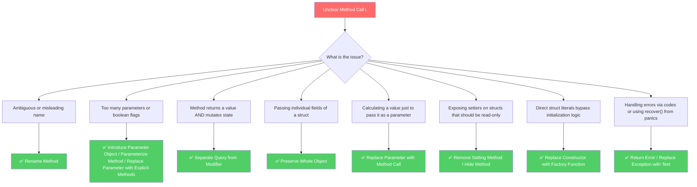

Imagine you are called to debug a critical payment failure on a Tuesday morning. You locate the payment entrypoint in the code, and its signature looks like this:

`func ProcessPayment(ctx context.Context, uID string, amt int, isRetry bool, gateway string, discCode string, notifyUser bool, isCallback bool) (*Receipt, error)`

You need to call this function from a new endpoint. What should you pass for `isRetry`? What if it is not a callback? What if `discCode` is empty? You end up writing `ProcessPayment(ctx, userID, 15000, false, "stripe", "", true, false)` and praying you didn't mix up the positions of the boolean flags.

This is a classic symptom of method calls that have grown organically without disciplined design. When method interfaces become convoluted, they turn into cognitive bottlenecks and integration hazards. In this article, we'll explore fourteen refactoring techniques to simplify method calls, focusing on how to translate these ideas into idiomatic, production-grade Go.

---

## 🎯 Takeaway

After reading this article, you will be able to:
- 🏷️ **Name Methods Clearly** to state their exact behavior and avoid package-name stuttering.
- 🧱 **Decouple Commands and Queries** by ensuring methods either modify state or return values, but not both.
- 📦 **Consolidate Parameter Bloat** into cohesive Parameter Objects.
- 🤝 **Maintain Flexible Interfaces** by passing whole objects instead of individual properties.
- 🛠️ **Leverage Factory Functions and Functional Options** to instantiate objects cleanly and safely in Go.
- 🛡️ **Replace Fragile Patterns** like error codes and panics with Go's standard error handling and state pre-checks.

---

## Method Call Refactoring Decision Map

Use this decision map to choose the correct method call refactoring technique depending on the design issue you encounter:



---

## The 7 Core Refactoring Techniques

Let's dive deep into the seven most critical refactoring techniques for simplifying method calls in Go.

---

### Technique 1: Rename Method

#### What is the Problem?
A method’s name should tell the reader *what* the method does, not how it does it. Ambiguous names force developers to read the implementation to understand the behavior. In Go, we must also avoid "stuttering" (e.g., naming a method `GetUserData` when the package is already named `user`, resulting in `user.GetUserData()`).

#### Bad Code Example (❌)
```go
package user

// ❌ BAD: Ambiguous method name. Does it load from the database, 
// transform data, or write to standard output?
func (u *User) Process() string {
	return fmt.Sprintf("%s <%s>", u.Name, u.Email)
}
```

#### Fix (✅)
```go
package user

// ✅ GOOD: Clear, self-documenting name that avoids stuttering when called.
// Call site reads: u.FormatContactInfo()
func (u *User) FormatContactInfo() string {
	return fmt.Sprintf("%s <%s>", u.Name, u.Email)
}
```

---

### Technique 2: Separate Query from Modifier

#### What is the Problem?
A method should either return a value (a query) or change the state of an object (a modifier), but not both. This is known as **Command-Query Separation (CQS)**. When queries modify state, they introduce hidden side effects, making concurrency difficult and unit tests fragile.

#### Bad Code Example (❌)
```go
// ❌ BAD: Returns the status while mutating the login counter and last login timestamp.
func (s *UserService) GetAndTrackUserStatus(userID string) (string, error) {
	user, err := s.db.Find(userID)
	if err != nil {
		return "", err
	}
	
	user.LoginCount++
	user.LastLogin = time.Now()
	
	if err := s.db.Update(user); err != nil {
		return "", err
	}
	return user.Status, nil
}
```

#### Fix (✅)
Split the code into a pure query method and a clear state-mutating modifier method:

```go
// ✅ GOOD: Query method has no side effects.
func (s *UserService) GetUserStatus(userID string) (string, error) {
	user, err := s.db.Find(userID)
	if err != nil {
		return "", err
	}
	return user.Status, nil
}

// ✅ GOOD: Modifier method explicitly signals write intent.
func (s *UserService) IncrementLoginActivity(userID string) error {
	user, err := s.db.Find(userID)
	if err != nil {
		return err
	}
	user.LoginCount++
	user.LastLogin = time.Now()
	return s.db.Update(user)
}
```

---

### Technique 3: Introduce Parameter Object

#### What is the Problem?
When a function takes more than three or four parameters, it becomes difficult to read, write, and maintain. In Go, since there are no named parameters at call sites (unlike Python or Swift), a long list of parameters of the same type (like strings) is highly prone to subtle positioning bugs.

#### Bad Code Example (❌)
```go
// ❌ BAD: Too many positional parameters of the same type. Easy to mix up street and city.
func CreateOrder(
	userID string, 
	name string, 
	email string, 
	phone string, 
	street string, 
	city string, 
	zip string, 
	items []OrderItem,
) (*Order, error) {
	// Processing...
	return &Order{}, nil
}
```

#### Fix (✅)
Group related parameters into clean, cohesive structs. This also makes it easier to extend the parameters in the future without breaking existing function signatures:

```go
// ✅ GOOD: High-cohesion structs grouped as a single Parameter Object.

type ContactInfo struct {
	Name  string
	Email string
	Phone string
}

type Address struct {
	Street string
	City   string
	ZIP    string
}

type CreateOrderRequest struct {
	UserID   string
	Contact  ContactInfo
	Shipping Address
	Items    []OrderItem
}

func CreateOrder(req CreateOrderRequest) (*Order, error) {
	// Processing becomes easier and cleaner: req.Shipping.City, etc.
	return &Order{}, nil
}
```

---

### Technique 4: Preserve Whole Object

#### What is the Problem?
Instead of extracting three or four fields from an object and passing them into a function, pass the entire object. Passing individual values bloats the function signature and creates coupling between the caller and the details of how the function processes the data.

#### Bad Code Example (❌)
```go
// ❌ BAD: Caller is forced to manually extract properties. 
// If we need the user's Tier or Timezone tomorrow, this signature breaks.
func (s *NotificationService) SendWelcomeEmail(name string, email string) error {
	return s.mailer.Send(email, "Welcome!", "Hello " + name)
}

// Call site:
err := notificationSrv.SendWelcomeEmail(user.Name, user.Email)
```

#### Fix (✅)
```go
// ✅ GOOD: Pass the whole struct. Signature remains resilient to future changes.
func (s *NotificationService) SendWelcomeEmail(user *User) error {
	return s.mailer.Send(user.Email, "Welcome!", "Hello " + user.Name)
}

// Call site:
err := notificationSrv.SendWelcomeEmail(user)
```
*Note: If you want to keep your packages decoupled and avoid depending on a concrete `User` struct, you can define a smaller interface containing only the getters you need.*

---

### Technique 5: Replace Parameter with Method Call

#### What is the Problem?
If a function parameter is a value that can be calculated by calling a method on an object the function already has access to, the caller should not compute it. Let the function retrieve the value itself, reducing the caller's cognitive load.

#### Bad Code Example (❌)
```go
// ❌ BAD: The caller must calculate the discount rate and pass it in.
func CalculateDiscountPrice(basePrice float64, discountRate float64) float64 {
	return basePrice * (1 - discountRate)
}

// Call site:
rate := discountPolicy.GetRate(user)
price := CalculateDiscountPrice(basePrice, rate)
```

#### Fix (✅)
```go
// ✅ GOOD: Pass the policy and user; let the function query what it needs.
func CalculateDiscountPrice(basePrice float64, policy *DiscountPolicy, user *User) float64 {
	rate := policy.GetRate(user)
	return basePrice * (1 - rate)
}

// Call site:
price := CalculateDiscountPrice(basePrice, discountPolicy, user)
```

---

### Technique 6: Remove Setting Method

#### What is the Problem?
Public setter methods (e.g., `SetBalance`) destroy encapsulation. They allow fields to be altered from anywhere, violating business invariants. Structs should be immutable where possible. If state changes are required, they should happen through explicit business-domain methods.

#### Bad Code Example (❌)
```go
package bank

// ❌ BAD: Anyone can change the balance or ID directly, bypassing checks.
type Account struct {
	ID      string
	Balance float64
}

func (a *Account) SetBalance(balance float64) {
	a.Balance = balance
}
```

#### Fix (✅)
Unexport the fields (using lowercase names) and provide read-only getters. Mutating state must happen through explicit, validated operations:

```go
package bank

import "errors"

// ✅ GOOD: Encapsulated fields are protected from arbitrary outside writes.
type Account struct {
	id      string
	balance float64
}

func NewAccount(id string, initialBalance float64) *Account {
	return &Account{id: id, balance: initialBalance}
}

// Read-only getters
func (a *Account) ID() string       { return a.id }
func (a *Account) Balance() float64 { return a.balance }

// Validated mutator methods (No generic SetBalance)
func (a *Account) Deposit(amount float64) error {
	if amount <= 0 {
		return errors.New("deposit amount must be positive")
	}
	a.balance += amount
	return nil
}
```

---

### Technique 7: Replace Constructor with Factory Method

#### What is the Problem?
Go does not have built-in class constructors. Direct struct literals (`&UserService{}`) expose internal fields and allow clients to instantiate uninitialized or invalid objects. Furthermore, rigid positional constructor functions (`NewUserService(db, logger, cache)`) break all callers when dependencies change.

#### Bad Code Example (❌)
```go
// ❌ BAD: Adding a new configuration parameter breaks every caller in the codebase.
type UserService struct {
	DB       *sql.DB
	Logger   *zap.Logger
	Cache    *redis.Client
	Timeout  time.Duration
}

func NewUserService(db *sql.DB, logger *zap.Logger, cache *redis.Client, timeout time.Duration) *UserService {
	return &UserService{
		DB:      db,
		Logger:  logger,
		Cache:   cache,
		Timeout: timeout,
	}
}
```

#### Fix (✅)
Implement a factory function utilizing the **Functional Options** pattern. This is the gold standard in Go for configuring complex services cleanly and extensibly:

```go
// ✅ GOOD: Clean factory function with flexible, non-breaking functional options.

type UserService struct {
	db      *sql.DB
	logger  *zap.Logger
	cache   *redis.Client
	timeout time.Duration
}

type Option func(*UserService)

func WithLogger(logger *zap.Logger) Option {
	return func(s *UserService) {
		s.logger = logger
	}
}

func WithCache(cache *redis.Client) Option {
	return func(s *UserService) {
		s.cache = cache
	}
}

func WithTimeout(timeout time.Duration) Option {
	return func(s *UserService) {
		s.timeout = timeout
	}
}

func NewUserService(db *sql.DB, opts ...Option) *UserService {
	// Set default configurations
	srv := &UserService{
		db:      db,
		logger:  zap.NewNop(), // Default to no-op logger
		timeout: 30 * time.Second,
	}

	// Apply functional options
	for _, opt := range opts {
		opt(srv)
	}

	return srv
}

// Call site is clean and readable:
srv := NewUserService(db, WithTimeout(5*time.Second), WithCache(redisClient))
```

---

## Other Refactoring Techniques for Method Calls

While the seven techniques above represent the core tools, let's explore the remaining seven techniques from the catalog and how they translate to Go.

### 8. Add Parameter
When a method needs new information to do its job, add a parameter.
*Go Tip:* If you find yourself adding parameters frequently, refactor the signature to use a config struct or functional options to protect backward compatibility.

### 9. Remove Parameter
If a method no longer uses a parameter, delete it immediately to reduce cognitive noise.

### 10. Parameterize Method
If several methods perform similar tasks but differ only by a specific value, merge them into a single method that accepts that value as a parameter.
```go
// Instead of separate methods:
func (a *Account) ChargeTenPercent()  { a.balance *= 0.90 }
func (a *Account) ChargeTwentyPercent() { a.balance *= 0.80 }

// Refactor to:
func (a *Account) ChargeFee(percentage float64) {
	a.balance *= (1 - percentage)
}
```

### 11. Replace Parameter with Explicit Methods
The opposite of *Parameterize Method*. If a method changes its behavior dramatically based on a parameter (often a boolean flag), split it into separate, explicitly named methods.
```go
// Instead of:
func (c *Connection) Connect(secure bool) {
	if secure { /* setup TLS */ } else { /* setup TCP */ }
}

// Refactor to:
func (c *Connection) ConnectTLS() { ... }
func (c *Connection) ConnectPlaintext() { ... }
```

### 12. Hide Method
If a method is only called within the package it is defined in, make it unexported (change the first letter to lowercase). This keeps the package's public API surface area small and maintainable.

### 13. Replace Error Code with Return Error (Go's Exception Equivalent)
Historically, languages without exception handling (like C) returned integer status codes (e.g., `-1` for error). While languages like Java use `throw/catch` exceptions, Go relies on explicit multi-value error returns.
```go
// ❌ BAD: C-style error status code
func (db *DB) Save() int {
	if db.isReadOnly { return -1 }
	return 0
}

// ✅ GOOD: Idiomatic Go error return
func (db *DB) Save() error {
	if db.isReadOnly {
		return errors.New("cannot write to read-only database")
	}
	return nil
}
```

### 14. Replace Exception with Test/Pre-check
Some developers rely on catching exceptions or recovering from panics to handle expected execution paths. It is far more idiomatic and performant to perform validation checks ("tests") before executing operations.
```go
// ❌ BAD: Recovering from a panic on nil pointer
func PrintUserAge(u *User) {
	defer func() {
		if r := recover(); r != nil {
			fmt.Println("User was nil!")
		}
	}()
	fmt.Println(u.Profile.Age) // Panics if u or Profile is nil
}

// ✅ GOOD: Guard logic with a pre-check (test)
func PrintUserAge(u *User) {
	if u == nil || u.Profile == nil {
		fmt.Println("User or profile data unavailable")
		return
	}
	fmt.Println(u.Profile.Age)
}
```

---

## Case Study: Refactoring a Checkout Workflow

Let's look at a complex checkout flow that violates multiple method-call design rules and see how we can refactor it into clean, idiomatic Go.

### Before Refactoring (❌)

This implementation suffers from parameter bloat, Command-Query Separation violations, direct struct manipulation, and old-school error coding:

```go
package checkout

import "time"

type Order struct {
	ID        string
	Amount    float64
	UserEmail string
	Status    string
}

type CheckoutService struct {
	Gateway      string
	IsReadOnly   bool
	PromoApplied bool
}

// ❌ BAD: 
// 1. Long list of individual parameters.
// 2. Command-Query Separation violation: Mutates PromoApplied AND returns order status.
// 3. C-Style error codes instead of return error.
// 4. Exposed struct fields allowing external modifications.
func (s *CheckoutService) ProcessCheckout(
	orderID string,
	amount float64,
	email string,
	promo string,
	street string,
	city string,
	zip string,
) (string, int) {
	if s.IsReadOnly {
		return "FAILED", -1
	}

	if promo == "SUMMER50" {
		s.PromoApplied = true
		amount = amount * 0.5
	}

	order := &Order{
		ID:        orderID,
		Amount:    amount,
		UserEmail: email,
		Status:    "PROCESSED",
	}

	// Save to DB (simulated)
	println("Saving order to DB...", order.ID)

	return order.Status, 0 // 0 means Success
}
```

### After Refactoring (✅)

We simplify this workflow by:
1. Creating a `CheckoutRequest` Parameter Object.
2. Returning an idiomatic Go `error` instead of integer codes.
3. Separating the promotion logic (modifier) from the checkout execution (CQS).
4. Restructuring `CheckoutService` with a Factory Function and unexported fields to enforce boundaries.

```go
package checkout

import (
	"errors"
	"fmt"
)

type Order struct {
	id        string
	amount    float64
	userEmail string
	status    string
}

type CheckoutService struct {
	gateway      string
	isReadOnly   bool
	promoApplied bool
}

// ✅ GOOD: Factory function with default configuration protection
func NewCheckoutService(gateway string, isReadOnly bool) *CheckoutService {
	return &CheckoutService{
		gateway:    gateway,
		isReadOnly: isReadOnly,
	}
}

type Address struct {
	Street string
	City   string
	ZIP    string
}

// ✅ GOOD: Parameter Object groups order request data
type CheckoutRequest struct {
	OrderID string
	Amount  float64
	Email   string
	Promo   string
	Address Address
}

// ✅ GOOD: Mutator explicitly updates state, separating query from modification
func (s *CheckoutService) ApplyPromo(req *CheckoutRequest) {
	if req.Promo == "SUMMER50" && !s.promoApplied {
		s.promoApplied = true
		req.Amount = req.Amount * 0.5
	}
}

// ✅ GOOD: Clean signature, processes checkout, and returns idiomatic Go errors
func (s *CheckoutService) ProcessCheckout(req CheckoutRequest) (*Order, error) {
	if s.isReadOnly {
		return nil, errors.New("cannot process checkout: service is in read-only mode")
	}

	order := &Order{
		id:        req.OrderID,
		amount:    req.Amount,
		userEmail: req.Email,
		status:    "PROCESSED",
	}

	// Save to DB (simulated)
	fmt.Printf("Saving order %s (Amount: %.2f) to DB...\n", order.id, order.amount)

	return order, nil
}
```

### Side-by-Side Comparison

| Metric | Before Refactoring | After Refactoring |
| :--- | :--- | :--- |
| **Number of Parameters** | 7 parameters | 1 parameter (Struct) |
| **Error Handling** | C-Style Status Codes (`0`, `-1`) | Idiomatic Go `error` return |
| **Encapsulation** | Public mutable fields (`PromoApplied`) | Private fields, domain-driven mutations |
| **Command-Query Separation** | Mixed (mutates promo, returns status) | Separated into `ApplyPromo` and `ProcessCheckout` |
| **Caller Safety** | Weak; easy to swap string fields | High type-safety and structured request inputs |

---

## When Not to Refactor Method Calls

Refactoring method calls is essential for cleanliness, but over-engineering signatures can lead to problems:

- **Parameter Object Overkill**: If a function takes only two parameters, wrapping them into a struct adds unnecessary boilerplate. Keep simple signatures simple.
- **Functional Options Complexity**: If your struct has only one mandatory dependency and no optional configurations, a plain, simple factory function like `NewService(db)` is much easier to maintain than full Functional Options.
- **Polymorphism vs. Parameters**: Do not generalize methods with generic interfaces (`interface{}` or `any`) simply to avoid adding parameters. Explicit, typed parameters are always safer than runtime assertions.

---

## 📝 Summary / Recap

Simplifying method calls reduces the cognitive friction of using your interfaces. By applying these techniques, you ensure that your code reads like clear prose and minimizes bugs at the integration boundaries.

Here is a summary of the techniques we discussed:

| Refactoring Technique | When to Use | Key Benefit |
| :--- | :--- | :--- |
| **Rename Method** | Name is ambiguous or stutters | Clearly communicates intent without looking bloated |
| **Separate Query from Modifier** | Method queries state and mutates it | Eliminates side effects, simplifying testability |
| **Introduce Parameter Object** | Long parameter lists (3+ parameters) | Prevents parameter positioning bugs |
| **Preserve Whole Object** | Passing individual properties of a struct | Prevents code breakage when new fields are needed |
| **Replace Parameter with Method Call** | Caller calculates value function can get itself | Reduces caller cognitive workload |
| **Remove Setting Method** | Fields are modified directly | Enforces encapsulation and object validation rules |
| **Replace Constructor with Factory** | Complex instantiation or configuration | Clean object creation via Functional Options |
| **Replace Error Code with Return Error** | Return values are used to represent status | Idiomatic error handling in Go |
| **Replace Exception with Test** | Catching panics/exceptions for control flows | Prevents runtime crashes using safe pre-checks |

By prioritizing readable and well-bounded method signatures, you write software that is easier to maintain, document, and test.

---

[🇮🇩 Versi Indonesia](/refactoring-part-9-simplify-method-calls-id) | 🇬🇧 English Version
