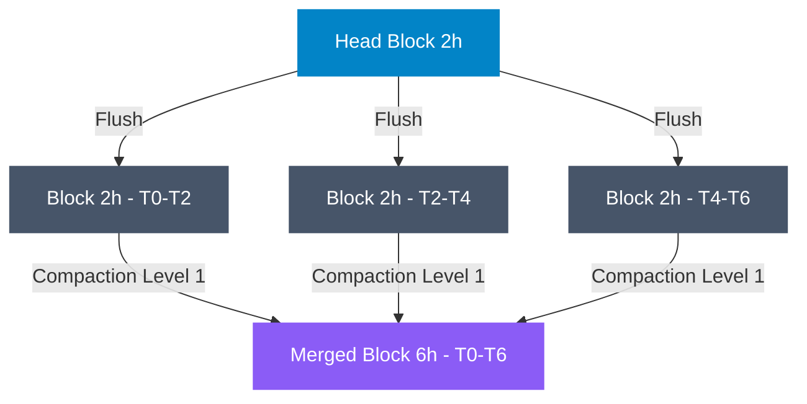

At 3:00 AM, the pager alerts fire with a critical alert: your core Prometheus instance, responsible for monitoring a high-throughput payment processing pipeline, has crashed due to an Out-Of-Memory (OOM) event. When Kubernetes restarts the pod, the system enters a devastating OOM loop: it spends ten minutes replaying the Write-Ahead Log (WAL), ballooning its memory consumption beyond its 64GB limit, only to be abruptly terminated by the kernel's OOM killer before it can scrape a single target. The root cause is a silent label injection: a newly deployed version of the checkout service began appending raw UUIDs as a `user_id` label to an HTTP latency histogram, exploding the active metric series from 50,000 to over 15 million in under an hour. In high-cardinality environments, standard Prometheus configurations fail because they cannot handle the memory spikes associated with merging massive, duplicate index structures during time-series database (TSDB) compaction. To build a resilient observability pipeline, you must tune block size durations, configure compaction limits, and adjust Go runtime variables to match the realities of high-cardinality data.


## The Anatomy of the Prometheus TSDB Disk Layout

To understand why Prometheus consumes massive amounts of memory under cardinality pressure, we must first dissect how the TSDB structures data on disk. If you inspect the storage directory (`/var/lib/prometheus/data`), you will see a layout containing several components: a write-ahead log (`wal/`), a set of directories named after UUIDs representing immutable block directories, and a transactional metadata file.

```
/var/lib/prometheus/data
├── 01FPS6E5D7MJK... (2h Block)
│   ├── chunks
│   │   └── 000001
│   ├── index
│   └── meta.json
├── 01FPS9H6T8YQ... (6h Merged Block)
│   ├── chunks
│   │   ├── 000001
│   │   └── 000002
│   ├── index
│   └── meta.json
├── wal
│   ├── 00000000
│   └── 00000001
└── tombstone
```

Each block directory represents a specific time range (by default, 2 hours) and contains three essential components:

1. **`chunks/`**: Raw time-series samples. Chunks store time-value pairs compressed using Gorilla XOR delta-of-delta compression, which compresses floating-point samples to an average of 1.37 bytes per sample.
2. **`index`**: The index file maps metric names and label keys/values to unique series IDs. The index is structured as a table containing a symbol table (a dictionary of all unique string keys and values), series records, and posting lists. Posting lists are arrays of series IDs that share a specific label set (e.g., all series containing `method="POST"`), allowing Prometheus to perform quick set-intersection operations during queries.
3. **`meta.json`**: A metadata file specifying the minimum and maximum timestamp of the block, the total number of series, the sample count, and compaction lineage (which source blocks were merged to create this one).

## The Mechanics of the In-Memory Head Block

All incoming write requests are directed to the Head block, which is the only write-active portion of the TSDB. The Head block keeps the last 2 hours of scraped data in memory. When a sample is scraped, the following sequence occurs:

1. **WAL Append**: The raw sample is appended to the WAL file on disk. This is a sequential append operation (`O_APPEND`) designed for durability; if the instance crashes, Prometheus can reconstruct the Head state by replaying these files.
2. **Head Chunk Insertion**: The sample is inserted into an active chunk for its series in the Head block. 
3. **Chunk Cutting & Memory Mapping**: To avoid keeping all 2 hours of raw sample values in RAM, Prometheus cuts chunks once they reach 120 samples or when 2 hours pass. Once cut, these chunks are written to disk as read-only memory-mapped (`mmap`) files. 

While the sample values are memory-mapped to disk, the index (the postings lists, symbol table, and series metadata) remains resident in heap memory. This design ensures that ingestion and queries are fast, but it means that the memory footprint of the Head block scales linearly with the number of active series. 

If your environment experiences a sudden cardinality spike—for example, if an application starts injecting a unique label value like an API token or IP address—the symbol table and posting lists in the Head block expand rapidly, consuming valuable RAM that cannot be garbage collected.

## The Compaction Pipeline: Merging and Rewriting Blocks

Every 2 hours, the Head block is flushed to disk as an immutable block directory (`01FPS...`). Because keeping thousands of 2-hour blocks on disk would degrade query performance (queries would need to open and read index files for every 2-hour window in the query range), Prometheus runs an asynchronous background process called **Compaction**.

Compaction merges multiple adjacent blocks into a single larger block. The compaction engine operates on an exponential level system, scaling block sizes by a factor of 3 at each tier:

- **Level 1**: 2-hour blocks (directly flushed from the Head).
- **Level 2**: 6-hour blocks (merging three 2-hour blocks).
- **Level 3**: 18-hour blocks (merging three 6-hour blocks).
- **Level 4**: 54-hour blocks (~2.25 days).
- **Max Level**: Up to 14 days or 31 days (depending on your retention settings).



During compaction, the engine reads the index files of all target blocks and unifies them. This involves:
- Sorting and merging the symbol tables to eliminate duplicates.
- Merging posting lists by resolving new series IDs and updating offsets.
- Rewriting chunk arrays sequentially on disk to improve read-ahead I/O performance during queries.
- Removing tombstoned samples (samples flagged for deletion by user APIs).

## The Compaction-Induced OOM Failure Mode

Compaction is a heavy background thread. In production environments with high-cardinality metrics, this thread is the primary source of transient memory spikes and OOM crashes. The failure mechanism is caused by the way the index merge phase is implemented.

To merge index files from three different 2-hour blocks, the compactor must build a unified symbol table. The compactor reads the symbol tables and posting lists of all input blocks, loads them into memory, and aligns the postings arrays. If you are merging three blocks that each contain 10 million unique series, the compactor must sort, deduplicate, and merge 30 million records. 

Go's garbage collector (GC) struggles under this load. During the merge, millions of temporary structures (slices, pointers, strings) are allocated in the heap. This causes two distinct issues:

1. **GC CPU Thrashing**: Go's GC attempts to clean up dereferenced objects, consuming significant CPU cycles (GC sweep phase). This starves the main scrape loop, leading to scraped target timeouts and gaps in metrics.
2. **Transient Heap Spikes**: If the rate of new allocations during index merging exceeds the rate of garbage collection, the heap size will double or triple. If Prometheus is running inside a Kubernetes container with hard memory limits, the container runtime will terminate the process with an OOM signal.

This failure mode is particularly dangerous because it occurs hours after the initial cardinality spike. If a major spike happens at 1:00 PM, the Head block is flushed at 2:00 PM. The compactor might not attempt to merge that block into a 6-hour block until 6:00 PM. To the operations team, the OOM crash appears to happen randomly when there is no active traffic increase, making debugging difficult.

## Tuning Prometheus for High-Cardinality Workloads

To mitigate these memory spikes, you must modify the Prometheus block size parameters. Prometheus provides two CLI flags that control block durations:

- `--storage.tsdb.min-block-duration` (Default: `2h`): Controls how often the Head block is flushed to disk.
- `--storage.tsdb.max-block-duration` (Default: `10%` of retention time, capped at `31d`): Controls the maximum time duration a merged block can span.

### Tuning for Sidecar Architectures (Thanos/Cortex/Mimir)

If you are using Prometheus as an agent that forwards data to a centralized long-term storage engine like Thanos, Cortex, or Grafana Mimir, you should completely disable local compaction. 

By setting both the minimum and maximum block duration to exactly `2h`, you instruct the local Prometheus engine to flush its Head block every 2 hours and never merge those blocks on-disk.

```bash
/bin/prometheus \
  --config.file=/etc/prometheus/prometheus.yml \
  --storage.tsdb.path=/var/lib/prometheus/data \
  --storage.tsdb.min-block-duration=2h \
  --storage.tsdb.max-block-duration=2h
```

**Why this works**:
When `--storage.tsdb.max-block-duration` matches the minimum block duration, Prometheus disables the compaction loop. This reduces the local CPU and memory usage of the Prometheus instance, shifting the heavy index-merging workload to the Thanos Compactor component. The Thanos Compactor can run as a separate, isolated microservice on dedicated nodes with larger memory limits, preventing the write-path Prometheus instances from crashing.

### Tuning for Standalone Prometheus

If you are running a standalone Prometheus instance and cannot offload compaction to a remote system, you must cap the maximum block size. The default max block duration of 31 days is too large for high-cardinality environments, as it requires merging multiple 14-day blocks.

Instead, restrict the maximum block duration to 12 or 24 hours:

```bash
/bin/prometheus \
  --config.file=/etc/prometheus/prometheus.yml \
  --storage.tsdb.path=/var/lib/prometheus/data \
  --storage.tsdb.retention.time=15d \
  --storage.tsdb.min-block-duration=2h \
  --storage.tsdb.max-block-duration=12h
```

Capping the max block duration at `12h` limits the compaction level to 4 stages. The compactor will merge 2-hour blocks into 6-hour blocks, and then merge 6-hour blocks into 12-hour blocks, but it will stop there. The index files will remain smaller, reducing the peak memory usage during merges. 

*Trade-off*: Capping the block size increases the number of open file descriptors on disk and slightly slows down queries that span multiple days, as Prometheus must evaluate more index files during query execution. For senior backend engineers, this is a standard trade-off: you sacrifice a small amount of query read performance to ensure ingestion path stability and prevent OOM crashes.

## Go Runtime and System-Level Tuning

In addition to TSDB configuration, you must configure the Go runtime to handle the memory spikes during compaction.

### Configuring GOMEMLIMIT

Introduced in Go 1.19, the `GOMEMLIMIT` environment variable allows you to set a soft memory limit for the runtime. If Prometheus approaches this limit, the Go garbage collector will run more aggressively, sacrificing CPU cycles to free heap space and prevent the OS from killing the process.

In Kubernetes, you should set `GOMEMLIMIT` to approximately 80-85% of your container's memory limit. For a container with a 32GiB memory limit:

```yaml
apiVersion: apps/v1
kind: StatefulSet
metadata:
  name: prometheus
spec:
  template:
    spec:
      containers:
      - name: prometheus
        image: prom/prometheus:v2.54.0
        env:
        - name: GOMEMLIMIT
          value: "27GiB"
        resources:
          limits:
            memory: 32GiB
          requests:
            memory: 24GiB
```

If compaction spikes memory consumption, the Go runtime detects that it is approaching the 27GiB limit and triggers a garbage collection cycle, avoiding the OOM threshold of the container.

### Monitoring Compaction Performance

To track whether compaction is causing issues on your instances, monitor these key Prometheus metrics:

- `prometheus_tsdb_compaction_duration_seconds_bucket`: A histogram of how long compactions are taking. If compactions take longer than 2 hours, the instance is falling behind.
- `prometheus_tsdb_compactor_last_cycle_duration_seconds`: The time taken by the last compaction cycle.
- `go_memstats_alloc_bytes`: Total active heap memory. Watch for sudden vertical spikes that correlate with compaction logs.
- `prometheus_tsdb_compactions_failed_total`: A counter of failed compactions (often due to out-of-disk space or file descriptor exhaustion).

## Emergency Mitigation: Analyzing and Dropping Cardinality

If your Prometheus instance is caught in an OOM loop during startup and replaying the WAL, standard queries will not work because the HTTP API is unavailable. You must analyze the storage directory directly.

### Running promtool tsdb analyze

The `promtool` CLI utility includes a TSDB analyzer that parses index files offline to find the source of cardinality spikes. Run this command against the storage path:

```bash
promtool tsdb analyze /var/lib/prometheus/data/
```

The tool scans the index files and outputs a detailed breakdown of your cardinality hotspots:

```
Block ID: 01FPS6E5D7MJK...
Duration: 2h0m0s
Series: 15403921
Label-value pairs: 450123
Unique names: 152

Top 10 most expensive labels:
1.  user_id: 15302194
2.  path: 8402
3.  instance: 24
4.  job: 4

Top 10 highest cardinality metrics:
1.  http_request_duration_seconds_bucket: 12059281
2.  http_requests_total: 3244640
```

This output confirms that the `user_id` label on the `http_request_duration_seconds_bucket` metric is the source of the cardinality explosion.

### Remediation via Relabeling Rules

Once you identify the high-cardinality metric, you must drop the offending label before it is written to the TSDB. Add a `metric_relabel_configs` block to your Prometheus configuration:

```yaml
scrape_configs:
  - job_name: 'checkout-service'
    kubernetes_sd_configs:
      - role: pod
    metric_relabel_configs:
      # Strip high-cardinality user_id labels before ingestion
      - source_labels: [__name__, user_id]
        regex: 'http_request_duration_seconds_bucket;(.+)'
        target_label: user_id
        replacement: 'redacted'
      # Drop the metric completely if it is not critical
      - source_labels: [__name__]
        regex: 'unneeded_debug_metric_total'
        action: 'drop'
```

Applying this configuration stops the cardinality leak at the ingestion boundary. When the next 2-hour Head block is written, it will only contain the redacted string representation, stabilizing the index and preventing future compaction-induced memory spikes.

## Conclusion

Tuning Prometheus TSDB compaction and block sizes is a critical production optimization. By understanding the lifecycle of a sample from the in-memory Head block to the multi-day compacted disk blocks, you can design a stable observability system. For agent setups, disable compaction with matching `--storage.tsdb.min-block-duration=2h` and `--storage.tsdb.max-block-duration=2h` flags. For standalone configurations, cap the maximum block duration at `12h` or `24h` to limit the memory requirements of index merges. Combine these settings with a properly configured `GOMEMLIMIT` environment variable and regular `promtool tsdb analyze` audits to ensure your Prometheus instances survive high-cardinality events without blinding your team.