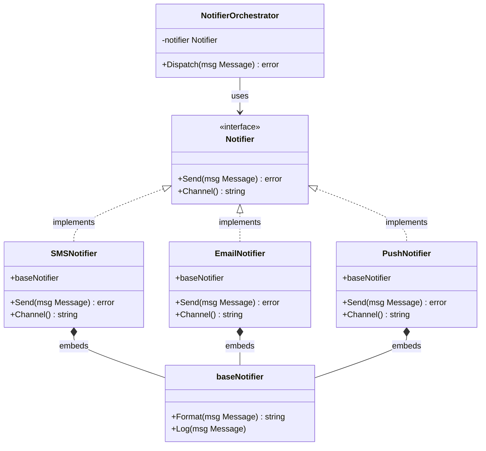
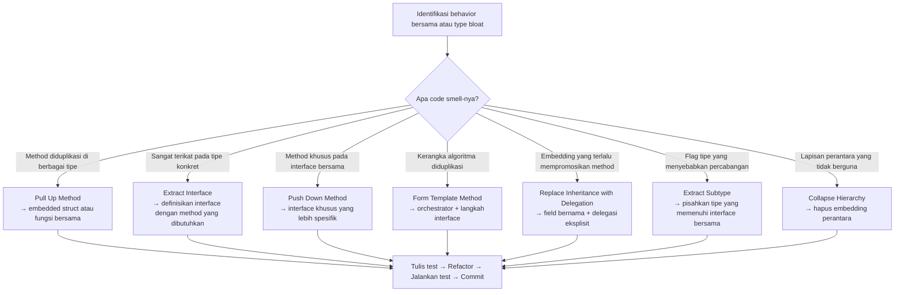

Dalam bahasa pemrograman berorientasi objek klasik seperti Java atau C++, refactoring generalisasi sebagian besar adalah tentang membentuk kembali hierarki pewarisan (inheritance hierarchy) — menarik kode ke superclass (pull up), mendorongnya ke subclass (push down), atau meruntuhkan hierarki yang sudah terlalu dalam. Go tidak memiliki pewarisan klasik sama sekali. Sebagai gantinya, Go memberikan kita **interface**, **embedding**, dan **komposisi** (composition) — yang ternyata merupakan alat yang *lebih baik* untuk pekerjaan yang sama.

Bagian dari seri refactoring ini akan mengeksplorasi semua teknik generalisasi utama dari katalog klasik Martin Fowler dan menunjukkan kepada kamu bagaimana cara menerapkannya secara idiomatis di Go. Baik saat kamu mengekstrak behavior bersama ke dalam sebuah interface, mengganti rantai delegasi yang rumit dengan embedding yang bersih, atau membentuk template method menggunakan tipe fungsi — panduan ini akan membantu kamu dengan contoh-contoh nyata berkualitas produksi.

---

## 🎯 Takeaway

Setelah membaca artikel ini, kamu akan mampu:

- **Extract Interface** — mengidentifikasi behavior umum di berbagai tipe konkret dan merumuskannya sebagai interface di Go.
- **Replace Inheritance with Delegation** — menggunakan struct embedding atau komposisi field eksplisit untuk berbagi behavior tanpa inheritance.
- **Form Template Method** — menentukan kerangka algoritma (skeleton) yang tetap, dan membiarkan implementasi konkret mengisi langkah-langkah yang bervariasi.
- **Pull Up Method / Pull Up Field** — menghilangkan duplikasi logika dengan memindahkannya ke lokasi bersama (fungsi, embedded struct, atau interface).
- **Push Down Method / Push Down Field** — memindahkan behavior khusus lebih dekat ke tempat di mana behavior tersebut sebenarnya digunakan.
- **Extract Subtype (Subclass / Interface)** — membuat tipe atau interface yang lebih spesifik ketika sebuah tipe melakukan terlalu banyak hal untuk terlalu banyak konteks.
- **Collapse Hierarchy** — meratakan rantai abstraksi yang terlalu rumit (over-engineered) ketika perbedaan di antaranya tidak lagi sebanding dengan kompleksitas yang ditimbulkan.

---

## Mengapa "Generalisasi" Terlihat Berbeda di Go

Dalam Java, generalisasi berarti bermain dengan `abstract class`, `extends`, dan `implements`. Di Go, kita bekerja dengan tiga alat yang lebih sederhana:

| Konsep OOP | Padanan di Go |
|---|---|
| Superclass / Abstract class | Struct bersama + interface |
| Inheritance | Struct embedding |
| Implements interface | Implisit — tipe apa pun dengan method yang cocok |
| Pull Up Method | Pindahkan ke embedded struct atau fungsi bersama |
| Push Down Method | Pindahkan keluar dari interface / embedding ke tipe konkret |
| Extract Interface | Definisikan `interface` hanya dengan method yang dibutuhkan |
| Collapse Hierarchy | Ratakan rantai embedded struct |
| Template Method | Interface + struct orchestrator |



Diagram ini merepresentasikan hasil akhir ideal yang akan kita tuju melalui refactoring di sepanjang artikel ini.

---

## Teknik 1: Extract Interface — Yang Paling Penting di Go

**Kapan diterapkan:** Ketika beberapa tipe konkret berbagi sekumpulan method yang sama. Pihak pemanggil (caller) hanya peduli pada behavior, bukan tipe konkretnya.

**Apa yang dicapai:** Mendekopel pemanggil dari implementasi. Membuat kode dapat diuji (testable) menggunakan mock. Memungkinkan desain Open/Closed — menambah implementasi baru tanpa menyentuh pemanggil.

### ❌ Contoh Bad Code — Terikat pada Tipe Konkret

```go
// ❌ BAD: UserService sangat terikat pada tipe konkret EmailSender.
// Sangat sulit untuk menggantinya dengan SMS, push notification, atau mock saat testing.

type EmailSender struct {
	SMTPHost string
	SMTPPort int
}

func (e *EmailSender) SendEmail(to, subject, body string) error {
	// terhubung ke SMTP, mengirim email...
	fmt.Printf("[SMTP] Mengirim email ke %s: %s\n", to, subject)
	return nil
}

type UserService struct {
	emailSender *EmailSender // ← ketergantungan keras (hard dependency) pada tipe konkret
}

func (s *UserService) Register(email, name string) error {
	// ... simpan user ke DB ...
	return s.emailSender.SendEmail(
		email,
		"Selamat datang di platform kami!",
		fmt.Sprintf("Hi %s, terima kasih telah bergabung!", name),
	)
}
```

**Masalah:**
- `UserService` terikat secara permanen pada `EmailSender`. Kamu tidak bisa menggantinya.
- Unit testing pada `Register()` membutuhkan server SMTP asli.
- Menambahkan notifikasi SMS berarti harus memodifikasi `UserService` — melanggar Open/Closed Principle.

### ✅ Perbaikan (Fix) — Extract Interface

```go
// ✅ GOOD: Ekstrak behavior ke dalam interface Notifier.
// UserService sekarang bergantung pada abstraksi, bukan implementasi.

// Langkah 1: Definisikan interface. Buat tetap kecil — hanya apa yang dibutuhkan pemanggil.
type Notifier interface {
	Send(to, subject, body string) error
	Channel() string
}

// Langkah 2: Implementasi konkret memenuhi interface secara implisit.

type EmailNotifier struct {
	SMTPHost string
	SMTPPort int
}

func (e *EmailNotifier) Send(to, subject, body string) error {
	fmt.Printf("[Email/%s:%d] → %s | %s\n", e.SMTPHost, e.SMTPPort, to, subject)
	return nil
}

func (e *EmailNotifier) Channel() string { return "email" }

type SMSNotifier struct {
	APIKey string
}

func (s *SMSNotifier) Send(to, subject, body string) error {
	fmt.Printf("[SMS] → %s | %s\n", to, body)
	return nil
}

func (s *SMSNotifier) Channel() string { return "sms" }

// Langkah 3: UserService hanya bergantung pada interface Notifier.
type UserService struct {
	notifier Notifier // ← bergantung pada abstraksi
}

func NewUserService(n Notifier) *UserService {
	return &UserService{notifier: n}
}

func (s *UserService) Register(email, name string) error {
	// ... simpan user ke DB ...
	fmt.Printf("User %s terdaftar melalui %s\n", name, s.notifier.Channel())
	return s.notifier.Send(
		email,
		"Selamat datang di platform kami!",
		fmt.Sprintf("Hi %s, terima kasih telah bergabung!", name),
	)
}

// Langkah 4: Dalam testing, gunakan mock sederhana — tidak perlu server SMTP.
type mockNotifier struct {
	SentMessages []string
}

func (m *mockNotifier) Send(to, subject, body string) error {
	m.SentMessages = append(m.SentMessages, to)
	return nil
}
func (m *mockNotifier) Channel() string { return "mock" }
```

**Insight Utama:** Interface di Go dipenuhi secara *implisit*. `EmailNotifier` and `SMSNotifier` tidak perlu mendeklarasikan sesuatu seperti `implements Notifier`. Hal ini memungkinkan kamu untuk mengekstrak interface dari kode yang tidak kamu miliki — pustaka pihak ketiga, `os.File`, `http.ResponseWriter` — tanpa menyentuh kode sumber mereka.

---

## Teknik 2: Pull Up Method — Menghilangkan Duplikasi Logika

**Kapan diterapkan:** Dua atau lebih tipe konkret memiliki method yang identik atau sangat mirip.

**Di Go:** Pindahkan logika bersama ke dalam embedded struct, fungsi bersama, atau helper tempat kedua tipe mendelegasikan tugasnya.

### ❌ Contoh Bad Code — Logika Format yang Diduplikasi

```go
// ❌ BAD: format() dan log() diduplikasi di kedua notifier.
// Jika format berubah, kamu harus memperbarui keduanya — dan berisiko membuat keduanya tidak konsisten.

type EmailNotifierOld struct {
	SMTPHost string
}

func (e *EmailNotifierOld) format(subject, body string) string {
	return fmt.Sprintf("[%s] %s", subject, body)  // duplikasi
}

func (e *EmailNotifierOld) log(msg string) {
	fmt.Printf("[LOG] Dikirim via email: %s\n", msg)  // duplikasi
}

func (e *EmailNotifierOld) Send(to, subject, body string) error {
	msg := e.format(subject, body)
	e.log(msg)
	return nil
}

type SMSNotifierOld struct {
	APIKey string
}

func (s *SMSNotifierOld) format(subject, body string) string {
	return fmt.Sprintf("[%s] %s", subject, body)  // duplikasi ← sama seperti di atas!
}

func (s *SMSNotifierOld) log(msg string) {
	fmt.Printf("[LOG] Dikirim via sms: %s\n", msg)   // duplikasi ← struktur yang sama!
}

func (s *SMSNotifierOld) Send(to, subject, body string) error {
	msg := s.format(subject, body)
	s.log(msg)
	return nil
}
```

### ✅ Perbaikan (Fix) — Pull Up ke Embedded Struct

```go
// ✅ GOOD: Ekstrak behavior yang diduplikasi ke dalam struct baseNotifier.
// Baik EmailNotifier maupun SMSNotifier meng-embed struct ini — Pull Up via komposisi.

// baseNotifier menyimpan method bersama yang telah di-"pull up".
type baseNotifier struct {
	channelName string
}

func (b *baseNotifier) format(subject, body string) string {
	return fmt.Sprintf("[%s] %s", subject, body)
}

func (b *baseNotifier) log(msg string) {
	fmt.Printf("[LOG] Dikirim via %s: %s\n", b.channelName, msg)
}

// EmailNotifier meng-embed baseNotifier — mendapatkan format() dan log() secara gratis.
type EmailNotifier struct {
	baseNotifier        // ← "Pull Up" — mewarisi behavior melalui embedding
	SMTPHost     string
}

func (e *EmailNotifier) Send(to, subject, body string) error {
	msg := e.format(subject, body)  // dipromosikan dari baseNotifier
	e.log(msg)                       // dipromosikan dari baseNotifier
	fmt.Printf("[SMTP→%s] %s\n", to, msg)
	return nil
}

func (e *EmailNotifier) Channel() string { return e.channelName }

// SMSNotifier meng-embed baseNotifier — menggunakan behavior bersama yang sama tanpa duplikasi.
type SMSNotifier struct {
	baseNotifier        // ← "Pull Up" — menggunakan behavior bersama yang sama
	APIKey       string
}

func (s *SMSNotifier) Send(to, subject, body string) error {
	msg := s.format(subject, body)  // dipromosikan dari baseNotifier
	s.log(msg)                       // dipromosikan dari baseNotifier
	fmt.Printf("[SMS→%s] %s\n", to, msg)
	return nil
}

func (s *SMSNotifier) Channel() string { return s.channelName }

// Konstruksi yang bersih dan eksplisit.
func NewEmailNotifier(host string) *EmailNotifier {
	return &EmailNotifier{
		baseNotifier: baseNotifier{channelName: "email"},
		SMTPHost:     host,
	}
}

func NewSMSNotifier(apiKey string) *SMSNotifier {
	return &SMSNotifier{
		baseNotifier: baseNotifier{channelName: "sms"},
		APIKey:       apiKey,
	}
}
```

---

## Teknik 3: Push Down Method — Memindahkan Behavior Khusus ke Tempat yang Tepat

**Kapan diterapkan:** Sebuah method di lokasi bersama (interface atau embedded struct) sebenarnya hanya digunakan oleh satu tipe konkret. Tipe konkret lainnya mengimplementasikannya sebagai no-op (tanpa operasi) atau mengembalikan error.

### ❌ Contoh Bad Code — Method Khusus Mengotori Interface

```go
// ❌ BAD: AttachFile() adalah fitur khusus email, tetapi dipaksakan masuk ke interface.
// SMSNotifier terpaksa mengimplementasikannya meskipun SMS tidak mendukung lampiran file.

type BadNotifier interface {
	Send(to, subject, body string) error
	Channel() string
	AttachFile(path string) error // ← hanya masuk akal untuk Email!
}

type BadSMSNotifier struct{}

func (s *BadSMSNotifier) Send(to, subject, body string) error {
	fmt.Printf("[SMS] → %s\n", to)
	return nil
}

func (s *BadSMSNotifier) Channel() string { return "sms" }

// Terpaksa mengimplementasikan method yang tidak masuk akal untuk SMS.
func (s *BadSMSNotifier) AttachFile(path string) error {
	return fmt.Errorf("SMS tidak mendukung lampiran file") // ← stub yang tidak berarti
}
```

### ✅ Perbaikan (Fix) — Push Down ke Interface yang Lebih Spesifik

```go
// ✅ GOOD: Dorong (push down) AttachFile() ke interface yang lebih spesifik.
// Interface Notifier dasar tetap bersih. Hanya EmailNotifier yang memenuhi FileAttacher.

// Interface dasar — hanya apa yang dibagikan oleh SEMUA notifier.
type Notifier interface {
	Send(to, subject, body string) error
	Channel() string
}

// FileAttacher adalah ekstensi khusus — hanya untuk notifier yang mendukung lampiran file.
type FileAttacher interface {
	Notifier
	AttachFile(path string) error
}

type GoodEmailNotifier struct {
	baseNotifier
	attachments []string
}

func (e *GoodEmailNotifier) Send(to, subject, body string) error {
	fmt.Printf("[Email→%s] %s | lampiran: %v\n", to, subject, e.attachments)
	return nil
}

func (e *GoodEmailNotifier) Channel() string { return "email" }

// AttachFile hanya ada pada EmailNotifier — tempat yang seharusnya.
func (e *GoodEmailNotifier) AttachFile(path string) error {
	e.attachments = append(e.attachments, path)
	fmt.Printf("[Email] Melampirkan file: %s\n", path)
	return nil
}

type GoodSMSNotifier struct {
	baseNotifier
}

func (s *GoodSMSNotifier) Send(to, subject, body string) error {
	fmt.Printf("[SMS→%s] %s\n", to, body)
	return nil
}

func (s *GoodSMSNotifier) Channel() string { return "sms" }
// Tidak perlu AttachFile. Bersih.

// Fungsi yang membutuhkan dukungan lampiran file menggunakan interface yang lebih spesifik.
func sendWithAttachment(n FileAttacher, to, path string) error {
	if err := n.AttachFile(path); err != nil {
		return err
	}
	return n.Send(to, "Laporan", "Silakan lihat laporan terlampir.")
}
```

---

## Teknik 4: Form Template Method — Menentukan Kerangka, Delegasikan Langkah-Langkah

**Kapan diterapkan:** Beberapa tipe mengikuti *urutan algoritma yang sama* tetapi berbeda dalam langkah-langkah spesifik tertentu.

**Di Go:** Struct orchestrator menyimpan referensi ke sebuah interface. Method dari struct tersebut mendefinisikan alur kerja (workflow) yang tetap. Tipe konkret mengimplementasikan langkah-langkah yang bervariasi.

### ❌ Contoh Bad Code — Kerangka Algoritma yang Diduplikasi

```go
// ❌ BAD: Alur pengiriman notifikasi (validate → format → send → audit)
// diduplikasi di setiap channel pengiriman. Jika alur tersebut mendapatkan langkah baru,
// setiap fungsi harus diperbarui — mimpi buruk untuk pemeliharaan.

func sendEmailNotification(to, subject, body string) error {
	// Langkah 1: validasi
	if to == "" || subject == "" {
		return fmt.Errorf("email: kolom yang diperlukan tidak lengkap")
	}
	// Langkah 2: format
	formatted := fmt.Sprintf("Subject: %s\n\n%s", subject, body)
	// Langkah 3: kirim (spesifik email)
	fmt.Printf("[SMTP] → %s: %s\n", to, formatted)
	// Langkah 4: audit
	fmt.Printf("[AUDIT] email dikirim ke %s pada %s\n", to, time.Now().Format(time.RFC3339))
	return nil
}

func sendSMSNotification(to, subject, body string) error {
	// Langkah 1: validasi  ← duplikasi!
	if to == "" || body == "" {
		return fmt.Errorf("sms: kolom yang diperlukan tidak lengkap")
	}
	// Langkah 2: format  ← duplikasi!
	formatted := fmt.Sprintf("[%s] %s", subject, body)
	// Langkah 3: kirim (spesifik sms)
	fmt.Printf("[SMS Gateway] → %s: %s\n", to, formatted)
	// Langkah 4: audit  ← duplikasi!
	fmt.Printf("[AUDIT] sms dikirim ke %s pada %s\n", to, time.Now().Format(time.RFC3339))
	return nil
}
```

### ✅ Perbaikan (Fix) — Form Template Method

```go
// ✅ GOOD: Struct NotificationPipeline ADALAH Template Method.
// Ia memiliki algoritma yang tetap. Tipe konkret hanya mengimplementasikan apa yang berbeda.

// Message adalah data yang dilewatkan melalui pipeline.
type Message struct {
	To      string
	Subject string
	Body    string
}

// NotificationStep mendefinisikan langkah-langkah yang bervariasi dari algoritma.
type NotificationStep interface {
	Validate(msg Message) error
	Format(msg Message) string
	Deliver(to, formatted string) error
	ChannelName() string
}

// NotificationPipeline adalah orchestrator untuk Template Method.
// Send mendefinisikan algoritma TETAP — validate → format → deliver → audit.
type NotificationPipeline struct {
	step NotificationStep
}

func NewPipeline(step NotificationStep) *NotificationPipeline {
	return &NotificationPipeline{step: step}
}

// Send adalah Template Method — kerangka algoritma yang tidak berubah.
func (p *NotificationPipeline) Send(msg Message) error {
	// Langkah 1: Validasi (bervariasi per channel)
	if err := p.step.Validate(msg); err != nil {
		return fmt.Errorf("[%s] validasi gagal: %w", p.step.ChannelName(), err)
	}

	// Langkah 2: Format (bervariasi per channel)
	formatted := p.step.Format(msg)

	// Langkah 3: Deliver (bervariasi per channel)
	if err := p.step.Deliver(msg.To, formatted); err != nil {
		return fmt.Errorf("[%s] pengiriman gagal: %w", p.step.ChannelName(), err)
	}

	// Langkah 4: Audit (TETAP — sama untuk setiap channel)
	fmt.Printf("[AUDIT] notifikasi %s dikirim ke %s pada %s\n",
		p.step.ChannelName(), msg.To, time.Now().Format(time.RFC3339))

	return nil
}

// --- Implementasi Konkret ---

type EmailStep struct{}

func (e *EmailStep) Validate(msg Message) error {
	if msg.To == "" || msg.Subject == "" {
		return fmt.Errorf("email membutuhkan 'to' dan 'subject'")
	}
	return nil
}

func (e *EmailStep) Format(msg Message) string {
	return fmt.Sprintf("Subject: %s\n\n%s", msg.Subject, msg.Body)
}

func (e *EmailStep) Deliver(to, formatted string) error {
	fmt.Printf("[SMTP] → %s:\n%s\n", to, formatted)
	return nil
}

func (e *EmailStep) ChannelName() string { return "email" }

type SMSStep struct{}

func (s *SMSStep) Validate(msg Message) error {
	if msg.To == "" || msg.Body == "" {
		return fmt.Errorf("sms membutuhkan 'to' dan 'body'")
	}
	if len(msg.Body) > 160 {
		return fmt.Errorf("panjang sms melebihi 160 karakter")
	}
	return nil
}

func (s *SMSStep) Format(msg Message) string {
	return fmt.Sprintf("[%s] %s", msg.Subject, msg.Body)
}

func (s *SMSStep) Deliver(to, formatted string) error {
	fmt.Printf("[SMS Gateway] → %s: %s\n", to, formatted)
	return nil
}

func (s *SMSStep) ChannelName() string { return "sms" }

// Penggunaan: algoritma terpusat, menambahkan dukungan Push tidak memerlukan perubahan di sini.
func main() {
	emailPipeline := NewPipeline(&EmailStep{})
	smsPipeline := NewPipeline(&SMSStep{})

	msg := Message{To: "user@example.com", Subject: "OTP Anda", Body: "Kode Anda adalah 482910"}

	if err := emailPipeline.Send(msg); err != nil {
		fmt.Println("Error:", err)
	}

	msg.To = "+628123456789"
	if err := smsPipeline.Send(msg); err != nil {
		fmt.Println("Error:", err)
	}
}
```

---

## Teknik 5: Replace Inheritance with Delegation (Komposisi alih-alih Pewarisan)

**Kapan diterapkan:** Sebuah tipe dirancang untuk "mewarisi" semua behavior dari tipe lain, tetapi sebenarnya hanya menggunakan sebagian kecil dari behavior tersebut.

**Di Go:** Ini bukan sekadar teknik refactoring — melainkan pilihan *default*. Go memaksa kamu untuk menggunakan delegasi melalui embedding. Memahami kapan harus menggunakan **field eksplisit** vs. **embedded struct** adalah keputusan desain yang krusial.

### Kapan Embedding Berdampak Buruk — Promosi Method yang Tidak Sengaja

```go
// ❌ BAD: Embedding mempromosikan SEMUA method Employee ke Manager,
// termasuk method yang seharusnya tidak dapat diakses secara bebas (seperti SetSalary pada struct Manager
// atau method yang merusak aturan invariants dari Manager).

type Employee struct {
	Name   string
	Salary float64
}

func (e *Employee) SetSalary(s float64) { e.Salary = s }
func (e *Employee) GetName() string     { return e.Name }
func (e *Employee) GetSalary() float64  { return e.Salary }

// ❌ Manager meng-embed Employee — tetapi sekarang siapa pun yang memegang *Manager dapat memanggil
// manager.SetSalary() secara langsung, melewati validasi apa pun di tingkat Manager.
type ManagerBad struct {
	Employee           // ← embedding mempromosikan SetSalary ke Manager — bukan yang kita inginkan!
	Reports  []*Employee
}

func useManagerBad() {
	m := &ManagerBad{}
	m.SetSalary(50_000)  // Melewati validasi gaji Manager — berbahaya!
	m.Reports = append(m.Reports, &Employee{Name: "Alice"})
}
```

### ✅ Perbaikan (Fix) — Ganti dengan Delegasi Eksplisit

```go
// ✅ GOOD: Manager mendelegasikan tugas ke field Employee secara eksplisit.
// Manager mengontrol dengan tepat behavior Employee mana saja yang diekspos.

type Employee struct {
	Name   string
	salary float64 // tidak diekspor (unexported) — terlindungi
}

func NewEmployee(name string, salary float64) *Employee {
	return &Employee{Name: name, salary: salary}
}

func (e *Employee) GetName() string    { return e.Name }
func (e *Employee) GetSalary() float64 { return e.salary }
func (e *Employee) SetSalary(s float64) {
	if s < 0 {
		panic("gaji tidak boleh negatif")
	}
	e.salary = s
}

// Manager menyusun (composes) Employee melalui field bernama eksplisit, bukan embedding.
type Manager struct {
	employee *Employee  // ← field bernama: delegasi eksplisit, bukan promosi implisit
	Reports  []*Employee
}

func NewManager(name string, salary float64) *Manager {
	return &Manager{
		employee: NewEmployee(name, salary),
	}
}

// Manager secara eksplisit hanya mengekspos behavior yang ingin didelegasikan.
func (m *Manager) GetName() string { return m.employee.GetName() }

// Manager menambahkan validasi gajinya sendiri sebelum mendelegasikan.
func (m *Manager) SetSalary(s float64) {
	if s < 30_000 {
		fmt.Println("[Peringatan] Gaji manajer diatur di bawah ambang batas minimum")
	}
	m.employee.SetSalary(s)
}

// Manager TIDAK mengekspos GetSalary() — ia memiliki model kompensasinya sendiri.
func (m *Manager) TotalCompensation() float64 {
	return m.employee.GetSalary() + float64(len(m.Reports))*500 // bonus per laporan
}

func (m *Manager) AddReport(e *Employee) {
	m.Reports = append(m.Reports, e)
}
```

**Kapan menggunakan embedding vs. field eksplisit:**

| Gunakan Embedding | Gunakan Field Eksplisit |
|---|---|
| Ingin *memperluas* (extend) sebuah tipe dan mengekspos semua method-nya | Ingin *menyusun* (compose) sebuah tipe dan mengontrol method mana saja yang terlihat |
| Semua method yang dipromosikan masuk akal pada tipe luar | Beberapa method yang dipromosikan akan merusak kontrak tipe luar |
| Sedang mengimplementasikan interface melalui delegasi | Perlu menambahkan validasi atau transformasi sebelum mendelegasikan |
| Behavior bertipe mixin (misal: `sync.Mutex` dalam struct) | Hubungan "has-a" sejati di mana enkapsulasi itu penting |

---

## Teknik 6: Extract Subtype (Subclass/Interface di Go)

**Kapan diterapkan:** Sebuah struct memiliki field atau method yang hanya digunakan dalam situasi tertentu. Kamu terus-menerus menambahkan percabangan `if type == "admin"` di seluruh kode.

### ❌ Contoh Bad Code — Satu Tipe Melakukan Terlalu Banyak Hal

```go
// ❌ BAD: Struct User membawa field dan method baik untuk pengguna biasa
// maupun admin. Flag IsAdmin menciptakan percabangan konstan di seluruh kode.

type User struct {
	ID          int
	Name        string
	Email       string
	IsAdmin     bool      // ← flag yang mengubah behavior
	AdminLevel  int       // ← hanya bermakna jika IsAdmin == true
	Permissions []string  // ← hanya bermakna jika IsAdmin == true
}

func (u *User) GetDashboardURL() string {
	if u.IsAdmin {
		return fmt.Sprintf("/admin/dashboard?level=%d", u.AdminLevel)
	}
	return "/user/dashboard"
}

func (u *User) CanAccess(resource string) bool {
	if u.IsAdmin {
		for _, p := range u.Permissions {
			if p == resource {
				return true
			}
		}
		return false
	}
	// pengguna biasa hanya dapat mengakses profil mereka sendiri
	return resource == "profile"
}
```

### ✅ Perbaikan (Fix) — Ekstrak Subtipe Melalui Interface

```go
// ✅ GOOD: Ekstrak interface Portal dan buat subtipe yang berbeda.
// Setiap tipe kohesif dan hanya membawa apa yang dibutuhkannya.

type Portal interface {
	GetDashboardURL() string
	CanAccess(resource string) bool
	GetName() string
}

// RegularUser — sederhana, tanpa beban admin.
type RegularUser struct {
	ID    int
	Name  string
	Email string
}

func (u *RegularUser) GetName() string         { return u.Name }
func (u *RegularUser) GetDashboardURL() string { return "/user/dashboard" }
func (u *RegularUser) CanAccess(resource string) bool {
	return resource == "profile" || resource == "settings"
}

// AdminUser — hanya membawa state spesifik admin.
type AdminUser struct {
	ID          int
	Name        string
	Email       string
	AdminLevel  int
	Permissions map[string]bool
}

func (a *AdminUser) GetName() string { return a.Name }
func (a *AdminUser) GetDashboardURL() string {
	return fmt.Sprintf("/admin/dashboard?level=%d", a.AdminLevel)
}
func (a *AdminUser) CanAccess(resource string) bool {
	return a.Permissions[resource]
}

// Kode yang bekerja dengan Portal tidak perlu tahu tipe konkret mana yang dipegangnya.
func redirectToHome(p Portal) string {
	if p.CanAccess("admin-panel") {
		return p.GetDashboardURL()
	}
	return p.GetDashboardURL()
}
```

---

## Teknik 7: Collapse Hierarchy — Meratakan Apa yang Tidak Memberikan Nilai Tambah

**Kapan diterapkan:** Kamu memiliki rantai embedded struct atau interface di mana lapisan perantara tidak memberikan nilai tambah apa pun. Kamu harus melompati beberapa lapisan untuk mencapai behavior yang sebenarnya.

### ❌ Contoh Bad Code — Rantai Embedding yang Over-Engineered

```go
// ❌ BAD: Tiga lapisan embedding tanpa behavior yang berarti ditambahkan
// pada lapisan perantara. Hanya kebisingan (noise) dan kebingungan.

type Animal struct {
	Name string
}

func (a *Animal) GetName() string { return a.Name }

// Vertebrate tidak menambahkan apa pun yang berarti.
type Vertebrate struct {
	Animal
}

// Mammal tidak menambahkan apa pun yang berarti.
type Mammal struct {
	Vertebrate
}

// DogComplex harus menavigasi tiga lapisan untuk mengatur namanya sendiri.
type DogComplex struct {
	Mammal
	Breed string
}

func createDog() *DogComplex {
	d := &DogComplex{Breed: "Labrador"}
	d.Mammal.Vertebrate.Animal.Name = "Rex" // ← absurd
	return d
}
```

### ✅ Perbaikan (Fix) — Runtuhkan ke Apa yang Penting

```go
// ✅ GOOD: Runtuhkan hierarki (collapse hierarchy). Hanya simpan abstraction yang memberikan nilai nyata.

type Animal struct {
	Name  string
	Breed string
}

func (a *Animal) GetName() string { return a.Name }

type Dog struct {
	Animal // ← satu embedding yang berarti
}

func NewDog(name, breed string) *Dog {
	return &Dog{Animal: Animal{Name: name, Breed: breed}}
}

// Bersih. Tidak perlu penggalian arkeologis untuk mengatur nama.
```

---

## Alur Kerja Refactoring: Edisi Generalisasi



---

## Lembar Panduan Referensi Cepat (Cheat Sheet)

| Teknik | Mekanisme di Go | Sinyal untuk Menerapkan |
|---|---|---|
| **Extract Interface** | `type X interface {}` | Pemanggil terikat pada tipe konkret; sulit ditest |
| **Pull Up Method** | Embedded struct dengan method bersama | Method yang sama di-copy-paste di 2+ tipe konkret |
| **Pull Up Field** | Field bersama dipindahkan ke embedded struct | Field yang sama di 2+ tipe dengan penggunaan identik |
| **Push Down Method** | Pindahkan keluar dari interface; interface lebih spesifik | Hanya satu tipe yang benar-benar menggunakan method interface |
| **Push Down Field** | Hapus dari embedded struct; tambahkan ke konkret | Field hanya digunakan oleh salah satu tipe yang meng-embed |
| **Form Template Method** | Struct orchestrator + interface `NotificationStep` | Urutan langkah yang sama, implementasi berbeda |
| **Replace Inheritance with Delegation** | Field bernama alih-alih embedding | Tipe yang di-embed mempromosikan method yang tidak diinginkan |
| **Extract Subtype** | Tipe konkret baru yang mengimplementasikan interface | Percabangan `if type == X`; adanya field flag tipe |
| **Extract Superclass** | Struct tersemat (embedded) bersama | Field/method umum di beberapa tipe |
| **Collapse Hierarchy** | Hapus lapisan embedding perantara | Lapisan perantara tidak menambahkan behavior baru |

---

## 📝 Ringkasan

Filosofi Go "komposisi alih-alih pewarisan" (composition over inheritance) membuat refactoring generalisasi menjadi *lebih* eksplisit dan *lebih* terkontrol dibandingkan OOP klasik. Tidak ada pemanggilan `super` ajaib yang menyembunyikan behavior. Setiap rantai delegasi terlihat jelas dalam kode.

Berikut adalah poin-poin penting yang perlu diingat:

- 🔌 **Lakukan Extract Interface terlebih dahulu** — ini adalah refactoring mendasar di Go. Ketika ragu, programlah ke sebuah interface. Jaga agar interface tetap kecil (idealnya 1–3 method).
- ⬆️ **Tarik ke Atas (Pull Up)** method yang diduplikasi ke embedded struct. Fitur promosi struct Go memberikan kamu penggunaan kembali (reuse) seperti pewarisan tanpa mengunci kamu dalam hierarki kelas.
- ⬇️ **Dorong ke Bawah (Push Down)** behavior khusus ke interface yang lebih spesifik atau tipe konkret. Jangan paksa pemanggil untuk mengimplementasikan method yang tidak mereka butuhkan (Interface Segregation Principle).
- 🧩 **Bentuk Template Method (Form Template Method)** ketika kamu memiliki alur kerja yang tetap dengan langkah-langkah yang bervariasi. Struct orchestrator memiliki kerangkanya; implementasi interface memiliki variasinya.
- 🔗 **Ganti Pewarisan dengan Delegasi (Replace Inheritance with Delegation)** dengan memilih *field bernama* alih-alih embedding ketika kamu perlu mengontrol behavior mana saja yang diekspos. Embedding itu kuat tetapi dapat menyebabkan promosi method yang tidak disengaja.
- ✂️ **Ekstrak Subtipe (Extract Subtypes)** untuk menggantikan percabangan berbasis flag tipe (`if user.IsAdmin`) dengan polimorfisme melalui interface.
- 🏗️ **Runtuhkan hierarki (Collapse hierarchy)** tanpa ragu. Setiap lapisan embedding harus memberikan nilai nyata berupa behavior. Jika tidak, runtuhkan.

Aturan emas generalisasi di Go: **ekstrak interface untuk mendekopel, gunakan embedding untuk berbagi, gunakan field bernama untuk mengontrol.**

---

**🇮🇩 Versi Indonesia** | [🇬🇧 English Version](/refactoring-part-10-generalization)

← [Bagian 9: Mengorganisasi Data](/refactoring-part-9-organizing-data) | [Bagian 11: Refactoring untuk Performa →](/refactoring-part-11-performance)
