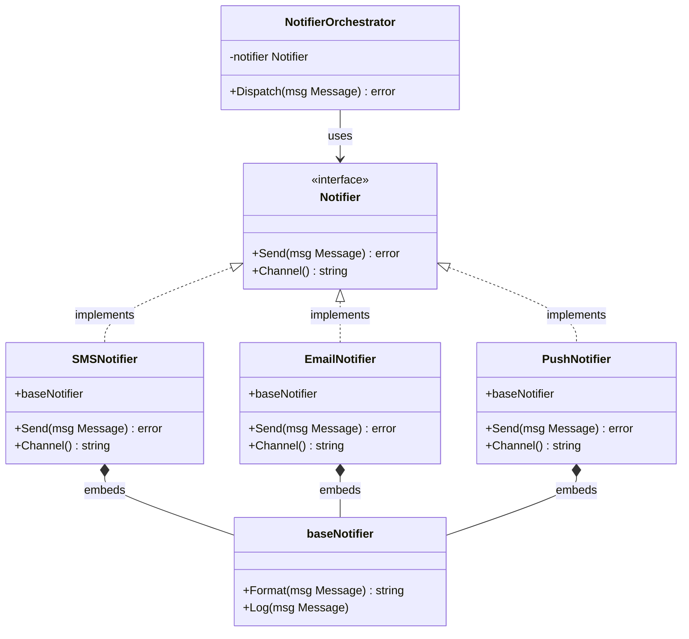
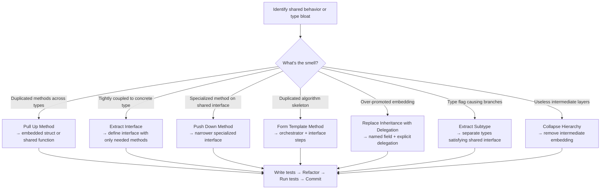

In classical object-oriented languages like Java or C++, generalization refactoring is mostly about reshaping inheritance hierarchies — pulling code up to superclasses, pushing it down to subclasses, or collapsing a hierarchy that got too deep. Go doesn't have classical inheritance at all. Instead, Go gives us **interfaces**, **embedding**, and **composition** — and they turn out to be *better* tools for the same job.

This part of the refactoring series explores all the major generalization techniques from Martin Fowler's classic catalog and shows you exactly how to apply them in idiomatic Go. Whether you're extracting a shared behavior into an interface, replacing a tangled delegation chain with clean embedding, or forming a template method using function types — this guide has you covered with real, production-quality examples.

---

## 🎯 Takeaway

By the end of this post, you will be able to:

- **Extract Interface** — identify common behaviors across concrete types and codify them as Go interfaces
- **Replace Inheritance with Delegation** — use struct embedding or explicit field composition to share behavior without inheritance
- **Form Template Method** — define a fixed algorithm skeleton, letting implementations fill in the variable steps
- **Pull Up Method / Pull Up Field** — eliminate duplicated logic by moving it to a shared location (function, embedded struct, or interface)
- **Push Down Method / Push Down Field** — move specialized behavior closer to where it's actually used
- **Extract Subtype (Subclass / Interface)** — create a narrower type or interface when a type does too many things for too many contexts
- **Collapse Hierarchy** — flatten an over-engineered abstraction chain when the distinction no longer earns its complexity

---

## Why "Generalization" Looks Different in Go

In Java, generalization means juggling `abstract class`, `extends`, and `implements`. In Go, you work with three simpler tools:

| OOP Concept | Go Equivalent |
|---|---|
| Superclass / Abstract class | Shared struct + interface |
| Inheritance | Struct embedding |
| Implements interface | Implicit — any type with matching methods |
| Pull Up Method | Move to embedded struct or shared function |
| Push Down Method | Move out of interface / embedding to concrete type |
| Extract Interface | Define `interface` with only the needed methods |
| Collapse Hierarchy | Flatten embedded struct chain |
| Template Method | Interface + orchestrator struct |



This diagram represents the ideal end state we'll refactor toward throughout this article.

---

## Technique 1: Extract Interface — The Most Important One in Go

**When to apply:** Multiple concrete types share the same set of methods. Callers only care about the behavior, not the concrete type.

**What it achieves:** Decouples callers from implementations. Makes code testable with mocks. Enables Open/Closed design — add new implementations without touching callers.

### ❌ Bad Code — Coupled to Concrete Types

```go
// ❌ BAD: UserService is tightly coupled to concrete EmailSender.
// Impossible to swap for SMS, push notifications, or a mock in tests.

type EmailSender struct {
	SMTPHost string
	SMTPPort int
}

func (e *EmailSender) SendEmail(to, subject, body string) error {
	// connects to SMTP, sends mail...
	fmt.Printf("[SMTP] Sending email to %s: %s\n", to, subject)
	return nil
}

type UserService struct {
	emailSender *EmailSender // ← hard dependency on concrete type
}

func (s *UserService) Register(email, name string) error {
	// ... save user to DB ...
	return s.emailSender.SendEmail(
		email,
		"Welcome to our platform!",
		fmt.Sprintf("Hi %s, thanks for joining!", name),
	)
}
```

**Problems:**
- `UserService` is permanently tied to `EmailSender`. You can never swap it.
- Unit testing `Register()` requires a real SMTP server.
- Adding SMS notifications means modifying `UserService` — violating the Open/Closed Principle.

### ✅ Good Code — Extract Interface

```go
// ✅ GOOD: Extract the behavior into a Notifier interface.
// UserService now depends on the abstraction, not the implementation.

// Step 1: Define the interface. Keep it small — only what callers need.
type Notifier interface {
	Send(to, subject, body string) error
	Channel() string
}

// Step 2: Concrete implementations satisfy the interface implicitly.

type EmailNotifier struct {
	SMTPHost string
	SMTPPort int
}

func (e *EmailNotifier) Send(to, subject, body string) error {
	fmt.Printf("[Email/%s:%d] → %s | %s\n", e.SMTPHost, e.SMTPPort, to, subject)
	return nil
}

func (e *EmailNotifier) Channel() string { return "email" }

type SMSNotifier struct {
	APIKey string
}

func (s *SMSNotifier) Send(to, subject, body string) error {
	fmt.Printf("[SMS] → %s | %s\n", to, body)
	return nil
}

func (s *SMSNotifier) Channel() string { return "sms" }

// Step 3: UserService depends only on the Notifier interface.
type UserService struct {
	notifier Notifier // ← depends on abstraction
}

func NewUserService(n Notifier) *UserService {
	return &UserService{notifier: n}
}

func (s *UserService) Register(email, name string) error {
	// ... save user to DB ...
	fmt.Printf("User %s registered via %s\n", name, s.notifier.Channel())
	return s.notifier.Send(
		email,
		"Welcome to our platform!",
		fmt.Sprintf("Hi %s, thanks for joining!", name),
	)
}

// Step 4: In tests, use a simple mock — no SMTP server needed.
type mockNotifier struct {
	SentMessages []string
}

func (m *mockNotifier) Send(to, subject, body string) error {
	m.SentMessages = append(m.SentMessages, to)
	return nil
}
func (m *mockNotifier) Channel() string { return "mock" }
```

**Key insight:** Go interfaces are satisfied *implicitly*. `EmailNotifier` and `SMSNotifier` never need to declare `implements Notifier`. This lets you extract interfaces from code you don't own — third-party libraries, `os.File`, `http.ResponseWriter` — without touching their source.

---

## Technique 2: Pull Up Method — Eliminate Duplicate Logic

**When to apply:** Two or more concrete types contain identical or near-identical methods.

**In Go:** Move shared logic into an embedded struct, a shared function, or a helper that both types delegate to.

### ❌ Bad Code — Duplicated Format Logic

```go
// ❌ BAD: format() and log() are duplicated across both notifiers.
// If the format changes, you have to update both — and risk them drifting apart.

type EmailNotifierOld struct {
	SMTPHost string
}

func (e *EmailNotifierOld) format(subject, body string) string {
	return fmt.Sprintf("[%s] %s", subject, body)  // duplicated
}

func (e *EmailNotifierOld) log(msg string) {
	fmt.Printf("[LOG] Sent via email: %s\n", msg)  // duplicated
}

func (e *EmailNotifierOld) Send(to, subject, body string) error {
	msg := e.format(subject, body)
	e.log(msg)
	return nil
}

type SMSNotifierOld struct {
	APIKey string
}

func (s *SMSNotifierOld) format(subject, body string) string {
	return fmt.Sprintf("[%s] %s", subject, body)  // duplicated ← same as above!
}

func (s *SMSNotifierOld) log(msg string) {
	fmt.Printf("[LOG] Sent via sms: %s\n", msg)   // duplicated ← same structure!
}

func (s *SMSNotifierOld) Send(to, subject, body string) error {
	msg := s.format(subject, body)
	s.log(msg)
	return nil
}
```

### ✅ Good Code — Pull Up to Embedded Struct

```go
// ✅ GOOD: Extract duplicated behavior into a baseNotifier struct.
// Both EmailNotifier and SMSNotifier embed it — Pull Up via composition.

// baseNotifier holds the shared, "pulled-up" methods.
type baseNotifier struct {
	channelName string
}

func (b *baseNotifier) format(subject, body string) string {
	return fmt.Sprintf("[%s] %s", subject, body)
}

func (b *baseNotifier) log(msg string) {
	fmt.Printf("[LOG] Sent via %s: %s\n", b.channelName, msg)
}

// EmailNotifier embeds baseNotifier — gets format() and log() for free.
type EmailNotifier struct {
	baseNotifier        // ← "Pull Up" — inherited behavior via embedding
	SMTPHost     string
}

func (e *EmailNotifier) Send(to, subject, body string) error {
	msg := e.format(subject, body)  // promoted from baseNotifier
	e.log(msg)                       // promoted from baseNotifier
	fmt.Printf("[SMTP→%s] %s\n", to, msg)
	return nil
}

func (e *EmailNotifier) Channel() string { return e.channelName }

// SMSNotifier embeds baseNotifier — same shared behavior, no duplication.
type SMSNotifier struct {
	baseNotifier        // ← "Pull Up" — same shared behavior
	APIKey       string
}

func (s *SMSNotifier) Send(to, subject, body string) error {
	msg := s.format(subject, body)  // promoted from baseNotifier
	s.log(msg)                       // promoted from baseNotifier
	fmt.Printf("[SMS→%s] %s\n", to, msg)
	return nil
}

func (s *SMSNotifier) Channel() string { return s.channelName }

// Construction is clean and explicit.
func NewEmailNotifier(host string) *EmailNotifier {
	return &EmailNotifier{
		baseNotifier: baseNotifier{channelName: "email"},
		SMTPHost:     host,
	}
}

func NewSMSNotifier(apiKey string) *SMSNotifier {
	return &SMSNotifier{
		baseNotifier: baseNotifier{channelName: "sms"},
		APIKey:       apiKey,
	}
}
```

---

## Technique 3: Push Down Method — Move Specialized Behavior Where It Belongs

**When to apply:** A method in a shared location (interface or embedded struct) is only actually used by one concrete type. The others implement it as a no-op or return an error.

### ❌ Bad Code — Specialized Method Pollutes the Interface

```go
// ❌ BAD: AttachFile() is an email-only feature, but it's forced onto the interface.
// SMSNotifier has to implement it even though SMS can't have attachments.

type BadNotifier interface {
	Send(to, subject, body string) error
	Channel() string
	AttachFile(path string) error // ← only makes sense for Email!
}

type BadSMSNotifier struct{}

func (s *BadSMSNotifier) Send(to, subject, body string) error {
	fmt.Printf("[SMS] → %s\n", to)
	return nil
}

func (s *BadSMSNotifier) Channel() string { return "sms" }

// Forced to implement a method that makes no sense for SMS.
func (s *BadSMSNotifier) AttachFile(path string) error {
	return fmt.Errorf("SMS does not support attachments") // ← meaningless stub
}
```

### ✅ Good Code — Push Down to a Specialized Interface

```go
// ✅ GOOD: Push AttachFile() down to a specialized interface.
// The base Notifier stays clean. Only EmailNotifier satisfies FileAttacher.

// Base interface — only what ALL notifiers share.
type Notifier interface {
	Send(to, subject, body string) error
	Channel() string
}

// FileAttacher is a specialized extension — only for notifiers that support attachments.
type FileAttacher interface {
	Notifier
	AttachFile(path string) error
}

type GoodEmailNotifier struct {
	baseNotifier
	attachments []string
}

func (e *GoodEmailNotifier) Send(to, subject, body string) error {
	fmt.Printf("[Email→%s] %s | attachments: %v\n", to, subject, e.attachments)
	return nil
}

func (e *GoodEmailNotifier) Channel() string { return "email" }

// AttachFile only lives on EmailNotifier — where it belongs.
func (e *GoodEmailNotifier) AttachFile(path string) error {
	e.attachments = append(e.attachments, path)
	fmt.Printf("[Email] Attached file: %s\n", path)
	return nil
}

type GoodSMSNotifier struct {
	baseNotifier
}

func (s *GoodSMSNotifier) Send(to, subject, body string) error {
	fmt.Printf("[SMS→%s] %s\n", to, body)
	return nil
}

func (s *GoodSMSNotifier) Channel() string { return "sms" }
// No AttachFile needed. Clean.

// A function that needs attachment support uses the narrower interface.
func sendWithAttachment(n FileAttacher, to, path string) error {
	if err := n.AttachFile(path); err != nil {
		return err
	}
	return n.Send(to, "Report", "Please see the attached report.")
}
```

---

## Technique 4: Form Template Method — Define the Skeleton, Delegate the Steps

**When to apply:** Multiple types follow the *same algorithm sequence* but differ in specific steps.

**In Go:** An orchestrator struct holds a reference to an interface. Its method defines the fixed workflow. Concrete types implement the variable steps.

### ❌ Bad Code — Duplicated Algorithm Skeleton

```go
// ❌ BAD: The notification pipeline (validate → format → send → audit)
// is duplicated across every delivery channel. If the pipeline gains a step,
// every function must be updated — a maintenance nightmare.

func sendEmailNotification(to, subject, body string) error {
	// Step 1: validate
	if to == "" || subject == "" {
		return fmt.Errorf("email: missing required fields")
	}
	// Step 2: format
	formatted := fmt.Sprintf("Subject: %s\n\n%s", subject, body)
	// Step 3: send (email-specific)
	fmt.Printf("[SMTP] → %s: %s\n", to, formatted)
	// Step 4: audit
	fmt.Printf("[AUDIT] email sent to %s at %s\n", to, time.Now().Format(time.RFC3339))
	return nil
}

func sendSMSNotification(to, subject, body string) error {
	// Step 1: validate  ← duplicated!
	if to == "" || body == "" {
		return fmt.Errorf("sms: missing required fields")
	}
	// Step 2: format  ← duplicated!
	formatted := fmt.Sprintf("[%s] %s", subject, body)
	// Step 3: send (sms-specific)
	fmt.Printf("[SMS Gateway] → %s: %s\n", to, formatted)
	// Step 4: audit  ← duplicated!
	fmt.Printf("[AUDIT] sms sent to %s at %s\n", to, time.Now().Format(time.RFC3339))
	return nil
}
```

### ✅ Good Code — Form Template Method

```go
// ✅ GOOD: The NotificationPipeline struct IS the Template Method.
// It owns the fixed algorithm. Concrete types implement only what differs.

// Message is the data passed through the pipeline.
type Message struct {
	To      string
	Subject string
	Body    string
}

// NotificationStep defines the variable parts of the algorithm.
type NotificationStep interface {
	Validate(msg Message) error
	Format(msg Message) string
	Deliver(to, formatted string) error
	ChannelName() string
}

// NotificationPipeline is the Template Method orchestrator.
// GenAndSend defines the FIXED algorithm — validate → format → deliver → audit.
type NotificationPipeline struct {
	step NotificationStep
}

func NewPipeline(step NotificationStep) *NotificationPipeline {
	return &NotificationPipeline{step: step}
}

// Send is the Template Method — the invariant algorithm skeleton.
func (p *NotificationPipeline) Send(msg Message) error {
	// Step 1: Validate (varies by channel)
	if err := p.step.Validate(msg); err != nil {
		return fmt.Errorf("[%s] validation failed: %w", p.step.ChannelName(), err)
	}

	// Step 2: Format (varies by channel)
	formatted := p.step.Format(msg)

	// Step 3: Deliver (varies by channel)
	if err := p.step.Deliver(msg.To, formatted); err != nil {
		return fmt.Errorf("[%s] delivery failed: %w", p.step.ChannelName(), err)
	}

	// Step 4: Audit (FIXED — same for every channel)
	fmt.Printf("[AUDIT] %s notification sent to %s at %s\n",
		p.step.ChannelName(), msg.To, time.Now().Format(time.RFC3339))

	return nil
}

// --- Concrete Implementations ---

type EmailStep struct{}

func (e *EmailStep) Validate(msg Message) error {
	if msg.To == "" || msg.Subject == "" {
		return fmt.Errorf("email requires 'to' and 'subject'")
	}
	return nil
}

func (e *EmailStep) Format(msg Message) string {
	return fmt.Sprintf("Subject: %s\n\n%s", msg.Subject, msg.Body)
}

func (e *EmailStep) Deliver(to, formatted string) error {
	fmt.Printf("[SMTP] → %s:\n%s\n", to, formatted)
	return nil
}

func (e *EmailStep) ChannelName() string { return "email" }

type SMSStep struct{}

func (s *SMSStep) Validate(msg Message) error {
	if msg.To == "" || msg.Body == "" {
		return fmt.Errorf("sms requires 'to' and 'body'")
	}
	if len(msg.Body) > 160 {
		return fmt.Errorf("sms body exceeds 160 characters")
	}
	return nil
}

func (s *SMSStep) Format(msg Message) string {
	return fmt.Sprintf("[%s] %s", msg.Subject, msg.Body)
}

func (s *SMSStep) Deliver(to, formatted string) error {
	fmt.Printf("[SMS Gateway] → %s: %s\n", to, formatted)
	return nil
}

func (s *SMSStep) ChannelName() string { return "sms" }

// Usage: the algorithm is centralized, adding Push support requires zero changes here.
func main() {
	emailPipeline := NewPipeline(&EmailStep{})
	smsPipeline := NewPipeline(&SMSStep{})

	msg := Message{To: "user@example.com", Subject: "Your OTP", Body: "Your code is 482910"}

	if err := emailPipeline.Send(msg); err != nil {
		fmt.Println("Error:", err)
	}

	msg.To = "+628123456789"
	if err := smsPipeline.Send(msg); err != nil {
		fmt.Println("Error:", err)
	}
}
```

---

## Technique 5: Replace Inheritance with Delegation (Composition over Inheritance)

**When to apply:** A type was designed to "inherit" all behaviors of another type, but it only actually uses a subset of them.

**In Go:** This isn't just a refactoring technique — it's the *default*. Go forces you into delegation via embedding. Understanding when to use **explicit field** vs. **embedded struct** is the key design decision.

### When Embedding Goes Wrong — Accidental Promotion

```go
// ❌ BAD: Embedding promotes ALL of Employee's methods to Manager,
// including ones that shouldn't be accessible (like SetSalary on a Manager struct
// or methods that break Manager's invariants).

type Employee struct {
	Name   string
	Salary float64
}

func (e *Employee) SetSalary(s float64) { e.Salary = s }
func (e *Employee) GetName() string     { return e.Name }
func (e *Employee) GetSalary() float64  { return e.Salary }

// ❌ Manager embeds Employee — but now anyone with a *Manager can call
// manager.SetSalary() directly, bypassing any Manager-level validation.
type ManagerBad struct {
	Employee           // ← embedding promotes SetSalary to Manager — not what we want!
	Reports  []*Employee
}

func useManagerBad() {
	m := &ManagerBad{}
	m.SetSalary(50_000)  // Bypasses any Manager salary validation — dangerous!
	m.Reports = append(m.Reports, &Employee{Name: "Alice"})
}
```

### ✅ Replace with Explicit Delegation

```go
// ✅ GOOD: Manager explicitly delegates to an Employee field.
// Manager controls exactly which Employee behaviors it exposes.

type Employee struct {
	Name   string
	salary float64 // unexported — protected
}

func NewEmployee(name string, salary float64) *Employee {
	return &Employee{Name: name, salary: salary}
}

func (e *Employee) GetName() string    { return e.Name }
func (e *Employee) GetSalary() float64 { return e.salary }
func (e *Employee) SetSalary(s float64) {
	if s < 0 {
		panic("salary cannot be negative")
	}
	e.salary = s
}

// Manager composes Employee via an explicit named field, not embedding.
type Manager struct {
	employee *Employee  // ← named field: explicit delegation, not implicit promotion
	Reports  []*Employee
}

func NewManager(name string, salary float64) *Manager {
	return &Manager{
		employee: NewEmployee(name, salary),
	}
}

// Manager explicitly exposes only the behaviors it wants to delegate.
func (m *Manager) GetName() string { return m.employee.GetName() }

// Manager adds its own salary validation before delegating.
func (m *Manager) SetSalary(s float64) {
	if s < 30_000 {
		fmt.Println("[Warning] Manager salary set below minimum threshold")
	}
	m.employee.SetSalary(s)
}

// Manager does NOT expose GetSalary() — it has its own compensation model.
func (m *Manager) TotalCompensation() float64 {
	return m.employee.GetSalary() + float64(len(m.Reports))*500 // bonus per report
}

func (m *Manager) AddReport(e *Employee) {
	m.Reports = append(m.Reports, e)
}
```

**When to use embedding vs. explicit fields:**

| Use Embedding | Use Explicit Field |
|---|---|
| You want to *extend* a type and expose all its methods | You want to *compose* a type and control which methods are visible |
| The promoted methods all make sense on the outer type | Some promoted methods would break the outer type's contract |
| You're implementing an interface by delegation | You need to add validation or transformation before delegating |
| Mixin behavior (e.g., `sync.Mutex` in a struct) | True "has-a" relationships where encapsulation matters |

---

## Technique 6: Extract Subtype (Subclass/Interface in Go)

**When to apply:** A single struct has fields or methods that are only used in certain situations. You're adding `if type == "admin"` branches throughout.

### ❌ Bad Code — One Type Doing Too Much

```go
// ❌ BAD: User struct carries fields and methods for both regular users
// and admins. The isAdmin flag creates constant branching throughout the code.

type User struct {
	ID          int
	Name        string
	Email       string
	IsAdmin     bool      // ← flag that changes behavior
	AdminLevel  int       // ← only meaningful if IsAdmin == true
	Permissions []string  // ← only meaningful if IsAdmin == true
}

func (u *User) GetDashboardURL() string {
	if u.IsAdmin {
		return fmt.Sprintf("/admin/dashboard?level=%d", u.AdminLevel)
	}
	return "/user/dashboard"
}

func (u *User) CanAccess(resource string) bool {
	if u.IsAdmin {
		for _, p := range u.Permissions {
			if p == resource {
				return true
			}
		}
		return false
	}
	// regular users can only access their own profile
	return resource == "profile"
}
```

### ✅ Good Code — Extract Subtypes via Interface

```go
// ✅ GOOD: Extract a Portal interface and create distinct subtypes.
// Each type is cohesive and only carries what it needs.

type Portal interface {
	GetDashboardURL() string
	CanAccess(resource string) bool
	GetName() string
}

// RegularUser — simple, no admin baggage.
type RegularUser struct {
	ID    int
	Name  string
	Email string
}

func (u *RegularUser) GetName() string         { return u.Name }
func (u *RegularUser) GetDashboardURL() string { return "/user/dashboard" }
func (u *RegularUser) CanAccess(resource string) bool {
	return resource == "profile" || resource == "settings"
}

// AdminUser — carries only admin-specific state.
type AdminUser struct {
	ID          int
	Name        string
	Email       string
	AdminLevel  int
	Permissions map[string]bool
}

func (a *AdminUser) GetName() string { return a.Name }
func (a *AdminUser) GetDashboardURL() string {
	return fmt.Sprintf("/admin/dashboard?level=%d", a.AdminLevel)
}
func (a *AdminUser) CanAccess(resource string) bool {
	return a.Permissions[resource]
}

// Code that works with Portal never needs to know which concrete type it holds.
func redirectToHome(p Portal) string {
	if p.CanAccess("admin-panel") {
		return p.GetDashboardURL()
	}
	return p.GetDashboardURL()
}
```

---

## Technique 7: Collapse Hierarchy — Flatten What Doesn't Earn Its Abstraction

**When to apply:** You have a chain of embedded structs or interfaces where an intermediate layer adds no value. You're jumping through multiple layers to get to actual behavior.

### ❌ Bad Code — Over-Engineered Embedding Chain

```go
// ❌ BAD: Three layers of embedding with no meaningful behavior added
// at the intermediate layers. Just noise and confusion.

type Animal struct {
	Name string
}

func (a *Animal) GetName() string { return a.Name }

// Vertebrate adds nothing meaningful.
type Vertebrate struct {
	Animal
}

// Mammal adds nothing meaningful.
type Mammal struct {
	Vertebrate
}

// Dog has to navigate three layers to set its own name.
type DogComplex struct {
	Mammal
	Breed string
}

func createDog() *DogComplex {
	d := &DogComplex{Breed: "Labrador"}
	d.Mammal.Vertebrate.Animal.Name = "Rex" // ← absurd
	return d
}
```

### ✅ Good Code — Collapse to What Matters

```go
// ✅ GOOD: Collapse the hierarchy. Only keep abstractions that earn their place.

type Animal struct {
	Name  string
	Breed string
}

func (a *Animal) GetName() string { return a.Name }

type Dog struct {
	Animal // ← single meaningful embedding
}

func NewDog(name, breed string) *Dog {
	return &Dog{Animal: Animal{Name: name, Breed: breed}}
}

// Clean. No archaeological excavation needed to set the name.
```

---

## Refactoring Workflow: Generalization Edition



---

## Quick Reference Cheat Sheet

| Technique | Go Mechanism | Signal to Apply |
|---|---|---|
| **Extract Interface** | `type X interface {}` | Callers coupled to concrete type; hard to test |
| **Pull Up Method** | Embedded struct with shared methods | Same method copy-pasted in 2+ concrete types |
| **Pull Up Field** | Shared field moved to embedded struct | Same field in 2+ types with identical usage |
| **Push Down Method** | Move out of interface; narrower interface | Only one type actually uses an interface method |
| **Push Down Field** | Remove from embedded struct; add to concrete | Field only used by one of the embedding types |
| **Form Template Method** | Orchestrator struct + `NotificationStep` interface | Same sequence of steps, different implementations |
| **Replace Inheritance with Delegation** | Named field instead of embedding | Embedded type promotes unwanted methods |
| **Extract Subtype** | New concrete type implementing interface | `if type == X` branching; type flag fields |
| **Extract Superclass** | Shared embedded struct | Common fields/methods across multiple types |
| **Collapse Hierarchy** | Remove intermediate embedding layers | Intermediate layers add no behavior |

---

## 📝 Summary / Recap

Go's "composition over inheritance" philosophy makes generalization refactoring *more* explicit and *more* controllable than in classical OOP. There's no magic `super` call hiding behavior. Every delegation chain is visible in the code.

Here's what to remember:

- 🔌 **Extract Interface first** — it's the foundational refactoring in Go. When in doubt, program to an interface. Keep interfaces small (ideally 1–3 methods).
- ⬆️ **Pull Up** duplicated methods to an embedded struct. Go's struct promotion gives you inheritance-like reuse without locking you into a class hierarchy.
- ⬇️ **Push Down** specialized behavior to narrower interfaces or concrete types. Don't force callers to implement methods they don't need (Interface Segregation Principle).
- 🧩 **Form Template Method** when you have a fixed workflow with variable steps. The orchestrator struct owns the skeleton; the interface implementations own the variations.
- 🔗 **Replace Inheritance with Delegation** by choosing *named fields* over embedding when you need to control which behaviors are exposed. Embedding is powerful but can lead to unintended method promotion.
- ✂️ **Extract Subtypes** to replace type-flag branching (`if user.IsAdmin`) with polymorphism through interfaces.
- 🏗️ **Collapse hierarchies** mercilessly. Every embedding layer should pay its way with actual behavior. If it doesn't, collapse it.

The golden rule of generalization in Go: **extract interfaces to decouple, use embedding to share, use named fields to control.**

---

**[🇮🇩 Versi Indonesia](/refactoring-part-10-generalization-id)** | 🇬🇧 English Version

← [Part 9: Organizing Data](/refactoring-part-9-organizing-data) | [Part 11: Refactoring for Performance →](/refactoring-part-11-performance)
