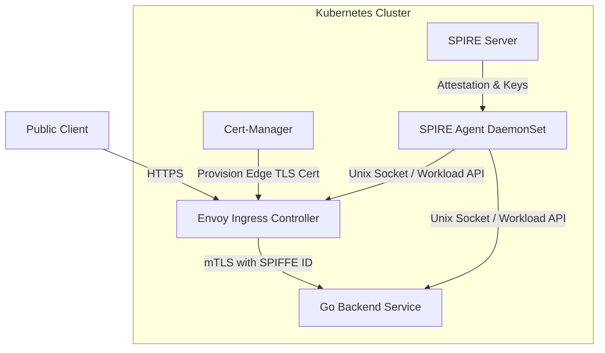

Imagine a typical production outage or security incident: an attacker exploits a remote code execution (RCE) vulnerability in a public-facing Node.js frontend pod. In a traditional perimeter-based security model, once the frontend is compromised, the attacker has free rein over the internal network. Because internal microservices trust any traffic originating within the VPC or the Kubernetes cluster CIDR, the attacker can query billing databases, scrape customer APIs, or exfiltrate sensitive data. Network policies (via Calico or Cilium) restrict traffic at the IP layer, but they lack cryptographic identity verification. On the other hand, managing internal mutual TLS (mTLS) by generating static Kubernetes secrets, distributing raw CA keys, and manually rotating certificates is an operational nightmare that introduces certificate expiration outages. 

To solve this, we must build a dual-layered zero-trust architecture. We terminate public-facing TLS at the edge using **Cert-Manager** (which automates challenges and certificate renewals from public Certificate Authorities like Let's Encrypt or Vault), and we secure internal service-to-service communication using **SPIFFE/SPIRE** to provision dynamic, short-lived cryptographic identities directly to workloads.

## The Architecture: Edge TLS Meets Workload Identity

A common mistake is trying to use Cert-Manager to handle internal service-to-service certificates. Cert-Manager excels at public PKI (ACME challenges, Let's Encrypt, DNS-01 verification) but scales poorly when tasked with managing identities for hundreds of rapidly scaling pods. Every new pod would require creating a Kubernetes `Certificate` resource, writing secrets to etcd, and forcing pod restarts to load updated files.

Conversely, SPIFFE/SPIRE is designed specifically for high-throughput, short-lived workload identities. SPIRE agents run as DaemonSets on each Kubernetes node, attesting workloads locally via the container runtime and exposing a local Unix domain socket. Pods query this socket to retrieve dynamic X.509 SVIDs (SPIFFE Verifiable Identity Documents) that rotate every few hours without process restarts.

In a secure architecture, the Ingress controller (e.g., Envoy) serves as the bridge:
1. **Downstream (Edge)**: Envoy terminates HTTPS traffic from public clients. Cert-Manager provisions these public-facing certificates via standard Kubernetes secrets.
2. **Upstream (Internal Mesh)**: Envoy initiates a new mTLS handshake to backend services. To do this, Envoy connects to the SPIRE agent's Unix socket using the gRPC-based Secret Discovery Service (SDS). It retrieves Envoy's internal SVID and uses it to establish an mTLS session with backend services, verifying that the backend pod's SPIFFE ID matches the expected policy.



## Step 1: Delegating the CA Chain with Cert-Manager

To ensure SPIRE does not operate as an isolated security silo, we hook SPIRE Server into our primary PKI. Instead of generating a self-signed root certificate, we configure Cert-Manager to issue an intermediate CA certificate and store it in a Kubernetes Secret. SPIRE Server then consumes this Secret using the `UpstreamAuthority` plugin to sign all downstream workload SVIDs.

Below is the Cert-Manager manifest that defines the intermediate CA. We set a 90-day duration with automatic renewal 15 days prior to expiration. This buffer prevents production outages caused by API propagation lag.

<script src="https://gist.github.com/mohashari/44dc47509cdcd89e8846d668fb02675f.js?file=snippet-1.yaml"></script>

## Step 2: Bootstrapping SPIRE Server with Upstream PKI

Next, we mount the `spire-upstream-ca-secret` into the SPIRE Server container. The server uses the `disk` upstream authority plugin to read the mounted PEM files. Additionally, we use the `k8s_psat` (Projected Service Account Token) Node Attestor plugin. This ensures that only authorized SPIRE Agents running on verified Kubernetes nodes can join the SPIRE trust domain.

<script src="https://gist.github.com/mohashari/44dc47509cdcd89e8846d668fb02675f.js?file=snippet-2.hcl"></script>

The disk-based upstream authority plugin regularly polls the files at the specified paths. When Cert-Manager rotates the secret in Kubernetes, the files on disk are updated, and SPIRE Server hot-reloads the CA chain without requiring a pod restart.

## Step 3: Defining Workload Identity Registrations

With SPIRE running, we must register our identities. In a production-grade setup, manually running `spire-server entry create` commands is error-prone. Instead, we use the SPIRE Controller Manager operator, which allows us to declare identities using custom resource definitions (CRDs).

The following resources register the Envoy Ingress Controller and a backend billing service. Workloads are attested using Kubernetes selectors: the namespace and service account name of the running pod.

<script src="https://gist.github.com/mohashari/44dc47509cdcd89e8846d668fb02675f.js?file=snippet-3.yaml"></script>

The `parentId` binds these workload entries to the node agents attested via `k8s_psat`. This creates a strong cryptographic bind: a pod can only retrieve its SVID if it runs on a node that has been successfully attested by the SPIRE Server.

## Step 4: Configuring Envoy Ingress via SDS

We configure Envoy to act as our edge gateway. For incoming public requests, Envoy uses a downstream TLS context with certificates issued by Cert-Manager (mounted via file paths). For upstream routing to the backend service, Envoy establishes a dynamic mTLS connection. 

Instead of reading static certificates from disk, Envoy queries the SPIRE Agent's Unix socket using the Secret Discovery Service (SDS) API. It requests its own SVID for client authentication and verifies the backend's server certificate using the SPIFFE root CA bundle.

```yaml
// snippet-4
static_resources:
  listeners:
  - name: edge_ingress_listener
    address:
      socket_address: { address: 0.0.0.0, port_value: 443 }
    filter_chains:
    - transport_socket:
        name: envoy.transport_sockets.tls
        typed_config:
          "@type": type.googleapis.com/envoy.extensions.transport_sockets.tls.v3.DownstreamTlsContext
          common_tls_context:
            tls_certificates:
            - certificate_chain: { filename: "/etc/envoy/certs/tls.crt" }
              private_key: { filename: "/etc/envoy/certs/tls.key" }
      filters: