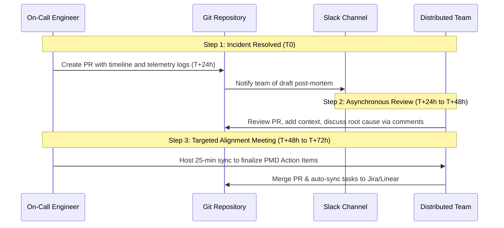

At 03:14 UTC, a minor latency spike in your primary database cluster triggers an automated failover. By 03:18 UTC, your read-heavy API service goes completely dark: connection pools are fully saturated, Kubernetes liveness probes are failing, and the container orchestrator has entered a death spiral of aggressive restarts that further DDOSes the database. The incident is resolved after 42 minutes of high-stress debugging by cycling the API deployments and manually throttle-limiting traffic at the Cloudflare edge. But three weeks later, a scheduled batch job triggers the exact same cascading failure mode. The initial incident's post-mortem was written, reviewed, and filed away. Yet nothing changed in the production configuration because the "action items" were buried in a Jira backlog under a mountain of feature sprint tickets. This is the reality of "Post-Mortem Theater"—a process that satisfies compliance requirements but fails to improve system reliability. For distributed engineering teams, scaling incident post-mortems requires moving past administrative reporting and establishing a rigorous, tool-integrated workflow that converts operational pain into concrete engineering modifications.

## The Pitfalls of "Post-Mortem Theater"

In many distributed engineering organizations, the post-mortem process is treated as a retrospective checklist rather than a diagnostic tool. This manifests in several distinct failure modes:

*   **The Blame Assignment Trap:** Even in teams that claim to practice "blameless" culture, reviews often settle on human error as the root cause. Identifying a developer who applied a wrong configuration value or a sysadmin who ran the wrong command is an analytical dead end. If a single human action can bypass safety guardrails and bring down a production environment, the system design itself is the failure mode.
*   **The Jira Graveyard:** Action items generated during post-mortems are often captured as generic tickets with low priority. Without strict SLA enforcement, these reliability tickets are continually deprioritized in favor of product features, rendering the entire post-mortem exercise useless.
*   **Vague Root Cause Analysis (RCA):** Explanations such as "network instability" or "database load" do not provide enough technical specificity to prevent recurrence. A useful post-mortem must detail the exact mechanisms: for example, how a specific TCP connection timeout default (e.g., 120 seconds instead of 2 seconds) allowed downstream worker threads to remain blocked, starving the incoming HTTP request queue.
*   **Asynchronous Fragmentation:** In a distributed setup across multiple time zones, holding a single live meeting to discuss an incident often leads to poor participation, dominated by the loudest voices or those in the majority time zone. The preparation is rushed, and the output lacks diverse technical input.

To fix these issues, we must treat post-mortems with the same architectural rigor we apply to software design.

## Deconstructing a Failure: The Systemic Five Whys

To move past superficial explanations, distributed teams need a structured framework to interrogate system failures. The "Five Whys" methodology is highly effective, provided it is applied to system architecture and organizational processes rather than human behavior.

Consider the cascading API outage mentioned in the introduction. A poorly executed RCA might stop at: *“The API went down because a database failover occurred, causing connections to drop.”* 

A systemic "Five Whys" analysis digs much deeper:

1.  **Why did the API service crash?**
    *   *Direct Cause:* The application runtimes starved on database connection availability, causing the HTTP server's thread pool to block entirely.
2.  **Why did the application runtimes starve on database connections during a routine failover?**
    *   *Systemic Cause:* The database driver pool configuration did not have a connection validation query or lifetime limit set. When the primary database failed over, the API runtime held onto stale TCP sockets inside its pool, attempting to send write queries to a read-only replica or a dead IP address.
3.  **Why did the application threads block indefinitely on these stale connections instead of failing fast?**
    *   *Technical Cause:* The TCP keep-alive settings and connection timeouts on the gorm/pg client were left at their default OS levels (which can keep connections open for up to 2 hours), and the application lacked a circuit breaker to short-circuit database calls when failure rates exceeded 15%.
4.  **Why were these database driver and timeout settings misconfigured in production?**
    *   *Process Cause:* The infrastructure configuration template for new microservices was copied from a legacy development environment configuration that did not implement production-grade timeout policies or resilience patterns.
5.  **Why was the configuration template not updated to reflect production standards?**
    *   *Root Cause:* There was no central ownership of shared runtime configurations or platform architecture standards. Changes in platform reliability rules were communicated via Slack channels rather than automated linting or shared base configurations.

By targeting the root cause (lack of central configuration standards and automated validation) rather than the symptom (database failover), the team can write action items that prevent this entire class of failure across all services, not just the one that crashed.

## The Post-Mortem Blueprint: Fields, Metrics, and PMD Action Items

A high-impact post-mortem starts with a structured, standardized document. This document should be stored in a git repository (e.g., markdown files in `/docs/post-mortems/`) to enable peer reviews via Pull Requests, version history, and easy accessibility.

### Critical Information Block

```markdown
---
incident_id: 2026-06-30-api-outage
title: "API Gateway Outage due to Database Connection Starvation"
severity: P1
owner: Moh Ashari Muklis (Backend / Platform)
date_occurred: 2026-06-30T03:14:00Z
date_resolved: 2026-06-30T03:56:00Z
total_duration_minutes: 42
---
```

### Key Metrics to Track

Every post-mortem must calculate three critical operational metrics:

*   **Mean Time to Detect (MTTD):** The duration between the actual start of the degradation and the moment the engineering team becomes aware of it.
    $$\text{MTTD} = T_{\text{alert}} - T_{\text{start}}$$
    *Example:* $03:18\text{ (alert received)} - 03:14\text{ (failover initiated)} = 4\text{ minutes}$.
*   **Mean Time to Acknowledge (MTTA):** The time from the initial alert to the moment an engineer begins active triage.
    $$\text{MTTA} = T_{\text{triage}} - T_{\text{alert}}$$
    *Example:* $03:20 - 03:18 = 2\text{ minutes}$.
*   **Mean Time to Resolve (MTTR):** The time from active triage to the implementation of a mitigation that restores normal service levels.
    $$\text{MTTR} = T_{\text{mitigation}} - T_{\text{triage}}$$
    *Example:* $03:56 - 03:20 = 36\text{ minutes}$.

If your MTTD is high, your alerting threshold or coverage is deficient. If your MTTA is high, your on-call rotations, alerting routing, or pager configurations are broken. If your MTTR is high, your runbooks, debugging tools, or deployment rollback mechanisms are inadequate.

### The PMD Action Item Framework

To ensure that action items are concrete and actionable, organize them using the **Prevent-Mitigate-Detect (PMD)** framework. Every post-mortem should produce at least one action item in each category:

| Category | Objective | Example |
| :--- | :--- | :--- |
| **Prevent** | Structural changes to ensure the specific failure mode cannot happen again. | *“Implement a Hystrix-style circuit breaker in the API Gateway for all DB-bound endpoints by 2026-07-15.”* |
| **Mitigate** | Changes that reduce the blast radius or duration of the failure if it occurs again. | *“Reduce PostgreSQL driver connection timeout from default to 2500ms and max lifetime to 10 minutes.”* |
| **Detect** | Improvements to observability so the issue is identified and surfaced faster. | *“Configure a Prometheus alert on `go_sql_stats_connections_open / go_sql_stats_connections_max > 0.85` for more than 60 seconds.”* |

Avoid vague action items like *"Investigate database tuning"* or *"Make devs write safer SQL."* Every task must follow the SMART criteria: Specific, Measurable, Achievable, Relevant, and Time-bound. Each task must also be assigned to a single developer, not a team.

## Running the Post-Mortem in Distributed Teams: The 72-Hour Rule

Distributed teams face the challenge of coordinating post-mortems across multiple time zones. Relying solely on live meetings leads to scheduling delays, resulting in lost context and delayed fixes. A hybrid, async-first workflow is the solution.



### Step 1: Automated Draft and Log Capture (Within 24 Hours)

Immediately after resolving the incident, the on-call engineer who led the triage creates a draft post-mortem document. This must happen within 24 hours of the incident, while details are fresh. 

The draft must include:
*   A chronological timeline constructed directly from timestamps in your logging provider (e.g., Datadog, Grafana Loki, or Google Cloud Logging).
*   Links to specific Grafana dashboard panels or tracing profiles (e.g., Jaeger trace IDs) showing the onset of the anomaly.
*   The raw terminal commands used during the incident mitigation (retrieved from terminal history).

### Step 2: Async Collaborative Review (24 to 48 Hours)

The draft markdown file is submitted as a Pull Request to the central documentation repository. The on-call engineer shares the PR link in the team's incident response Slack channel. 

Over the next 24 hours, team members review the timeline, ask questions, and contribute additional context asynchronously through inline PR comments. For example:
*   An infrastructure engineer might point out that the database failover was triggered by an underlying EBS volume degradation.
*   A backend engineer might identify that a recently merged PR removed the query timeout configuration from a specific microservice.

This async phase ensures that everyone can contribute detailed, technical feedback without having to join a meeting outside their working hours.

### Step 3: The Focused Review Meeting (48 to 72 Hours)

Once the async reviews are complete, a 25-minute synchronous review meeting is scheduled. The goal of this meeting is **not** to reconstruct the timeline or debate the technical facts—that was accomplished in the PR. The meeting is strictly focused on:
1.  Aligning on the "Five Whys" analysis.
2.  Refining and finalizing the Prevent-Mitigate-Detect (PMD) Action Items.
3.  Assigning owners and setting hard delivery dates for those action items.

By limiting the scope of the sync meeting, teams avoid meeting fatigue and keep the focus on remediation. The post-mortem PR is merged immediately following the meeting, serving as the official record of the incident.

## Enforcement and Governance: Defeating the Jira Graveyard

A post-mortem process is only as good as its enforcement mechanism. If action items are not prioritized, the team will continue to suffer from the same outages. Distributed teams need concrete policies and tool integrations to make sure reliability work gets done.

### The Remediation SLA Policy

Establish a clear, non-negotiable Service Level Agreement (SLA) for post-mortem action items based on severity:

| Action Item Priority | Incident Severity | Remediation SLA | Enforcement Mechanism |
| :--- | :--- | :--- | :--- |
| **P0 (Critical)** | P1 Outage (High User Impact) | **7 Days** | Blocks the next planned product release. |
| **P1 (High)** | P2 Outage (Moderate Impact) | **14 Days** | Escales automatically to the Engineering Director. |
| **P2 (Medium)** | P3 Degraded (Low Impact) | **30 Days** | Planned in the next sprint's standard backlog. |

If a P0 action item is not resolved within its 7-day window, the team's deployment pipeline is restricted. Feature releases are paused, and only bug fixes, security patches, and the outstanding reliability item are allowed to go to production. This creates a strong, systemic incentive to prioritize reliability over features.

### Automated Tool Integration

Manual tracking of post-mortem action items is prone to failure. Use automated integrations to sync your documentation with your project management systems.

When the post-mortem markdown file is merged into the main branch of your documentation repository, a GitHub Action can parse the document's PMD tables and automatically generate corresponding issues in Jira, Linear, or GitHub Issues.

Here is an example GitHub Action workflow using Python to parse the markdown file and create issues:

```yaml
# .github/workflows/sync-post-mortem.yml
name: Sync Post-Mortem Action Items

on:
  push:
    branches:
      - main
    paths:
      - 'docs/post-mortems/*.md'

jobs:
  sync:
    runs-on: ubuntu-latest
    steps:
      - name: Checkout Code
        uses: actions/checkout@v4

      - name: Set up Python
        uses: actions/setup-python@v5
        with:
          python-node-version: '3.11'

      - name: Install dependencies
        run: pip install markdown gitpython requests

      - name: Parse and Create Issues
        env:
          JIRA_API_TOKEN: ${{ secrets.JIRA_API_TOKEN }}
          JIRA_BASE_URL: "https://your-company.atlassian.net"
          JIRA_USER: "engineering-ops@company.com"
        run: |
          python .github/scripts/sync_jira.py
```

And the corresponding script (`.github/scripts/sync_jira.py`) that extracts the action items:

```python
import os
import re
import requests
from requests.auth import HTTPBasicAuth
import git

def get_modified_post_mortems():
    repo = git.Repo('.')
    # Find files modified in the latest commit
    latest_commit = repo.head.commit
    parent_commit = latest_commit.parents[0] if latest_commit.parents else None
    
    if not parent_commit:
        return []
        
    diffs = parent_commit.diff(latest_commit)
    modified_files = []
    for diff in diffs:
        if diff.a_path.startswith('docs/post-mortems/') and diff.a_path.endswith('.md'):
            modified_files.append(diff.a_path)
    return modified_files

def create_jira_ticket(summary, description, priority, owner_email):
    auth = HTTPBasicAuth(os.getenv("JIRA_USER"), os.getenv("JIRA_API_TOKEN"))
    headers = {"Accept": "application/json", "Content-Type": "application/json"}
    
    url = f"{os.getenv('JIRA_BASE_URL')}/rest/api/3/issue"
    
    # Map post-mortem priority to Jira priority IDs
    priority_map = {"P0": "1", "P1": "2", "P2": "3"}
    
    payload = {
        "fields": {
            "project": {"key": "RELIABILITY"},
            "summary": summary,
            "description": {
                "type": "doc",
                "version": 1,
                "content": [
                    {
                        "type": "paragraph",
                        "content": [{"type": "text", "text": description}]
                    }
                ]
            },
            "priority": {"id": priority_map.get(priority, "3")},
            "issuetype": {"name": "Task"}
        }
    }
    
    response = requests.post(url, json=payload, headers=headers, auth=auth)
    if response.status_code == 201:
        print(f"Successfully created ticket: {response.json()['key']}")
    else:
        print(f"Failed to create ticket: {response.text}")

def parse_post_mortem(filepath):
    with open(filepath, 'r') as f:
        content = f.read()
        
    # Regex to find markdown table rows for action items: | Priority | Type | Description | Owner | Target Date |
    action_items = re.findall(r'\|\s*(P[0-2])\s*\|\s*([^|]+)\s*\|\s*([^|]+)\s*\|\s*([^|]+)\s*\|\s*([^|]+)\s*\|', content)
    
    for item in action_items:
        priority, task_type, desc, owner, due_date = [x.strip() for x in item]
        # Skip table header rows
        if priority == "Priority" or priority.startswith("---"):
            continue
            
        summary = f"[{priority}][PMD-{task_type}] {desc[:60]}..."
        detailed_description = f"Action Item from {filepath}.\n\nDescription: {desc}\nOwner: {owner}\nTarget Date: {due_date}"
        
        create_jira_ticket(summary, detailed_description, priority, owner)

if __name__ == "__main__":
    files = get_modified_post_mortems()
    for file in files:
        print(f"Parsing post-mortem: {file}")
        parse_post_mortem(file)
```

By automating the transition from the post-mortem document to your task management platform, you ensure that every action item is immediately visible to the team during sprint planning.

## Case Study: Cascading Failure under Load

To understand how this end-to-end framework operates in practice, let's examine a real production incident at a high-volume fintech gateway.

### The Incident
During a monthly payroll processing event, the database CPU utilization spiked to 100%, causing query execution times to increase from 5ms to 12,000ms. The application's database connection pools quickly filled up. When new HTTP requests arrived, they blocked waiting for an available database connection. This backup exhausted the worker thread pool in the API service. The container orchestrator, seeing that the API's liveness health check endpoint (`/healthz`) failed to respond within the 5-second timeout, assumed the containers were dead and restarted them. 

The restart proved catastrophic: as the new containers initialized, they all opened their maximum configured connection limits simultaneously, creating a connection storm (thundering herd) that kept the database CPU at 100% and prevented it from processing queries. The outage lasted 85 minutes, causing 350,000 failed transactions.

### The Post-Mortem Remediation

Following the incident, the engineering team drafted a post-mortem and met to establish root causes and actions. 

1.  **Why did the database CPU hit 100%?** An unindexed query was introduced in the billing service to check account status for each payroll line item.
2.  **Why did the API threads block?** The database driver connection pool lacked an acquisition timeout. Application threads would wait indefinitely for a connection instead of returning a 503 Service Unavailable error to the API gateway.
3.  **Why did the liveness probe fail?** The liveness probe shared the same runtime resource pool as user traffic and depended on a database query to prove liveness.
4.  **Why did the service restarts make things worse?** The deployment configuration allowed for 100% surge capacity during rollouts, causing the number of concurrent API instances (and thus connection attempts) to double during restarts.

The team implemented the following PMD Action Items to address these systemic issues:

```markdown
### Remediation Action Items

| Priority | Type | Action Item | Owner | Target Date |
| :--- | :--- | :--- | :--- | :--- |
| **P0** | Prevent | Add database index on `billing_status.account_id`. | @backend-dev-1 | 2026-07-02 |
| **P0** | Mitigate | Configure gorm connection acquisition timeout to 1500ms and max idle connections to 20. | @platform-lead | 2026-07-03 |
| **P1** | Mitigate | Separate Kubernetes liveness and readiness probes: remove DB ping dependency from liveness check, using it only for readiness. | @infra-eng-2 | 2026-07-05 |
| **P1** | Prevent | Implement rate-limiting at the Cloudflare API Gateway for `/payroll/process` requests. | @secops-1 | 2026-07-07 |
| **P2** | Detect | Configure Datadog alerting for active DB connection count exceeding 80% of max allowed connections. | @oncall-lead | 2026-07-10 |
```

Because the two P0 items were prioritized according to the 7-day SLA, they were deployed to production within 72 hours. When a similar database load spike occurred during the next payroll cycle, the API gateway shed load gracefully by returning 503 errors for a fraction of requests, and the system recovered automatically without requiring manual intervention or cascading restarts.

## Conclusion

Scaling post-mortems for distributed teams requires moving from administrative record-keeping to a strict engineering process:

1.  **Commit post-mortems to git:** Treat your operational review documents as production artifacts. Keep them under version control and subject to peer review.
2.  **Focus on systems, not humans:** Run a Five Whys analysis that identifies configuration template gaps, missing timeouts, and architectural limitations, rather than human error.
3.  **Use the Prevent-Mitigate-Detect framework:** Ensure every post-mortem produces concrete, prioritized, and owned action items across all three categories.
4.  **Enforce remediation SLAs:** Create systemic consequences for overdue reliability tickets, such as halting product feature deployments if P0 actions remain open.

By building these habits into your daily operations, you ensure that every production incident is paid for only once, transforming operational pain into long-term system reliability.