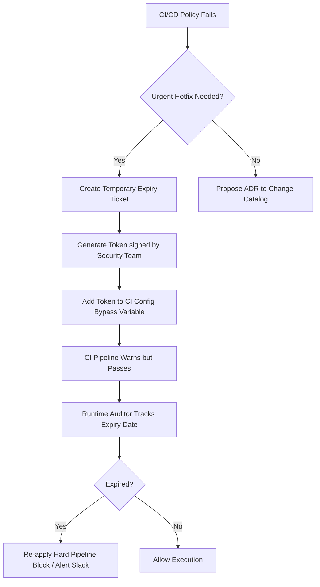

Imagine waking up at 3:00 AM to a critical security advisory: a zero-day remote code execution vulnerability has been discovered in a popular HTTP logging library. As a senior backend engineer or architect, your immediate task is to identify every vulnerable service running in your production Kubernetes clusters. In a fragmented microservices ecosystem with 150+ services, you quickly realize you are facing a nightmare: thirty services are running Node.js (split across versions 14, 16, 18, and 20), forty are in Go (compiled with versions ranging from 1.15 to 1.21), twenty-five run various JVM flavors with build configurations ranging from Gradle to Maven, and the rest are a mix of Python, Rust, and even a legacy Haskell service written by an engineer who left the company three years ago. Without structured tech stack governance, you have no single source of truth, no automated way to audit runtime dependencies, and no guardrails preventing developers from introducing arbitrary libraries, runtimes, or base images. The result is operational paralysis, high maintenance overhead, and severe security exposure.


## The Illusion of Total Autonomy: Why Microservice Sprawl Kills Velocity

In the early days of the microservices transition, the industry rallied around a enticing promise: *"Use the right tool for the job."* Teams were told they had complete autonomy to choose their languages, frameworks, databases, and deployment models. While this decentralized model works well for isolated prototyping, it introduces unsustainable friction when scaled to dozens of teams and hundreds of services. 

Autonomy without alignment leads to severe architectural debt:
1. **The Maintenance Tax:** Every programming language and framework version introduced to production requires maintenance. This includes base image OS upgrades, patch management, security scanning configuration, and internal library upgrades (e.g., logging wrappers, telemetry integration, and authentication middleware). If a company supports four languages, it must write and maintain its internal SDKs four times.
2. **Reduced Engineer Mobility:** When teams use radically different stacks, developers cannot easily move between teams. A Go engineer cannot quickly contribute to a Scala microservice, which slows down cross-team collaboration and creates single points of failure.
3. **Black Box Services:** Services built on unapproved, non-standard stacks quickly become unmaintainable black boxes. When the original author leaves, the team inherits a system they cannot debug, upgrade, or reliably test. Eventually, these services are left running on outdated container OS images, acting as ticking time bombs.
4. **Licensing and Compliance Risks:** Without strict oversight, developers may pull in open-source libraries with restrictive licenses (like GPLv3 or AGPL) that violate corporate IP policy, exposing the organization to legal liability.

Tech stack governance is not about building an ivory tower of dogmatic rules. It is about creating a frictionless **Paved Path** (or Golden Path)—a set of pre-approved, automated, and highly supported technologies that make the right way to build software also the easiest way.

## The Governance Matrix: Define, Enforce, and Audit

An effective governance model requires a closed-loop system built on three core pillars:

| Pillar | Objective | Implementation |
| :--- | :--- | :--- |
| **Define** | Establish the boundaries of the tech stack and create a single source of truth. | Tech Stack Registry (e.g., Backstage Catalog), RFC/ADR process for stack variations. |
| **Enforce** | Prevent out-of-compliance code or configurations from entering the build artifact stage. | CI/CD pipeline policy checks using OPA/Conftest, static analysis, SBOM validation. |
| **Audit** | Scan active execution environments for runtime drift or manual overrides. | Continuous Kubernetes controller loops, container registry scanning, vulnerability tracking. |

Without all three pillars, the system fails. If you only *define* the stack without *enforcing* it, developers will ignore the documentation. If you only *enforce* it at the CI stage, legacy services that are not frequently rebuilt will drift from compliance, and manual hotfixes will bypass your checks. If you only *audit* without *defining* clear paths, you will generate thousands of alerts with no actionable remediation steps for developers.

## Establishing the Paved Path: A GitOps-Driven Catalog

The foundation of governance is a machine-readable catalog of approved tech stacks. We model this catalog in a Git repository using schema-validated YAML files. This repository acts as the single source of truth for the organization's architectural standards.

Below is an example of a custom Backstage-compatible `TechStack` schema definition that classifies stack tiers, base images, and approved dependency groups:

```yaml
apiVersion: governance.internal.net/v1alpha1
kind: TechStackDefinition
metadata:
  name: go-standard-service
  description: "Approved Go service stack for high-throughput, low-latency microservices."
spec:
  language: "go"
  runtimeVersion: "1.21.x"
  tier: "paved-path" # paved-path, deprecated, sunset, experimental
  allowedBaseImages:
    - "cr.internal.net/paved/go-base:1.21-alpine"
    - "cr.internal.net/paved/go-base:1.21-distroless"
  approvedLibraries:
    - group: "github.com/gin-gonic/gin"
      versions: ["^1.9.0"]
    - group: "google.golang.org/grpc"
      versions: ["^1.57.0"]
    - group: "github.com/jackc/pgx"
      versions: ["^5.4.0"]
  lifecycle:
    owner: "platform-architecture-team"
    reviewCycleMonths: 6
    sunsetDate: "2027-06-30"
```

### Stack Lifecycles and Tiers

A scalable governance model must accommodate the natural evolution of software. Rather than applying a binary "approved vs. banned" filter, we implement a tiered lifecycle classification:

*   **Paved Path (Blessed):** Fully supported by the platform engineering team. Includes automated template creation, out-of-the-box CI/CD pipelines, integrated logging/metrics libraries, and automated patching pipelines. Recommended for all new services.
*   **Experimental:** Time-bounded approvals granted to specific teams to prototype new languages or frameworks (e.g., evaluating Rust for a high-performance network proxy). Experimental stacks are restricted to non-production environments and must be re-evaluated within 90 days.
*   **Deprecated:** Stacks that are no longer allowed for *new* services, but are tolerated for existing systems. The platform team provides limited support, and security patches must still be applied.
*   **Sunset:** Critical decommissioning phase. Services running on sunset stacks must be migrated to a Paved Path within a designated timeline (e.g., 6 months). CI pipelines for these services will emit build warnings, and deployments to production will require architect-level approval.

### Proposing Stack Changes via RFC/ADR

Developers must have a structured path to introduce new technologies. If a team has a legitimate use case that the current Paved Path cannot solve (e.g., requiring Python for machine learning model inference instead of the standard Go/Java stacks), they submit an Architectural Decision Record (ADR) via a Pull Request to the Governance repository.

The proposal must address:
1. **Business Justification:** Why the current Paved Path is insufficient.
2. **Maintenance Plan:** Which team will maintain the base images, libraries, and SDKs.
3. **Observability Integration:** How the stack will export standard Prometheus metrics, OpenTelemetry traces, and structured JSON logs.
4. **Security Tooling:** Confirmation that the stack's build tools and dependencies are compatible with the company's Software Composition Analysis (SCA) scanners (e.g., Snyk, Trivy).

## Automated Enforcement: OPA, Conftest, and SBOM Guards

Waiting for manual architectural reviews during a release cycle introduces major bottlenecks. Instead, we shift enforcement left by running automated policy-as-code evaluations within the CI/CD pipeline using **Open Policy Agent (OPA)** and **Conftest**.

When a developer triggers a build, the CI runner:
1. Pulls the latest rules from the central Governance Registry.
2. Inspects the codebase configuration files (`Dockerfile`, `package.json`, `go.mod`, etc.).
3. Generates a Software Bill of Materials (SBOM) using **Syft** or **Trivy**.
4. Evaluates the files and SBOM against OPA policies.

### Concrete OPA/Conftest Policy Example

The following Rego policy files check if a service's `Dockerfile` uses an approved base image from the internal container registry and blocks the build if an unauthorized public image is referenced.

```rego
# policy/dockerfile_governance.rego
package main

# Import input helpers
import future.keywords.in

# List of pre-approved base images fetched from our Tech Stack Catalog
approved_base_images := [
    "cr.internal.net/paved/go-base:1.21-alpine",
    "cr.internal.net/paved/go-base:1.21-distroless",
    "cr.internal.net/paved/nodejs-base:18-alpine",
    "cr.internal.net/paved/jvm-base:17-temurin"
]

# Deny helper rule
deny[msg] {
    # Parse the FROM instruction of the Dockerfile
    input[i].Cmd == "from"
    val := input[i].Value[0]
    
    # Check if the image is NOT in the approved list
    not image_in_approved_list(val)
    
    msg := sprintf("Insecure deployment blocker: Base image '%v' is not approved. Must use one of: %v", [val, approved_base_images])
}

# Sub-rule to validate image exact match or pattern match
image_in_approved_list(image) {
    image == approved_base_images[_]
}
```

To run this policy locally or in a GitHub Action, engineers use the `conftest` CLI:

```bash
conftest test Dockerfile --policy ./policy
```

If a developer attempts to build a container using `FROM node:14-alpine` (a public, end-of-life base image), the pipeline aborts immediately with a non-zero exit code:

```text
FAIL - Dockerfile - Insecure deployment blocker: Base image 'node:14-alpine' is not approved. Must use one of: ["cr.internal.net/paved/go-base:1.21-alpine", "cr.internal.net/paved/go-base:1.21-distroless", "cr.internal.net/paved/nodejs-base:18-alpine", "cr.internal.net/paved/jvm-base:17-temurin"]
```

### Dependency Guard: Checking the SBOM

By generating an SBOM in the CI pipeline, we can analyze transient dependencies. For example, during a node project compilation, the build agent runs:

```bash
syft package.json -o json > sbom.json
```

We run a second OPA policy to check `sbom.json` for banned packages, licensing conflicts, or deprecated libraries (e.g., blocking `log4j` versions prior to `2.17.1` or flagging license headers matching `GPL-3.0`).

## Runtime Drift Detection: Trust, but Verify

CI/CD enforcement is highly effective, but it only validates code at the point of release. Production environments are dynamic. Hotfixes are sometimes applied manually during outages, configuration changes are made directly to Kubernetes clusters via `kubectl`, and legacy microservices might run for hundreds of days without a new build.

To catch runtime drift, we deploy a **Tech Stack Audit Controller** inside our Kubernetes clusters. This controller runs as a cron job or a reconciliation loop that periodically compares running pods against the Tech Stack Catalog.

```python
# drift_detector.py
import os
import sys
import requests
from kubernetes import client, config

# Load cluster config
try:
    config.load_incluster_config()
except config.ConfigException:
    config.load_kube_config()

v1 = client.CoreV1Api()

# Fetch allowed base images from the Governance Registry API
def fetch_approved_images():
    try:
        response = requests.get("https://registry.internal.net/api/v1/approved-images", timeout=10)
        return set(response.json().get("images", []))
    except Exception as e:
        print(f"Error fetching approved images list: {e}")
        sys.exit(1)

def audit_running_pods():
    approved_images = fetch_approved_images()
    drifted_pods = []
    
    # List all running pods in the target namespaces
    namespaces = ["production", "staging"]
    for ns in namespaces:
        pods = v1.list_namespaced_pod(ns)
        for pod in pods.items:
            # Check the status phase
            if pod.status.phase != "Running":
                continue
                
            for container in pod.spec.containers:
                image = container.image
                # Correlate running image with our approved list
                if image not in approved_images:
                    drifted_pods.append({
                        "name": pod.metadata.name,
                        "namespace": ns,
                        "image": image,
                        "owner_team": pod.metadata.labels.get("team", "unknown")
                    })
                    
    return drifted_pods

def alert_drift(drifts):
    for drift in drifts:
        payload = {
            "text": f"🚨 *Governance Drift Detected in Production!* \n"
                    f"*Pod:* `{drift['name']}`\n"
                    f"*Namespace:* `{drift['namespace']}`\n"
                    f"*Image:* `{drift['image']}`\n"
                    f"*Owner Team:* `{drift['owner_team']}`\n"
                    f"*Remediation:* Rebuild container using the Go 1.21 paved path base image."
        }
        # Post to Slack alert channel
        requests.post(os.getenv("SLACK_WEBHOOK_URL"), json=payload, timeout=5)

if __name__ == "__main__":
    drifts = audit_running_pods()
    if drifts:
        print(f"Detected {len(drifts)} out-of-compliance pods.")
        alert_drift(drifts)
    else:
        print("All running pods conform to tech stack policies.")
```

By executing this check every 4 hours, we achieve closed-loop verification. If an operator bypasses the CI pipeline and deploys a custom image containing an old base tag, the platform team is alerted within hours.

## Handling Exceptions without Friction: The Escalation Path

A governance policy that is too rigid will force developers to seek workarounds. There are legitimate business situations that require temporary bypasses:
*   A third-party client library only compiles with an older version of Python.
*   An acquired service is running on AWS ECS with a legacy Node.js stack, and the team needs three months to integrate it into the Kubernetes paved path.
*   A high-priority bug fix needs to go live immediately, and the team lacks the time to rewrite deprecated components to pass the OPA linter.

To address these scenarios, we design a formal exception workflow:



1. **Ticket-Based Exceptions:** The developer opens a Jira exception ticket detailing the reason for stack bypass, the security implications, and a definitive migration date.
2. **Auto-Expiring Approvals:** The platform registry generates a temporary exception token mapped to the service. The exception token is stored in the service repository configuration:
    ```yaml
    # .governance-bypass.yaml
    exceptions:
      - policy: "dockerfile_governance"
        rationale: "Upgrade of legacy billing service postponed due to Q3 compliance sprint."
        expires: "2026-10-01"
        approver: "engineering-director-backend"
        token: "jwt_signed_payload_here"
    ```
3. **Escalated Operational Ownership:** If a team runs a service on an unapproved stack under an exception, the operational alert ownership shifts. Instead of the platform team managing stability alerts for that service, PagerDuty alerts are routed directly to the engineering team's management, aligning incentives toward refactoring.

## Conclusion: Balancing Safety and Innovation

Tech stack governance is not about limiting creativity; it is about automating the routine aspects of software delivery so that engineering teams can focus on writing business logic. By implementing a GitOps-based catalog, automating policy enforcement in the CI pipeline with OPA/Conftest, and validating running environments with runtime drift detection controllers, you can maintain high architectural standards at scale.

This governance structure transforms a chaotic, fragmented microservices sprawl into a secure, predictable, and highly efficient paved path. When the next critical zero-day vulnerability drops, you will not spend days searching through hundreds of git repositories. Instead, you will update a single base image in the Tech Stack Catalog, verify the automated pipeline runs, and track the deployments in near real-time.