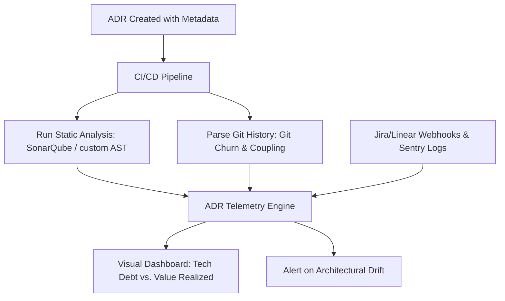

Most Architectural Decision Records (ADRs) are write-only monuments to good intentions. You gather the senior engineers, argue for three hours about database engines or modular monolith boundaries, write a beautiful markdown file detailing the context, decision, and consequences, and then merge it. Six months later, the codebase is still a tangled web of dependencies, developer velocity continues to decay, and nobody can prove whether that architectural pivot actually solved the problem or just shifted the pain to another service. In high-throughput production environments, relying on architectural intuition is a liability. If you cannot quantify the impact of your architectural decisions, you are not managing technical debt—you are just rearranging it.

To solve this, we must transition from passive documentation to a active, quantitative framework that treats ADRs as testable engineering hypotheses. This post outlines a concrete framework for measuring the real-world impact of architectural decisions by tracking complexity churn and technical debt payoff directly from your Git history, static analysis pipelines, and telemetry systems.

## The Failure of the Passive ADR

In typical engineering organizations, the life cycle of an ADR ends when the pull request containing the markdown file is merged. This passive approach suffers from three major production failure modes:

1. **Architectural Drift:** Engineers bypass the agreed-upon architecture because there is no automated feedback loop telling them they have violated the decision's boundary constraints.
2. **Invisible Debt Accumulation:** A decision made to reduce complexity (e.g., migrating a shared database to decoupled service-specific schemas) often introduces new, unmeasured forms of complexity (e.g., distributed transaction management or network latency overhead).
3. **The Unfunded Refactoring:** When you need to justify a major refactoring to product stakeholders, you lack the objective data to prove that the previous architectural state is actively costing the company money in developer cycles.

To move past this, every ADR must include a **Quantitative Hypothesis**. Instead of writing "Consequence: Code will be easier to maintain," you must write: "Hypothesis: By decoupling the billing module from the core transaction engine, we will reduce the average cognitive complexity of files in `/services/billing` by 30% and decrease the commit churn rate in `/services/transaction` by 45% over the next two quarters."

## The Metrics That Matter

To quantify the impact of an architectural decision, we track metrics across three categories: structural complexity, git churn, and operational reliability.

### Structural Complexity Metrics

Static code analysis tools like SonarQube or custom AST parsers can calculate structural metrics, but you must focus on the correct indicators:

* **Cognitive Complexity (over Cyclomatic):** While cyclomatic complexity measures the number of execution paths, cognitive complexity measures how difficult the code is for a human to comprehend (e.g., nested loops, deep recursion, and catch blocks). An effective ADR targeting readability should show a downward trend in cognitive complexity in the target namespace.
* **Afferent (Ca) and Efferent (Ce) Coupling:** If your ADR specifies a boundary between two domains, you must monitor coupling. High efferent coupling (depending on many classes outside the module) means the module is unstable; high afferent coupling (many outside classes depending on it) means the module is highly resistant to change.
* **Instability ($I = \frac{Ce}{Ca + Ce}$):** Instability ranges from 0 (completely stable, highly coupled afferently) to 1 (completely unstable, highly coupled efferently). Your ADRs should specify the target instability index for key packages.

### Git Churn Metrics

Your version control history is a goldmine of behavioral data. By parsing git logs, you can measure how developers interact with the architecture:

* **Code Churn:** The number of lines added, modified, or deleted in a specific directory over a time window. If an ADR aims to stabilize a core module, code churn in that directory should plummet.
* **Change Coupling:** The frequency with which two unrelated modules are modified in the same commit. If ADR-204 asserts that the `/user` module and the `/notification` module are fully decoupled, any commit containing modifications to both represents an architectural regression.
* **Impact Radius:** The average number of files touched per pull request within a domain. A successful modularization ADR should shrink the impact radius of feature PRs.

### Operational and Business Metrics

Code metrics are meaningless if they do not translate to business outcomes. We tie our quantitative ADRs to downstream signals:

* **Ticket Cycle Time:** The elapsed time from when work starts on a task in a specific domain to when it is deployed to production.
* **Defect Density:** The number of bugs reported per 1,000 lines of code within the refactored domain.
* **Alert Volume and MTTR:** The frequency of pageable alerts and the Mean Time to Resolution for incidents stemming from the affected services.

## Instrumenting the Quantitative Framework

You do not need to purchase expensive enterprise software engineering intelligence platforms to implement this. You can build a robust quantitative ADR pipeline using tools you already use: Git, CI/CD runners, and simple scripts.

Here is the high-level architecture of the framework:



### Step 1: Standardizing ADR Metadata

To measure the impact of an ADR, we must map specific directories or packages in our monorepo to the ADR that governs them. We achieve this by adding a YAML frontmatter block to the top of our ADR markdown files:

```yaml
---
id: ADR-042
title: "Decouple Notification Engine into Asynchronous Worker Pool"
date: 2026-07-29
status: Accepted
affects:
  - "/services/notification-api"
  - "/workers/notification-dispatcher"
hypotheses:
  - metric: "git.churn.lines"
    target: "-40%"
    baseline: 1250 # lines per week
    timeline: "90d"
  - metric: "code.cognitive_complexity.max"
    target: "< 15"
    baseline: 28
    timeline: "60d"
  - metric: "operational.defect_density"
    target: "-50%"
    baseline: 4.2 # defects per KLOC
    timeline: "180d"
---
```

### Step 2: Automated Churn and Coupling Tracker

To calculate code churn and change coupling, we execute a script in our CI/CD post-merge hook (or as a nightly cron job). Below is a production-ready Python script that calculates change coupling between two directories to detect if they are violating decoupling boundaries defined in an ADR:

```python
#!/usr/bin/env python3
import subprocess
import re
from collections import defaultdict
import json
import sys

def get_git_commits(limit=100):
    # Get hash and list of modified files for the last N commits
    cmd = ["git", "log", f"-n {limit}", "--pretty=format:%H", "--name-only"]
    result = subprocess.run(cmd, capture_output=True, text=True, check=True)
    
    commits = []
    current_files = []
    
    for line in result.stdout.split("\n"):
        line = line.strip()
        if not line:
            continue
        if re.match(r"^[0-9a-f]{40}$", line):
            if current_files:
                commits.append(current_files)
                current_files = []
        else:
            current_files.append(line)
            
    if current_files:
        commits.append(current_files)
    return commits

def analyze_coupling(commits, path_a, path_b):
    co_occurrences = 0
    total_a = 0
    total_b = 0
    
    for files in commits:
        touches_a = any(f.startswith(path_a) for f in files)
        touches_b = any(f.startswith(path_b) for f in files)
        
        if touches_a:
            total_a += 1
        if touches_b:
            total_b += 1
        if touches_a and touches_b:
            co_occurrences += 1
            
    # Calculate Jaccard similarity coefficient as the coupling metric
    union = total_a + total_b - co_occurrences
    coupling_index = co_occurrences / union if union > 0 else 0.0
    
    return {
        "path_a_touches": total_a,
        "path_b_touches": total_b,
        "shared_touches": co_occurrences,
        "coupling_index": coupling_index
    }

if __name__ == "__main__":
    # Example usage: check coupling between notification services
    commits = get_git_commits(limit=500)
    metrics = analyze_coupling(commits, "services/notification-api", "services/order-processor")
    
    print(json.dumps(metrics, indent=2))
    
    # If coupling index exceeds threshold (e.g., 0.15 for decoupled services), trigger warning
    if metrics["coupling_index"] > 0.15:
        print("WARNING: High architectural coupling detected between Notification API and Order Processor!", file=sys.stderr)
        # Exit with success in CI, but flag the metrics payload to be ingested
        sys.exit(0)
```

### Step 3: Measuring Cognitive Complexity Churn

To track structural debt payoff, we integrate a static analysis step in our CI pipeline using tools like `cloc` and local AST parsers. For example, if you run a Go or TypeScript stack, you can generate a complexity report per file using tools like `gocyclo` or `complexity-report` (JS/TS).

By comparing the average complexity of the files modified in a PR to the baseline stored in the ADR frontmatter, the pipeline computes the delta:

$$\Delta \text{Complexity} = \text{Complexity}_{\text{post-ADR}} - \text{Complexity}_{\text{baseline}}$$

If the delta is positive over a 30-day moving window, the refactoring is failing to pay down structural debt.

### Step 4: Tracking Technical Debt Valuation (ROI)

How do we prove to product managers that the rewrite was worth it? We calculate the **Refactoring ROI** using ticket cycle times. 

Suppose the baseline cycle time for tickets in the `/legacy-billing` service was $54$ hours. After implementing ADR-088 (migrating to a unified payment service in `/services/payment`), the cycle time drops to $32$ hours. 

$$\text{Hours Saved Per Ticket} = \text{Cycle Time}_{\text{baseline}} - \text{Cycle Time}_{\text{post}}$$
$$\text{Financial Payoff} = \sum (\text{Tickets Resolved}) \times (\text{Hours Saved}) \times (\text{Average Developer Blended Rate})$$

If your team resolves 40 billing tickets a quarter at a blended rate of \$100/hr, that single architectural shift saved \$88,000 in engineering capacity in 90 days. Presenting this to your VPE or CFO turns tech debt discussions from emotional pleas into solid business cases.

## Two Real-World Production Failure Modes

To demonstrate the value of this quantitative approach, let’s look at two production case studies where this framework either validated a hard decision or stopped a disastrous one.

### Case 1: The Database Sharding Illusion

An engineering team experienced write bottlenecks on their primary PostgreSQL instance. They drafted an ADR to implement manual application-level sharding by user ID across four databases. 

* **The Assumption:** Sharding would distribute load, stabilize database latency, and decouple the write pathways.
* **The Quantitative Reality:** After implementing the change, the team tracked their metrics:
  * **Database Latency:** Dropped by 35% on average (success).
  * **Git Churn (Codebase-wide):** Increased by 80% because every single feature PR now required boilerplate code to route queries through the new shard-manager.
  * **Change Coupling:** Slipped from 0.05 to 0.40 between the user-management service and the shard-routing layer.
  * **MTTR:** Increased by 110% because debugging cross-shard transactions required manual database state reconciliation.

Without a quantitative framework, the team would have celebrated the database latency graph. With the metrics framework, they realized they had traded an operations bottleneck for a massive developer velocity bottleneck. They ultimately rolled back the application sharding and moved to a managed distributed SQL option (CockroachDB), returning code churn and MTTR back to baseline.

### Case 2: The Monolith-to-Microservices Refactoring Trap

To improve deploy times and clear up ownership, a team decided to extract their authentication logic out of a Ruby on Rails monolith into a Go microservice (ADR-102).

* **The Assumption:** The auth microservice would be highly stable, requiring few changes after launch.
* **The Quantitative Reality:**
  * **Afferent/Efferent Coupling:** The Go service was highly stable ($I = 0.12$), but the Rails monolith’s efferent coupling spiked as it had to handle gRPC retries, auth caching, and token validation logic.
  * **Change Coupling:** Over three months, 70% of commits to the Go microservice also required a corresponding commit in the Rails monolith to update client configurations.
  * **Ticket Cycle Time:** Auth-related tickets increased from a cycle time of 3 days to 8.5 days because developers had to coordinate deployments across two codebases with different CI runtimes.

```
Monolith-to-Microservice Metric Shift (Post-90 Days):
+-----------------------------------+----------+-----------+
| Metric                            | Baseline | Post-ADR  |
+-----------------------------------+----------+-----------+
| Average Churn (Files/PR)          | 3.2      | 7.8       |
| Change Coupling Index             | 0.02     | 0.72      |
| Cycle Time (Days)                 | 3.0      | 8.5       |
| Deploy Success Rate               | 99.8%    | 97.4%     |
+-----------------------------------+----------+-----------+
```

The metrics clearly proved that the microservice boundary was drawn in the wrong place. The auth logic was too tightly coupled to business domains in the monolith. The team used this data to merge the service back before the operational complexity became unmanageable, refactoring the monolith internals with explicit module namespaces instead.

## How to Prevent Metric Gaming (Goodhart's Law)

Whenever you introduce quantitative measurements to software engineering, you risk running into Goodhart's Law: *"When a measure becomes a target, it ceases to be a good measure."* 

If you tell developers they must reduce cognitive complexity below 15 to comply with an ADR, they will start split-mapping functions into arbitrary, hard-to-follow sub-functions. They will reduce the metrics on paper while making the system harder to reason about in reality.

To mitigate this, you must apply these constraints to the framework:

1. **Balance Metrics with Counter-Metrics:** Never measure complexity in isolation. Pair structural complexity with **Impact Radius** and **Cycle Time**. If a developer cheats cognitive complexity by splitting a function into ten files, their Impact Radius (files touched per PR) will shoot up, flagging the regression.
2. **Never Tie Metrics to Appraisals:** Use this framework strictly for architectural health and decision validation. The moment these metrics influence performance reviews or bonuses, the data will be corrupted.
3. **Decay the Baselines:** Architectures decay naturally. Re-evaluate your ADR baseline metrics every 12 months. If the codebase has drifted, reset the baselines to match the current production reality before planning your next technical debt sprint.

## The Pragmatic Path Forward

If you want to start measuring architectural performance today, do not try to automate everything at once. Start with a single, high-stakes architectural change:

1. Write your next ADR with a **Quantitative Hypothesis** section containing at least two measurable developer metrics (like git churn or coupling) and one business metric.
2. Set up a simple shell script in your repository to track files changed in that domain over the next 60 days.
3. Run a post-mortem review 90 days after deployment, comparing your metrics to the baseline.

By moving your architecture from a series of subjective arguments to a set of testable, measurable hypotheses, you will build cleaner systems, increase developer velocity, and prove the business value of paying down your technical debt.