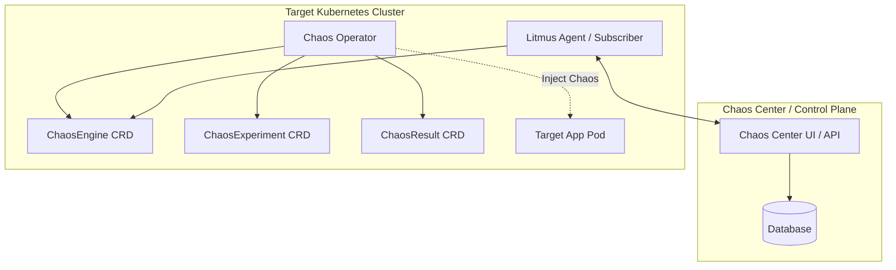

In distributed systems, failure is not an anomaly; it is a mathematical certainty. In Kubernetes environments, where containers spin up and down dynamically, microservices scale horizontally, and network configurations are in constant flux, understanding how your application behaves under stress is critical. 

Traditional testing focuses on happy paths and expected error states. **Chaos Engineering**, on the other hand, is the practice of injecting controlled failure into a system to verify its resilience. Among the tools available for Kubernetes, **LitmusChaos** stands out as a premier cloud-native Chaos Engineering platform. 

In this post, we will explore what LitmusChaos is, how its architecture works, and how you can run your first chaos experiment.

---

## Why LitmusChaos?

LitmusChaos is an incubating project under the Cloud Native Computing Foundation (CNCF). It is designed specifically for Kubernetes, adopting a **declarative, Kubernetes-native approach** to chaos.

Key benefits of LitmusChaos include:
*   **Kubernetes-Native (CRD-Based):** Chaos experiments are defined as Custom Resource Definitions (CRDs). You manage them just like you manage Pods, Deployments, or Services using `kubectl`.
*   **Chaos Hub:** A public registry containing hundreds of pre-defined, community-vetted chaos experiments (such as Pod delete, network latency, CPU hog, disk fill, and API gateway disruption).
*   **Chaos Center (Litmus Portal):** A single pane of glass to design, schedule, monitor, and analyze chaos scenarios across multiple target clusters.
*   **Resilience Score:** Provides a quantitative measurement of your system's resilience based on the outcome of the chaos tests.

---

## LitmusChaos Architecture

LitmusChaos uses a decentralized, agent-based architecture. A central control plane (Chaos Center) communicates with agents running on target Kubernetes clusters.

Here is how the components interact:



### Core Custom Resources (CRDs)
To write and execute chaos experiments, LitmusChaos relies on three main custom resources:
1.  **`ChaosExperiment`**: Defines the metadata and parameters of the experiment (e.g., duration, chaos library, environment variables).
2.  **`ChaosEngine`**: Connects a specific workload (like your deployment) to a `ChaosExperiment`. It controls the execution of the chaos.
3.  **`ChaosResult`**: Holds the outcome of the chaos experiment (e.g., Verdict: Pass/Fail, and detailed logs/metrics).

---

## Injecting Your First Chaos: Pod Delete

A classic chaos experiment is the **Pod Delete** experiment (similar to the legacy Chaos Monkey). It randomly kills pods of a target deployment to verify if your application has high availability configured (e.g., replica count > 1, pod disruption budgets, health probes).

### Step 1: Install ChaosExperiment
First, you pull the experiment definition from the Chaos Hub. For example, to install the `pod-delete` experiment in your cluster:

```bash
kubectl apply -f https://hub.litmuschaos.io/api/chaos/1.13.8?file=charts/generic/pod-delete/experiment.yaml -n litmus
```

### Step 2: Define the ChaosEngine
Next, you create a `ChaosEngine` manifest that targets your application deployment. Suppose you have a service named `frontend` running in the `default` namespace:

```yaml
apiVersion: litmuschaos.io/v1alpha1
kind: ChaosEngine
metadata:
  name: frontend-chaos
  namespace: default
spec:
  # Reference to the Service Account with permissions to run chaos
  chaosServiceAccount: litmus-admin
  # AppInfo specifies details of the application under experiment
  appinfo:
    appns: 'default'
    applabel: 'app=frontend'
    appkind: 'deployment'
  # EngineState controls the execution of chaos (active/stop)
  engineState: 'active'
  # The list of experiments to run
  experiments:
    - name: pod-delete
      spec:
        components:
          env:
            # How long the pod deletion loop should run (in seconds)
            - name: TOTAL_CHAOS_DURATION
              value: '30'
            # Interval between consecutive pod deletions (in seconds)
            - name: CHAOS_INTERVAL
              value: '10'
            # Force kill the pod immediately
            - name: FORCE
              value: 'true'
```

Apply the engine manifest to start the chaos:
```bash
kubectl apply -f frontend-chaos-engine.yaml
```

---

## Measuring Steady State (Probes)

Chaos without validation is just breaking things. LitmusChaos utilizes **Probes** to validate the system's health before, during, and after chaos execution. 

For instance, you can add an `httpProbe` to verify that your frontend API returns a `200 OK` status code throughout the experiment:

```yaml
spec:
  experiments:
    - name: pod-delete
      spec:
        probe:
          - name: check-frontend-status
            type: httpProbe
            httpProperties:
              url: http://frontend.default.svc.cluster.local:8080/healthz
              method: GET
            mode: Continuous
            runProperties:
              probeTimeout: 1000
              interval: 2000
              retry: 3
```

If the endpoint fails to respond with `200 OK` at any point during the execution, the probe fails, the experiment halts, and the `ChaosResult` verdict is set to **Failed**.

---

## Inspecting the ChaosResult

After the experiment finishes, you can check its outcome by querying the `ChaosResult` resource:

```bash
kubectl get chaosresult frontend-chaos-pod-delete -o yaml
```

The output will contain the status verdict:

```yaml
status:
  experimentStatus:
    phase: Completed
    verdict: Passed # or Failed
    probeSuccessPercentage: 100
```

---

## Summary and Next Steps

By incorporating LitmusChaos into your Kubernetes workflow, you transition from *assuming* your system is resilient to *proving* it. 

Start by injecting simple faults like pod deletions in your staging environment. Gradually progress to network latency injection, resource hogging, and database connection losses. Once you have high confidence, you can automate these scenarios in your continuous deployment pipeline to guard against resilience regressions.

In the next post, we will look at how to run advanced network latency experiments using LitmusChaos and how to build custom probes for microservices.
