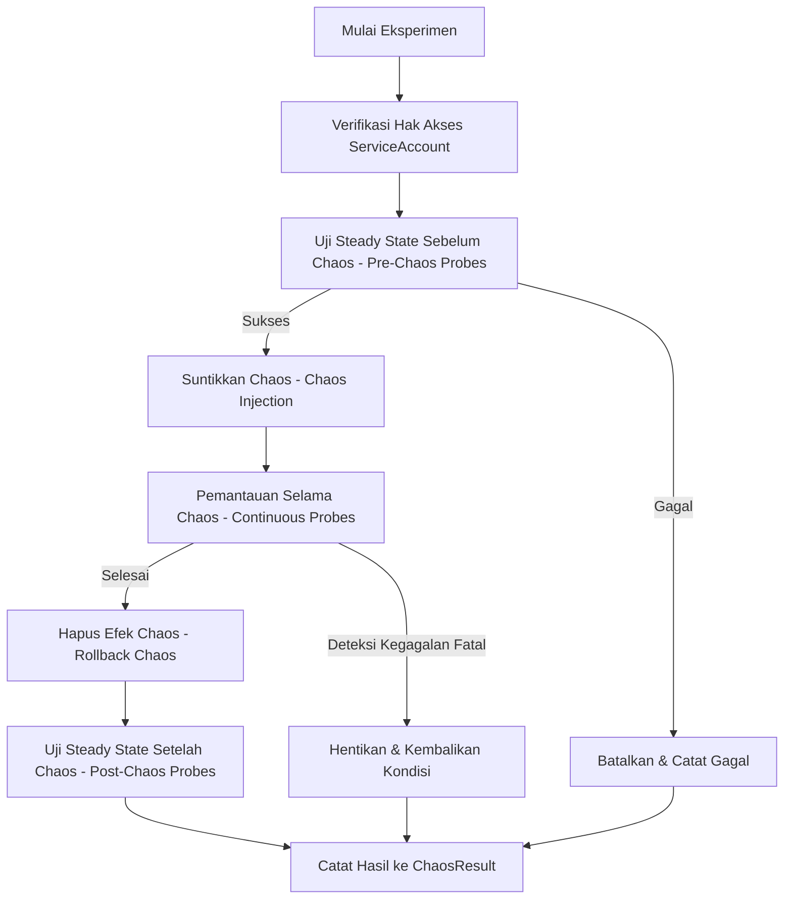

Dalam sistem terdistribusi, kegagalan bukanlah hal yang aneh; melainkan sebuah kepastian matematis. Pada lingkungan Kubernetes—tempat di mana container berjalan dan mati secara dinamis, microservices berskala secara horizontal, dan konfigurasi jaringan terus berubah—memahami bagaimana aplikasi Anda berperilaku saat mengalami tekanan sangatlah penting.

Pengujian tradisional biasanya hanya berfokus pada skenario sukses (*happy paths*) dan skenario error yang sudah diantisipasi. Sebaliknya, **Chaos Engineering** adalah praktik menyuntikkan kegagalan yang terkendali ke dalam sistem untuk memverifikasi ketahanan (*resilience*) secara nyata. Di antara berbagai alat yang tersedia untuk Kubernetes, **LitmusChaos** merupakan salah satu platform terdepan.

Dalam artikel ini, kita akan membahas apa itu LitmusChaos, bagaimana arsitekturnya bekerja, dan bagaimana Anda dapat menjalankan eksperimen chaos pertama Anda.

---

## Mengapa LitmusChaos?

LitmusChaos adalah proyek inkubasi di bawah Cloud Native Computing Foundation (CNCF). Alat ini dirancang khusus untuk Kubernetes dengan mengadopsi pendekatan **deklaratif berbasis Kubernetes-native**.

Keunggulan utama LitmusChaos meliputi:
*   **Kubernetes-Native (Berbasis CRD):** Eksperimen chaos didefinisikan sebagai Custom Resource Definitions (CRDs). Anda dapat mengelolanya menggunakan `kubectl` layaknya mengelola Pods atau Deployments.
*   **Chaos Hub:** Repositori publik yang berisi ratusan eksperimen chaos siap pakai (seperti mematikan Pod, latensi jaringan, konsumsi CPU berlebih, disk penuh, dan gangguan API gateway).
*   **Chaos Center (Litmus Portal):** Dasbor terpadu untuk merancang, menjadwalkan, memantau, dan menganalisis skenario chaos di berbagai cluster Kubernetes secara terpusat.
*   **Resilience Score:** Memberikan metrik kuantitatif tentang seberapa tangguh sistem Anda berdasarkan hasil dari eksperimen yang dijalankan.

---

## Alur Kerja Eksperimen LitmusChaos

Eksperimen chaos di LitmusChaos memiliki siklus hidup yang teratur dan aman. Setiap tahap dirancang untuk meminimalkan dampak buruk yang tidak terencana (*blast radius*).

Berikut adalah gambaran alur kerja dari sebuah eksperimen chaos:



### Resource Kunci di LitmusChaos
Ada tiga Custom Resource utama yang perlu Anda ketahui:
1.  **`ChaosExperiment`**: Berisi parameter teknis eksperimen (seperti durasi chaos, library yang digunakan, dan variabel lingkungan).
2.  **`ChaosEngine`**: File konfigurasi yang menghubungkan aplikasi target dengan eksperimen chaos yang ingin dijalankan.
3.  **`ChaosResult`**: Menyimpan hasil akhir dari eksperimen chaos (apakah berstatus Lolos/Gagal beserta metrik detailnya).

---

## Menjalankan Eksperimen Pertama: Pod Delete

Eksperimen paling klasik dan mendasar adalah **Pod Delete** (mirip dengan konsep Chaos Monkey). Eksperimen ini mematikan pod secara acak pada aplikasi target untuk memastikan konfigurasi High Availability (HA) Anda (seperti replica count > 1, Pod Disruption Budgets, dan readiness probes) berfungsi dengan baik.

### Langkah 1: Pasang ChaosExperiment
Pertama, unduh definisi eksperimen `pod-delete` dari Chaos Hub ke cluster Anda:

```bash
kubectl apply -f https://hub.litmuschaos.io/api/chaos/1.13.8?file=charts/generic/pod-delete/experiment.yaml -n litmus
```

### Langkah 2: Definisikan ChaosEngine
Buat berkas manifest `ChaosEngine` yang menargetkan deployment aplikasi Anda. Sebagai contoh, aplikasi web `frontend` di namespace `default`:

```yaml
apiVersion: litmuschaos.io/v1alpha1
kind: ChaosEngine
metadata:
  name: frontend-chaos-id
  namespace: default
spec:
  # Service Account yang memiliki izin untuk menjalankan chaos
  chaosServiceAccount: litmus-admin
  # Detail workload yang akan diuji
  appinfo:
    appns: 'default'
    applabel: 'app=frontend'
    appkind: 'deployment'
  # Status eksekusi (active = langsung berjalan)
  engineState: 'active'
  # Daftar eksperimen yang akan dieksekusi
  experiments:
    - name: pod-delete
      spec:
        components:
          env:
            # Total waktu pengulangan hapus pod (dalam detik)
            - name: TOTAL_CHAOS_DURATION
              value: '30'
            # Jeda waktu antara penghapusan pod berikutnya
            - name: CHAOS_INTERVAL
              value: '10'
            # Matikan pod secara paksa
            - name: FORCE
              value: 'true'
```

Jalankan perintah berikut untuk mengeksekusi eksperimen:
```bash
kubectl apply -f frontend-chaos-engine.yaml
```

---

## Memantau Kesehatan Aplikasi Menggunakan Probes

Menjalankan chaos tanpa pemantauan hanyalah tindakan merusak sistem tanpa arah. LitmusChaos menyediakan fitur **Probes** untuk memvalidasi kesehatan sistem sebelum, selama, dan setelah eksperimen berjalan.

Contoh di bawah ini menggunakan `httpProbe` untuk memastikan endpoint health-check aplikasi `frontend` tetap merespon dengan status `200 OK` selama proses penghapusan pod berlangsung:

```yaml
spec:
  experiments:
    - name: pod-delete
      spec:
        probe:
          - name: cek-koneksi-frontend
            type: httpProbe
            httpProperties:
              url: http://frontend.default.svc.cluster.local:8080/healthz
              method: GET
            mode: Continuous
            runProperties:
              probeTimeout: 1000
              interval: 2000
              retry: 3
```

Jika endpoint gagal merespon atau mengembalikan status error di tengah-tengah jalannya chaos, probe akan mendeteksi kegagalan tersebut, eksperimen akan segera dihentikan, dan status akhir dinyatakan **Failed**.

---

## Memeriksa ChaosResult

Setelah eksperimen selesai, Anda dapat memeriksa hasilnya dengan melihat resource `ChaosResult`:

```bash
kubectl get chaosresult frontend-chaos-id-pod-delete -o yaml
```

Anda akan melihat bagian status seperti berikut:

```yaml
status:
  experimentStatus:
    phase: Completed
    verdict: Passed # atau Failed
    probeSuccessPercentage: 100
```

---

## Kesimpulan

Dengan mengintegrasikan LitmusChaos ke dalam siklus pengembangan, Anda dapat beralih dari sekadar *berasumsi* bahwa aplikasi Anda tangguh menjadi *membuktikannya* secara nyata.

Mulailah dengan eksperimen sederhana di lingkungan staging. Setelah kepercayaan diri tim meningkat, Anda dapat melangkah ke eksperimen yang lebih kompleks seperti simulasi latensi jaringan, pembatasan CPU, dan kegagalan koneksi database. Langkah terakhir adalah mengintegrasikan eksperimen ini ke dalam pipeline CI/CD untuk mencegah terjadinya regresi ketahanan sistem.

Pada artikel selanjutnya, kita akan membahas cara melakukan eksperimen manipulasi jaringan (*network emulation*) dan merancang visualisasi dasbor pemantauan chaos yang komprehensif.
