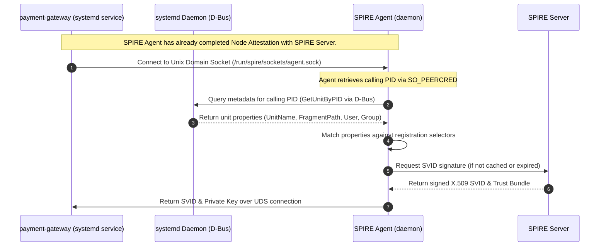

In production environments running outside of Kubernetes—such as legacy VM clusters, hybrid cloud deployments, or bare-metal hypervisors—security engineers constantly struggle with the "Secret Zero" bootstrapping problem. While Kubernetes simplifies workload identity using native service accounts, non-containerized environments often rely on static configuration files, long-lived API keys, or over-privileged Cloud Metadata Service (IMDSv2) access. This status quo is a security disaster: a single Server-Side Request Forgery (SSRF) or Remote Code Execution (RCE) exploit on a web application can expose the VM’s entire IAM role, giving an attacker access to databases, object storage, and upstream services. Transitioning to a zero-trust model in these environments requires a cryptographically verifiable, short-lived identity document that is issued dynamically and bound directly to the operating system's process lifecycle. This post details how to implement zero-trust workload identity on bare-metal and VMs using the SPIFFE Runtime Environment (SPIRE) and systemd workload attestation.

## The Mechanics of SPIFFE/SPIRE on Linux VMs

SPIFFE (Secure Production Identity Framework for Everyone) defines a standard for identifying workloads using a uniform URI known as a SPIFFE ID (e.g., `spiffe://prod.internal.net/ns/payment/sa/payment-gateway`). The identity is delivered to the workload in the form of a SPIFFE Verifiable Identity Document (SVID), which can be an X.509 certificate or a JSON Web Token (JWT).

SPIRE implements this framework via a server-agent architecture. The SPIRE Agent runs as a daemon on the target node. It exposes the SPIFFE Workload API over a local Unix Domain Socket (UDS) `/run/spire/sockets/agent.sock`. When a process connects to this socket, the agent performs two stages of verification:

1. **Node Attestation**: The agent proves its own identity (the VM or bare-metal host) to the central SPIRE Server. On VMs, this is typically done using cloud-native attesters (AWS Instance Identity Documents, GCP Instance Identity Tokens) or TPMs.
2. **Workload Attestation**: The agent identifies the specific process calling the Workload API. Since there is no Kubernetes API on a bare-metal VM, SPIRE leverages the local OS. The agent identifies the caller's PID by reading the socket's ancillary credentials (`SO_PEERCRED`). It then uses the `systemd` workload attester plugin to query the systemd daemon over D-Bus and collect properties about the service managing that PID.

## Configuring the SPIRE Agent for Systemd Attestation

To enable the systemd workload attester, the SPIRE Agent configuration file (`agent.conf`) must load the `systemd` workload attester plugin. In production, we also configure the `unix` workload attester to allow multi-layered attestation.

Security hardening starts at the socket level. We configure the `workload_api_socket_group` to restrict socket access to a specific Linux group (e.g., `spire-workloads`). This prevents unauthorized local users from querying the Workload API.

Any workload that needs to obtain its SPIFFE identity must run as a user that belongs to the `spire-workloads` group. This is configured in the workload's systemd unit file.

## Hardening the Systemd Service Unit File

If a workload binary is compromised, an attacker could theoretically attempt to connect to the Workload API to read another service's credentials. However, the systemd workload attester ensures that only the process belonging to the specific systemd unit file can request that identity.

We must harden the systemd service file using Linux security mechanisms. By enforcing non-root execution, setting supplementary groups, and enabling mount isolation, we create a secure, sandbox-like execution environment.

Setting `BindPaths=/run/spire/sockets` is critical when running with `ProtectSystem=strict`. Systemd creates a mount namespace for the process, and without explicitly exposing the path containing the Unix socket, the workload will get a "connection refused" or "file not found" error.

## Declarative Registration: Combining Systemd and Unix Selectors

The SPIRE Server is where the SPIFFE IDs are mapped to specific physical selectors. To prevent impersonation, a production setup must employ multi-factor attestation. We combine:

*   `systemd:unit` to identify the service unit.
*   `systemd:fragment_path` to ensure the systemd unit file has not been loaded from a user-writable directory (e.g., `/tmp` or `/home/user`). Only unit files in system-controlled directories like `/lib/systemd/system/` or `/etc/systemd/system/` should be trusted.
*   `unix:user` to verify the execution user.
*   `unix:path` to verify the exact binary path of the executed code.

If an attacker exploits a remote code execution vulnerability in the payment gateway app, they run as user `payment-app`. If they try to execute a secondary script or download a malicious payload to query the Workload API, the SPIRE Agent will intercept the connection, detect that the calling process path is not `/opt/payment-gateway/bin/payment-gateway` or is not running under the `payment-gateway.service` unit, and deny the request.

## Consuming Cryptographic Identity in Code

In a zero-trust model, workloads do not parse static configuration files containing client certificates or database passwords. Instead, they interact directly with the local SPIFFE Workload API to bootstrap transport layer security (mTLS) or obtain JWT tokens for API authorization.

### Mutual TLS Client in Go

The client uses the official SPIFFE Go SDK to construct a dynamic TLS config. It connects to the agent socket over gRPC, fetches the X.509 SVID and the trust bundle, and handles automatic key and certificate rotation in the background.

### Mutual TLS gRPC Server in Go

The server performs mutual TLS and enforces client authorization using the client's SPIFFE ID.

### Fetching JWT-SVID for HashiCorp Vault Authentication in Python

Inside legacy environments, some workloads need to call HTTP APIs that do not support mTLS directly, but do support JWT token validation (like HashiCorp Vault, AWS IAM, or external gateways). SPIFFE supports this by generating short-lived JWT-SVIDs.

## Real-world Production Failure Modes & Mitigation Strategies

Implementing SPIRE on VMs exposes operating-system level dependencies that are hidden inside Kubernetes. Below are the most common failure modes and their production mitigations.

### 1. Transient Systemd D-Bus Race Condition

*   **Scenario**: When systemd starts a service, the service binary immediately calls the SPIRE Workload API. However, the systemd D-Bus registry might not have finished indexing the new process ID (PID) to its service unit file.
*   **Symptom**: The workload receives an error like `rpc error: code = Unavailable desc = workload attestation failed: systemd: unit not found for PID xxxx`.
*   **Mitigation**: Implement an exponential backoff in the client startup code. In Go, do not crash the application immediately. Wait 100ms, then 200ms, then 500ms before giving up. A retry pool of 5 attempts over 2.5 seconds resolves 99.9% of startup race conditions.

### 2. D-Bus Permission Denied

*   **Scenario**: The SPIRE Agent runs as a non-root system user (e.g., `spire-agent`) for security reasons, but systemd requires administrative privileges to query details of processes run by other users.
*   **Symptom**: The SPIRE Agent logs contain `failed to retrieve systemd unit for PID: permission denied` and workloads fail to get certificates.
*   **Mitigation**: Configure D-Bus policy rules in `/etc/dbus-1/system.d/org.spiffe.spire.conf` to explicitly allow the `spire-agent` user to query the systemd manager APIs. Alternatively, run the agent with the necessary capabilities (`CAP_SYS_PTRACE`, etc.) or run the agent daemon as root.

### 3. PrivateTmp and Namespace Isolation

*   **Scenario**: A hardened systemd unit file uses `PrivateTmp=true`, `ProtectSystem=strict`, or `RootDirectory=/opt/chroot`. The process cannot resolve the `/run/spire/sockets/agent.sock` path because it is isolated from the host filesystem namespace.
*   **Symptom**: The application crashes with `dial unix /run/spire/sockets/agent.sock: no such file or directory`.
*   **Mitigation**: Use systemd's `BindPaths=/run/spire/sockets` to bind-mount the socket directory from the host filesystem namespace directly into the service's private namespace. Ensure that the parent directory permissions are readable by the service group.

### 4. Cgroup V1 vs V2 Discrepancies

*   **Scenario**: On older Linux distros (e.g., CentOS 7 or Ubuntu 18.04 using cgroup v1 in hybrid mode), or when run inside nested systemd runtimes, systemd places the process in a slice that doesn't match the service unit file directly, or the `/proc/<pid>/cgroup` contains multiple paths.
*   **Symptom**: SPIRE Agent systemd attester fails to extract the unit name because the cgroup parser expects a single unified path layout.
*   **Mitigation**: Upgrade the OS kernel and systemd to support unified cgroup v2. If stuck on cgroup v1, ensure the kernel boot parameters include `systemd.unified_cgroup_hierarchy=1` to force v2 mode, or fall back to utilizing a combination of `unix:path` and `unix:uid` selectors rather than relying solely on `systemd:unit`.

### 5. UDS Socket Permissions and Group Mismatch

*   **Scenario**: The SPIRE Agent starts, creates the socket, but does not assign it to the correct group. Or, the workload service starts but its Unix user is not added to the `spire-workloads` group.
*   **Symptom**: Workload logs show `dial unix /run/spire/sockets/agent.sock: permission denied`.
*   **Mitigation**: Set `workload_api_socket_group = "spire-workloads"` and `workload_api_socket_mode = "0660"` (or similar configuration) in the SPIRE Agent configuration. Ensure the systemd service file has `SupplementaryGroups=spire-workloads` and that the group exists on the host.

## Production Readiness Checklist for VM-Based Zero-Trust

Before rolling out SPIRE and systemd attestation to VM environments, ensure the following checklist is completed:

*   [ ] **Socket Access**: Is the Unix domain socket restricted via group permissions? Are workloads using `SupplementaryGroups`?
*   [ ] **Path Hardening**: Are the workload binaries stored in root-owned directories? (Preventing path-traversal/impersonation attacks).
*   [ ] **Systemd Isolation**: Are workloads configured with `ProtectSystem=strict`, `NoNewPrivileges=true`, and `PrivateTmp=true`?
*   [ ] **D-Bus Policies**: Is the SPIRE Agent configured to correctly access systemd over D-Bus?
*   [ ] **Robust Retries**: Does the client code implement exponential backoff when connecting to the Workload API?
*   [ ] **TTL & Rotation Tuning**: Are SVIDs configured with short TTLs (e.g., 1 hour) and rotated automatically?
*   [ ] **Monitoring**: Are SPIRE Agent logs monitored for attestation failures (`workload attestation failed`)?